##  工 程 数 学  
 Engineering Mathematics  

 

**李小飞**  @ 光电科学与工程学院

 

 2023-03-01  

<!-- .slide: data-background="EM-beamer/images/uestclogo-1.png" data-background-opacity="1.0"-->

---

##   第一章 绪论

note: # 章
note: ## 第X讲
note: ### N、主题  
note: ###  无次序主题
note: ####  分主题
note: #####     再分主题
note: ######   

---

###  课程简介

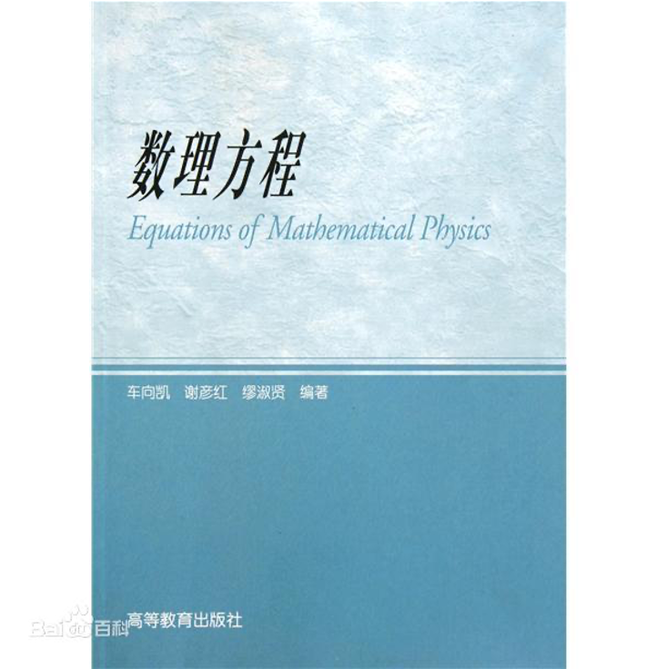
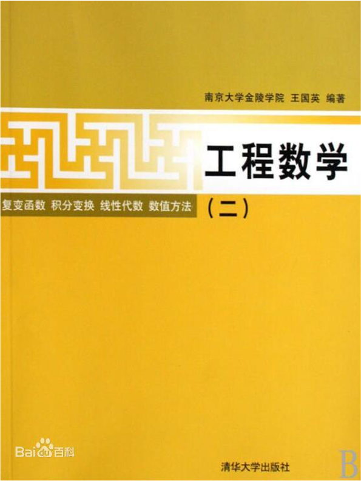

17世纪微积分出现，物理学家写方程，数学物理学家解方程，试图通过方程的解来理解大千世界。

--

####  数理方程的位置  

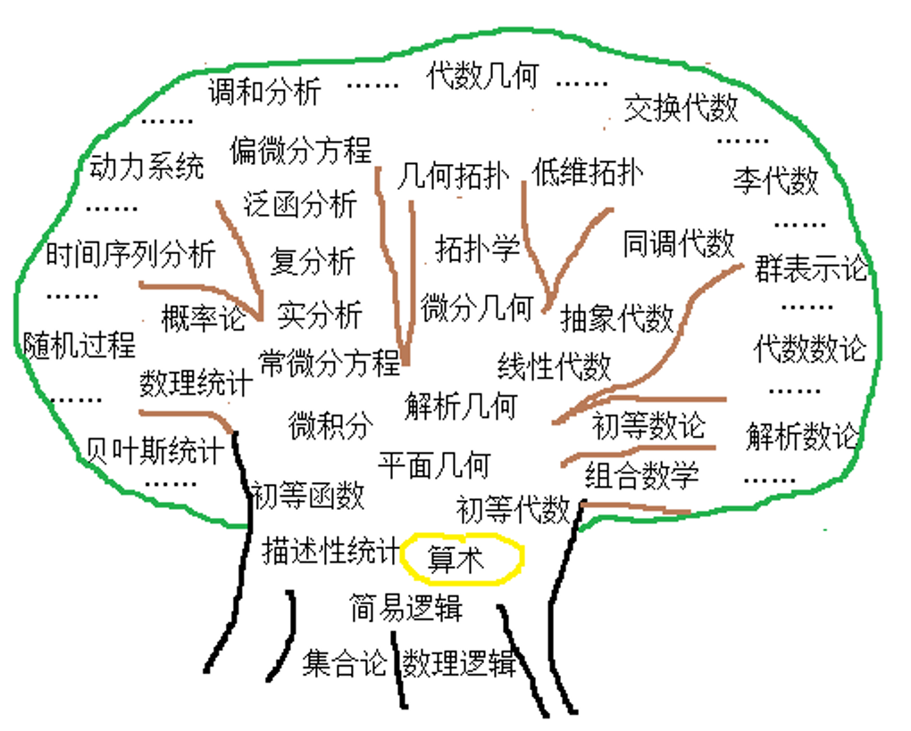
  

数学：逻辑，算术，分析，统计，结构

--

####  分数构成  
1. 平时成绩： 15\%
   
2. 课堂测试： 15\%
   
3. 期末考试：70\%
  

--

#### 教学效果

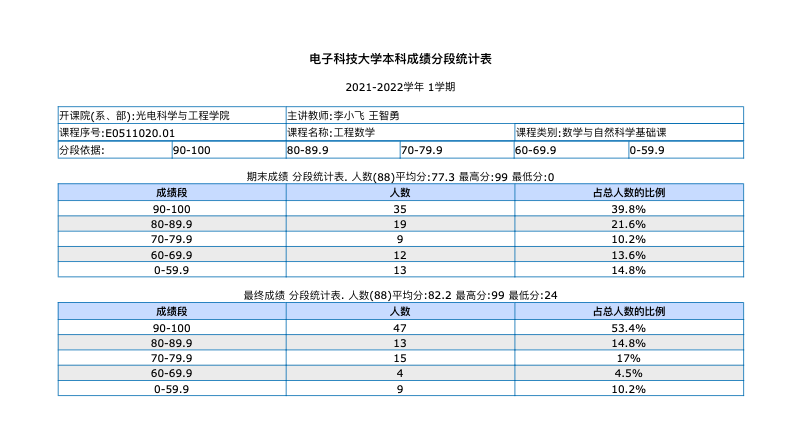
  

--

####  教学内容  

- 第一章 绪论， 常微分方程解法、傅里叶变换

- 第二章 偏微分方程，波动方程、热传导方程、拉普拉斯方程。

- 第三章 薛定谔方程，无限深势阱、量子谐振子、Hermite多项式

- 第四章 氢原子薛定谔方程，勒让德方程、拉盖尔（Laguerre）方程

- 第五章 特殊函数及其应用，贝塞尔（Bessel）方程、Bessel函数
 

--

####  参考书目：

1. 教材：《工程数学讲义》 李明奇，钟尔杰，国防工业出版社， 待出版
2. 《Mathematics for Physicists》 Shaw, G:
3. 《数学物理方法》 姚瑞正，梁家宝 ，武汉大学出版社，1992 
4. 《数学物理方程与特殊函数》南京工学院数学教研组，人民教育出版社，1983
5. 《数学物理方程》孙振绮，机械工业出版社，2004

--

<!-- .slide:  data-auto-animate -->
### 数理方程大家

--

<!-- .slide:  data-auto-animate -->
### 数理方程大家 {style="color: #FF0000;"}

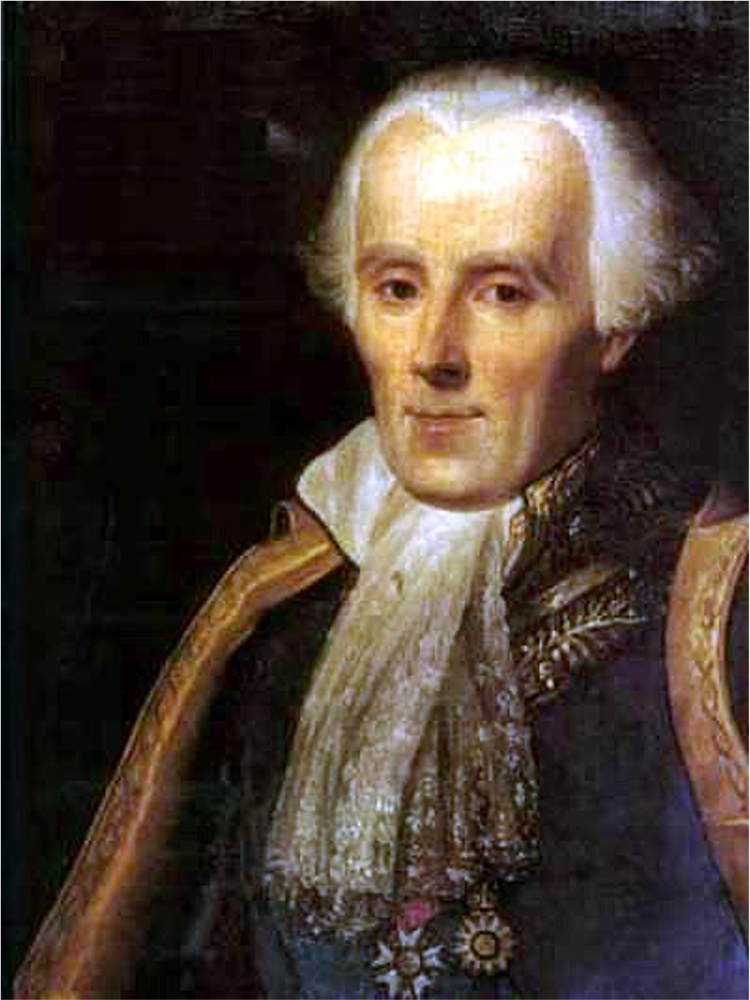 

拉普拉斯（法）: 拉普拉斯方程. (乾隆年间) 

--

#### 泊松（法）

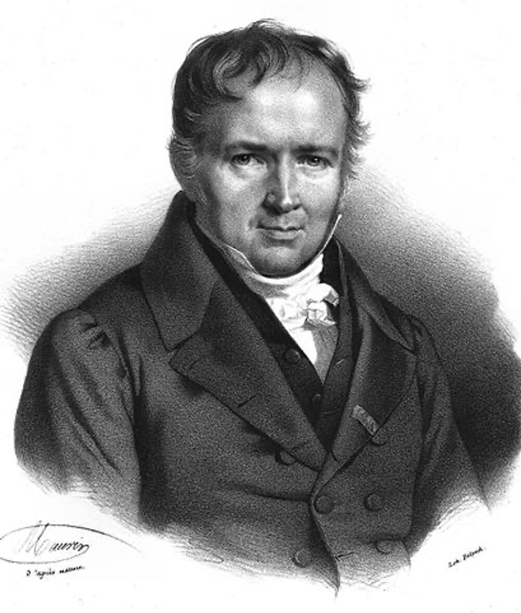
  
泊松方程: 描述场（电场，引力场等），Laplace方程只是Poisson方程的特例，

--

#### 勒让德（法）

  
勒让德方程: 球坐标系Laplace方程与勒让德方程等效

--

#### 傅里叶（法）

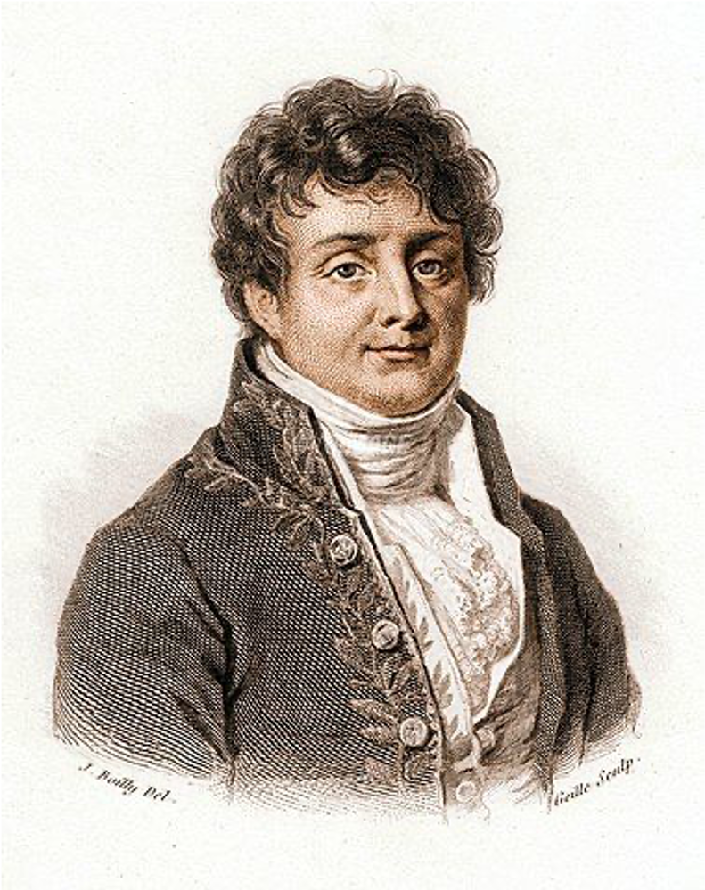
  
傅里叶变换: 分离变量法解波动方程，积分变换法解热传导方程， 发现叠加原理。

--

#### 格林（英）

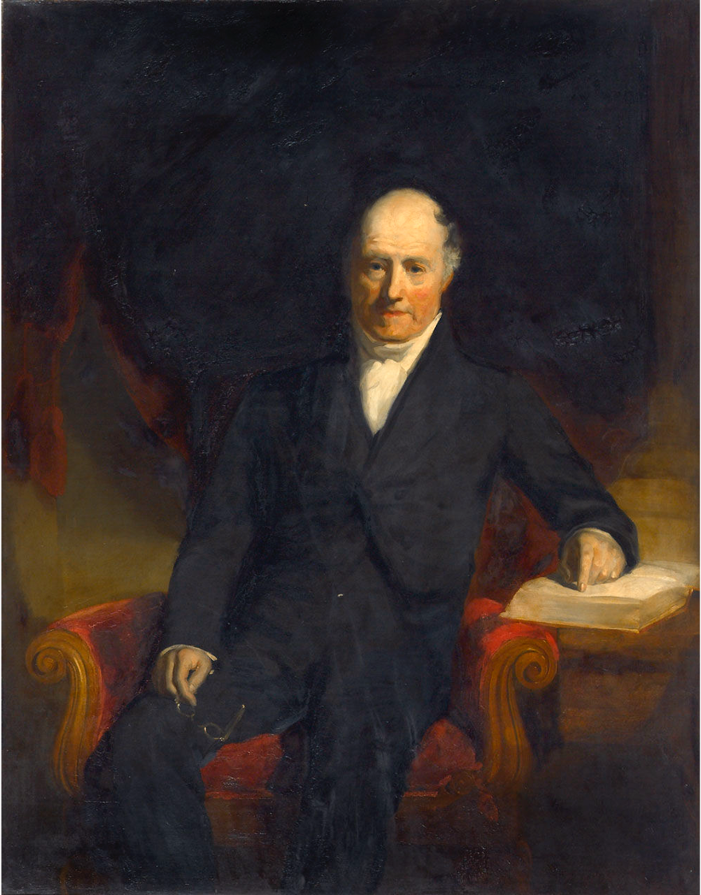
  
格林函数: Laplace方程和泊松方程的解是格林函数的叠加

--

#### 贝塞尔（德）

  
塞尔方程: 柱坐标系下Laplace方程是贝塞尔方程，解是一系列贝塞尔函数的叠加

--

#### 新方程与新解法：

- 薛定谔方程 {.fragment .fade-up}

- 爱因斯坦场方程 {.fragment .fade-up}

---

## 第一讲 常微分方程

--

#### 微分方程基本概念
- 微分方程：含未知函数及其导数的方程
$f\left(x,t, u, u_t,u_{tt}, \ldots u_{t \ldots t}, u_{x}, u_{xx}, \ldots, u_{x \ldots x} \right)=0$ {.fragment .fade-up}
- 解微分方程: 求物理量的函数表达式u(x,t) {.fragment .fade-up}
- 分类-1: 按导数的阶分，有一阶微分方程、二阶微分方程、高阶微分方程 {.fragment .fade-up}
- 分类-2: 按自变量的个数来分，有常微分方程和偏微分方程 {.fragment .fade-up}
- 基本解法：行波法、**分离变量法**、**积分变换法**、格林函数法、保角变换法、复变函数法、变分法、**级数展开法**, ... {.fragment .fade-up} 

---

### 1. 常微分方程的数学模型

---

#### 一阶微分方程的基本形态： {.fragment .fade-up}

$$ f\left(x, t, u, u_t, u_x\right)$$ {.fragment .fade-up}

$\color{#FFA500}{\text{例-0：}}$ 求 $g(y)dy=f(x)dx $ 的通解 {.fragment .fade-up}

$\color{#FFA500}{\text{解：}}$若 $g(y)$ , $f(x)$ 连续 ，有:  
$$\int g(y) d y = \int f(x) d x $$ {.fragment .fade-up}

若$g(y)$, $f(x)$  有原函数，通解为:
$$G(y)=F(x)+C$$ {.fragment .fade-up}

---

#### 衰减、增长模型与一阶微分方程

- 衰减与增长模型是自然和人类社会客观存在的数学模型 {.fragment .fade-up}
  
- 通常呈指数衰减或增长的形式 {.fragment .fade-up}
  
- 速率大于零为增长模型，小于零为衰减模型 {.fragment .fade-up}

---

$\color{#FFA500}{\text{例-1：}}$ 求解放射性衰减方程 ：
$$\frac{du}{dt}	= - r u, \qquad u(t_0) = u_0$${.fragment .fade-up}

$\color{#FFA500}{\text{解：}}$ 方程可分离变量{.fragment .fade-up}

`$$
\begin{aligned}
  \frac{du}{u} &= - rdt\\
  \ln u &=-rt+C\\
  u(t)&=C'exp(-rt) \\ 
\end{aligned}
$$ `
{.fragment .fade-up}

--

代入定解条件（令 $t=t_0$）: {.fragment .fade-up}

`$$
\begin{aligned}
u(t_0)= C'exp(-rt_0) & = u_0 \\
\implies C' & =u_0
\end{aligned} 
$$`{.fragment .fade-up}

方程的解为：
$$ u(t)=u_0 exp(-rt) $$ {.fragment .fade-up}

--

- 显然，当$r>0$时, 有$t \to \infty$， $u(t) \to 0${.fragment .fade-up}

- 衰减中的一个重要参数是半衰期 T {.fragment .fade-up}
  
$\color{#FFA500}{\text{解：}}$ {.fragment .fade-up} 

`$$
\begin{aligned}
  \frac{1}{2}u_0 &=u(T) \\
  & =u_0 exp(-rT) \\
  T &=\frac{1}{r} \ln 2  \\
  & \approx \frac{1}{r} \times 0.6931  
\end{aligned}	
$$`{.fragment .fade-up}

---

$\color{#FFA500}{\text{例-2：}}$ 求人口增长的模型(逻辑斯蒂) $$
\frac{d u}{d t}=r u (1-u/K) 
$${.fragment .fade-up}

$\color{#FFA500}{\text{解：}}$  方程可分离变量 {.fragment .fade-up} 

`\begin{align*}
		\frac{1}{u(1-u / K)}du &=r d t \\
		\frac{u / K+(1-u / K)}{u(1-u / K)} d u &=r d t	\\
		(\frac{1}{K-u}+\frac{1}{u} ) d u &=r d t \\
		-\ln (K-u)+\ln u &=r t+C \\
	\end{align*}`{.fragment .fade-up} 

--

`\begin{align*}
		&\ln \frac{u}{K-u}  = r t+C\\
		&\frac{u}{K-u} = \exp (r t+C)\\
		&u(t) = \frac{K}{1+ \exp (-r t-C)}	\\
	\end{align*}` {.fragment .fade-up} 

参数C由初始条件确定 {.fragment .fade-up} 

$\color{#FFA500}{\text{Tips:}}$  {.fragment .fade-up} 
- 自然过程要么指数增长要么指数哀减 {.fragment .fade-up} 

- 一生二, 二生三, 三生万物?  {.fragment .fade-up} 

---

#### 二阶常微分方程的基本形态 

$$ f\left(x, t, u, u_t, u_x, u_{tt}, u_{xx}\right)$$  {.fragment .fade-up}

---

#### 振动模型与二阶常微分方程

$\color{#FFA500}{\text{例-3：}}$ 建立简谐振动微分方程并求解  

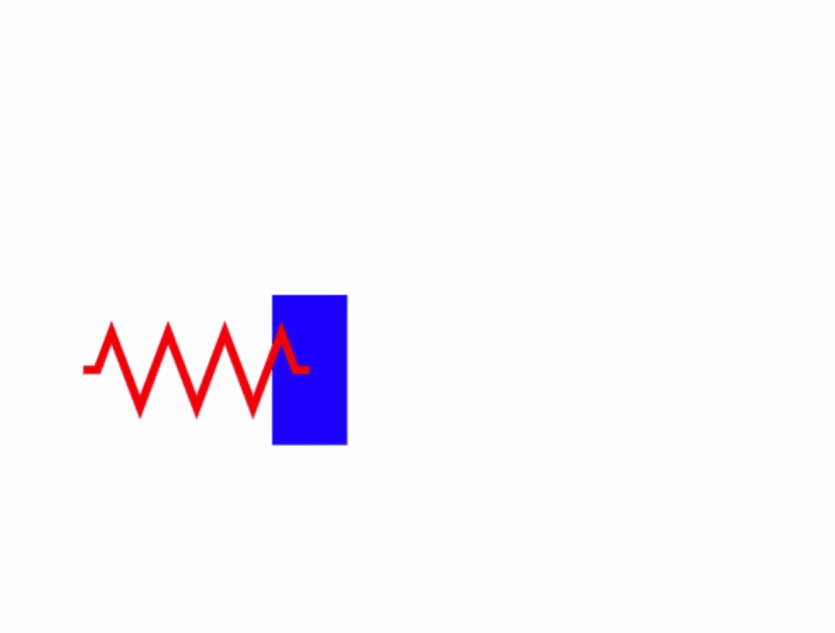
 

$\color{#FFA500}{\text{解：}}$  根据牛顿第二定律和胡克力定律，有{.fragment .fade-up}

`\begin{equation*}
F= -k x, ~~	F=Ma= M\frac{d ^2 x}{d t^2} 
\end{equation*}` {.fragment .fade-up}

--

整理
`$$\frac{d ^2 x}{d t^2} +\frac{k}{M} x =0$$` {.fragment .fade-up} 

写成标准数理方程
`$$\begin{cases}
	x^{\prime \prime} +\omega ^2 x = 0 \qquad (1)	\\
  \\
	x(t)\left |_{t=0}  =x_0  \right. \qquad (2) \\
	x^{\prime}(t) \left |_{t=0}  =0  \right. \qquad (3)     	
	\end{cases}$$` {.fragment .fade-up}

（2）和（3）分别是初始位置和速度，统称定解条件。{.fragment .fade-up}

--

$\color{#FFA500}{\text{解方程：}}$ 这是二阶常系数齐次微分方程, 可通过辅助方程求解 {.fragment .fade-up}

`\begin{aligned}
  u^2+\omega ^2&=0  \\ 
  u_{1, 2} &=\pm i\omega 
\end{aligned}`{.fragment .fade-up}

原方程的基本解 {.fragment .fade-up}

`$$ \begin{cases}
    x_{1} =\cos \omega t  \\
    x_{2} =\sin \omega t
  \end{cases} $$`{.fragment .fade-up}

通解： $x(t)=C_1 \cos \omega t +C_2 \sin \omega t ${.fragment .fade-up}

代入定解条件, 得特解： 
$$x(t)=x_0 \cos \omega t $$ {.fragment .fade-up}

---

$\color{#FFA500}{\text{例-4：}}$ 考虑空气阻力， 有如下小阻尼振动微分方程， 试求解
` \begin{equation*}
    \frac{d^2 x}{d t^2} +2\varepsilon \frac{d x}{dt} +\omega ^2 x = 0 ,  ~~~ (\varepsilon \ll \omega)   
  \end{equation*} `

$\color{#FFA500}{\text{解：}}$  令 $\displaystyle  x(t)= exp(-\varepsilon t) u(t) $, 微分 {.fragment .fade-up}

`$$
\begin{aligned}
  \frac{d x}{d t } & =exp(-\varepsilon t) [-\varepsilon u +\frac{d u}{dt}]\\
	\frac{d^2 x}{d t^2 } & =exp(-\varepsilon t) [\varepsilon ^2 u -2\varepsilon \frac{d u}{dt}+ \frac{d^2 u}{dt^2} ]
\end{aligned}
$$ ` {.fragment .fade-up}

代回方程并整理
$$ \frac{d^2 u}{d t^2} +(\omega ^2 - \varepsilon ^2) u = 0,  ~~~ (\varepsilon \ll  \omega) $$ {.fragment .fade-up}

--

令 $k^2 =\omega ^2 - \varepsilon ^2 >0 $, 得简谐振动方程标准型
$$\frac{d^2 u}{d t^2} +k ^2 u = 0$$ {.fragment .fade-up}

由公式得 {.fragment .fade-up}
`\begin{equation*}
		u(t)=C_1 \cos k t +C_2 \sin k t 
	\end{equation*}`{.fragment .fade-up}

方程的通解  {.fragment .fade-up}
`\begin{equation*}
		x(t)= exp(-\varepsilon t) \left[ C_1 \cos \sqrt{k}  t +C_2 \sin \sqrt{k} t \right] 
	\end{equation*}` {.fragment .fade-up}

--

如存在定解条件，则一样可以写出特解，比如： {.fragment .fade-up}

`\begin{equation*}
		x(t)= x_0 exp(-\varepsilon t) \cos \sqrt{\omega ^2 - \varepsilon ^2}  t 
	\end{equation*}` {.fragment .fade-up}

--

很明显，振幅呈指数衰减！

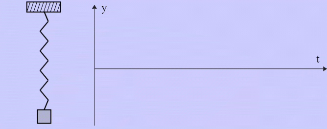

--

$\color{#FFA500}{\text{例-5：}}$ 考虑加上周期性的策动力 $p  \sin \omega_0 t$， 则有如下非齐次振动方程， 试求解
` \begin{equation*}
    \frac{d^2 u}{d t^2} +\omega ^2 u = p \sin \omega_0 t ,  ~~~ (\varepsilon \ll \omega)   
  \end{equation*} `

$\color{#FFA500}{\text{解：}}$  对应齐次方程的通解：{.fragment .fade-up}

`\begin{equation*}
	u(t)=C_1 \cos \omega t +C_2 \sin \omega t 
	\end{equation*}`{.fragment .fade-up}

因此，可以设非齐次方程的特解为： 
$$ u(t) =C \sin \omega_0 t $$ {.fragment .fade-up}

问题转化为求 $C$ （待定系数法）{.fragment .fade-up}

--

把特解代回原方程
`$$ \begin{aligned}
  C(\omega^2-\omega_{0} ^2 ) \sin(\omega_0 t)& =p\sin(\omega_0 t)\\
		C & = \frac{p}{\omega^2-\omega_{0} ^2 }
\end{aligned}  $$ ` {.fragment .fade-up}

原方程的解为：对应齐次方程的通解+特解
$$ x(t)= C_1 \cos \omega t +C_2 \sin \omega t+ \frac{p}{\omega^2-\omega_{0} ^2 } \sin (\omega_0 t)  $$  {.fragment .fade-up}

$\color{#FFA500}{\text{Tips：}}$ 当策动函数为多项式函数，三角函数等与通解形式相类似型时， 待定系数法通常可确定特解。对于一般性的情况，可采用常数变易法求解。 {.fragment .fade-up} 

---

解的分析：这是固固有频率和策动频率两种波的线性叠加 

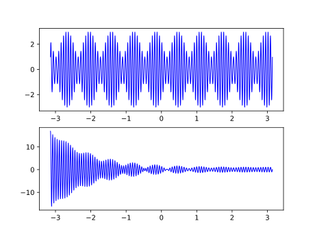

- 如果两频率相近，发生共振。{.fragment .fade-up}
- 器件的工作频率在远离固有频率。{.fragment .fade-up}
- 如果是衰减波，最后只留下策动频率波。{.fragment .fade-up}

--

如果既有策动又有空气阻尼，方程为：{.fragment .fade-up}

` \begin{equation*}
    \frac{d^2 u}{d t^2} +2\varepsilon \frac{d u}{dt} +\omega ^2 u = f(t) ,  ~~~ (\varepsilon \ll \omega)   
  \end{equation*} ` {.fragment .fade-up}

如果策动还与位置相关，则方程为： {.fragment .fade-up}

` \begin{equation*}
    \frac{d^2 u}{d t^2} +2\varepsilon \frac{d u}{dt} +\omega ^2 u = f(x, t) ,  ~~~ (\varepsilon \ll \omega)   
  \end{equation*} ` {.fragment .fade-up}

如果阻尼系数是位置的函数（比如空间密度不是常数），则方程为：{.fragment .fade-up}

` \begin{equation*}
    \frac{d^2 u}{d t^2} +2\varepsilon(x) \frac{d u}{dt} +\omega ^2 u = f(x, t) ,  ~~~ (\varepsilon \ll \omega)   
  \end{equation*} ` {.fragment .fade-up}

--

如果再考虑到阻尼导致弹簧温度变化，进而影响弹性系数，则方程为：{.fragment .fade-up}

` \begin{equation*}
    \frac{d^2 u}{d t^2} +2\varepsilon(x) \frac{d u}{dt} +\omega^2 (t)  u = f(x, t) ,  ~~~ (\varepsilon \ll \omega)   
  \end{equation*} ` {.fragment .fade-up}

如果弹簧不同的位置温度变化不一样，则方程为：{.fragment .fade-up}

` \begin{equation*}
    \frac{d^2 u}{d t^2} +2\varepsilon(x) \frac{d u}{dt} +\omega^2 (x,t)  u = f(x, t) ,  ~~~ (\varepsilon \ll \omega)   
  \end{equation*} ` {.fragment .fade-up}

 

 
$\color{#FFA500}{\text{Tips：}}$  现实工程里的数理方程远比《工程数学》教材上的方程复杂！建立方程并求解是工科学校学生的一项基本功。 {.fragment .fade-up}

---

### 2. 常微分方程的基本解法

---

$\color{#FFA500}{\text{例-6：}}$ 求解一阶常系数线性非齐次常微分方程 
$$ y'+py=f(x)$$ 

$\color{#FFA500}{\text{解：}}$  对应的齐次方程是衰减数学模型，有解：
$$y=C exp(-px)$$ {.fragment .fade-up}

采用常数变易法，设非齐次方程的解为
$$y(x) =C(x) exp(-px)$$ {.fragment .fade-up}

求导
`$$ \begin{aligned}
		y'&= -p C(x) exp(-px) + C'(x) exp(-px)   \\
		py &= p C(x) exp(-px)
\end{aligned} $$` {.fragment .fade-up}

--

代入原方程, 得
$$ exp(-px)C'(x) = f(x)$$ {.fragment .fade-up}

解得
$$ C(x) = \int exp(px) f (x)dx + c $$  {.fragment .fade-up}

原方程的（通）解为
`$$ \begin{aligned}
	y(x) &=C(x) exp(-px) \\
	&= \left(\int exp(px) f (x)dx + c\right) exp(-px) 
\end{aligned}$$` {.fragment .fade-up}

分析：做指数哀减，哀减幅度由初始条件和非自由项共同决定 {.fragment .fade-up}

---

$\color{#FFA500}{\text{例-7：}}$ 求一阶非齐次变系数微分方程:
` \begin{equation*}
    y^{\prime}+P(x) y=Q(x)
  \end{equation*} ` {.fragment .fade-up}

$\color{#FFA500}{\text{解：}}$  对应的齐次方程为：{.fragment .fade-up}

` \begin{equation*}
    y^{\prime}+P(x) y=0
  \end{equation*} `{.fragment .fade-up}

分离变量法得通解
$$y=Ce^{-\int P(x)dx}$$ {.fragment .fade-up}

常数变易，令： $C=C(x)$，得
$$
y=C(x)e^{-\int P(x)dx}
$$ {.fragment .fade-up} 

--

求导并代回原方程
$$
C^{\prime}(x)=\frac {Q(x)} {e^{-\int P(x)dx}}
$$ {.fragment .fade-up}

积分得
$$
C(x)=\int Q(x)e^{\int P(x)dx} dx+c 
$$ {.fragment .fade-up}

原方程得解
$$
y=\left(\int Q(x)e^{\int P(x)dx} dx+c\right)e^{-\int P(x)dx}
$$ {.fragment .fade-up}

---

$\color{#FFA500}{\text{例-8：}}$ 求解二阶常系数非齐次常微分方程 
$$ y^{\prime \prime}+py'+qy=f(x) $$ 

$\color{#FFA500}{\text{解：}}$  对应的齐次方程为：
$$  y^{\prime \prime}+py'+qy=0 $$ {.fragment .fade-up}

特征方程
$$ \lambda^2 +p\lambda +q=0  $$  {.fragment .fade-up}

--

解有三种情况： {.fragment .fade-up}

`$$ \begin{aligned}
		两相异实根：& \lambda_1 \ne \lambda_2  \\
		两相同实根：& \lambda_1 = \lambda_2   \\
		两共轭复根：& \lambda_1=\alpha+i\beta , \lambda_2=\alpha-i\beta
\end{aligned}$$ ` {.fragment .fade-up}

对应的齐次方程的通解：{.fragment .fade-up}

`$$ \begin{aligned}
		两相异实根：y=& C_1 exp(\lambda_1 x)+ C_2 exp (\lambda_2 x)   \\
		两相同实根：y=& (C_1+C_2x)  exp (\lambda_1 x)  \\
		两共轭复根：y=&  exp(\alpha x)  [C_1 \cos (\beta x)+ C_2 sin (\beta x)]
\end{aligned}$$ ` {.fragment .fade-up}

根据自由项的特点，再通过待定系数法或常数变易法求解非齐次常微分方程。 {.fragment .fade-up}

---

$\color{#FFA500}{\text{例-9：}}$ 求解二阶常系数非齐次常微分方程的初值问题
`$$\begin{cases}
		u^{\prime \prime} +\omega ^2 u =f, (t>0)\\
		\\
		u(0)=0, u'(0)=0
\end{cases}$$`

$\color{#FFA500}{\text{解：}}$ 这是振动数学模型，齐次方程有通解： 
$$ u=C_1 \cos(\omega t)+C_2 \sin(\omega t) $$  {.fragment .fade-up}

由于$f$的函数形式不明，不能写出特解。采用常数变易，设非齐次方程的解为 
$$ u=C_1(t) \cos(\omega t)+C_2(t) \sin(\omega t) $${.fragment .fade-up}

--

求导
`$$ \begin{aligned}
	u'& =[C'_1(t) \cos(\omega t)+C'_2(t) \sin(\omega t)] \\
	&+ [  - \omega C_1(t) \sin(\omega t)+ \omega C_2(t) \cos(\omega t)  ] \\ 
\end{aligned}  $$` {.fragment .fade-up}

令 $$[C'_1(t) \cos(\omega t)+C'_2(t) \sin(\omega t)]=0 \qquad (1) $$ {.fragment .fade-up}

再求导
$$ u^{\prime \prime}= [  - \omega C'_1(t) \sin(\omega t)+ \omega C'_2(t) \cos(\omega t)  ] -\omega^2 u  $$  {.fragment .fade-up}

--

代回原方程
$$ [  - \omega C'_1(t) \sin(\omega t)+ \omega C'_2(t) \cos(\omega t)  ] =f      \qquad( 2) $$ {.fragment .fade-up}

联立（1）（2）， 得方程组
`$\qquad \begin{bmatrix}
		\cos(\omega t) & \sin(\omega t) \\ 
		-\omega \sin(\omega t) & \omega\cos(\omega t)
	\end{bmatrix} $`
`$\begin{bmatrix}
		C'_1(t)\\ 
		C'_2(t)
	\end{bmatrix} $` =
`$\begin{bmatrix}
		0\\ 
		f
	\end{bmatrix} $` {.fragment .fade-up}

求解：
`$$ \begin{cases}
		C'_1(t)=\dfrac{f}{\omega} \sin(\omega t)  \\ 
		C'_2(t)=\dfrac{f}{\omega} \cos(\omega t)  
	\end{cases}  $$ ` {.fragment .fade-up}

--

积分得
`$$ \begin{cases}
		C_1(t)=\dfrac{1}{\omega} [\int_{0}^{\tau} \sin(\omega \tau) f(\tau)  d\tau +c_1 ]\\ 
		C_2(t)=\dfrac{1}{\omega} [\int_{0}^{\tau} \cos(\omega \tau) f(\tau)  d\tau +c_2 ]\
	\end{cases}  $$`  {.fragment .fade-up}

原方程的通解：
`$$ \begin{aligned}
	u=&\dfrac{1}{\omega}\cos(\omega t)[\int_{0}^{\tau} \sin(\omega \tau) f(\tau)  d\tau +c_1 ] \\
		&+\dfrac{1}{\omega} \sin(\omega t) [\int_{0}^{\tau} \cos(\omega \tau) f(\tau)  d\tau +c_2 ]
\end{aligned}  $$` {.fragment .fade-up}

代入定解条件，得  $c_1=c_2=0$ {.fragment .fade-up}

--

原方程的解为：
`$$ \begin{aligned}
	u=&\dfrac{1}{\omega}\cos(\omega t)\left[\int_{0}^{\tau} \sin(\omega \tau) f(\tau)  d\tau \right] \\
		&+\dfrac{1}{\omega} \sin(\omega t) \left[\int_{0}^{\tau} \cos(\omega \tau) f(\tau)  d\tau \right]
\end{aligned}  $$` {.fragment .fade-up}

$\color{#FFA500}{\text{结束！}}$   {.fragment .fade-up}

---

$\color{#FFA500}{\text{例-10：}}$ 求二阶变系数齐次常微分方程（欧拉方程-1）
$$ x^2 \frac{d^2 y}{d x^2} +x \frac{d y}{d x} +n^2 y =0   $$ 

$\color{#FFA500}{\text{解：}}$ 令 $x=exp(t) , (t=ln x)$，求微分： {.fragment .fade-up}

$$ 
\frac{d y}{d x}  = \frac{d y}{d t}\frac{d t}{d x}= \frac{1}{ x}\frac{d y}{d t}  \implies x \frac{d y}{d x}=	\frac{d y}{d t} \\
$$  {.fragment .fade-up}

$$ \frac{d ^2y}{d x^2}  = \frac{d }{d t} ( \frac{1}{ x}\frac{d y}{d t}  )\frac{d t}{d x}=  
		\frac{1}{ x^2}(\frac{d ^2y}{d t^2} -	\frac{d y}{d t}) $$  {.fragment .fade-up}

$$ \implies 	x^2 \frac{d^2 y}{d x^2} = \frac{d ^2y}{d t^2} -	\frac{d y}{d t}  $$  {.fragment .fade-up}

--

代回原方程并整理，得
$$ \frac{d^2 y}{d t^2}  +n^2 y =0  $$  {.fragment .fade-up}

这是振动数学模型，有通解： 
$$ u=C_1 \cos(n t)+C_2 \sin(n t) $$ {.fragment .fade-up}

把 $t=ln x$ 代入，得原方程的通解
$$ y(x)=C_1 \cos (n \ln x) +C_2 \sin (n \ln x)  $$ {.fragment .fade-up}

$\color{#FFA500}{\text{结束！}}$  {.fragment .fade-up} 

---

$\color{#FFA500}{\text{例-11：}}$ 求二阶变系数齐次常微分方程（欧拉方程-2）
$$ x^2 \frac{d^2 y}{d x^2} +2x \frac{d y}{d x} -n(n+1) y =0   $$ 

$\color{#FFA500}{\text{解：}}$ 令 $x=exp(t) , (t=ln x)$，求微分： {.fragment .fade-up}

$$ 
\frac{d y}{d x}  = \frac{d y}{d t}\frac{d t}{d x}= \frac{1}{ x}\frac{d y}{d t}  \implies x \frac{d y}{d x}=	\frac{d y}{d t} \\
$$ {.fragment .fade-up}

$$ \frac{d ^2y}{d x^2}  = \frac{d }{d t} ( \frac{1}{ x}\frac{d y}{d t}  )\frac{d t}{d x}=  
		\frac{1}{ x^2}(\frac{d ^2y}{d t^2} -	\frac{d y}{d t}) $$  {.fragment .fade-up}

$$ \implies 	x^2 \frac{d^2 y}{d x^2} = \frac{d ^2y}{d t^2} -	\frac{d y}{d t}  $$  {.fragment .fade-up}

--

代回原方程并整理，得
$$ \frac{d^2 y}{d t^2}  +\frac{dy}{dt}-n(n+1) y =0   $$ {.fragment .fade-up}

这是含哀减项的非标准振动数学模型，写特征方程
$$ \lambda^2 +\lambda -n(n+1) =0  $$ {.fragment .fade-up}

两相异实根：$ \lambda_1=n, \quad \lambda_2= -(n+1) $ {.fragment .fade-up}

方程的解为：
$$ y(t)=C_1 \exp (nt) +C_2 \exp (-(n+1) t)  $$  {.fragment .fade-up}

--

代入 $t=ln x$, 原方程得解： 
$$ y(x)=C_1 x^n +C_2 x^{-(n+1) } $$  {.fragment .fade-up}
 
$\color{#FFA500}{\text{Tips：}}$  {.fragment .fade-up}

- 系数是其他形式的二阶欧拉方程  {.fragment .fade-up}
- 非齐式二阶欧拉方程  {.fragment .fade-up}
- 高阶的欧拉方程 {.fragment .fade-up}

---

$\color{#FFA500}{\text{例-12：}}$ 求二阶变系数非齐次常微分方程（欧拉方程-3）
$$ x^2 \frac{d^2 y}{d x^2} -2x \frac{d y}{d x} +2y = \ln^2( x) -2 \ln(x) $$ 

$\color{#FFA500}{\text{解：}}$ 令 $x=exp(t) , (t=ln x)$，求微分并代回原方程， 得 {.fragment .fade-up}

$$ 
\frac{d^2 y}{d t^2}  -3\frac{dy}{dt} +2 y =t^2 -2t  $$ {.fragment .fade-up}

这是含哀减项和策动项（自由项）的非标准振动数学模型， {.fragment .fade-up}

先写齐次方程的特征方程
$$ \lambda^2  -3\lambda +2  =0  $$ {.fragment .fade-up}

--

有两相异实根
$$ \lambda_1=1,   \lambda_2=2 $$ {.fragment .fade-up}

通解：
$$y_1=C_1 e^t +C_2 e^{2t}$$ {.fragment .fade-up}

现在有二条路可走 {.fragment .fade-up}
- 特解+通解 {.fragment .fade-up}
- 常数变易法 {.fragment .fade-up}
  
考虑自由项（$ \ln^2( x) -2 \ln(x) = t^{2} -2 t $ ），令特解为：
$$y_2=a t^2+bt+c$$ {.fragment .fade-up}

--

把特解代回原方程, 并求解得
$$ y_2=\frac{1}{2} t^2+\frac{1}{2}t+\frac{1}{4}  $$ {.fragment .fade-up}

原方程得解
$$ y= y_1 + y_2 =C_1 e^t +C_2 e^{2t}+\frac{1}{2} t^2+\frac{1}{2}t+\frac{1}{4}  $$ {.fragment .fade-up}

代入 $t=ln x $, 得 
$$ y(x)=C_1 x +C_2 x^2+\frac{1}{2} \ln ^2 x+\frac{1}{2}\ln x+\frac{1}{4} $$ {.fragment .fade-up} 

$\color{#FFA500}{\text{结束！}}$   {.fragment .fade-up}

---

$\color{#FFA500}{\text{例-13：}}$ 求二阶变系数齐次常微分方程（n 阶厄米方程）
$$ \frac{d^2 y}{d x^2} -2x \frac{d y}{d x} +2n y =0  $$ 

$\color{#FFA500}{\text{解：}}$ 设方程有级数解 
$$ y=\sum_{k=0}^{\infty} c_k x^k $$  {.fragment .fade-up}

问题转化为求 \{ $c_k$ \} {.fragment .fade-up}

--

求导：
`$$\begin{cases}
		y' = \sum\limits_{k=1}^{\infty} k c_k x^{k-1} =\sum\limits_{k=0}^{\infty} (k+1) c_{k+1} x^{k}\\
		\\
		y'' = \sum\limits_{k=2}^{\infty} k (k-1) c_k x^{k-2} =  \sum\limits_{k=0}^{\infty} (k+2) (k+1) c_{k+2} x^k
	\end{cases}$$`  {.fragment .fade-up}

(注意：脚标变换大法！) {.fragment .fade-up}

--

代回原方程：
$$ \sum_{k=0}^{\infty} [ (2n -2k)c_k +(k+2)(k+1) c_{k+2}  ] x^k  =0 $$ {.fragment .fade-up}

一个多项式为零，要求所有项的系数为零
$$ (2n -2k)c_k +(k+2)(k+1) c_{k+2} =0 $$ {.fragment .fade-up}

得系数递推式：
$$ c_{k+2} = \frac{ 2(k-n)}{(k+2)(k+1) } c_k, ~~  \left( k=0,1,2,3, ...  \right)  $$ {.fragment .fade-up}

这是隔项递推，如果 $c_0, c_1$ 知道， 则所有的 $c_k$ 都可得。 {.fragment .fade-up}

--

$$ c_{k+2} = \frac{ 2(k-n)}{(k+2)(k+1) } c_k, ~~  \left( k=0,1,2,3, ...  \right)  $$  {.fragment .fade-up}

试推一下：
`$$\begin{cases}
		c_2 =- \frac{2n}{2!} c_0\\
		c_4 = \frac{2^2n(n-2)}{4!} c_0 \\
		c_6 = -\frac{2^3n(n-2)(n-4)}{6!} c_0 \\
		...	
\end{cases} $$` {.fragment .fade-up}

偶数阶：
$$c_{2m} = (-1) ^m \frac{2^mn(n-2)(n-4) ... (n-2m+2)  } {(2m)!} c_0$$ {.fragment .fade-up}

--

同理，奇数阶:
$$ c_{2m+1} = (-1) ^m \frac{2^m (n-1) (n-3)(n-5)...(n-2m+1)  } {(2m+1)!} c_1  $$ {.fragment .fade-up}

令：
` \begin{cases}
		y_1(x)  = [1- \dfrac{2n}{2!} x^2+ \dfrac{2^2n(n-2)}{4!} x^4 -...  ] \\
		y_2(x)  = [x- \dfrac{2(n-1)}{3!} x^3+ \dfrac{2^2(n-1)(n-3) }{5!}x^5 -...  ]
	\end{cases} ` {.fragment .fade-up}

原方程得解：
$$y(x) =c_0y_1(x)+c_1 y_2(x)$$ {.fragment .fade-up}

---

## 第二讲 傳里叶级数与傅里叶变换

---

#### 1. 数学公式

- 如果$f(x)$是定义于$(-\infty,+\infty)$的周期函数（$T=2l$）, 则可表示成如下级数形式： 
`$$ \begin{cases}
	f(x) =\dfrac{a_0}{2} +\sum\limits_{n=1}^{\infty}  \left(  a_n \cos~ \dfrac{n\pi}{l} x +  b_n \sin~ \dfrac{n\pi}{l} x  \right) \\ 
	\\
	a_n =\dfrac{1}{l}  \int\limits_{-l}^{l}  f(\xi )   \cos~ \dfrac{n\pi}{l} \xi d\xi \\
	b_n =\dfrac{1}{l}  \int\limits_{-l}^{l}  f(\xi )   \sin~ \dfrac{n\pi}{l} \xi d\xi  
\end{cases} $$` {.fragment .fade-up}

--

- 如果$f(x)$不是周期函数，则有如下变换形式 
`$$ \begin{cases}
	f(x) =\int\limits_{-\infty}^{+\infty}  G(\omega) e^{i\omega x} d\omega\\
	\\
	G(\omega) = \dfrac{1}{2\pi} \int\limits_{-\infty}^{+\infty}  f(x) e^{-i\omega x} dx 
\end{cases}  $$` {.fragment .fade-up} 

- 当然，上式可以写成对称形式
`$$ \begin{cases}
	f(x) = \dfrac{1}{\sqrt{2\pi} }\int\limits_{-\infty}^{+\infty}  G(\omega) e^{i\omega x} d\omega\\
	\\
	G(\omega) = \dfrac{1}{\sqrt{2\pi} } \int\limits_{-\infty}^{+\infty}  f(x) e^{-i\omega x} dx 
\end{cases}  $$` {.fragment .fade-up}

--

- 如果考虑频率的量子化， 则有： 
`$$ \begin{cases}
	f(x) = \dfrac{1}{\sqrt{2\pi} }\sum c_n e^{i\omega_n x} \\
     \\
	c_n =\dfrac{1}{\sqrt{2\pi} }  \int\limits_{-\infty}^{\infty}  f(x)  e^{-i\omega_n x}  d x 
\end{cases} $$` {.fragment .fade-up} 

---

#### 2. 物理意义

考察: 周期性力策动下谐振子的解（例-5）
`$$ \begin{aligned}
	x(t) & = C_1 \cos \omega t +C_2 \sin \omega t+ \frac{p}{\omega^2-\omega_{0} ^2 } \sin (\omega_0 t) \\
	& = a_0 /2  + a_1 \cos \omega _1 t +b_1 \sin \omega _1 t + a_2 \cos \omega _2 t +b_2 \sin \omega _2 t
\end{aligned}  $$`  {.fragment .fade-up}

注： $a_0$是零率的振幅，$a_1$和$b_1$是基率的振幅，$a_2$和$b_2$是策动率的振幅  {.fragment .fade-up}

--

如果存在多级策动，效果如下

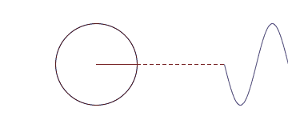

其波函数应是各率波函数的线性叠加（具有周期性） 
$$ f(x) =\dfrac{a_0}{2} +\sum\limits_{n=1}^{\infty}  \left(  a_n \cos~ \dfrac{n\pi}{l} x +  b_n \sin~ \dfrac{n\pi}{l} x  \right)  $$ {.fragment .fade-up} 

--

上例表明：一个方波信号可以用{$\sin \omega_n x, \cos \omega_n x$} 函数的叠加来表示

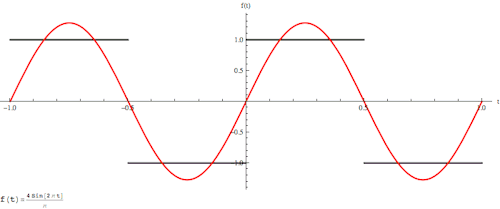
 

那么，是否任意的周期函数$f(x)$也可以用$\left\{\cos \omega_n x,\sin \omega_n x \right\}$函数的叠加来表示呢？{.fragment .fade-up}

（物理 $ \implies $ 数学）{.fragment .fade-up}

--

结论：（傅里叶）

- 可以  {.fragment .fade-up}
  
- 非周期的也可以，但得改 \{ $\cos \omega_n x,\sin \omega_n x$ \} 为  \{$e^{i \omega_n x} $ \} {.fragment .fade-up}

---

#### 3. 深刻原因

- `$\{ \cos \omega_n x,\sin \omega_n x \}$` 构成正交完全集 {.fragment .fade-up}

- \{$e^{i \omega_n x} $ \} 也构成正交完全集 {.fragment .fade-up}
  

--

例如：\{`$\vec{i}$`,   `$\vec{j}$`,   `$\vec{k}$` \}构成三维矢量空间的一个正交完全集 {.fragment .fade-up}

- 完全集：空间的任意矢量都可以用各基矢的线性叠加来表示
  $$ \vec{P} =  x\vec{i}+y\vec{j}+z\vec{k} = \sum\limits_{n=1}^3 x_n \vec{e}_n$$ {.fragment .fade-up}

并称 $x_n$ 是矢量 $\vec{P}$ 在对应基矢$\vec{e}_n$上的投影, 其内积表示为：
  $$ x_n = (\vec{e}_n, \vec{P}) $$ {.fragment .fade-up}

- 正交：两矢量的内积为零 
	$$( \vec{P}_1, \vec{P}_2) = 0$$ {.fragment .fade-up}

- 正交集：集合中的所有矢量两两正交： 
$( \vec{e}_n, \vec{e}_m) = 0 $ {.fragment .fade-up}

--

#### 三角正交完全集：

- 正交集: \{$1, \cos x, \sin x, \cos 2x, \sin 2x,\cdots $\} 中任意两函数的内积等于零，{.fragment .fade-up}

比如：
`$$ \begin{aligned}
	 (\cos n x, \sin m x ) & = \int\limits_{-\infty}^{+\infty} (\cos n x)^* (\sin m x) d x \\
	 & = 0
  \end{aligned} $$` {.fragment .fade-up}

--

- 完全集: 任意周期函数$f(x)$可以用此集做线性展开
  $$ f(x) =\dfrac{a_0}{2} +\sum\limits_{n=1}^{\infty}  \left(  a_n \cos~ \dfrac{n\pi}{l} x +  b_n \sin~ \dfrac{n\pi}{l} x  \right) $$ {.fragment .fade-up}

- 展开系数： 是 $f(x)$在对应基矢上的投影 
`$$ \begin{aligned}
	 a_n & = (\cos n x, f(x) ) \\ 
	 & = \int\limits_{-\infty}^{+\infty} (\cos n x)^* f(x) d x \\
	 &= \dfrac{1}{l} \int\limits_{-l}^{+l} f(x) \cos n x d x  
  \end{aligned} $$` {.fragment .fade-up}

--

同理，
`$$ \begin{aligned}
	 b_n & = (\sin n x, f(x) ) \\ 
	 & = \int\limits_{-\infty}^{+\infty} (\sin n x)^* f(x) d x \\
	 &= \dfrac{1}{l} \int\limits_{-l}^{+l} f(x) \sin n x d x  
  \end{aligned} $$` {.fragment .fade-up}

 
 
"一种数学方法的成功，不是由于巧妙的谋略或者幸运的偶遇，而是因为它表达着物理真理的某个方面"
$\qquad$ -- -- 沙顿	 {.fragment .fade-up}

---

$\color{#FFA500}{\text{例-14：}}$  求下列函数的傳里叶展开式
`$$ f(x)=\begin{cases}
		1 , ~~~ x \in [0, \pi] \\
         \\
		-1 ,~~~ x \in [-\pi, 0] 
	\end{cases} $$`

$\color{#FFA500}{\text{解：}}$ 作延拓则可认为是周期函数 （$T=2\pi$），{.fragment .fade-up}

这是个奇函数， 展开式中只有$sin$函数， 因此只需计算 $b_n$ {.fragment .fade-up}

$$b_n = \dfrac{1}{l} \int\limits_{-l}^{+l} f(x) \sin n x d x $$ {.fragment .fade-up}

--

`$$ \begin{aligned}
	b_n & = \dfrac{1}{\pi} \int\limits_{-\pi}^{+\pi} f(x) \sin n x d x  \\ 
	&= \dfrac{1}{\pi} \int\limits_{0}^{+\pi} f(x) \sin n x d x +\dfrac{1}{\pi} \int\limits_{-\pi}^{0} (-1) \sin n x d x \\ 
	&= \dfrac{2}{\pi}\int\limits_{0}^{+\pi} f(x) \sin n x d x   \\
	&= \frac{2}{n\pi} [\cos nx ] \vert_0 ^\pi = \frac{2}{n\pi} [ (-1) ^n -1] 
\end{aligned}  $$` {.fragment .fade-up} 

--

只有当$n$为奇数时，$b_n$不为零
$$b_{2k+1} = \frac{2}{n\pi} [ (-1) ^n -1] =  -\frac{4}{(2k+1)\pi}$$ {.fragment .fade-up}

代回傳里叶展开式， 得：
$$ f(x) = -\dfrac{4}{\pi} \sum_{n=0}^{\infty}  \dfrac{1}{2k+1} \sin(2k+1) dx   $$  {.fragment .fade-up}

$\color{#FFA500}{\text{结束！}}$  {.fragment .fade-up}

---

$\color{#FFA500}{\text{例-15：}}$  量子力学中,某体系在坐标表象中的波函数如下，求在动量表象中的波函数
$$\Psi(x)=\frac{1}{\sqrt{2\pi \hbar}}  \int_{-\infty}^{+\infty} c(p) e^{\frac{i}{\hbar} px} dp $$

$\color{#FFA500}{\text{解：}}$ 傳里叶变换公式如下 {.fragment .fade-up}

`$$ \begin{cases}
	f(x) =\int\limits_{-\infty}^{+\infty}  G(\omega) e^{i\omega x} d\omega\\
	\\
	G(\omega) = \dfrac{1}{2\pi} \int\limits_{-\infty}^{+\infty}  f(x) e^{-i\omega x} dx 
\end{cases}  $$` {.fragment .fade-up}

--

把波函数写成公式的形式
$$\Psi(x)= \int_{-\infty}^{+\infty} [\frac{\sqrt{\hbar} }{\sqrt{2\pi}} c(p)] e^{i\frac{p}{\hbar} x} d (\frac{p}{\hbar}) $$ {.fragment .fade-up}

基于公式，有
$$[\frac{\sqrt{\hbar} }{\sqrt{2\pi}} c(p)]= \dfrac{1}{2\pi} \int_{-\infty}^{+\infty} \Psi(x) e^{-i\frac{p}{\hbar} x} d (x) $$
$$ c(p)= \dfrac{1}{\sqrt{2\pi \hbar}} \int_{-\infty}^{+\infty} \Psi(x) e^{-i\frac{p}{\hbar} x} d (x) $$ {.fragment .fade-up}

$\color{#FFA500}{\text{结束！}}$ {.fragment .fade-up} 

---

#### 4. 性质 (P24)

线性： $F[\alpha  f_1 +\beta f_2]=\alpha  F[f_1]+ \beta F[f_2]$ 

延迟： $F[e^{i\omega_0x} f(x)] = G(\omega-\omega_0) $ 

位移： $F[ f(x\pm x_0)] = e^{i\omega x_0 } F[f(x)]=e^{i\omega x_0 }G(\omega) $ 

伸缩： $F[ f(\alpha  x)] = \frac{1}{|\alpha |}G(\frac{\omega}{\alpha }) $ 

微分： $F[ f^{n} (x)] = (i\omega ) ^n F[f(x)]= (i\omega )^n G(\omega) $ 

积分： $F[ \int_{x_0}^{x} f (\xi) d\xi ] = \frac{1}{\omega}  F[f(x)]=\frac{1}{\omega} G(\omega) $ 

--

<!-- .slide: data-background="EM-beamer/images/uestclogo-8.png" data-background-opacity="1.0"-->

# 
  A & Q 

---

$\color{#FFA500}{\text{作 业：}}$ 

1. 求函数的傳里叶展开式：

`$\displaystyle f(x)=\begin{cases}
		\pi +x , ~~~ x \in [-\pi, 0] \\
		\pi -x ,~~~ x \in   [0, \pi] 
	\end{cases}$`

2. 分离变量法解方程
`\begin{equation*}
		\frac{dy}{dt}	=  r y (1-\frac{y}{K}), ~~~~ y(t_0) = y_0
	\end{equation*}`

3. 	幂级数法解方程
`\begin{equation*}
		\frac{d^2 y}{d x^2} -2x \frac{d y}{d x} +2n y =0 
	\end{equation*}`

---

# 
  Thanks 
 

note: thanks for your attention