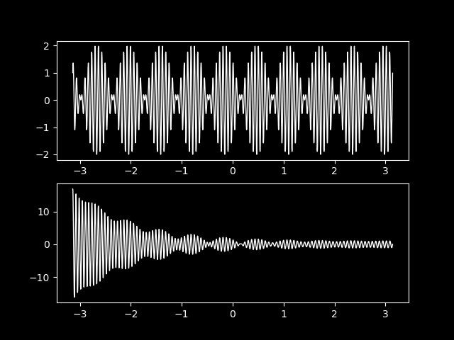

##  工 程 数 学  
 Engineering Mathematics  

 

**李小飞**  @ 光电科学与工程学院

 

 2023-03-01  

<!-- .slide: data-background="EM-beamer/images/uestclogo-1.png" data-background-opacity="1.0"-->

---

#   第一章 绪论

note: # 章
note: ## 第X讲
note: ### N、主题  
note: ###  无次序主题
note: ####  分主题
note: #####     再分主题
note: ######   

---

##  课程简介

17世纪微积分出现，物理学家写方程，数学物理学家解方程，试图通过方程的解来理解大千世界。

--

####  数理方程的位置  

  

数学：逻辑，算术，分析，统计，结构

--

####  分数构成  
1. 平时成绩： 15\%
   
2. 课堂测试： 15\%
   
3. 期末考试：70\%
  

--

#### 教学效果

  

--

####  教学内容  

- 第一章 绪论， 常微分方程解法、傅里叶变换

- 第二章 偏微分方程，波动方程、热传导方程、拉普拉斯方程。

- 第三章 薛定谔方程，无限深势阱、量子谐振子、Hermite多项式

- 第四章 氢原子薛定谔方程，勒让德方程、拉盖尔（Laguerre）方程

- 第五章 特殊函数及其应用，贝塞尔（Bessel）方程、Bessel函数
 

--

####  参考书目：

1. 教材：《工程数学讲义》 李明奇，钟尔杰，国防工业出版社， 待出版\\	\vspace{0.3cm}
2. 《Mathematics for Physicists》 Shaw, G:
3. 《数学物理方法》 姚瑞正，梁家宝 ，武汉大学出版社，1992 
4. 《数学物理方程与特殊函数》南京工学院数学教研组，人民教育出版社，1983
5. 《数学物理方程》孙振绮，机械工业出版社，2004

--

<!-- .slide:  data-auto-animate -->

### 数理方程大家: 
#### 拉普拉斯（法）

  
拉普拉斯方程: 天体力学， 比如描述引力势能。  (乾隆年间)

--

#### 泊松（法）

  
泊松方程: 描述场（电场，引力场等），Laplace方程只是Poisson方程的特例，

--

#### 勒让德（法）

  
勒让德方程: 球坐标系Laplace方程与勒让德方程等效

--

#### 傅里叶（法）

  
傅里叶变换: 分离变量法解波动方程，积分变换法解热传导方程， 发现叠加原理。

--

#### 格林（英）

  
格林函数: Laplace方程和泊松方程的解是格林函数的叠加

--

#### 贝塞尔（德）

  
塞尔方程: 柱坐标系下Laplace方程是贝塞尔方程，解是一系列贝塞尔函数的叠加

--

### 新方程与新解法：

- 薛定谔方程

- 爱因斯坦场方程

---

## 第一讲 常微分方程

--

- 微分方程：含未知函数及其导数的方程
$f\left(x,t, u, u_t,u_{tt}, \ldots u_{t \ldots t}, u_{x}, u_{xx}, \ldots, u_{x \ldots x} \right)=0$ 
- 解微分方程: 求物理量的函数表达式u(x,t) 
- 分类-1: 按导数的阶分，有一阶微分方程、二阶微分方程、高阶微分方程
- 分类-2: 按自变量的个数来分，有常微分方程和偏微分方程
- 基本解法：行波法、**分离变量法**、**积分变换法**、格林函数法、保角变换法、复变函数法、变分法、**级数展开法**, ...  

---

### 1. 常微分方程的数学模型

---

### 一阶微分方程的基本形态： 

$$ f\left(x, t, u, u_t, u_x\right)$$ 

$\color{#FFA500}{\text{例-0：}}$ 求 $g(y)dy=f(x)dx $ 的通解 

$\color{#FFA500}{\text{解：}}$若 $g(y)$ , $f(x)$ 连续 ，有:  
$$\int g(y) d y = \int f(x) d x $$
若$g(y)$, $f(x)$  有原函数，通解为:
$$G(y)=F(x)+C$$

---

### 衰减、增长模型与一阶微分方程

- 衰减与增长模型是自然和人类社会客观存在的数学模型
  
- 通常呈指数衰减或增长的形式
  
- 速率大于零为增长模型，小于零为衰减模型

---

$\color{#FFA500}{\text{例-1：}}$ 求解放射性衰减方程 ：
$$\frac{du}{dt}	= - r u, \qquad u(t_0) = u_0$$
$\color{#FFA500}{\text{解：}}$ 方程可分离变量 
`$$
\begin{aligned}
  \frac{du}{u} &= - rdt\\
  \ln u &=-rt+C\\
  u(t)&=C'exp(-rt) \\ 
\end{aligned}
$$ `
代入定解条件（令 $t=t_0$）:
`$$
\begin{aligned}
u(t_0)= C'exp(-rt_0) & = u_0 \\
\implies C' & =u_0
\end{aligned} 
$$`
方程的解为：
$$ u(t)=u_0 exp(-rt) $$ 

--

- 显然，当$r>0$时, 有$t \to \infty$， $u(t) \to 0$

- 衰减中的一个重要参数是半衰期 T 
  
$\color{#FFA500}{\text{解：}}$ 

`$$
\begin{aligned}
  \frac{1}{2}u_0 &=u(T) \\
  & =u_0 exp(-rT) \\
  T &=\frac{1}{r} \ln 2  \\
  & \approx \frac{1}{r} \times 0.6931  
\end{aligned}	
$$`

---

$\color{#FFA500}{\text{例-2：}}$ 求人口增长的模型(逻辑斯蒂) 
$$
\frac{d u}{d t}=r u (1-u/K) 
$$ 
$\color{#FFA500}{\text{解：}}$  方程可分离变量
`\begin{align*}
		\frac{1}{u(1-u / K)}du &=r d t \\
		\frac{u / K+(1-u / K)}{u(1-u / K)} d u &=r d t	\\
		(\frac{1}{K-u}+\frac{1}{u} ) d u &=r d t \\
		-\ln (K-u)+\ln u &=r t+C \\
	\end{align*}`

--

`\begin{align*}
		&\ln \frac{u}{K-u}  = r t+C\\
		&\frac{u}{K-u} = \exp (r t+C)\\
		&u(t) = \frac{K}{1+ \exp (-r t-C)}	\\
	\end{align*}`

参数C由初始条件确定

 

 
$\color{#FFA500}{\text{Tips:}}$ 
- 自然过程要么指数增长要么指数哀减

- 一生二, 二生三, 三生万物? 

---

### 二阶常微分方程的基本形态 

$$ f\left(x, t, u, u_t, u_x, u_{tt}, u_{xx}\right)$$ 

---

### 振动模型与二阶常微分方程

$\color{#FFA500}{\text{例-3：}}$ 建立简谐振动微分方程并求解 

 

$\color{#FFA500}{\text{建立方程：}}$  根据牛顿第二定律和胡克力定律，有
`\begin{equation*}
		F= -k x, ~~	F=Ma= M\frac{d ^2 x}{d t^2} 
	\end{equation*}`

--

整理
`$$\frac{d ^2 x}{d t^2} +\frac{k}{M} x =0$$` 
写成标准数理方程

`$$\begin{cases}
	x^{\prime \prime} +\omega ^2 x = 0 \qquad (1)	\\
  \\
	x(t)\left |_{t=0}  =x_0  \right. \qquad (2) \\
	x^{\prime}(t) \left |_{t=0}  =0  \right. \qquad (3)     	
	\end{cases}$$`
（2）和（3）分别是初始位置和速度，统称定解条件。

--

$\color{#FFA500}{\text{解方程：}}$ 这是二阶常系数齐次微分方程, 

可通过辅助方程求解
`\begin{aligned}
  u^2+\omega ^2&=0  \\ 
  u_{1, 2} &=\pm i\omega 
\end{aligned}`

原方程的基本解
`$$
\begin{cases}
    x_{1} =\cos \omega t  \\
    x_{2} =\sin \omega t
\end{cases} $$`
通解： $x(t)=C_1 \cos \omega t +C_2 \sin \omega t $

代入定解条件, 得特解： 
$$x(t)=x_0 \cos \omega t $$

---

$\color{#FFA500}{\text{例-4：}}$ 考虑空气阻力， 有如下小阻尼振动微分方程， 试求解
` \begin{equation*}
    \frac{d^2 x}{d t^2} +2\varepsilon \frac{d x}{dt} +\omega ^2 x = 0 ,  ~~~ (\varepsilon \ll \omega)   
  \end{equation*} `
$\color{#FFA500}{\text{解：}}$  令 $\displaystyle  x(t)= exp(-\varepsilon t) u(t) $, 微分

`$$
\begin{aligned}
  \frac{d x}{d t } & =exp(-\varepsilon t) [-\varepsilon u +\frac{d u}{dt}]\\
	\frac{d^2 x}{d t^2 } & =exp(-\varepsilon t) [\varepsilon ^2 u -2\varepsilon \frac{d u}{dt}+ \frac{d^2 u}{dt^2} ]
\end{aligned}
$$ `
代回方程并整理
$$ \frac{d^2 u}{d t^2} +(\omega ^2 - \varepsilon ^2) u = 0,  ~~~ (\varepsilon \ll  \omega)    $$

--

令 $k^2 =\omega ^2 - \varepsilon ^2 >0 $, 得简谐振动方程标准型
$$\frac{d^2 u}{d t^2} +k ^2 u = 0$$
由公式得
`\begin{equation*}
		u(t)=C_1 \cos k t +C_2 \sin k t 
	\end{equation*}`
方程的通解 
`\begin{equation*}
		x(t)= exp(-\varepsilon t) \left[ C_1 \cos \sqrt{k}  t +C_2 \sin \sqrt{k} t \right] 
	\end{equation*}`

--

如存在定解条件，则一样可以写出特解，比如： 	
`\begin{equation*}
		x(t)= x_0 exp(-\varepsilon t) \cos \sqrt{\omega ^2 - \varepsilon ^2}  t 
	\end{equation*}`
很明显，振幅呈指数衰减！

 

--

$\color{#FFA500}{\text{例-5：}}$ 考虑加上周期性的策动力 $p  \sin \omega_0 t$， 则有如下非齐次振动方程， 试求解

` \begin{equation*}
    \frac{d^2 x}{d t^2} +\omega ^2 x = p \sin \omega_0 t ,  ~~~ (\varepsilon \ll \omega)   
  \end{equation*} `

$\color{#FFA500}{\text{解：}}$  对应齐次方程的通解：
`\begin{equation*}
	u(t)=C_1 \cos \omega t +C_2 \sin \omega t 
	\end{equation*}`
因此，可以设非齐次方程的特解为： 
$$ u(t) =C \sin \omega_0 t $$ 
问题转化为求 $C$ （待定系数法）

--

把特解代回原方程
`$$ \begin{aligned}
  C(\omega^2-\omega_{0} ^2 ) \sin(\omega_0 t)& =p\sin(\omega_0 t)\\
		C & = \frac{p}{\omega^2-\omega_{0} ^2 }
\end{aligned}  $$ `
原方程的解为：对应齐次方程的通解+特解
$$ x(t)= C_1 \cos \omega t +C_2 \sin \omega t+ \frac{p}{\omega^2-\omega_{0} ^2 } \sin (\omega_0 t)  $$ 

$\color{#FFA500}{\text{Tips：}}$ 当策动函数为多项式函数，三角函数等与通解形式相类似型时， 待定系数法通常可确定特解。对于一般性的情况，可采用常数变易法求解。 

---

解的分析：这是两个不同频率的波的叠加

note: python {data-trim data-line-numbers="|1-2|7-7"}
import numpy as np
import matplotlib.pyplot as plt
plt1 =plt.subplot(211)
plt2 =plt.subplot(212)
x = np.arange(- np.pi, np.pi, 0.001)
y1 = np.cos(x*100)+ np.sin(x*90)
y2 = np.exp(-0.9*x)*np.cos(x*100)+ np.sin(x*90)
plt1.plot(x, y1, linewidth=1.0, color='w')
plt2.plot(x, y2, linewidth=1.0, color='w')
plt.savefig("./figs/my.png")
plt.show();

 

如果两频率相近，则发生共振。

如果是衰减波，则最后只留下策动

--

如果既有策动又有空气阻尼，方程为：
` \begin{equation*}
    \frac{d^2 x}{d t^2} +2\varepsilon \frac{d x}{dt} +\omega ^2 x = f(t) ,  ~~~ (\varepsilon \ll \omega)   
  \end{equation*} `

如果策动还与位置相关，则方程为：
` \begin{equation*}
    \frac{d^2 x}{d t^2} +2\varepsilon \frac{d x}{dt} +\omega ^2 x = f(x, t) ,  ~~~ (\varepsilon \ll \omega)   
  \end{equation*} `

如果阻尼系数是位置的函数（比如空间密度不是常数），则方程为：
` \begin{equation*}
    \frac{d^2 x}{d t^2} +2\varepsilon(x) \frac{d x}{dt} +\omega ^2 x = f(x, t) ,  ~~~ (\varepsilon \ll \omega)   
  \end{equation*} `

--

如果再考虑到阻尼导致弹簧温度变化，进而影响弹性系数，则方程为：
` \begin{equation*}
    \frac{d^2 x}{d t^2} +2\varepsilon(x) \frac{d x}{dt} +\omega^2 (t)  x = f(x, t) ,  ~~~ (\varepsilon \ll \omega)   
  \end{equation*} `

如果弹簧不同的位置温度变化不一样，则方程为：
` \begin{equation*}
    \frac{d^2 x}{d t^2} +2\varepsilon(x) \frac{d x}{dt} +\omega^2 (x,t)  x = f(x, t) ,  ~~~ (\varepsilon \ll \omega)   
  \end{equation*} `

 

 
$\color{#FFA500}{\text{Tips：}}$  现实工程里的数理方程远比《工程数学》教材上的方程复杂！建立方程并求解是工科学校学生的一项基本功。

---

## 2. 常微分方程的基本解法

---

<!-- .slide: data-visibility="hidden" -->
$\color{#FFA500}{\text{例-6：求解一阶齐次方程}}$  
`\begin{equation*}
		\frac{d y}{d x}=f\left(\frac{y}{x}\right) 
	\end{equation*}`

$\color{#FFA500}{\text{解：}}$ 令：$\dfrac{y}{x}=u$, 有：$y=xu$

微分： $ \dfrac{d y}{d x}=u+x \dfrac{d u}{d x}$,

代回方程：	
	
 `\[ \dfrac{d u}{d x}=\dfrac{f(u)-u}{x}\]` 

分离变量：
$$\int \dfrac{d u}{f(u)-u}=\int \dfrac{d x}{x}$$ 	

--

<!-- .slide: data-visibility="hidden" -->
$\color{#FFA500}{\text{例-7：}}$ 求一阶齐次微分方程: 
$$
\left(x-y \cos \frac{y}{x}\right) d x+x \cos \frac{y}{x} d y=0
$$ 
$\color{#FFA500}{\text{解：}}$ 变量代换： 令 $\dfrac{y}{x}=u$, 有$y=xu$, 微分：
$$ d y=x d u+u d x $$
代回原方程
`$$
\begin{aligned}
  (x-u x \cos u) d x&+x \cos u(u d x+x d u) =0 \\
  \cos udu & =-\frac{dx}{x}  \\
  \sin u &=-\ln x+C, \implies \sin \frac{y}{x}=-\ln x+C
\end{aligned}
$$`

---

$\color{#FFA500}{\text{例-6：}}$ 求解一阶常系数线性非齐次常微分方程 
$$ y'+py=f(x)$$ 
$\color{#FFA500}{\text{解：}}$  对应的齐次方程是衰减数学模型，有解：
$$y=C exp(-px)$$
采用常数变易法，设非齐次方程的解为
$$y(x) =C(x) exp(-px)$$
求导
`$$ \begin{aligned}
		y'&= -p C(x) exp(-px) + C'(x) exp(-px)   \\
		py &= p C(x) exp(-px)
\end{aligned} $$` 

--

代入原方程, 得
$$ exp(-px)C'(x) = f(x)$$
解得
$$ C(x) = \int exp(px) f (x)dx + c $$ 
原方程的（通）解为

`$$ \begin{aligned}
	y(x) &=C(x) exp(-px) \\
	&= \left(\int exp(px) f (x)dx + c\right) exp(-px) 
\end{aligned}$$`

分析：做指数哀减，哀减幅度由初始条件和非自由项共同决定

---

$\color{#FFA500}{\text{例-7：}}$ 求一阶非齐次变系数微分方程:
` \begin{equation*}
    y^{\prime}+P(x) y=Q(x)
  \end{equation*} `
$\color{#FFA500}{\text{解：}}$  对应的齐次方程为：
` \begin{equation*}
    y^{\prime}+P(x) y=0
  \end{equation*} `
分离变量法得通解
$$y=Ce^{-\int P(x)dx}$$
常数变易，令： $C=C(x)$，得
$$
y=C(x)e^{-\int P(x)dx}
$$  

--

求导并代回原方程
$$
C^{\prime}(x)=\frac {Q(x)} {e^{-\int P(x)dx}}
$$ 
积分得
$$
C(x)=\int Q(x)e^{\int P(x)dx} dx+c 
$$ 
原方程得解
$$
y=\left(\int Q(x)e^{\int P(x)dx} dx+c\right)e^{-\int P(x)dx}
$$ 

---

$\color{#FFA500}{\text{例-8：}}$ 求解二阶常系数非齐次常微分方程 
$$ y^{\prime \prime}+py'+qy=f(x) $$ 
$\color{#FFA500}{\text{解：}}$  对应的齐次方程为：
$$  y^{\prime \prime}+py'+qy=0 $$ 
特征方程
$$ \lambda^2 +p\lambda +q=0  $$ 

--

解有三种情况：

`$$ \begin{aligned}
		两相异实根：& \lambda_1 \ne \lambda_2  \\
		两相同实根：& \lambda_1 = \lambda_2   \\
		两共轭复根：& \lambda_1=\alpha+i\beta , \lambda_2=\alpha-i\beta
\end{aligned}$$ `
对应的齐次方程的通解：
`$$ \begin{aligned}
		两相异实根：y=& C_1 exp(\lambda_1 x)+ C_2 exp (\lambda_2 x)   \\
		两相同实根：y=& (C_1+C_2x)  exp (\lambda_1 x)  \\
		两共轭复根：y=&  exp(\alpha x)  [C_1 \cos (\beta x)+ C_2 sin (\beta x)]
\end{aligned}$$ `

根据自由项的特点，再通过待定系数法或常数变易法求解非齐次常微分方程。

---

$\color{#FFA500}{\text{例-9：}}$ 求解二阶常系数非齐次常微分方程的初值问题
`$$\begin{cases}
		u^{\prime \prime} +\omega ^2 u =f, (t>0)\\
		\\
		u(0)=0, u'(0)=0
\end{cases}$$`
$\color{#FFA500}{\text{解：}}$ 这是振动数学模型，齐次方程有通解： 
$$ u=C_1 \cos(\omega t)+C_2 \sin(\omega t) $$ 
由于$f$的函数形式不明，不能写出特解。采用常数变易，设非齐次方程的解为 
$$ u=C_1(t) \cos(\omega t)+C_2(t) \sin(\omega t) $$

--

求导
`$$ \begin{aligned}
	u'& =[C'_1(t) \cos(\omega t)+C'_2(t) \sin(\omega t)] \\
	&+ [  - \omega C_1(t) \sin(\omega t)+ \omega C_2(t) \cos(\omega t)  ] \\ 
\end{aligned}  $$` 
令 $$[C'_1(t) \cos(\omega t)+C'_2(t) \sin(\omega t)]=0 \qquad (1) $$
再求导
$$ u^{\prime \prime}= [  - \omega C'_1(t) \sin(\omega t)+ \omega C'_2(t) \cos(\omega t)  ] -\omega^2 u  $$ 

--

代回原方程
$$ [  - \omega C'_1(t) \sin(\omega t)+ \omega C'_2(t) \cos(\omega t)  ] =f      \qquad( 2) $$ 
联立（1）（2）， 得方程组

`$\qquad \begin{bmatrix}
		\cos(\omega t) & \sin(\omega t) \\ 
		-\omega \sin(\omega t) & \omega\cos(\omega t)
	\end{bmatrix} $`
`$\begin{bmatrix}
		C'_1(t)\\ 
		C'_2(t)
	\end{bmatrix} $` =
`$\begin{bmatrix}
		0\\ 
		f
	\end{bmatrix} $`

求解：
`$$ \begin{cases}
		C'_1(t)=\dfrac{f}{\omega} \sin(\omega t)  \\ 
		C'_2(t)=\dfrac{f}{\omega} \cos(\omega t)  
	\end{cases}  $$ `

--

积分得
`$$ \begin{cases}
		C_1(t)=\dfrac{1}{\omega} [\int_{0}^{\tau} \sin(\omega \tau) f(\tau)  d\tau +c_1 ]\\ 
		C_2(t)=\dfrac{1}{\omega} [\int_{0}^{\tau} \cos(\omega \tau) f(\tau)  d\tau +c_2 ]\
	\end{cases}  $$` 
原方程的通解：
`$$ \begin{aligned}
	u=&\dfrac{1}{\omega}\cos(\omega t)[\int_{0}^{\tau} \sin(\omega \tau) f(\tau)  d\tau +c_1 ] \\
		&+\dfrac{1}{\omega} \sin(\omega t) [\int_{0}^{\tau} \cos(\omega \tau) f(\tau)  d\tau +c_2 ]
\end{aligned}  $$`
代入定解条件，得  $c_1=c_2=0$

--

原方程的解为：
`$$ \begin{aligned}
	u=&\dfrac{1}{\omega}\cos(\omega t)\left[\int_{0}^{\tau} \sin(\omega \tau) f(\tau)  d\tau \right] \\
		&+\dfrac{1}{\omega} \sin(\omega t) \left[\int_{0}^{\tau} \cos(\omega \tau) f(\tau)  d\tau \right]
\end{aligned}  $$`

$\color{#FFA500}{\text{结束！}}$  

---

$\color{#FFA500}{\text{例-10：}}$ 求二阶变系数齐次常微分方程（欧拉方程-1）
$$ x^2 \frac{d^2 y}{d x^2} +x \frac{d y}{d x} +n^2 y =0   $$ 

$\color{#FFA500}{\text{解：}}$ 令 $x=exp(t) , (t=ln x)$，求微分：

$$ 
\frac{d y}{d x}  = \frac{d y}{d t}\frac{d t}{d x}= \frac{1}{ x}\frac{d y}{d t}  \implies x \frac{d y}{d x}=	\frac{d y}{d t} \\
$$ 
$$ \frac{d ^2y}{d x^2}  = \frac{d }{d t} ( \frac{1}{ x}\frac{d y}{d t}  )\frac{d t}{d x}=  
		\frac{1}{ x^2}(\frac{d ^2y}{d t^2} -	\frac{d y}{d t}) $$ 
$$ \implies 	x^2 \frac{d^2 y}{d x^2} = \frac{d ^2y}{d t^2} -	\frac{d y}{d t}  $$ 
代回原方程

--

整理，得

$$ \frac{d^2 y}{d t^2}  +n^2 y =0  $$ 

这是振动数学模型，有通解： 
$$ u=C_1 \cos(n t)+C_2 \sin(n t) $$

把 $t=ln x$ 代入，得原方程的通解
$$ y(x)=C_1 \cos (n \ln x) +C_2 \sin (n \ln x)  $$

$\color{#FFA500}{\text{结束！}}$  

---

$\color{#FFA500}{\text{例-11：}}$ 求二阶变系数齐次常微分方程（欧拉方程-2）
$$ x^2 \frac{d^2 y}{d x^2} +2x \frac{d y}{d x} -n(n+1) y =0   $$ 

$\color{#FFA500}{\text{解：}}$ 令 $x=exp(t) , (t=ln x)$，求微分：

$$ 
\frac{d y}{d x}  = \frac{d y}{d t}\frac{d t}{d x}= \frac{1}{ x}\frac{d y}{d t}  \implies x \frac{d y}{d x}=	\frac{d y}{d t} \\
$$ 
$$ \frac{d ^2y}{d x^2}  = \frac{d }{d t} ( \frac{1}{ x}\frac{d y}{d t}  )\frac{d t}{d x}=  
		\frac{1}{ x^2}(\frac{d ^2y}{d t^2} -	\frac{d y}{d t}) $$ 
$$ \implies 	x^2 \frac{d^2 y}{d x^2} = \frac{d ^2y}{d t^2} -	\frac{d y}{d t}  $$ 
代回原方程

--

整理，得

$$ \frac{d^2 y}{d t^2}  +\frac{dy}{dt}-n(n+1) y =0   $$ 
这是含哀减项的非标准振动数学模型，写特征方程
$$ \lambda^2 +\lambda -n(n+1) =0  $$ 
两相异实根：$ \lambda_1=n, \quad \lambda_2= -(n+1) $

方程的解为：
$$ y(t)=C_1 \exp (nt) +C_2 \exp (-(n+1) t)  $$ 

--

代入 $t=ln x$, 原方程得解：

$$ y(x)=C_1 x^n +C_2 x^{-(n+1) } $$ 
 
$\color{#FFA500}{\text{Tips：}}$ 
- 系数是其他形式的二阶欧拉方程 
- 非齐式二阶欧拉方程 
- 高阶的欧拉方程

---

$\color{#FFA500}{\text{例-12：}}$ 求二阶变系数非齐次常微分方程（欧拉方程-3）
$$ x^2 \frac{d^2 y}{d x^2} -2x \frac{d y}{d x} +2y = \ln^2( x) -2 \ln(x) $$ 
$\color{#FFA500}{\text{解：}}$ 令 $x=exp(t) , (t=ln x)$，求微分并代回原方程， 得 
$$ 
\frac{d^2 y}{d t^2}  -3\frac{dy}{dt} +2 y =t^2 -2t  $$ 
这是含哀减项和策动项（自由项）的非标准振动数学模型，

先写齐次方程的特征方程
$$ \lambda^2  -3\lambda +2  =0  $$

--

有两相异实根
$$ \lambda_1=1,   \lambda_2=2 $$ 
通解：
$$y_1=C_1 e^t +C_2 e^{2t}$$
两在有二条路可走
- 特解+通解
- 常数变易法
  
考虑自由项（$ \ln^2( x) -2 \ln(x) = t^{2} -2 t $ ），令特解为：
$$y_2=a t^2+bt+c$$

--

把特解代回原方程, 并求解得
$$ y_2=\frac{1}{2} t^2+\frac{1}{2}t+\frac{1}{4}  $$ 

原方程得解
$$ y= y_1 + y_2 =C_1 e^t +C_2 e^{2t}+\frac{1}{2} t^2+\frac{1}{2}t+\frac{1}{4}  $$

代入 $t=ln x $, 得 
$$ y(x)=C_1 x +C_2 x^2+\frac{1}{2} \ln ^2 x+\frac{1}{2}\ln x+\frac{1}{4} $$ 

$\color{#FFA500}{\text{结束！}}$  

---

$\color{#FFA500}{\text{例-13：}}$ 求二阶变系数齐次常微分方程（n 阶厄米方程）
$$ \frac{d^2 y}{d x^2} -2x \frac{d y}{d x} +2n y =0  $$ 
$\color{#FFA500}{\text{解：}}$ 设方程有级数解 
$$ y=\sum_{k=0}^{\infty} c_k x^k $$ 

问题转化为求 \{ $c_k$ \}

--

求导：
`$$\begin{cases}
		y' = \sum\limits_{k=1}^{\infty} k c_k x^{k-1} =\sum\limits_{k=0}^{\infty} (k+1) c_{k+1} x^{k}\\
		\\
		y'' = \sum\limits_{k=2}^{\infty} k (k-1) c_k x^{k-2} =  \sum\limits_{k=0}^{\infty} (k+2) (k+1) c_{k+2} x^k
	\end{cases}$$` 

(注意：运用了脚标变换大法！)

--

代回原方程：
$$ \sum_{k=0}^{\infty} [ (2n -2k)c_k +(k+2)(k+1) c_{k+2}  ] x^k  =0 $$ 

一个多项式为零，要求所有项的系数为零
$$ (2n -2k)c_k +(k+2)(k+1) c_{k+2} =0 $$

得系数递推式：
$$ c_{k+2} = \frac{ 2(k-n)}{(k+2)(k+1) } c_k, ~~  \left( k=0,1,2,3, ...  \right)  $$ 
这是隔项递推，如果 $c_0, c_1$ 知道， 则所有的 $c_k$ 都可得。

--

$$ c_{k+2} = \frac{ 2(k-n)}{(k+2)(k+1) } c_k, ~~  \left( k=0,1,2,3, ...  \right)  $$ 
试推一下：
`$$\begin{cases}
		c_2 =- \frac{2n}{2!} c_0\\
		c_4 = \frac{2^2n(n-2)}{4!} c_0 \\
		c_6 = -\frac{2^3n(n-2)(n-4)}{6!} c_0 \\
		...	
\end{cases} $$`

偶数阶：
$$c_{2m} = (-1) ^m \frac{2^mn(n-2)(n-4) ... (n-2m+2)  } {(2m)!} c_0$$

--

同理，奇数阶:
$$ c_{2m+1} = (-1) ^m \frac{2^m (n-1) (n-3)(n-5)...(n-2m+1)  } {(2m+1)!} c_1  $$ 
令：
` \begin{cases}
		y_1(x)  = [1- \dfrac{2n}{2!} x^2+ \dfrac{2^2n(n-2)}{4!} x^4 -...  ] \\
		y_2(x)  = [x- \dfrac{2(n-1)}{3!} x^3+ \dfrac{2^2(n-1)(n-3) }{5!}x^5 -...  ]
	\end{cases} `

原方程得解：
$$y(x) =c_0y_1(x)+c_1 y_2(x)$$

---

## 第二讲 傳里叶级数与傅里叶变换

--

## 1. 傳里叶级数

--

## 2. 傅里叶变换

--

# 
  Thanks 
 

note: thanks for your attention