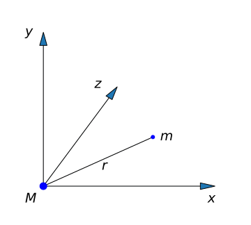
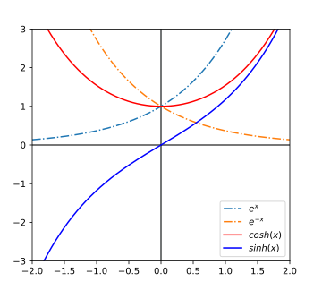

##  工 程 数 学  
 Engineering Mathematics  

 

**李小飞**  @ 光电科学与工程学院

 

 2023-03-01  

<!-- .slide: data-background="EM-beamer/images/uestclogo-1.png" data-background-opacity="1.0"-->

---

##   第二章  三大偏微分方程

note: # 章
note: ## 第X讲
note: ### N、主题  
note: ###  无次序主题
note: ####  分主题
note: #####     再分主题
note: ######   

---

- 偏微分方程(PDE)指未知函数是多元函数的微分方程.

  方程的解函数多以时间和空间为自变量，这些方程的来源和应用通常具有物理背景, 因此又称数学物理方程。

- 方程的最高阶是二阶的称为二阶偏微分方程
$$ au_{xx}+2bu_{xy}+cu_{yy}+du_x+eu_y+fu=g  $$ 

- 根据$\Delta=b^2-ac$， 二阶偏微分方程可分为三类：
  
  椭圆型($\Delta<0$)、双曲型($\Delta>0$)和 抛物型 ($\Delta=0$). 
  
  代表有: 波动方程、热传导方程、拉普拉斯（泊松）方程

---

## 第一讲 波动方程

---

### 1. 方程的建立
$\color{#FFA500}{\text{例-1：}}$ 考虑均匀柔软的细弦线，二端固定，受到扰动后在平衡位置作微小运动。求位移函数 $u(x，t)$满足的方程。

- 自然界普遍存在振动现象，振动在媒介中传播，开成波，服从统一的波动方程。	

--

$\color{#FFA500}{\text{解：}}$  建立如图的坐标系,  取任意微元$ds$为研究对象, 进行受力分析。

临元对ds存在拉力$T_1, T_2$，对它们进行正交分解

- 水平方向：$T_2\cos \alpha _2=T_1\cos \alpha _1=T_0$ 
     
- 竖直方向：$T_2 \sin \alpha_2 - T_1 \sin \alpha_1 = ma =(\rho ds) u_{tt} $

--

代入$T_0$, 有：$$T_0 (\tan \alpha_2 - \tan \alpha_1 )=\rho ds u_{tt}$$ 

斜率就是一阶导数，同时小角度条件下$ds \simeq dx$

$$T_0[u_x(x+dx,t)-u_x(x,t)]=\rho dx ~u_{tt}$$  

整理
$$\frac{T_0}{\rho}\times\frac{u_x(x+dx,t)-u_x(x,t)}{dx}=u_{tt}$$ 

--

基于导数的定义，得波动方程：
$$ u_{tt}=a^2u_{xx}  $$ 

定解条件:
- 初始条件 
$$  u(x,t) | _{t=0} = \psi (x), \quad u_t  (x,t) | _{t=0} = \Psi (x)  $$ 

- 边界条件
$$ u(x_0,t) | _{x=0} = 0, u(x,t) | _{x=l} = 0 $$

--

若质点受外力作用(比如风)，则有：

$$ u_{tt} =a^2 u_{xx} +f(x,t)  $$ 

$\color{#FFA500}{\text{Tips：}}$  
- 波动方程描述的是物体在平衡位置附近做小幅震荡的规律，
  比如可描述琴弦、鼓膜、耳机的机械震动，

- 也描述声波、电磁波、地震波、引力波，甚至弦论中弦的运动。

---

### 2. 方程的求解
	
$\color{#FFA500}{\text{例-2：}}$  求解如下一维波动方程
`$$ \begin{cases}
		u_{tt}=a^2u_{xx}\\
		\\
		u(x,t)|_{t=0}= \psi (x) ,~~~ u_t(x,t)|_{t=0}= \Psi (x) \\
		u(x,t)|_{x=0}= 0, ~~~  u(x,t)|_{x=l}= 0 
	\end{cases} $$`

$\color{#FFA500}{\text{解：}}$ (傅里叶) 设 $u(x,t)=T(t)X(x) $，代回方程 , 得：

$$ T^{\prime\prime} (t) X(x) = a ^2 T(t) X ^{\prime\prime}(x)   $$ 

--

整理得	
$$ \dfrac{ T^{\prime\prime}}{ a^2 T} = \dfrac{X^{\prime\prime} }{X} $$ 

上式恒成立，可令 
$$ \dfrac{ T^{\prime\prime}}{ a^2 T} = \dfrac{X^{\prime\prime} }{X} = -\lambda $$

--

得两个常微分方程
- 方程（I）：
`$$ \begin{cases}
	X ^{\prime\prime} +\lambda X=0, \quad 0<x<l \\
	\\
	X(0)=0, \quad X(l)=0
	\end{cases}  $$` 

- 方程（II）：
$$ T^{\prime\prime} +\lambda {a^2 T}=0  $$ 
	

通过变量分离，偏微分方程转化为常微分方程

--

解方程（I）
$$ X ^{\prime\prime} +\lambda X=0  $$ 

特征（辅助）方程 
$$ \mu^2 +\lambda =0  $$ 

根为:
`\begin{cases}
		\mu~_1 =+\sqrt{-\lambda}\\
		\mu~_2 =-\sqrt{-\lambda}
	\end{cases}`

--

$\bullet$ 分情况讨论：

(1) 相异实根（$\lambda < 0$）
	
写出通解：$$ X(x)=A e^{\sqrt{-\lambda}x} + B e^{-\sqrt{-\lambda}x}  $$ 

代入定解条件$X(0)=0, \quad X(l)=0$, 得定解方程组：
`$$ \begin{cases}
	 A + B = 0 \\
	 A e^{\sqrt{-\lambda}l} + B e^{-\sqrt{-\lambda} l} =0
\end{cases} $$ `

--

写成矩阵形式
`$$ \left[
	\begin{array}{lll}
		1 & 1\\
		e ^{\sqrt{-\lambda} l} & e~^{-\sqrt{-\lambda} l}
	\end{array}
	\right]
	\left[
	\begin{array}{ll}
		A\\
		B
	\end{array}
	\right]
	=\left[
	\begin{array}{ll}
		0\\
		0
	\end{array}
	\right]  $$` 

有解条件为系数行列式为零：
`$$ \begin{vmatrix}
		1 & 1 \\
		e^{\sqrt{-\lambda} l} & e ^{-\sqrt{-\lambda} l}
	\end{vmatrix}
	= 0  $$` 
	
很明显，这个行列式不等于0， 所以只有零解 （A=0,~B=0）    

--

(2) 相同实根（$\lambda = 0$），
	
写出通解：	$$ X(x) = Ax + B $$ 

分别取$x=0, x=l$, 得定解方程组：
`$$\left\{
	\begin{array}{lll}
		B=0\\
		Al+B=0
	\end{array} \right. $$`

也只有零解  

--

	
(3) 虚根（$\lambda >0$），即： $$ \mu~_1 = i \sqrt{\lambda}, \quad \mu _2 = - i \sqrt{\lambda}$$	

写出通解：$$ X(x)=A\cos \sqrt{\lambda}x+ B\sin \sqrt{\lambda}x  $$  

分别取$x=0, x=l$, 得定解方程组：

`$$ \left[
	\begin{array}{lll}
		1&0\\
		\cos( {\sqrt{\lambda}~l}) &\sin ({\sqrt{\lambda}~l})
	\end{array}
	\right]
\left[
	\begin{array}{ll}
		A\\
		B
	\end{array}
	\right]=
\left[
	\begin{array}{ll}
		0\\
		0
	\end{array}
	\right] $$` 

--

由系数行列式为零，得：
$$ \sin ({\sqrt{\lambda}~l})=0  $$

有
$$ \sqrt{\lambda} l = n \pi \quad  (n = 1, 2, 3, \cdots )  $$ 

解得
- 固有值：$ \lambda~_n = \dfrac{n^2 \pi~^2 }{l~^2 }$ 

--

把固有值 $ \lambda~_n= \dfrac{n^2 \pi~^2 }{l~^2 } $代入通解， 得：
- 固有函数：$ X~_n=A_n\sin \dfrac{n\pi~}{l} x = A_n \sin \omega_n x  $ 

--

解方程II : 	$$  T~^{\prime\prime} +\lambda {a~^2 T}=0   $$ 

把固有值 $\lambda_n$ 代入, 得：

$$ T_n ^{\prime\prime} +\lambda~_n a~^2 ~T=0  $$  

改写为：
$$ T_n ^{\prime\prime} + (\omega_n a)^2 T=0  $$ 

特征方程只有虚根，定出方程的通解 ：
$$ T _n = C _n \cos \omega_n a t+ D _n \sin \omega _n a t   $$ 

--

	
原方程的基本解：
`$$ \begin{array}{llll}
		u_n(x,t) &= T_n(t)X_n(x)\\
		&=(a_n\cos \omega_nat+ b_n\sin \omega _nat ) \sin \omega_n x\\
		&=(a_n\cos\dfrac{ n\pi a}{l}t+ b_n\sin \dfrac{ n\pi a}{l}t) \sin \dfrac{ n\pi }{l}x
	\end{array}  $$` 

叠加解 (解函数)：
`$$ \begin{array}{llll}
		u(x,t) &=&\sum\limits_{n=1}^{\infty } u_n(x,t)\\
		&=& \sum\limits_{n=1}^{\infty }  (a_n\cos\dfrac{ n\pi a}{l}t+ b_n\sin \frac{ n\pi a}{l}t) \sin \dfrac{ n\pi }{l}x
	\end{array}  $$` 

还需确定系数 $a_n, b_n$！

--

$$ u(x,t)= \sum\limits_{n=1}^{\infty }  (a_n\cos\dfrac{ n\pi a}{l}t + b_n\sin \frac{ n\pi a}{l}t) \sin \dfrac{ n\pi }{l}x  $$

定解条件-1: (初始位置) 
$u(x,0)= \varphi (x)$  
$$\varphi (x)=\sum_{n=1}^{\infty } a_n \sin \dfrac{ n\pi }{l}x $$  

由傳里叶变换公式得系数： （注意：积分区间导致因子变化）
$$ a_n =  \frac{2}{l}\int\limits_{0 }^{l}  \varphi (x) \sin \dfrac{ n\pi }{l}x dx  $$ 

--

定解条件-2: （初始速度）
$ u_t(x,0)= \Psi (x)$  
$$\Psi (x)=\sum_{n=1}^{\infty } b_n \frac{ n\pi a}{l} \sin \frac{ n\pi }{l}x  $$ 

由傳里叶变换公式，得：
`$$ \begin{aligned}
b_n \frac{ n\pi a}{l}  & = \frac{2}{l}\int\limits_{0 }^{l}  \Psi  (x) \sin \dfrac{ n\pi }{l}x dx \\ 
b_n &=  \frac{2} { n\pi a}  \int\limits_{0 }^{l}  \Psi  (x) \sin \dfrac{ n\pi }{l}x dx 
\end{aligned}   $$` 
 
$\color{#FFA500}{\text{结束！}}$  

--

叠加解的思考与讨论：

- 数学理解: 线性方程解的线性组合，依然是方程的解  
  
- 物理理解: It is not complicated. It is just a lot of it. 
  
- 核心成果: 傅里叶级数与傅里叶变换 

---

	 
### 3. 固有函数正交

$\color{#FFA500}{\text{例-3：}}$  试证明所有固有函数($X~_n= \sin \dfrac{n\pi~}{l} x$) 两两正交

$\color{#FFA500}{\text{证明：}}$  
			 
固有函数是固有方程的解
`$$ \begin{array}{llll}
		&X_n ^{''}+\lambda_n X_n=0 \qquad (1) \\
		&X_m ^{''}+\lambda_m X_m=0 \qquad (2)
	\end{array}  $$ `

用$X_m$乘(1)式，$X_n$乘(2)式
`$$\begin{array}{llll}
		&X_m X_n ^{''}+\lambda_n X_m X_n=0 \qquad (3)\\
		&X_nX_m ^{''}+\lambda_m X_n X_m=0 \qquad (4)
	\end{array}$$` 

--

(3)-(4)：
`$$\begin{array}{llll}
		& (\lambda_n - \lambda_m) X_n X_m= X_n X_m ^{''}-X_m X_n ^{''} 
	\end{array}$$ ` 
	

两边同时积分：
`$$ \begin{array}{llll}
		(\lambda_n - \lambda_m )& \int\limits_{0 } ^{l}  X_n X_m dx  =  \int\limits_{0} ^{l}  [ X_n X_m ^{\prime\prime} - X_m X_n ^{\prime\prime} ] dx \\  
		& = [ X_n X_m ^{'} - X_m X_n ^{'} ] _0 ^{l} - \int\limits_{0} ^{l} [ X_n ^{'} X_m ^{'} - X_m ^{'} X_n ^{'} ] dx  
	\end{array}$$`

等式右边的两项分别为零，因此等式左边也等于零：

--

$$ (\lambda_n-\lambda_m) \int\limits_{0 }^{l}  X_n X_m dx=0   $$ 
由于 $\lambda_n \ne \lambda_m$, 得：
$$ \int\limits_{0 }^{l}  X_n X_m dx=0 , \qquad (n\ne m)  $$  

即： 固有函数两两正交

$\color{#FFA500}{\text{结束！}}$ 

--

$\color{#FFA500}{\text{例-4：}}$  试证明所有固有函数平方可积 

$\color{#FFA500}{\text{证明：}}$  当$n= m \ne 0$时，    
`$$ \begin{array}{llll}
		\int\limits_{0 }^{l}  X_n X_m dx&= \int\limits_{0 }^{l}  X_n X_n dx \\
		&= \int\limits_{0 }^{l}   \sin ^2  \frac{n\pi~}{l} x dx \\ 
		&=  \dfrac{l}{2}  \\ 
		&= \dfrac{T}{2} 
	\end{array}  $$ `

$\color{#FFA500}{\text{结束！}}$ 

--

正交和平方可积写在一起
`$$ \begin{equation*}
		\int\limits_{0 }^{l}  X_n X_m dx =
		\begin{cases}
		 0, \qquad (n=m) \\ 
		 \\
		 \dfrac{l}{2} , \qquad (n \not =m) 
		\end{cases} 
	\end{equation*}  $$`  

---

	
$\color{#FFA500}{\text{例-5：}}$ 求解如下定常问题
`$$\displaystyle  \begin{cases}
		u_{tt} =u_{xx},\quad (0<x<1, t>0)\\
		\\
		u(0,t) =u(1,t)=0 \\
		u(x,0) =\sin \pi x, \quad u_t (x,0)=0 
	\end{cases}$$ `	

$\color{#FFA500}{\text{解：}}$ 这是零边界条件下的波动方程，

- 固有值：$$ \lambda_n =\dfrac{n^2 \pi ^2}{l ^2 }= n^2 \pi^2 $$  

- 固有函数：$$  X_n = \sin \dfrac{n\pi}{l} x = \sin n \pi x $$

--

- 解函数:
`$$\begin{array}{llll}
		u(x,t)&=& \sum\limits_{n=1}^{\infty }  (a_n\cos\dfrac{ n\pi at}{l}+ b_n\sin \dfrac{ n\pi at}{l}) \sin \dfrac{ n\pi x}{l}\\
		&= &\sum\limits_{n=1}^{\infty }  (a_n\cos n\pi t+ b_n\sin n\pi t ) \sin n\pi x \\
	\end{array}$$ `

--

	
现在，我们通过初值条件来确定常数：初始位置决定 $a_n$  
` $$\begin{array}{lllllllll}
		a_n&=  \dfrac{2}{l} \int\limits_{0 }^{l}  \varphi (x) \sin \dfrac{ n\pi x}{l} dx \\
		&= 2 \int\limits_{0 }^{1}  \sin(\pi x) \sin n\pi x dx \\
		&= 2 \int\limits_{0 }^{1}  \sin(\pi x) \sin \pi x dx =1~~  (n=1)   
	\end{array}$$  `

--

初始速度决定 $b_n$  
`$$\begin{array}{lllllllll}
		b_n&= \dfrac{2} { n\pi a} \int\limits_{0 }^{l}  \Psi  (x) \sin \dfrac{ n\pi x}{l} dx  \\
		&= \dfrac{2} { n\pi} \int\limits_{0 }^{1}  0  \sin n\pi x dx  =0
	\end{array}$$`   

代回，得定常后的解函数：
$$ u(x,t) = \cos(\pi t) \sin(\pi x)  $$ 

$\color{#FFA500}{\text{结束！}}$  

--

$\color{#FFA500}{\text{作 业：}}$ 求波动方程的定常问题 

	
`$$\begin{array}{lllllllll}
	1. & \begin{cases}
		u_{tt} =a^2u_{xx} ~~,~~ 0<x<l, t>0\\
		\\
		u(0,t) =u(l,t)=0 \\
		u(x,0) =sin \dfrac{\pi x}{l} ,  u_t (x,0)=\sin \pi x 
	\end{cases}\\	
	2. &\begin{cases}
		u_{tt} =a^2u_{xx} ~~,~~ 0<x<1, t>0\\
		\\
		u(0,t) =u(1,t)=0 \\
		u(x,0) =3sin \dfrac{3\pi x}{2} +6\sin(\dfrac{5\pi x}{2}),  u_t (x,0)=0
	\end{cases} \\	
	3. &\begin{cases}
		u_{tt} =u_{xx} ~~,~~ -1<x<1, t>0\\
		\\
		u(-1,t) =u(1,t)=0  \\
		u(x,0) =\sin 4\pi x ,  u_t (x,0)=x (1-x) 
	\end{cases} \\	
	\end{array}$$` 

---

## 第二讲 热传导方程

---

## 第三讲 拉普拉斯方程

---

### 1. 方程的建立

$\color{#FFA500}{\text{例-1：}}$ 对于位于原点的质量为M的质点，试建立其引力场 $u(x,y,z,t)$ 所满足的方程 

::: .container

::: left
$\color{#FFA500}{\text{解：}}$  在空间任一点（x,y,z）放置

试验质点m, 根据万有引力定律，

它感受的引力为： 

:::

::: right 

:::

:::

$$ \overrightarrow{F} = - G \dfrac{Mm}{r^3} \overrightarrow{r}, \quad r=\sqrt{x^2 +y^2 +z^2}  $$ 

--

M所激发的引力场强为
$$ \overrightarrow{A} =\dfrac{GM}{r^3} \overrightarrow{r} $$ 

取无穷远处场强为零，则引力势场为
$$  u = -\int_{r}^{\infty} \overrightarrow{A}\cdot d \overrightarrow{r} $$ 

有:  $\overrightarrow{A} =-\nabla u $， 则 
$$  \nabla \cdot \overrightarrow{A} = \nabla \cdot \left(-\nabla u\right)= -\nabla ^2 u, \qquad (1) $$

--

封闭球面S内的质量通量为
$$  \oint_{S} \overrightarrow{A} \cdot d \overrightarrow{S} = \frac{GM}{r^2} 4\pi r^2 =\int_V  4\pi G  \rho d\tau $$ 

由高斯定理可知：
$$ \oint_{S} \overrightarrow{A} \cdot d \overrightarrow{S} =\int_V  \nabla \cdot \overrightarrow{A} d\tau  $$ 

$$ \implies \nabla \cdot \overrightarrow{A} = 4\pi G \rho  \qquad (2) $$ 

联立（1）（2）式，得泊松方程：
$$ \nabla ^2 u= -4\pi G \rho  $$ 

--

对于无源区域，得拉普拉斯方程
$$ \nabla ^2  u =0   $$ 

定义拉普拉斯算子：
$$ \triangle  = \nabla ^2 = \frac{\partial ^2}{\partial x^2} +\frac{\partial^2 }{\partial y^2} +\frac{\partial^2  }{\partial z^2}  $$ 

拉普拉斯方程为：
$$ \triangle   u =0  $$  

$\color{#FFA500}{\text{Tips：}}$ 拉普拉斯方程和泊松方程是描述各种场的基本方程。比如引力场，电磁场等。

---

### 2. 方程的求解

$\color{#FFA500}{\text{例-2：}}$ 求解矩形区域拉普拉斯方程
`$$ \begin{cases}
			u_{xx} +u_{yy} =0,\qquad (0<x<a, 0<y<b)\\
			\\
			u(x,0)= f_1 (x), \quad u(x,b)= f_2 (x) \\
			u(0,y)= g_1 (y), \quad u(a,y)= g_2 (y) 
		\end{cases}  $$`

$\color{#FFA500}{\text{解：}}$  这是第一类边界条件，但都不是零边界条件

--

可转化：
`$$ (A) \begin{cases}
		u_{xx} +u_{yy} =0 ,~~~~ (0<x<a, 0<y<b)\\
		\\
		u(x,0)= 0,  u(x,b)= 0 \\
		u(0,y)= g_1 (y) ,  u(a,y)= g_2 (y) 
	\end{cases} $$ `
`$$ (B) \begin{cases}
		u_{xx} +u_{yy} =0 ,~~~~ (0<x<a, 0<y<b)\\
		\\
		u(x,0)= f_1 (x) ,  u(x,b)= f_2 (x) \\
		u(0,y)= 0,  u(a,y)= 0 
	\end{cases} $$` 

当然，还可进一步分解成四个边值问题！

--

`$$ (I) \begin{cases}
		u_{xx} +u_{yy} =0 ,~~~~ (0<x<a, 0<y<b)\\
		u(x,0)= 0,  u(x,b)= 0 \\
		u(0,y)= g_1 (y) ,  u(a,y)= 0
	\end{cases} $$` 

`$$ (II)  \begin{cases}
		u_{xx} +u_{yy} =0 ,~~~~ (0<x<a, 0<y<b)\\
		u(x,0)= 0,  u(x,b)= 0 \\
		u(0,y)= 0,  u(a,y)= g_2 (y) 
	\end{cases}  $$ `

`$$ (III)  \begin{cases}
		u_{xx} +u_{yy} =0 ,~~~~ (0<x<a, 0<y<b)\\
		u(x,0)= f_1 (x) ,  u(x,b)= 0 \\
		u(0,y)= 0,  u(a,y)= 0 
	\end{cases}  $$ `
`$$ (IV) \begin{cases}
		u_{xx} +u_{yy} =0 ,~~~~ (0<x<a, 0<y<b)\\
		u(x,0)= 0,  u(x,b)= f_2 (x) \\
		u(0,y)= 0,  u(a,y)= 0 
	\end{cases}  $$ `

--

$\color{#FFA500}{\text{解方程（I）：}}$
`$$  \begin{cases}
			u_{xx} +u_{yy} =0 ,~~~~ (0<x<1, 0<y<1)\\
			\\
			u(x,0)= 0,  u(x,1)= 0 \\
			u(0,y)=\sin \pi y,  u(1,y)= 0 
	\end{cases}$$`  

设有 	$ u(x,y)=X(x) Y(y)$ ，代回原方程，得 
$$  X^{\prime\prime} (x)Y(y) +X(x)Y~^{\prime\prime}(y)=0 $$ 

$$ -\frac{X~^{\prime\prime}}{X} = \frac{Y~^{\prime\prime} }{Y} =-\lambda $$ 

--

得两个常微分方程：
`$$ (i) \begin{cases}
		Y~^{\prime\prime} +\lambda Y=0  ~~,~~ 0<y<1\\
		Y(0)=0 ~~,~~Y(1)=0 
	\end{cases}  $$ `
`$$  (ii) \begin{cases}
		X~^{'} -\lambda X=0  ~~,~~ 0<x<1 \\
		X(0)=\sin \pi y~~,~~X(1)=0 
	\end{cases} $$` 

--

方程（i）是一类条件零边界固有值问题，解为：

- 固有值：$ \lambda_n = \dfrac{n^2 \pi^2 }{l^2} =n^2 \pi^2 $ 

- 固有函数： $\displaystyle  Y_n= \sin \dfrac{n\pi~}{l} y = \sin n \pi y \qquad (1) $ 

--

把 $ \lambda_n = n^2 \pi^2 $ 代入方程（ii），得：
$$  X^{\prime\prime} - n^2 \pi^2 X=0 \qquad (2) $$

特征方程有两相异实根 $\pm n \pi$, 所以通解为：
$$ X_n(x)=C_n exp(n\pi x )+ D_n exp(-n\pi x )  $$ 

--

结合（1）（2），方程 (I) 的基本解：

`$$ \begin{array}{llll}
		u_n(x,y) &= X(x)Y(y)\\
		&= [C_n exp(n\pi x )+ D_n exp(-n\pi x )] \sin (n \pi y)  \\ 
		&= [a_n \cosh (n\pi x )+ b_n \sinh(n\pi x ) ]\sin (n \pi y) 
	\end{array}  $$ `

叠加解：
$$ u(x, y)   = \sum\limits_{n=1}^{\infty }  [a_n \cosh (n\pi x )+ b_n \sinh (n\pi x ) ] \sin (n \pi y)  $$   

--

代入定解条件-1：$ u(0,y)=0$, 
$$ u(0, y)   = \sum\limits_{n=1}^{\infty }  [a_n \cosh (n\pi 0 )+ b_n \sinh (n\pi 0 ) ] \sin (n \pi y) =0 $$  
$$ \sum\limits_{n=1}^{\infty }  a_n  \sin (n \pi y) =0， \implies a_n=0  $$

代入定解条件：$u(1,y) = \sin \pi y $，
$$ u(1,y)    = \sum\limits_{n=1}^{\infty }  [a_n \cosh (n\pi )+ b_n \sinh (n\pi ) ] \sin (n \pi y) = \sin \pi y $$ 

--

$$ \sum\limits_{n=1}^{\infty }  b_n \sinh (n\pi )  \sin (n \pi y)  = \sin \pi y $$ 
方程两边同乘 $\sin \pi y$, 并对全区域积分

`$$ \begin{aligned}
	 & \sum\limits_{n=1}^{\infty }  b_n \sinh (n\pi ) \int\limits_{0}^{1} \sin (n \pi y) \sin \pi y dy = \int\limits_{0}^{1} \sin  \pi y  \sin  \pi y dy  \\ 
	 & b_1 \sinh (\pi ) \int\limits_{0}^{1} \sin (\pi y) \sin \pi y dy =  \int\limits_{0}^{1} \sin  \pi y  \sin  \pi y dy \\ 
	 & b_1  = \frac{1}{\sinh\pi}, \quad (b_n=0 \quad \text{when} \quad n>1)
\end{aligned} $$ `
 
 

--

 
代回叠加解 

`$$ \begin{aligned}
	u(x, y)  &  = \sum\limits_{n=1}^{\infty }  [a_n \cosh (n\pi x )+ b_n \sinh (n\pi x ) ] \sin (n \pi y) \\ 
		&=  \frac{1}{\sinh\pi} \sinh (\pi x ) \sin ( \pi y)
\end{aligned} $$ `

方程（I）求解结束

同理，可以求出方程（II）（III）（IV）的解，

矩形区域拉普拉斯方程的解为：

$$ u(x,y) = u_I (x,y)  +   u_{II}(x,y)  + u_{III}(x,y)  + u_{IV}(x,y)  $$   

$\color{#FFA500}{\text{结束！}}$  

--

$\color{#FFA500}{\text{Tips：}}$  双曲函数:		
`$\begin{cases}
		&\sinh(x) = -i \sin(ix) = \dfrac{e^x -e^{-x}}{2} \\
		&\cosh(x) = \cos(ix) = \dfrac{e^x +e^{-x}}{2} 
		\end{cases}$ `

---

### 区域边界条件 

拉普拉斯算符在不同坐标系中有着不同的微分形式

- 直角坐标 $(x,y,z): $	$ \displaystyle  \nabla ^{2}  = \frac{\partial ^2}{\partial x^2} +\frac{\partial^2 }{\partial y^2} +\frac{\partial^2  }{\partial z^2}$
  	
- 球坐标 $(r,\theta, \varphi )$ ：
$ \displaystyle  \nabla ^{2} =\frac{1}{r^2} \frac{\partial }{\partial r} (r^2\frac{\partial }{\partial r} )+
		\frac{1}{r^2 \sin \theta  } \frac{\partial }{\partial \theta } (\sin \theta \frac{\partial }{\partial \theta } )
		+\frac{1}{r^2 \sin^2 \theta  } \frac{\partial^2}{\partial\varphi ^2}$

- 极坐标~ $	(r,\theta)$ ：
$ \displaystyle  \nabla ^{2} =\frac{\partial ^2 }{\partial r^2 } +\frac{1}{r } \frac{\partial }{\partial r } +
		\frac{1}{r^2 } \frac{\partial ^2 }{\partial \theta ^2 } $  

分别对应：求一个接地金属方型框，金属球壳，金属圆环，金属柱面等环境的内部电场等应用场景。 

---

$\color{#FFA500}{\text{例-3：}}$ 求圆域拉普拉斯方程
`$$ \left \{ 
	\begin{array}{cc}
		\displaystyle {	\frac{\partial^2 u }{\partial r^2 } +\frac{1}{r } \frac{\partial u }{\partial r } +
			\frac{1}{r^2 } \frac{\partial ^2 u }{\partial \theta ^2
		} } =0, ~~ 0<r<r_0\\
		\\
		u(r_0,\theta )=f(\theta ) ,\qquad 0<\theta <2\pi \qquad \qquad
	\end{array}
	\right.  $$`

$\color{#FFA500}{\text{解：}}$ 方程可分离变量，令 $$\displaystyle  u(r,\theta)=R\(r\) \Theta(\theta)$$

对上式分别对$r$和$\theta$求导，并代回原方程，得： 
$$ R^{\prime\prime}\Theta +\dfrac{1}{r^2} R\Theta^{\prime\prime} +\dfrac{1}{r}R'\Theta=0 $$

--

$$ \dfrac{r^2 R^{\prime\prime} +rR'}{R}=-\dfrac{\Theta^{\prime\prime}}{\Theta} =\lambda  $$ 

得两个常微分方程

`$$ (I)\quad \begin{cases}
	&\Theta ^{\prime\prime} + \lambda \theta =0  \\
	\\
    &\Theta(\theta +2 \pi )=\Theta (\theta) 
\end{cases} $$ `
  

$$(II)\quad r^2 R^{\prime\prime} +r R' -\lambda R =0 $$  	

--

先求方程（I）

特征方程分析表明，当 $\lambda > 0 $ 时，方程有非平凡解，通解为

$$ \Theta(\theta)=A\cos \sqrt{\lambda } \theta+B\sin \sqrt{\lambda }\theta  $$ 

代定系数有两个而定解条件只有一个 
$$\Theta(2 \pi )=\Theta (0)$$
再构造个定解条件
$$\Theta'(2 \pi )=\Theta’ (0)$$

--

代入通解，得方程组
`$$ \left [
	\begin{array}{lll}
		\cos (\sqrt {\lambda} 2\pi )-1  & \sin (\sqrt {\lambda} 2\pi )\\
		-\sin (\sqrt {\lambda} 2\pi ) & \cos (\sqrt {\lambda} 2\pi )-1
	\end{array} \right] 
	\left [
	\begin{array}{lll}
		A\\
		B
	\end{array} \right] 
	=
	\left [
	\begin{array}{lll}
		0\\
		0
	\end{array} \right]  $$` 

有解条件为系数行列式为零, 得
`$$(\cos (\sqrt {\lambda} 2\pi )-1 ) ^2 + \sin ^2 (\sqrt {\lambda} 2\pi ) =0$$`

因此
$$\cos (\sqrt {\lambda} 2\pi)=1$$

--

- 固有值： $\lambda = n^2, \quad (n =0,1,2,\cdots) $
  
 把$\lambda = n^2$代回通解，得： 
- 固有函数： $\Theta _n (\theta)=A_n\cos n \theta +B_n \sin n \theta  $
- 
再把 $\lambda = n^2$ 代回方程（II）, 有：
$$  r^2 R'' +r R' -n^2R =0 $$

---

这是欧拉方程，有通用解法：

令 $ r=exp(t) $ ，有 $t=\ln r$， 求导

`$$ \begin{aligned}
	\frac{dR}{dr} &=\frac{dR}{dt} \frac{dt}{dr} =\frac{1}{r} \frac{dR}{dt} \\
	\frac{d^2 R}{d r^2} &=-\frac{1}{r^2}\frac{dR}{dt} + \frac{1}{r} \frac{d}{dr} (\frac{dR}{dt} ) \\ 
	&= \frac{1}{r^2} (\frac{d^2 R}{dt^2}-\frac{dR}{dt} )
\end{aligned}
 $$` 

代回, 得： 

$$ \dfrac{d^2 R}{dt^2} -n^2 R =0  $$ 

--

由特征方程有两相异实根，写出通解
$$ R_n=C_nexp(nt)+D_n exp(-nt)   $$ 

代回$t=\ln r$， 得： 
$$ R_n=C_n r^n +D_nr^{-n}  $$ 

第二项发散，应删除
$$ R_n= C_n r^n,  ~~ (n=0,1,2,\cdots ) $$	

--

原方程的基本解：
`$$ \begin{aligned}
	u_n(r,\theta) &= R_n (r) \Theta _n(\theta) \\ 
	&=  (a_n \cos n\theta +b_n \sin n \theta )r^n
\end{aligned} $$ `

叠加解：
$$ u(r, \theta) = \dfrac{1}{2} a_0 +\sum\limits_{n=1}^{\infty } (a_n  \cos n\theta +b_n \sin n \theta ) r^n  $$ 

--

代入定解条件：$ u(r_0,\theta)=f (\theta)$ 
$$ f (\theta)=  \dfrac{1}{2} a_0 +\sum\limits_{n=1}^{\infty } (a_n\cos n\theta +b_n \sin n \theta ) r_0^n $$

系数公式：
$$   a_n = \dfrac{1}{r_0 ^n \pi }  \int\limits_{0}^{2\pi} f(\theta) \cos n \theta d\theta $$
$$   b_n = \dfrac{1}{r_0 ^n \pi }  \int\limits_{0}^{2\pi} f(\theta) \sin n \theta d\theta $$ 

---

<!-- .slide: data-background="EM-beamer/images/uestclogo-8.png" data-background-opacity="1.0"-->

# 
  A & Q 

---

$\color{#FFA500}{\text{作 业：}}$ 

1. 求函数的傳里叶展开式：

`$\displaystyle f(x)=\begin{cases}
		\pi +x , ~~~ x \in [-\pi, 0] \\
		\pi -x ,~~~ x \in   [0, \pi] 
	\end{cases}$`

2. 分离变量法解方程
`\begin{equation*}
		\frac{dy}{dt}	=  r y (1-\frac{y}{K}), ~~~~ y(t_0) = y_0
	\end{equation*}`

3. 	幂级数法解方程
`\begin{equation*}
		\frac{d^2 y}{d x^2} -2x \frac{d y}{d x} +2n y =0 
	\end{equation*}`

---

# 
  Thanks 
 

note: thanks for your attention