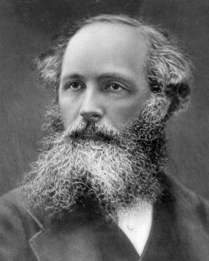
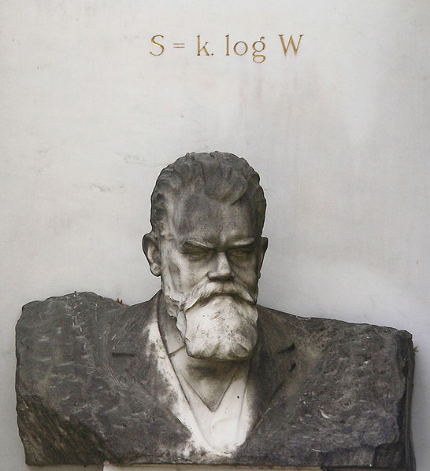
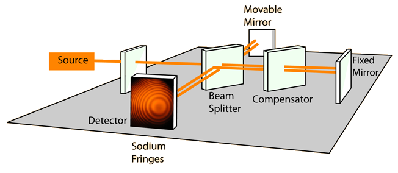

# 量子力学与统计物理
### Quantum mechanics and statistical physics

<br>

::: block
**李小飞** @ 光电科学与工程学院
{style=background:green;width:960px}
::: 


---

### 课程简介

- [ ] 课程目标
- [ ] 分数构成
- [ ] 参考书目
- [ ] 三条军规

--

### 课程目标

- Learn the formal theory of Quantum Mechanics
- How physical systems are described in Quantum Mechanics.   
- How to solve problems in Quantum Mechanics
  

--


### 分数构成

- Normal results： 20\%
- Midterm examination results： 20\%
- Final examination results ：60\%
  

--

### 参考书目

- 《量子力学》卷I，II， 曾谨言， 科学出版社， 2008           
- Principles of quantum mechanics, shankar
- Modern quantum mechanics, shankar
- Lectures on quantum mechanics, weinberg
- Principles of quantum mechanics, Dirac

--

### 三条军规

- Objects are wave-particles and can be in states of superposition
- Rule 1 holds as long as you don't measure
- Measurement gives random results

---

### 第一讲：普朗克能量子假说

- [ ] Great successes in Classical Physics
- [ ] Michelson-Morley experiment  
- [ ] Black body radiation
- [ ] Three formulas for radiation
- [ ] Planck's Energy Quantum Hypothesis

---

### 经典物理学的伟大成就

1. Newtonian mechanics 
2. Maxwell's electromagnetism          
3. Thermodynamic laws  
>




--

```js
    "There is nothing new to be discovered in physics now. 
    All that remains is more and more precise measurements" 

                                 Lord Kelvin (1900)

    "But, the beauty and clearness ... is obscured by 
    two small puzzling clouds " 
                                 Lord Kelvin (1900.4)
```


--

### Two small puzzling clouds

- [ ] Michelson-Morley experiment

- [ ] Black body radiation experiment


--

### 迈克尔逊-莫雷实验



<span class="fragment">No displacements of</span> <span class="fragment">interference</span> <span class="fragment">bands!</span>

--

### Relativity theory is established 

  

Greatly changed our view of time and space. Mainly useful in two aspects: high-speed motion, and strong gravitational field. 

--

### 黑体辐射实验


<span class="fragment">No mathematical function</span> <span class="fragment"> to describe </span> <span class="fragment">the curves</span> <span class="fragment">exactly</span> 

--

### Quantum mechanics is established

 

It is a theory about matter.  {.fragment .grow}

--

### Foundation stones
 

---

### Three formula for radiation

 

- [ ] Wien's formula
- [ ] Rayleigh-Jeans formula
- [x] Planck's formula 

--

<!-- .slide: style="text-align: left;" -->
#### 1. Wien's formula  
$$
\rho(\nu) d \nu=c_{1} \nu^{3} e^{-c_{2} \nu / T} d \nu 
$$
- Derived from electromagnetism (1893),
- Described well only in high frequency region
- Nobel Prize in physics（1911)

--

<!-- .slide: style="text-align: left;" -->
#### 2. Rayleigh-Jeans formula
$$
\rho(\nu, T) d \nu=\frac{8 \pi}{c^{3}} \nu^{2} k T d \nu 
$$
- Derived from thermodynamics (1900), 
- Described well only in low frequency region
$$
\int_0 ^\infty \frac{8 \pi}{c^{3}} \nu^{2} k T d\nu \to \infty 
$$
- Nobel Prize in physics（1904） 

--

<!-- .slide: style="text-align: left;" -->
#### 3. Planck's formula
$$
\rho(\nu, T) d \nu=\frac{8 \pi}{c^{3}} \frac{h \nu^{3}}{e^{h \nu / K T}-1} d \nu
$$

- Obtained from experimental data via interpolation technique (1900-4), 
- Described well in whole frequency region
- Nobel Prize in physics（1918） 

--

::: block
**Problem:** how to derive the Planck's formula from existing theory.
{style=background:green;width:960px}
::: 

::: block
On **1900-12-14**, Planck gives out his solution based on the Energy Quantum Hypothesis 
{style=background:green;width:960px}
::: 

---

### Planck's energy quantum hypothesis

-  Black body consists of millions of oscillators
-  Assuming the oscillators can only radiate at a discrete amounts of energy
    $$    E=n\varepsilon $$
- The unit of the energy (quanta) determined by the oscillator' frequency
    $$   \varepsilon=h\nu  $$

--

Based on Boltzmann distribution law,
$$
\frac{N_{i}}{N}=\frac{\exp \left(-\frac{E_{i}}{k T}\right)}{\sum_{i} \exp \left(\frac{-E_{i}}{k T}\right)}
$$

- If energy is continuous，the distribution between $E - E+dE$ should be 
$$
\omega=\frac{e^{-E / k T}}{\int\limits_{0}^{\infty} e^{-E / k T} d E}
$$

--

The average energy is  

<span>
\[\begin{aligned}
< E >  &amp; = \int\limits_{0}^{\infty} E \frac{e^{-E / k T}}{\int\limits_{0}^{\infty} e^{-E / k T} d E} d E  \\
&amp; = -kT (E e ^{-E / k T} \vert_{0}^{\infty}- \int\limits_{0}^{\infty} e^{-E / k T} d E)  \\
 &amp; = \color{red}{kT} 
\end{aligned} \]
</span> 

--

- If energy is discrete，the distribution should be   
$$
  \frac{e^{-E / k T}}{\int\limits_{0}^{\infty} e^{-E / k T} d E} 
  \to \frac{e^{-E / k T}}{\sum\limits_{0}^{\infty} e^{-E / k T}} 
  \to \frac{e^{-nh\nu / k T}}{\sum\limits_{0}^{\infty} e^{-nhv / k T}} 
$$

--

The average energy is

<span>
\[\begin{aligned}
< E > &amp; = \sum\limits_{0}^{\infty} nh\nu\frac{e^{-nh\nu / k T}}{\sum\limits_{0}^{\infty} e^{-nh\nu / k T}}  \\
&amp; = -h\nu \frac{d}{dx} \frac{n e^{-nx}}{\sum\limits_{0}^{\infty} e^{-nx}}   \\
 &amp; = \color{red}{\frac{h\nu}{e^{h\nu/kT}-1}} 
\end{aligned} \]
</span> 

--

$$
\text{(continuous)} \quad k T \rightarrow \frac{h \nu}{e^{ h \nu / k T}-1} \quad \text{(discrete)} 
$$

--

If energy is discrete, in Rayleigh-Jeans formula
\begin{equation*}
\rho(\nu, T) d \nu=\frac{8 \pi}{c^{3}} \nu^{2} k T d \nu 
\end{equation*}
the item $kT$ should be replaced by $\frac{h \nu}{e^{ h \nu / k T}-1}$
\begin{equation*}
\rho(\nu, T) d \nu=\frac{8 \pi}{c^{3}} \frac{h \nu^{3}}{e^{h \nu / K T}-1} d \nu
\end{equation*}
It is exactly the Planck's formula 

---

### 讨论 

1. 能量量子化只是一种数学处理技术？
   
2. 普朗克能量子假说说明什么？

--

### Planck's energy quantum hypothesis

- Broke through the constraints of classical physics  
  
- Opened the door of quantum mechanics 

---

<!-- .slide: style="text-align: left;" -->
### The End 

::: block
In 1927, **Dirac** got the Planck's formula from Quantum Mechanism.
:::
