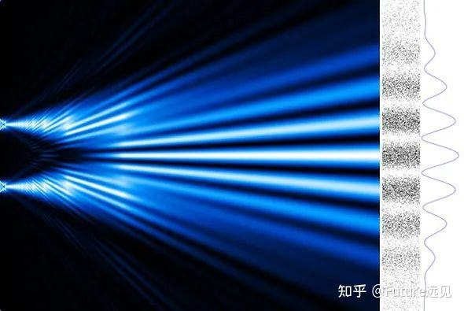
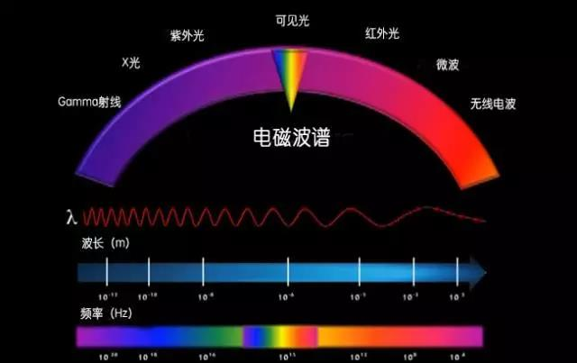
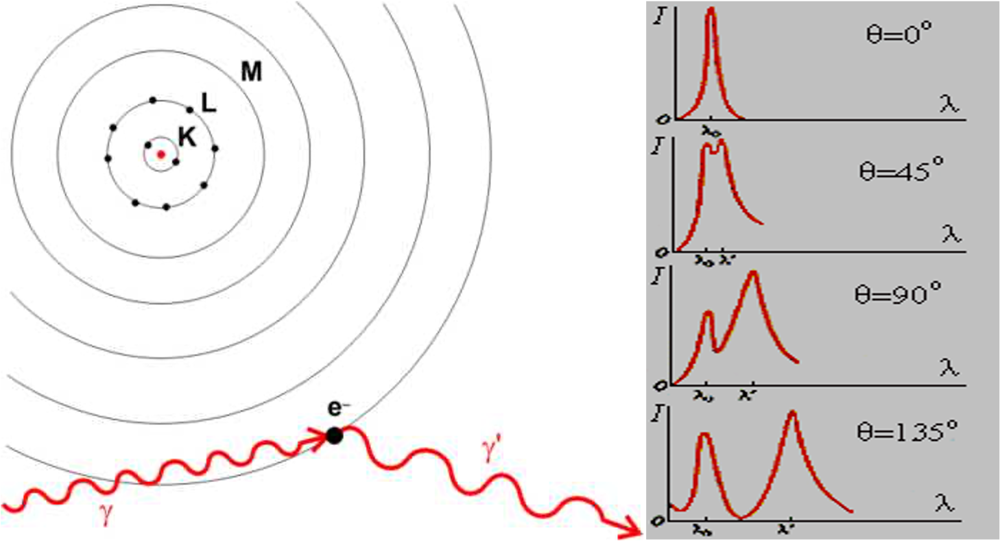
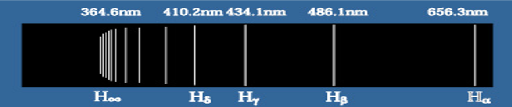
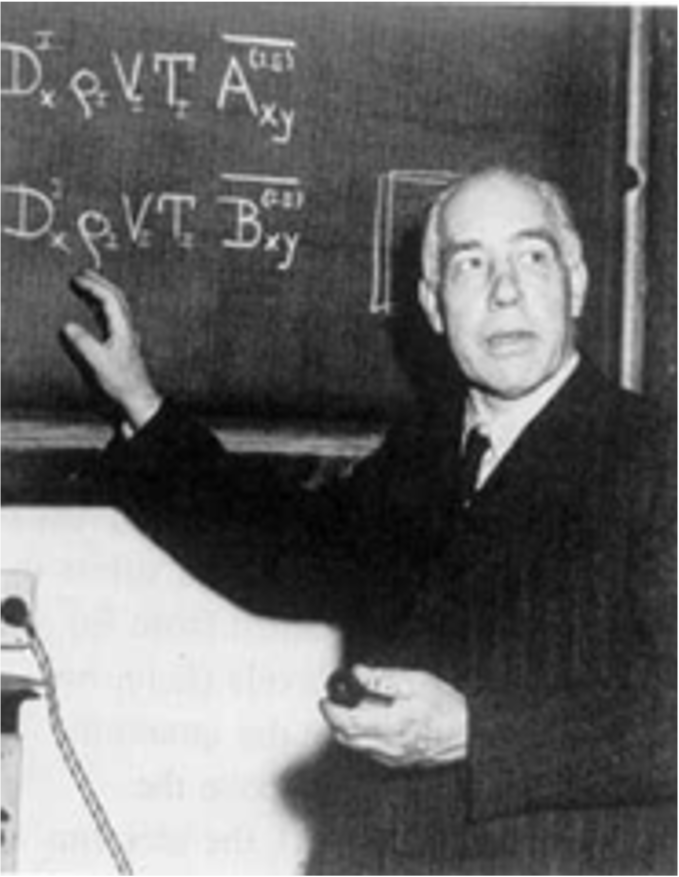
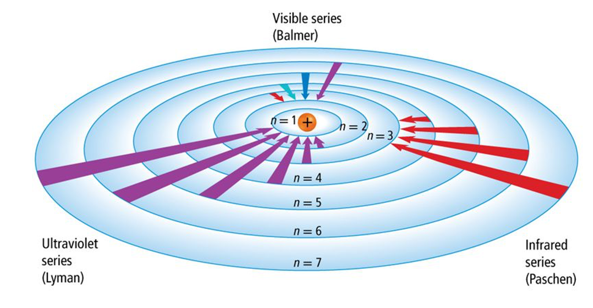
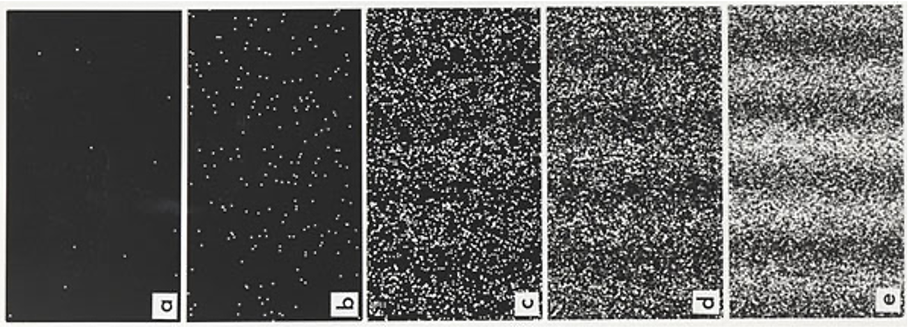

<!-- .slide: data-background="images/2021-12-03-05-23-33.png" -->

# 量子力学与统计物理 {style=background:green;width:960px}
### Quantum mechanics and statistical physics 

 

::: block
**李小飞** @ 光电科学与工程学院
{style=background:none;width:960px}
::: 

---

## 请选择PPT转场方式

You can select from different transitions
[None](?transition=none#/transitions) - [Fade](?transition=fade#/transitions) - [Slide](?transition=slide#/transitions) - [Convex](?transition=convex#/transitions) - [Concave](?transition=concave#/transitions) - [Zoom](?transition=zoom#/transitions)

---

## 请选择PPT主题 

reveal.js comes with a few themes built in:
<a href="#" onclick="document.getElementById('theme').setAttribute('href','libs/reveal.js/3.8.0/css/theme/black.css'); return false;">Black (default)</a> -
<a href="#" onclick="document.getElementById('theme').setAttribute('href','libs/reveal.js/3.8.0/css/theme/white.css'); return false;">White</a> -
<a href="#" onclick="document.getElementById('theme').setAttribute('href','libs/reveal.js/3.8.0/css/theme/league.css'); return false;">League</a> -
<a href="#" onclick="document.getElementById('theme').setAttribute('href','libs/reveal.js/3.8.0/css/theme/sky.css'); return false;">Sky</a> -
<a href="#" onclick="document.getElementById('theme').setAttribute('href','libs/reveal.js/3.8.0/css/theme/beige.css'); return false;">Beige</a> -
<a href="#" onclick="document.getElementById('theme').setAttribute('href','libs/reveal.js/3.8.0/css/theme/simple.css'); return false;">Simple</a>  
<a href="#" onclick="document.getElementById('theme').setAttribute('href','libs/reveal.js/3.8.0/css/theme/serif.css'); return false;">Serif</a> -
<a href="#" onclick="document.getElementById('theme').setAttribute('href','libs/reveal.js/3.8.0/css/theme/blood.css'); return false;">Blood</a> -
<a href="#" onclick="document.getElementById('theme').setAttribute('href','libs/reveal.js/3.8.0/css/theme/night.css'); return false;">Night</a> -
<a href="#" onclick="document.getElementById('theme').setAttribute('href','libs/reveal.js/3.8.0/css/theme/moon.css'); return false;">Moon</a> -
<a href="#" onclick="document.getElementById('theme').setAttribute('href','libs/reveal.js/3.8.0/css/theme/solarized.css'); return false;">Solarized</a>

---

<!-- .slide: data-background="#0000ff" -->

### ==前情回顾==
> Assuming the oscillators can only radiate at a discrete amounts of energy
    $$    E=n\varepsilon, \qquad (n=1,2,3,\cdots) $$
The unit of the energy determined by the oscillator' frequency
    $$   \varepsilon=h\nu  $$

--

<!-- .slide: data-background="#0000ff" -->

可导出普朗克公式：
> $$\rho(\nu, T) d \nu=\frac{8 \pi}{c^{3}} \frac{h \nu^{3}}{e^{h \nu / K T}-1} d \nu $$

它准确描述黑体辐射现象！

因此，能量子假说打开了量子力学的大门 {style=background:green;width:960px}

---

### 第二讲：波粒二象性

- 光电效应
- 光量子假说
- 康普顿效应
- 氢原子光谱
- 物质波假说

---

### 粒子与波的不可调和性

- 粒子的特性
  
  1. 具有确定的位置、能量、动量等
  2. 两个粒子不能同时占据同一位置
  3. 同一粒子也不能同时占据多个位置
  4. 会产生碰撞现象

- 波的特性
  
  1. 具有确定的波长、振幅、相位等
  2. 两列波可以同时出现在同一位置
  3. 一列波可以同时占据多个位置
  4. 具衍射及干涉现象，不具碰撞现象

--

- 一个物体要么是粒子，要么是波

- 人们正是通过上述特性进行判定的
  
- 这个方法一直是有效的，但有时却无效
  
- 比如说: **光** ...

--

### 光的波动说

水波的干涉  $\qquad$  光的干涉

--

光只是一定波长范围内的电磁波 {.fragment .highlight-green}

--

### 波动说面临的困难

- 光电效应
  
- 康普顿效应
  
- 氢原子光谱

---

### 光电效应

- 具有瞬时性
- 存在临界频率 $\nu_0$
- 光电子能量与光的频率决定

::: block
波动说无法解释实验发现 {.fragment .highlight-red}
::: 

--

### 爱因斯坦的光量子假说

In 1905, Einstein considered derivating Planck's Law
- Plank’s Law was consistent with experment but not with existing theory
- Rayleigh-Jeans Law was consistent with existing theory but not with experiment
- For treating Ultraviolet Catastrophe, he proposed light quantum hypothesis
- Using light quantum hypothesis, he explained Photoelectric effect

--

爱因斯坦在论文中提出光量子假说：
- Light likes particles with unit energy $E=h\nu$ 
  
- The energy of n light quantum: $n h\nu$

- The momentum of a light quantum (1918):
  $$ \vec{p} =\frac{E}{c} \vec{n} = \frac{h}{\lambda} \vec{n}$$

--

基于光量子假说，爱因斯坦提出一个光电效应公式
$$
\frac{1}{2}m_eV_0^2=h\nu-W
$$

- 瞬时性： 
  
  光子碰上电子时，能量被瞬时吸收

- 临界频率：($\nu_0=\frac{W}{h} $)

- 光电子能量与光的频率决定:
  $E_k=h\nu-W$

::: block
$\quad$ 1921年，诺贝尔物理学奖 {style=background:green;width:960px}
:::

--

基于光电效应公式:

$$
\frac{1}{2}m_eV_0^2=h\nu-W
$$

1916年，密立根实验上测定普朗克系数，验证光子说

1923年诺贝尔物理学奖 {.fragment .highlight-green} 

--

### 光量子假说的意义

1. 揭示能量子的本质：在于光本身是量子化的，具有粒子性

2. 揭示光的本质：光既具波动性又具粒子性。

- 普朗克的评价：

  在近代物理学结出硕果的那些重大问题中，很难找到一个问题是爱因斯坦没有做过重要贡献。在他的各种推测中，他有时可能也曾经没有中标的。例如他的光量子假设,就有点迷失了方向 

---

### 康普顿效应 (1922)

经验公式：$\lambda_{out}-\lambda_{in}=\lambda_e(1-\cos \theta)$

--

- Energy of electron ：

  $$ E^2 =m_ec^2=p^2c^2 +m_0 ^2 c^4 $$ 

- Energy of light quantum

  $$ E =pc $$ 

--

- Energy conservation law

\[\begin{equation*}
        \begin{split}
        E_i + m_0 c^2 &= E_o + m_ec^2 \\
        (E_i -E_o + m_0 c^2)^2 &= E_e ^2\\
        (p_i c-p_o c + m_0 c^2) ^2 &= p_e ^2 c^2 +m_0 ^2 c^4 \\
        (p_i-p_o)^2 +2 m_0 (p_i c-p_o c) &= p_e ^2
    \end{split}
    \end{equation*}
\]</pan>

--

- Momentum conservation law

\[\begin{equation*}
        \begin{split}
            \vec{p}_i -\vec{p}_o &= \vec{p}_e \\
            (\vec{p}_i -\vec{p}_o)\cdot (\vec{p}_i -\vec{p}_o)  &= \vec{p}_e\cdot \vec{p}_e   \\
            p_i ^2 + p_o ^2 -2p_i p_o \cos \theta &= p_e ^2  \\
            p_i ^2 + p_o ^2 -2p_i p_o \cos \theta &= (p_i-p_o)^2 +2 m_0 (p_i c-p_o c) \\
            \frac{1}{p_o} -\frac{1}{p_i} &= \frac{1}{m_0 c} (1-\cos \theta) \\
            \lambda_o -\lambda_i &= \frac{h}{m_0 c} (1-\cos \theta) 
        \end{split}
\end{equation*}
\]</pan>

--

- 康普顿效应表明：
  1. 波长为$\lambda$ 的光具有确定动量 $$p=\frac{h}{\lambda}$$
  2. 动量守衡定律适用了微观体系

$\qquad $ Nobel Prize in physics（1927） {.fragment .highlight-green}

---

### 氢原子光谱

经验公式：$\dfrac{1}{\lambda}=R_H c (\dfrac{1}{m^2} -\dfrac{1}{n^2})$

--

--

- 1905年爱因斯坦提出的光子概念，不受名人的重视，普朗克把爱因斯坦的光量子概念说成是“迷失了方向”。
- 1913年，28岁的玻尔，创造性地把光子概念用到卢瑟福模型上，成功破解氢原子光谱问题 

--

### 玻尔的氢原子模型

--

- 两个假设：
  1. Stationary states: Electrons move around the nucleus only in certain allowed circular orbits with fixed energy
    $$ L=n \frac{h}{2\pi}= n \hbar,\qquad (\oint p_i dq_i = n_i h)$$
  2. Quantum transition: Electron can jump between stationary state orbits when absorbed or emitted a photon with energy
    $$h\nu=E_n -E_m $$

--

- 推导光谱公式
  1. Stationary state orbit radius:

\[\begin{equation*}
        \begin{split}
            m\frac{v^2}{r}&=\frac{1}{4\pi\epsilon_0} \frac{e^2}{r^2} \\
            L&=mvr =n\hbar \\
            r_n&= n^2 (\frac{\epsilon_0 h^2}{m\pi e^2}) =n^2 r_1   
        \end{split} 
     \end{equation*}
\]</pan>

--

2. Stationary state orbit energy:

\[\begin{equation*}
        \begin{split}
            E_n &= T + U \\
            &= \frac{1}{2}mv^2- \frac{1}{4\pi\epsilon_0} \frac{e^2}{r_n ^2} \\
            &= \frac{1}{n^2} (-\frac{m e^4}{8 \epsilon_0 ^2 h^2}) \\
            &= \frac{E_1}{n^2}
        \end{split}  
\end{equation*}
\]</pan>

--

3. Spectrum formula: 
  

  \[\begin{equation*}
        \begin{split}
         \nu&=\frac{E_n -E_m}{h} \\
         &= \frac{m e^4}{4\pi \hbar ^3} [\frac{1}{m^2} -\frac{1}{n^2}]
        \end{split}  
\end{equation*}
\]</pan>

--

4. Rydberg constant :

  \[\begin{equation*}
        \begin{split}
            R_{theo}&= \frac{m e^4}{4\pi \hbar ^3 c} =1.0973731\times 10^7 m^{-1} \\
            R_{exp}&=1.0974\times10^7 m^{-1} 
        \end{split}  
\end{equation*}
\]</pan>

$\quad$ Nobel Prize in physics（1922） {.fragment .highlight-green}

--

### 光子的波粒二象性

\[\begin{cases}
    \text{Light behaves like waves }\\
    \text{$\qquad$ Interference} \\
    \text{$\qquad$ Diffraction} \\
    \text{Light behaves like particles}\\
    \text{$\qquad$ Photoelectric effect} \\
    \text{$\qquad$ Compton effect} \\
    \text{$\qquad$ Atomic spectrum } 
\end{cases}
\]</pan>

- Light behaving like waves and particles is called **wave-particle duality of light**

--

<!-- .slide: data-background="images/2021-12-03-05-23-33.png" -->

# 讨论: 
### How can something be both particle and wave ?

---

### De Broglie hypothesis of matter wave

- In 1923, de Broglie states that if light which is classically a wave could behave as a particle, 
  then classical particles could also behave as quantum waves.

- The relationship between the wave property and particle property should be 
  $$\lambda=\frac{h}{p}, \qquad \nu =\frac{E}{h}$$

--

- De Broglie wavelength of electron in Bohr's atom model

\[\begin{equation*}
        \begin{split}
            L&=n\hbar \\
            r \cdot p & =  n\frac{h}{2 \pi} \\
            2\pi r&=  n\frac{h}{p}\\
            2\pi r&=  n\lambda \to \color{red} {l=n\lambda}
        \end{split} 
\end{equation*}
\]</pan>

Called standing-wave condition 

--

### Electron diffraction experiment

- Electron diffraction patterns (Davisson and Germer, 1927)

--

- Meeting Bragg formula $2d\sin \theta=n\lambda$
- Thus, getting the wavelength of electron (about 0.16x $nm$), agreeing well with the 
calculated de Broglie wavelength
- Nobel Prize in physics（1937) {.fragment .highlight-green}

--

::: block
- de Broglie extended the wave-particle duality from light to particles
  and discovered the wave nature of electrons.

- Nobel Prize in physics（1929) {.fragment .highlight-green}
::: 

---

<!-- .slide: data-background-video="images/doubleslite-n.mp4" .slide:data-background-color="#000000" -->

---

 {.fragment .fade-in}

Electron interference patterns (Jonsson, 1961) {.fragment .fade-in}

---

::: block
Conclusion:
- Wave-particle duality is the inherent attribute of matter
{style=background:green;width:800px}
::: 

--

::: block
Big problem:
- How one can interpret the world where waves are particles and particles are waves
{style=background:green;width:800px}
::: 

---

<!-- .slide: data-background="images/2021-12-03-05-23-33.png" -->

## Thanks

