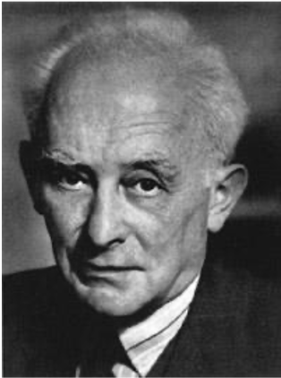

量子力学与统计物理{style=background:green;width:960px}
---------------
Quantum mechanics and statistical physics 

 

::: block

**李小飞** @ 光电科学与工程学院
 
 
2020-03-01
{style=background:none;width:960px}

::: 

---

<!-- .slide:  data-auto-animate -->
### **前情回顾** 

--

<!-- .slide:  data-auto-animate -->
### **前情回顾** 

- 波粒二象性是物质的本质特性 {.fragment .fade-up} 

--

### Big problem
::: block
- How to interpret the world where waves are particles and particles are waves
{style=background:red;width:800px}
::: 

---

### 第三讲：波函数及其统计诠释

- 波函数
- 波函数的统计诠释

---

<!-- .slide: data-background-video="figs/doubleslite-n.mp4" .slide:data-background-color="#000000" -->

--

<!-- .slide:  data-auto-animate -->
### 双缝干涉实验分析

--

<!-- .slide:  data-auto-animate -->
### 双缝干涉实验分析

- 多个波构成电子 {.fragment .fade-in}
- 多个电子构成波 {.fragment .fade-in}
- 单个电子既是粒子又是波 {.fragment .fade-in}
  - 电子与自己干涉 {.fragment .fade-up}
  - 电子同时过双缝  {.fragment .fade-up}
  - 电子至少同时有两条路径 {.fragment .fade-up}
  - 牛顿力学失效！ {.fragment .fade-up}
  - 波动学失效！ {.fragment .fade-up}
  
 

> 

如何描述物体的运动状态？ {.fragment .fade-up}

---

<!-- .slide:  data-auto-animate -->
### Basic assumption 1/5

--

<!-- .slide:  data-auto-animate -->
### Basic assumption 1/5

In 1924, De Broglie assumed that : {.fragment .fade-up}
  
The state of a system is described by a wavefunction  {.fragment .fade-up}

(波函数完全描述物体的状态) {.fragment .fade-up} 

--

### 构造第一个波函数
- For a classical plane wave 

 \[\begin{equation*}
    \begin{split}
    y(x,t)&=A e^{i(\dfrac{2\pi}{\lambda}x-\omega t)} \\
    & = A e^{i\dfrac{2\pi}{h}(\dfrac{h}{\lambda}x-h\nu t)}
    \end{split} 
\end{equation*} 
\]

--

- Putting De Broglie relationship into the formula, one gets a quantum plane wavefunction

\[\begin{equation*}
        \begin{split}
          \Psi_p(x,t)&=A e^{\dfrac{i}{\hbar}(px-Et)}
        \end{split} 
\end{equation*}
\]

- It describes the state of a quantum free particle with constant energy and momentum {.fragment .fade-up} 

--

- In general,  the wavefunction of a particle is the wave-packet of quantum plane wavefunction.

\[\begin{equation*}
    \Psi(x,t)=\sum\limits_{p=0} ^{\infty} c(p)\Psi_p(x,t) = \int\limits_{p=0} ^{\infty} c(p,t) e^{\frac{i}{\hbar}px}dp
\end{equation*}
\]

$\color{red}{Tips:}$ Wavefunction is a complex function {.fragment .fade-up} 

--

### 德布罗意的成就

- 物质波假说
- 原子内电子的波动性
- 波函数假说
- 构造第一个波函数
- ...
  

  " 德布罗意已经揭开了面纱的一角 "   --爱因斯坦  {.fragment .fade-up} 

--

### Big problems
::: block

- What is the nature of wavefunction
  
- How to obtain a general wavefunction 
{style=background:red;width:800px}
::: 

---

### 波函数的统计诠释

- In 1926, Born proposed the statistical interpretation of wavefunction : {.fragment .fade-up} 

  - The magnitude of wavefunction $\Psi(\vec{r},t)$ does not tell us how much of 
the particle is at position $\vec{r}$ at time t, {.fragment .fade-up} 
  - but rather the probability ($W$) that the particle is at or near the position at time t. 
$$ d W = |\Psi(\vec{r},t)|^2 d \tau $$ {.fragment .fade-up} 

 {style=background:green;width:850px}

Nobel Prize in physics（1954) {.fragment .fade-up} 

--

### 解释双缝干涉实验

- 自由电子平面波，等概率出现在屏的任一位置 {.fragment .fade-up} 
- 电子通过双缝，发生衍射和干涉，导致在某些位置的振幅大，某些位置的振幅小 {.fragment .fade-up} 
- 振幅较大的位置电子出现概率大，形成明纹。振幅小的位置电子出现概率小，形成暗纹 {.fragment .fade-up} 
- 明暗干涉条纹不体现电子的波的形状，体现的是电子出现概率的分布。 {.fragment .fade-up} 

--

<!-- .slide:  data-auto-animate -->
### Do you believe it? 

--

<!-- .slide:  data-auto-animate -->
### Do you believe it? 
### What's your explanation ? 

--

<!-- .slide:  data-auto-animate -->
### 统计诠释的数学描述

--

<!-- .slide:  data-auto-animate -->
### 统计诠释的数学描述

- Magnitude of the wavefunction, $|\Psi|^2 =\Psi^* \Psi $ {.fragment .fade-up} 
- Probability density, $\omega = |\Psi|^2 $ {.fragment .fade-up} 
- Probability in $d \tau$,  $d W = |\Psi|^2 d \tau $ {.fragment .fade-up} 
- Normalization, $$ \int\limits_{\Omega} |\Psi|^2 d \tau =1 $$ {.fragment .fade-up} 

--

- Momentum wavefunction $$ c(\vec{p},t)=\frac{1}{(2\pi\hbar)^{3/2}} \int_{0}^{\infty} \Psi(\vec{r},t) e^{-\frac{i}{\hbar} \vec{p}\cdot \vec{r} } d \tau $$  {.fragment .fade-up} 
- Expectation value of any $f (x)$  $$ <f(x)>=\int_{0}^{\infty} f(x) |\Psi(x)|^2 dx $$ {.fragment .fade-up} 
- Expectation value of observable A  
   $$ < A>=\int_{0}^{\infty} \Psi^*(x) A \Psi(x) dx $$ {.fragment .fade-up} 

--

- $ \color{red} {Tips：} $ {.fragment .fade-up} 
  - $\Psi$ and $C\Psi$ describe the same state 
    $$\frac{C\Psi(x_1)}{C\Psi(x_2)} = \frac{\Psi(x_1)}{\Psi(x_2)}$$ {.fragment .fade-up} 
  
  - $\Psi$ and $e^{i\omega}\Psi$ describe the same state 
    $$ |e^{i\omega} \Psi|^2 = e^{-i\omega} e^{i\omega} |\Psi|^2 = |\Psi|^2 $$ {.fragment .fade-up} 

--

 #### Statistical interpretation requires the wavefunction to be （标准化条件）
  {.fragment .fade-up} 
  1. monotropic function {.fragment .fade-up} 
  2. continuous function {.fragment .fade-up} 
  3. finite function {.fragment .fade-up} 
  4. square integrable function {.fragment .fade-up} 

---

$ \color{yellow}{例1}$: Normalizating the wavefunction $$\psi(x)=\sin(x), \qquad (0\le x \le \pi)$$

$ \color{yellow}{解:}$ assuming the normalized wavefunction $$\Psi=C\psi(x)=C\sin(x)$$ {.fragment .fade-up} 

--

`
\[\begin{equation*}
        \begin{split}
            \int_0 ^\pi |C\sin(x)|^2 dx &=1 \\
            C^2 \int_0 ^\pi \sin^2(x) dx &=1 \\
            C^2 \int_0 ^\pi \frac{1-\cos 2x }{2} dx &=1 \\ 
            C^2 [\frac{x}{2}-\frac{\sin 2x}{4}]_0 ^\pi &=1 \\ 
        \end{split}  
\end{equation*}
\] 
`

$\to C=\sqrt{\dfrac{2}{\pi}} $

--

Thus, the normalizated wavefunction is
  $$ \Psi=C\sin(x)=\sqrt{\frac{2}{\pi}}\sin(x)$$

--

$ \color{yellow}{例2}$: Normalizating the plane wavefunction $$ \Psi_p (x,t)=e^{\frac{i}{\hbar}(px-Et)} $$ 

$ \color{yellow}{解:}$ assuming the normalized wavefunction $$\Psi=C\Psi_p (x,t)$$ {.fragment .fade-up} 

--

\[\begin{equation*}
        \begin{split}
            \int_{-\infty} ^\infty |C\Psi_p (x,t)|^2 dx &=1  \\
            C^2 \int_0 ^\infty \Psi_p (x) \Psi_{p'} (x) dx &=\delta (p-p')  \\
            C^2 \int_0 ^\infty e^{\frac{i}{\hbar}(p-p')x} dx =&=\delta (p-p')\\
            C^2 2\pi \hbar \delta (p-p') &=\delta(p-p') \\
            C&= \frac{1}{\sqrt{2\pi \hbar}}
        \end{split} 
\end{equation*}
\]

--

- The normalized plane wavefunction

$$ \Psi(x,t)=\frac{1}{\sqrt{2\pi \hbar}} e^{\frac{i}{\hbar}px-Et} $$

$$ \Psi(\vec r ,t)=\frac{1}{(2\pi \hbar)^{3/2}} e^{\frac{i}{\hbar}\vec p\cdot \vec r -Et} $$ {.fragment .fade-up} 

--

#### 玻恩 (Max Born 1882～1970)

- 德国理论物理学家，量子力学奠基人之一,
  因对波函数的统计解释，获1954年诺贝尔物理学奖 {.fragment .fade-up} 

- 1912年受聘哥廷根大学无薪讲师，1933年因犹太血统被剥夺教职和财产，流亡英国 {.fragment .fade-up} 

- 泡利、海森堡和黄昆都是他的学生 {.fragment .fade-up} 

--

<!-- .slide: data-background="images/uestclogo.png" data-background-opacity="0.07"-->
### A & q

---

---

### 选择PPT转场方式

You can select from different transitions

[None](?transition=none#/transitions) - [Fade](?transition=fade#/transitions) - [Slide](?transition=slide#/transitions) - [Convex](?transition=convex#/transitions) - [Concave](?transition=concave#/transitions) - [Zoom](?transition=zoom#/transitions)

--

### 选择PPT主题 

You can select from different themes:

<a href="#" onclick="document.getElementById('theme').setAttribute('href','libs/reveal.js/4.1.3/theme/black.css'); return false;">Black (default)</a> -
<a href="#" onclick="document.getElementById('theme').setAttribute('href','libs/reveal.js/4.1.3/theme/white.css'); return false;">White</a> -
<a href="#" onclick="document.getElementById('theme').setAttribute('href','libs/reveal.js/4.1.3/theme/league.css'); return false;">League</a> -
<a href="#" onclick="document.getElementById('theme').setAttribute('href','libs/reveal.js/4.1.3/theme/sky.css'); return false;">Sky</a> -
<a href="#" onclick="document.getElementById('theme').setAttribute('href','libs/reveal.js/4.1.3/theme/beige.css'); return false;">Beige</a> -
<a href="#" onclick="document.getElementById('theme').setAttribute('href','libs/reveal.js/4.1.3/theme/simple.css'); return false;">Simple</a>-
<a href="#" onclick="document.getElementById('theme').setAttribute('href','libs/reveal.js/4.1.3/theme/serif.css'); return false;">Serif</a> -
<a href="#" onclick="document.getElementById('theme').setAttribute('href','libs/reveal.js/4.1.3/theme/blood.css'); return false;">Blood</a> -
<a href="#" onclick="document.getElementById('theme').setAttribute('href','libs/reveal.js/4.1.3/theme/night.css'); return false;">Night</a> -
<a href="#" onclick="document.getElementById('theme').setAttribute('href','libs/reveal.js/4.1.3/theme/moon.css'); return false;">Moon</a> -
<a href="#" onclick="document.getElementById('theme').setAttribute('href','libs/reveal.js/4.1.3/theme/solarized.css'); return false;">Solarized</a>

---

