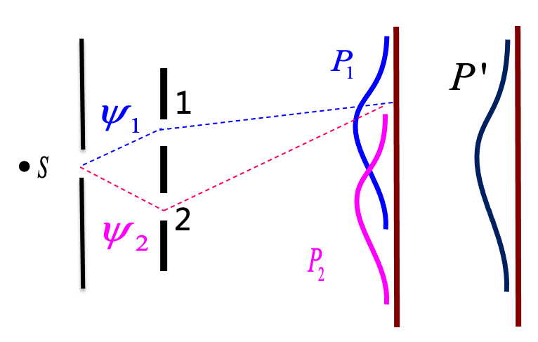
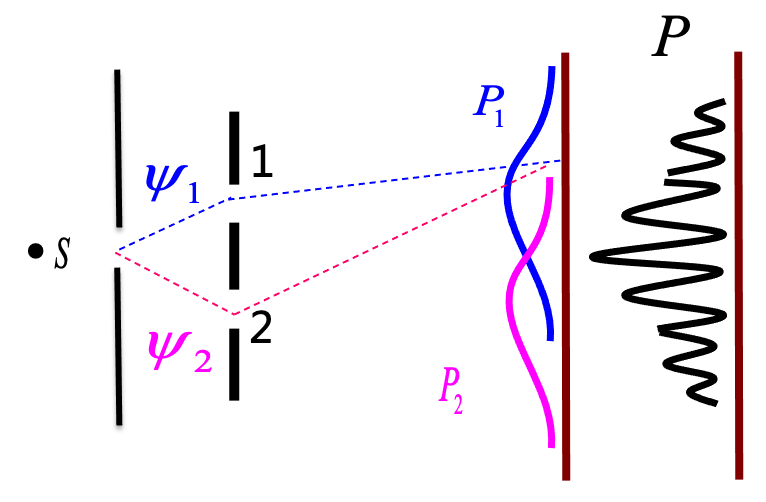
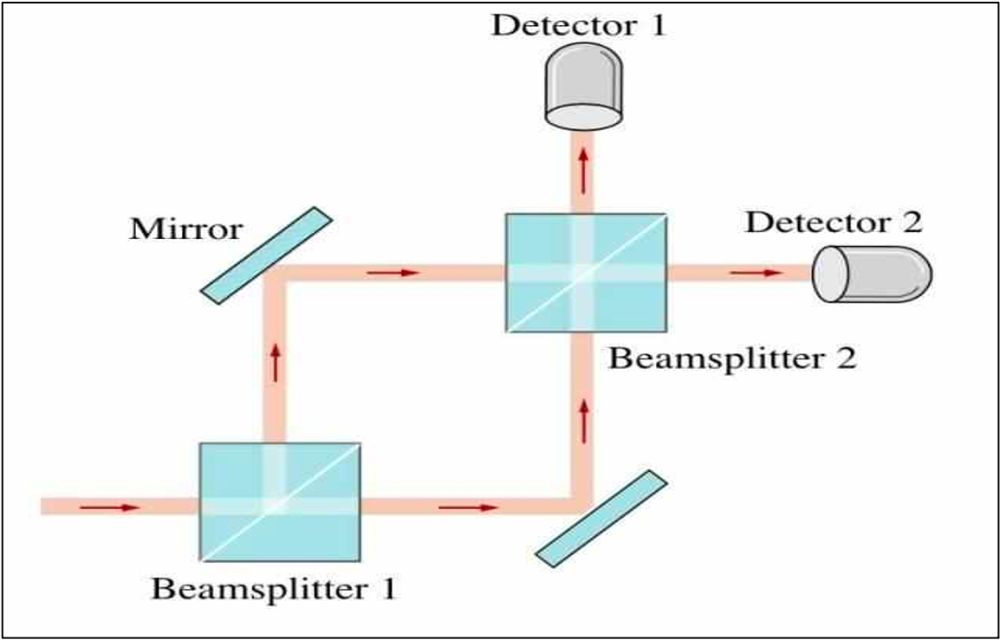
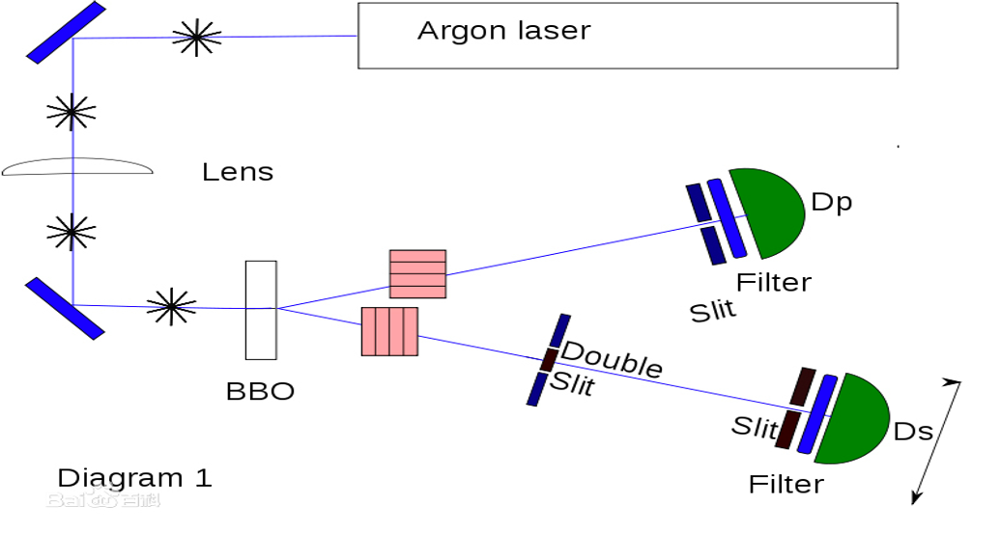
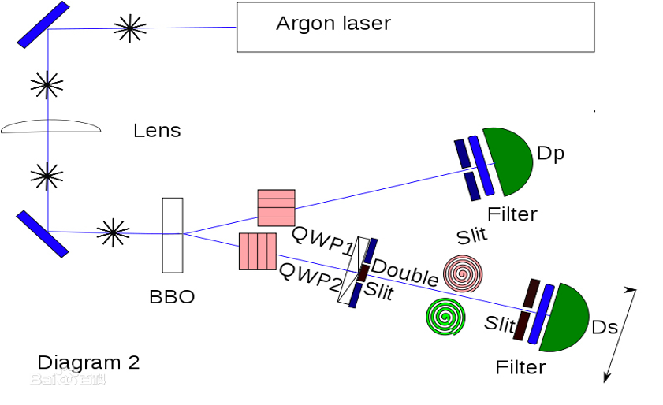
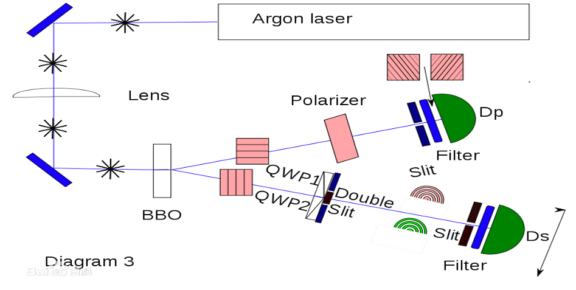

<!-- .slide: data-background="images/2021-12-03-05-23-33.png" -->

# 量子力学与统计物理 {style=background:green;width:960px}
### Quantum mechanics and statistical physics 

 

::: block
**李小飞** @ 光电科学与工程学院
{style=background:none;width:960px}
::: 

---

## 请选择PPT转场方式

You can select from different transitions
[None](?transition=none#/transitions) - [Fade](?transition=fade#/transitions) - [Slide](?transition=slide#/transitions) - [Convex](?transition=convex#/transitions) - [Concave](?transition=concave#/transitions) - [Zoom](?transition=zoom#/transitions)

---

## 请选择PPT主题 

reveal.js comes with a few themes built in:
<a href="#" onclick="document.getElementById('theme').setAttribute('href','libs/reveal.js/3.8.0/css/theme/black.css'); return false;">Black (default)</a> -
<a href="#" onclick="document.getElementById('theme').setAttribute('href','libs/reveal.js/3.8.0/css/theme/white.css'); return false;">White</a> -
<a href="#" onclick="document.getElementById('theme').setAttribute('href','libs/reveal.js/3.8.0/css/theme/league.css'); return false;">League</a> -
<a href="#" onclick="document.getElementById('theme').setAttribute('href','libs/reveal.js/3.8.0/css/theme/sky.css'); return false;">Sky</a> -
<a href="#" onclick="document.getElementById('theme').setAttribute('href','libs/reveal.js/3.8.0/css/theme/beige.css'); return false;">Beige</a> -
<a href="#" onclick="document.getElementById('theme').setAttribute('href','libs/reveal.js/3.8.0/css/theme/simple.css'); return false;">Simple</a>  
<a href="#" onclick="document.getElementById('theme').setAttribute('href','libs/reveal.js/3.8.0/css/theme/serif.css'); return false;">Serif</a> -
<a href="#" onclick="document.getElementById('theme').setAttribute('href','libs/reveal.js/3.8.0/css/theme/blood.css'); return false;">Blood</a> -
<a href="#" onclick="document.getElementById('theme').setAttribute('href','libs/reveal.js/3.8.0/css/theme/night.css'); return false;">Night</a> -
<a href="#" onclick="document.getElementById('theme').setAttribute('href','libs/reveal.js/3.8.0/css/theme/moon.css'); return false;">Moon</a> -
<a href="#" onclick="document.getElementById('theme').setAttribute('href','libs/reveal.js/3.8.0/css/theme/solarized.css'); return false;">Solarized</a>

---

<!-- .slide: data-background="#0000ff" -->

### ==前情回顾==
- 波粒二象性是物质的本质特性
- 波函数完全描述粒子的状态
- 波函数的模方与粒子出现的概率成比例

--

<!-- .slide: data-background="#0000ff" -->
### 重要问题：

  
    
      概率论 or 决定论 ？ 
    
  

---

### 第四讲：态叠加原理

- 概率叠加与态叠加
  
- 态叠加原理

- Which Way ?
  

---

<!-- .slide: data-background-video="images/Wave-particle-duality and-double-slit-experiment.mp4" .slide:data-background-color="#000000" -->

---

## 经典叠加

>

- 小球双缝实验，$P'=P_1+P_2 $， 是概率叠加。

- 经典叠加是概率叠加！

--

> 
- 电子双缝实验，很明显，$P\neq P_1+P_2 $
- 量子叠加不是概率叠加！
- 波恩认为量子体系服从波函数（态）叠加
$$ \psi =\psi_1+\psi_2$$

--

  

\[\begin{equation*}
        \begin{split}
            \omega&=|\psi|^2 \\
            &=|\psi_1+\psi_2|^2 \\
            &=(\psi_1^*+\psi_2^*)(\psi_1+\psi_2) \\ 
            &=|\psi_1|^2+|\psi_2|^2 + （\psi_1^*\psi_2+\psi_2^*\psi_1） 
        \end{split}  
\end{equation*}
\] 

- 概率计算发现，存在干涉项（后两项），产生干涉条纹。
- 电子如果只过一个缝，则$\psi_1$ 或$\psi_2$为零，干涉项为零，没有干涉条纹！
- 干涉条纹正是源于电子同时过两个缝,即电子处于叠加态。
  

--

### 态叠加原理 (Born)

- 如果 $\psi_1$ 、 $\psi_2$、 $\cdots$、$\psi_N$ 是粒子可能的态，那么它们的线性叠加
 $$ \Psi=c_1 \psi_1+ c_2\psi_2+\cdots+c_N\psi_N $$
 也是粒子可能的态（称为叠加态）

- 如果粒子处于叠加态 $\Psi=\sum\limits_{i=1}^N c_i \psi_i$,  那么测量粒子处在 $\psi_i$ 态的概率为 $$\|c_i\|^2, \qquad \text{且} \sum_{i=1}^{N} |c_i|^2 =1$$

--

## 实验升级 

> 

- 目标：想观测到电子是如何同时过两个缝的
- 结果：（1）只能测到电子要么过第一缝，要么过第二缝。（2）探测器越灵敏，干涉条纹越模糊，当探测器能长时间地保持几乎可以完全判断电子过哪条缝时，干涉条纹消失！如图(b)所示

--

  
### 结果分析

1. 测量的目的与结果
   - 当我们“挖出”Ａ和Ｂ两条狭缝时，“设计”了一个想要观察“电子的波动性”的设备，也就是电子已经预先被我们设定为“波”，因此我们观测到波动性（干涉条纹）。
   - 当我们装上侦测器时，整个实验被我们“设计”成观察电子的“粒子性”，因为想要知道电子到底是由Ａ还是Ｂ穿过时，就必须先具备确定的“位置”的概念，因此我们观察到粒子性（干涉条纹消失）。

--

2. 测量导致状态发生改变
  - 探测前，电子处于叠加态（$ \psi =\psi_1+\psi_2$）
  - 探测时，电子状态改变，被迫从叠加态变变为确定态 （$\psi_1$ or $\psi_2$），称为波函数坍塌
  - 探测后，电子处于某一单态，不能干涉。
  - 探测器不灵敏，有部分没有被探测到的电子依然处于叠加态， 干涉条纹模糊。
  - 探测器灵敏，全部电子被探测，没有电子处于叠加态， 干涉条纹消失。

--

3. 测量结果互补（互补性原理）
  - 波动性和粒子性是两种不同的属性，
  - 不能因为测得粒子性就否定波动性，反之亦然。
  - 测量结果就算相互矛盾，也要接受，它们互补地揭示物体的本质。

--

4. 结论
  - 电子具有波粒二象性，总是处于叠加态
  - 没有被测量，则依然保持叠加态
  - 测量导致确定的态，但结果是随机的。
  - 测得电子处于某个态，不能说明电子原本就处于这个态

---

### Which way ?

- The probabilistic interpretation and Superposition principle of states were controversial from the beginning of of quantum mechanics
  - De Broglie : Pilot waves
  - Schr$\ddot{o}$dinger: Schr$\ddot{o}$dinger's cat
  - EPR paradox
  - Wheeler's delayed choice experiment
  - Quantum eraser experiment
  - $\cdots \cdots$

--

### Schr$\ddot{o}$dinger's cat 

 

--

### Wheeler's delayed choice experiment

--

### EPR paradox

--

### The bell inequality

--

- Quantum eraser experiment

--

- Quantum eraser experiment
  

---

<!-- .slide: data-background="images/2021-12-03-05-23-33.png" -->
## THE END

