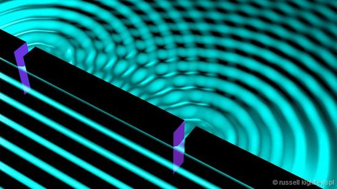
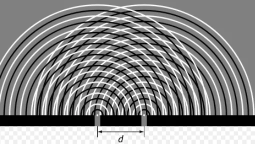
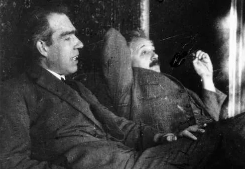
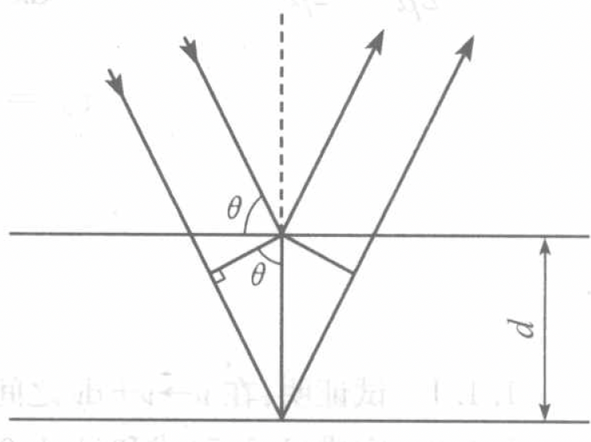
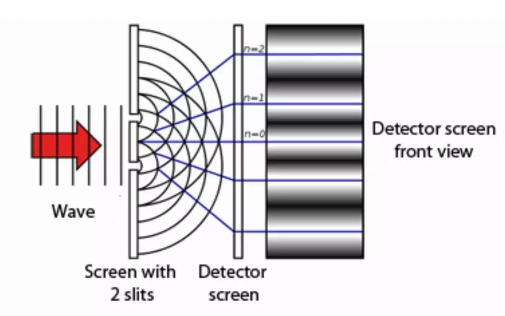
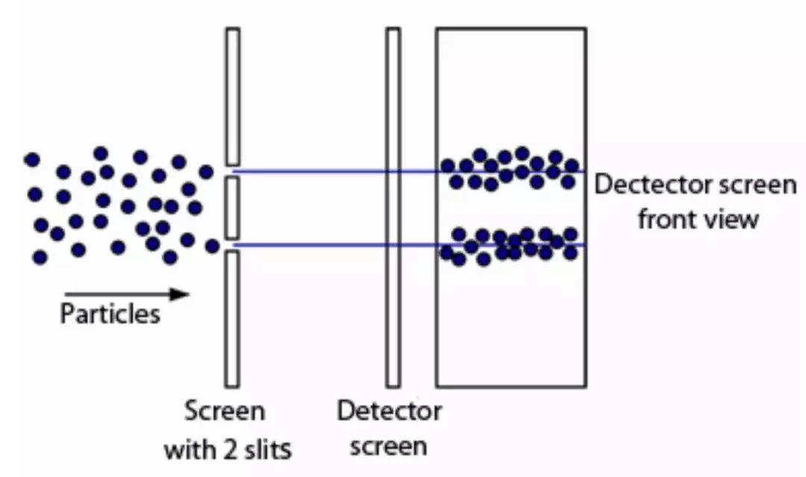
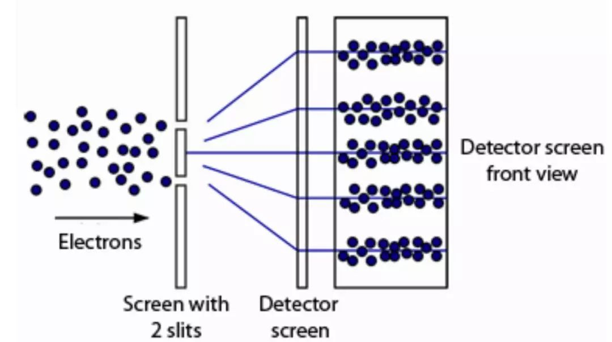

量子力学与统计物理{style=background:#003377; width:800px}
---------------

Quantum mechanics and statistical physics 
 
 
 

::: block

**李小飞** 
@ 光电科学与工程学院
 

:fa-anchor: 

2023-03-01 
{style=background:none;width:960px}

::: 

<!-- .slide: data-background="images/uestclogo-1.png" data-background-opacity="0.05"-->

---

#   第一章 绪论

---

### :fa-leaf: 课程简介

- [ ] 课程目标
- [ ] 分数构成
- [ ] 教学效果
- [ ] 参考书目
- [ ] 三条军规

--

#### :fa-paper-plane: 课程目标  

1. Learn the formal theory of Quantum Mechanics
2. How physical systems are described in Quantum Mechanics.   
3. How to solve problems in Quantum Mechanics  

--

#### :fa-paper-plane: 分数构成  
1. Normal results： 20\%
2. Midterm examination results： 20\%
3. Final examination results ：60\%
  

--

#### :fa-paper-plane: 教学效果  
  

--

#### :fa-paper-plane: 参考书目：

1. 《量子力学》卷I，II， 曾谨言， 科学出版社， 2008           
2. Principles of quantum mechanics, shankar
3. Modern quantum mechanics, shankar
4. Lectures on quantum mechanics, weinberg
5. Principles of quantum mechanics, Dirac {.fragment .highlight-blue}
  
<!-- .slide: style="text-align: left;" -->

--

<!-- .slide: style="text-align: left;" -->
<!-- .slide:  data-auto-animate -->

#### :fa-paper-plane: 三条军规 

- Rule 1. Objects are wave-particles and can be in states of superposition  {.fragment .fade-up}

- Rule 2. Rule 1 holds as long as you don't measure  {.fragment .fade-up}

- Rule 3. Measurement gives random results  {.fragment .fade-up}

---

# 第一讲 能量子假说

 

- 经典物理学的伟大成就
- 黑体辐射实验
- 普朗克能量子假说

---

<!-- .slide:  data-auto-animate -->

##  1. 经典物理学的伟大成就  
 

<table>
    <tr>
        <td>   </td>
        <td>   </td>
        <td>   </td>
    </tr>
</table>

--

### :fa-leaf: 三大学科 

1. 牛顿力学  {.fragment .fade-up}
2. 电磁学   {.fragment .fade-up}       
3. 统计力学  {.fragment .fade-up}

--

<!-- .slide:  data-auto-animate -->

 Lord Kelvin said (1900) : 

  &quot;There is nothing new to be discovered in physics now. All that remains is more and more precise measurements" &quot; 
  

"But, the beauty and clearness ... is obscured by two small puzzling clouds "  {.fragment .fade-up}

--

<!-- .slide:  data-auto-animate -->

#### :fa-paper-plane: 两朵乌云-1: 迈克尔逊-莫雷实验

 

- 直接导致相对论的建立 {.fragment .fade-up}

- 改变了人们对时间和空间的基本看法{.fragment .fade-up}

--

<!-- .slide:  data-auto-animate -->

#### :fa-paper-plane: 两朵乌云-2: 黑体辐射实验

 

- 直接导致量子力学的建立  {.fragment .fade-up}
  
- 改变了人们对物质的基本看法{.fragment .fade-up}

--

#### :fa-paper-plane: 现代物理学的二大基石  

 

---

## 2. 黑体辐射实验  
 

**黑体的定义：**  吸收所有电磁辐射的理想物体

--

### :fa-leaf: 实验结果 

 

找到一个数学公式来描述黑体辐射的所有曲线 {.fragment .fade-up}

--

### :fa-leaf: 三大公式 $\hspace{6em}$

- [x] Wien's formula
- [x] Rayleigh-Jeans formula
- [x] Planck's formula 

 

--

#### :fa-paper-plane: 维恩公式  
$$
\rho(\nu) d \nu=c_{1} \nu^{3} e^{-c_{2} \nu / T} d \nu 
$$
- Derived from electromagnetism (1893),
- Described well only in high frequency region
- Nobel Prize in physics（1911)  {.fragment .highlight-red}

<!-- .slide: style="text-align: left;" -->

--

#### :fa-paper-plane: 瑞-琼公式  
$$
\rho(\nu, T) d \nu=\frac{8 \pi}{c^{3}} \nu^{2} k T d \nu 
$$ 
- Derived from thermodynamics (1900), 
- Described well only in low frequency region
- Nobel Prize in physics（1904）  {.fragment .highlight-red}

<!-- .slide: style="text-align: left;" -->

--

- **Ultraviolet Catastrophe**
$$ \int_0 ^\infty \frac{8 \pi}{c^{3}} \nu^{2} k T d \nu \to \infty  $$

--

<!-- .slide: style="text-align: left;" -->

#### :fa-paper-plane: 普朗克公式  
$$
\rho(\nu, T) d \nu=\frac{8 \pi}{c^{3}} \frac{h \nu^{3} }{e^{h \nu / K T}-1} d \nu
$$
where h is Planck constant
$$~h=6.6260693(11)\times10^{-34} J\cdot S $$ 

- Obtained from experimental data via interpolation technique (1900-4), 
- Described well in whole frequency region
- Nobel Prize in physics（1918）  {.fragment .highlight-red}

--

- **问题：** 如何从经典物理学导出普朗克公式!
  

- **1900-12-14**, 普朗克基于能量子假说给出了解决方案!  {.fragment .fade-up}

---

<!-- .slide:  data-auto-animate -->
## 3. 普朗克能量子假说

---

<!-- .slide:  data-auto-animate -->
## 3. 普朗克能量子假说

-  Black body consists of millions of oscillators {.fragment .fade-up}  
-  The oscillators can only radiate at a discrete amounts of energy
    $$    E=n\varepsilon $${.fragment .fade-up} 
- The unit of the energy (quanta) determined by the oscillator' frequency
    $$   \varepsilon=h\nu  $${.fragment .fade-up}

--

### :fa-leaf: 不连续对平均辐射能的影响

Based on Boltzmann distribution law,
`
\[\frac{N_{i}}{N}=\frac{\exp \left(-\frac{E_{i}}{k T}\right)}{\sum_{i} \exp \left(\frac{-E_{i}}{k T}\right)}
\]
`{class="fragment"}
 
- If energy is continuous，the distribution between $E - E+dE$ : {.fragment .fade-up} 
  
`
\[
\omega=\frac{e^{-E / k T}}{\int\limits_{0}^{\infty} e^{-E / k T} d E}
\]
`{class="fragment"}

--

The average energy :  

`
\[\begin{aligned}
< E >  
& = \int\limits_{0}^{\infty} E \frac{e^{-E / k T}}{\int\limits_{0}^{\infty} e^{-E / k T} d E} d E  \\
\end{aligned} \]
` {class="fragment"}

`
\[\hspace{8em}\begin{aligned}
& = -kT (E e ^{-E / k T} \vert_{0}^{\infty}- \int\limits_{0}^{\infty} e^{-E / k T} d E)  \\
& = \color{red}{kT} 
\end{aligned} \]
` {class="fragment"}

--

- If energy is discrete，the distribution :
  
`
\[
  \frac{e^{-E / k T}}{\int\limits_{0}^{\infty} e^{-E / k T} d E} 
\]
` {class="fragment"} 

`
\[
  \to \frac{e^{-E / k T}}{\sum\limits_{0}^{\infty} e^{-E / k T}} 
\]
` {class="fragment"} 
 
`
\[
  \to \frac{e^{-nh\nu / k T}}{\sum\limits_{0}^{\infty} e^{-nhv / k T}} 
\]
` {class="fragment"}

--

The average energy is

`
\[\begin{aligned}
< E > 
& = \sum\limits_{0}^{\infty} nh\nu\frac{e^{-nh\nu / k T}}{\sum\limits_{0}^{\infty} e^{-nh\nu / k T}}  \\
\end{aligned} 
\]
` {class="fragment"} 
 
`
\[\hspace{2em}\begin{aligned}
& = -h\nu \frac{d}{dx} \frac{n e^{-nx}}{\sum\limits_{0}^{\infty} e^{-nx}}   \\
& = \color{red}{\frac{h\nu}{e^{h\nu/kT}-1}} 
\end{aligned} 
\]
`{class="fragment"} 

--

`
\[
\text{(Continuous)} \quad k T \rightarrow \frac{h \nu}{e^{ h \nu / k T}-1} \quad \text{(Discrete)}  
\]
`{class="fragment"}  

--

### :fa-leaf: 对瑞-金公式的影响

The item of $kT$ in Rayleigh-Jeans 
\begin{equation*}
\rho(\nu, T) d \nu=\frac{8 \pi}{c^{3}} \nu^{2} k T d \nu 
\end{equation*} {.fragment .fade-up} 

should be replaced by $\dfrac{h \nu}{e^{ h \nu / k T}-1}$ {.fragment .fade-up} 

\begin{equation*}
\rho(\nu, T) d \nu=\frac{8 \pi}{c^{3}} \frac{h \nu^{3} }{e^{h \nu / K T}-1} d \nu
\end{equation*} {.fragment .fade-up} 

It is exactly the Planck's formula {.fragment .fade-up} 

---

### :fa-heartbeat: 讨论 

1. 通过普朗克，你学到了什么?  

2. 普朗克黑体辐射公式和能量量子化观念哪个影响会更大？

--

<!-- .slide:  data-auto-animate -->
#####    Revolutionary Significance 

--

<!-- .slide:  data-auto-animate -->
#####    Revolutionary Significance 

::: block
- Broke through the constraints of classical physics  {.fragment .fade-up}  
- Opened the door of quantum mechanics {.fragment .fade-up} 
 
{style=background:green;width:800px}
::: 

--

### The End 

::: block
In 1927, **Dirac** got the Planck's formula from Quantum Mechanism.
:::

--

- 实际上，除了普朗克，还有德拜，艾伦菲斯特，劳厄，洛伦兹, 庞加莱，泡利，玻色，爱因斯坦等人从多角度推导过普朗克公式，

- 每一次推导都给物理学带来了新的知识内容 

--

<!-- .slide: data-background="images/uestclogo-1.png" data-background-opacity="0.8"-->
### A & q

--

<!-- .slide: data-background="images/uestclogo-6.png" data-background-opacity="0.1"-->

###  作业 

1. 试述普朗克能量子假说的主要内容 
2. 由普朗克公式导出维恩位移定律
3. 由普朗克公式导出维恩公式和瑞利—金斯公式

---

# 第二讲 波粒二象性

 

- 光的波粒二象性
- 德布罗意物质波假说

---

## 4. 光的波粒二象性
- 光是粒子还是波？{class="fragment"}   

- 是一个困扰人类2000多年的问题 {class="fragment"}  

---

### :fa-leaf: 波与粒子的不可调和性  

|**粒子性** | **波动性**|
|------:|----- |
|确定的位置、能量、动量|确定的波长、振幅、相位|
|两个粒子不能同时占据同一位置|可以同时出现在同一位置|
|同一粒子也不能同时占据多个位置|可以同时占据多个位置|
|存在碰撞现象|衍射、干涉，无碰撞|

---

### :fa-leaf: 光的波动说

<table><tr>
<td>  </td>
<td>  </td>
</tr></table>

--

光是一定波长范围内的**电磁波**

--

#### :fa-paper-plane: 光的波动说面临的困难

- 黑体辐射
- 光电效应
- 康普顿效应
- 氢原子光谱

---

### :fa-leaf:  光电效应
 

**光电效应的定义：** 
: 光照射到金属上，引起其电性质发生变化的现象称为光电效应。(光电子发射, 光电导效应和光生伏特效应)。

瞬时性. 临界频率. 光电子能量由光的频率决定 {class="fragment"}  

--

<!-- .slide: style="text-align: left;" -->

1905年, 爱因斯坦推导普朗克公式$\cdots$    {class="fragment"}
- Plank’s Law was consistent with experment but not with existing theory {class="fragment"}  
- Rayleigh-Jeans Law was consistent with existing theory but not with experiment {class="fragment"}  
- For treating Ultraviolet Catastrophe, he proposed the light quantum hypothesis {class="fragment"}  
- Using light quantum hypothesis, he explained the Photoelectric effect {class="fragment"}

--

#### :fa-paper-plane: 光量子假说

- Light likes particles with unit energy (quanta).
$$ E=h\nu $$ {class="fragment"}  
- The energy of n light quantum is 
$$ n h \nu $$ {class="fragment"}  
- The momentum of light quantum is (1918)
  $$ p=\frac{E}{c}=\frac{h\nu}{c}=\frac{h}{\lambda} $$ {class="fragment"}  

--

#### :fa-paper-plane: 光电效应公式

$$\frac{1}{2}m_eV_0^2=h\nu-W $$

基于这个公式，爱因斯坦成功解释了实验

--

##### :fa-fire:  解释实验     
<!-- .slide: style="text-align: left;" -->

- 瞬时性：光是粒子，能量被电子瞬时吸收
  
- 临界频率：

$$\nu_0=\frac{W}{h} $$

- 光电子能量与光的频率决定:

$$E_k=h\nu-W $$

- Nobel Prize in physics（1921） 
  

--

##### :fa-fire: 测定普朗克常数

`\begin{aligned}
\frac{1}{2}m_eV_0^2 & =h\nu-W  \\
y & =kx-b
\end{aligned}`{class="fragment"} 

- 1916年，密立根测定普朗克常数 {class="fragment"}   
- Nobel Prize in physics（1923）{class="fragment"}  

--

<!-- .slide:  data-auto-animate -->
#####    Revolutionary Significance 

--

<!-- .slide:  data-auto-animate -->
#####    Revolutionary Significance 

::: block
- 揭示能量子的本质：在于光本身是量子化的，具有粒子性  {.fragment .fade-up} 
- 揭示光的本质：光既具波动性又具粒子性。 {.fragment .fade-up} 
 
{style=background:green;width:800px}
::: 

--

 普朗克说道 : 

  
&quot; 在近代物理学结出硕果的那些重大问题中，很难找到一个问题是爱因斯坦没有做出过重要贡献的 $\dots$
在他的各种推测中，他有时可能也曾经没有中标的, $\dots$ 例如他的光量子假设，就有点迷失了方向$\dots$&quot;

---

### :fa-leaf: 康普顿效应

 

**康普顿效应的定义：** 
: 光通过实物时，散射光中存在不同于原波长的成份，且其波长的增量随散射角而变化，这种现象称为康普顿效应（Compton Effect）

--

--

#### :fa-paper-plane:  波长-角度关系

$$\lambda_{out}-\lambda_{in}=\lambda_e(1-\cos \theta)$$ {.fragment .fade-up} 

<!-- .slide: style="text-align: left;" -->

推导： {.fragment .fade-up} 

- 电子能量
$$ E^2 =m_e c^2 = p^2 c^2 +m_0 ^2 c^4 $$  {.fragment .fade-up} 
- 光子能量
$$ E =pc $$  {.fragment .fade-up} 

--

<!-- .slide: style="text-align: left;" -->

- 能量守恒
`\begin{aligned}
  E_i + m_0 c^2 &= E_o + m_ec^2 \\
  (E_i -E_o + m_0 c^2)^2 &= E_e ^2\\
  (p_i c-p_o c + m_0 c^2) ^2 &= p_e ^2 c^2 +m_0 ^2 c^4 \\
  (p_i-p_o)^2 +2 m_0 (p_i c-p_o c) &= p_e ^2
\end{aligned}`

--

- 动量守恒
`\begin{aligned}
  \vec{p}_i -\vec{p}_o &= \vec{p}_e \\
  (\vec{p}_i -\vec{p}_o)\cdot (\vec{p}_i -\vec{p}_o)  &= \vec{p}_e\cdot \vec{p}_e   \\
  p_i ^2 + p_o ^2 -2p_i p_o \cos \theta &= p_e ^2  \\
  p_i ^2 + p_o ^2 -2p_i p_o \cos \theta &= (p_i-p_o)^2 +2 m_0 (p_i c-p_o c) \\
  \frac{1}{p_o} -\frac{1}{p_i} &= \frac{1}{m_0 c} (1-\cos \theta) \\
  \lambda_o -\lambda_i &= \frac{h}{m_0 c} (1-\cos \theta)  \\
  \lambda_{out}-\lambda_{in} &=\lambda_e(1-\cos \theta)
\end{aligned}`

--

康普顿效应表明：
: 1. 光与电子发生了“弹性碰撞”
  2. 波长为$\lambda$ 的光子具有确定动量 $$p=\frac{h}{\lambda}$$
  3. 动量守衡定律适用了量子体系

 
 

Nobel Prize in physics（1927）{.fragment .fade-up} 

---

### :fa-leaf:  氢原子光谱

经验公式：$\dfrac{1}{\lambda}=R_H c (\dfrac{1}{m^2} -\dfrac{1}{n^2})$ {.fragment .fade-up} 

--

#### :fa-paper-plane: Rutherford 有核原子模型不能解释原子光谱 

--

<!-- .slide:  data-auto-animate -->
#### :fa-paper-plane: 玻尔的氢原子模型  

--

<!-- .slide:  data-auto-animate -->
#### :fa-paper-plane: 玻尔的氢原子模型  

1. Stationary state: Electrons move around the nucleus only in certain allowed circular orbits with fixed momentum
$$ L=n \frac{h}{2\pi}= n \hbar,\qquad (\oint p_i dq_i = n_i h)$$ {.fragment .fade-up} 

--

<!-- .slide:  data-auto-animate -->
#### :fa-paper-plane: 玻尔的氢原子模型  

1. Stationary state: Electrons move around the nucleus only in certain allowed circular orbits with fixed momentum
$$ L=n \frac{h}{2\pi}= n \hbar,\qquad (\oint p_i dq_i = n_i h)$$ 

1. Quantum transition: Electron can jump between stationary state orbits when absorbed or emitted a photon with energy 
$$h\nu=E_n -E_m $$ {.fragment .fade-up} 

--

<!-- .slide: style="text-align: left;" -->

- 定态轨道半径

\[\begin{equation*}
        \begin{split}
            m\frac{v^2}{r}&=\frac{1}{4\pi\epsilon_0} \frac{e^2}{r^2} \\
            L&=mvr =n\hbar \\
            r_n&= n^2 (\frac{\epsilon_0 h^2}{m\pi e^2}) =n^2 r_1   
        \end{split} 
     \end{equation*}
\]</pan>

--

<!-- .slide: style="text-align: left;" -->
- 定态能量

\[\begin{equation*}
        \begin{split}
            E_n &= T + U \\
            &= \frac{1}{2}mv^2- \frac{1}{4\pi\epsilon_0} \frac{e^2}{r_n ^2} \\
            &= \frac{1}{n^2} (-\frac{m e^4}{8 \epsilon_0 ^2 h^2}) \\
            &= \frac{E_1}{n^2}
        \end{split}  
\end{equation*}
\]</pan>

--

<!-- .slide: style="text-align: left;" -->
- 光谱公式 
  
`\begin{aligned}
  \nu&=\frac{E_n -E_m}{h} \\
  &= \frac{m e^4}{4\pi \hbar ^3} [\frac{1}{m^2} -\frac{1}{n^2}]
\end{aligned}`
          

--

<!-- .slide: style="text-align: left;" -->
- Rydberg 常数

  \[\begin{equation*}
        \begin{split}
            R_{theo}&= \frac{m e^4}{4\pi \hbar ^3 c} \\
            & =1.0973731\times 10^7 m^{-1} \\
            R_{exp}&=1.0974\times10^7 m^{-1} 
        \end{split}  
\end{equation*}
\]</pan>

- Nobel Prize in physics（1922） {.fragment .fade-up} 

--

- 1905年爱因斯坦提出的光子概念，不受名人的重视，普朗克说他“迷失了方向”
  
- 1913年，28岁的玻尔把光子概念作用于卢瑟福原子模型，成功破解氢原子光谱问题 

--

<!-- .slide:  data-auto-animate -->
#### 光的波粒二象性  

--

<!-- .slide:  data-auto-animate -->
#### 光的波粒二象性

`\begin{cases}
    \text{Light behaves like waves }\\
    \text{$\qquad$ Interference} \\
    \text{$\qquad$ Diffraction} 
\end{cases}`{.fragment .fade-up} 

--

<!-- .slide:  data-auto-animate -->
### 光的波粒二象性

`\begin{cases}
    \text{Light behaves like waves }\\
    \text{$\qquad$ Interference} \\
    \text{$\qquad$ Diffraction} 
\end{cases}`

`\begin{cases}
  \text{Light behaves like particles}\\
    \text{$\qquad$ Photoelectric effect} \\
    \text{$\qquad$ Compton effect} \\
    \text{$\qquad$ Atomic spectrum }
\end{cases}` {.fragment .fade-up} 

- Light behaving like waves and particles is called **wave-particle duality of light** {.fragment .fade-up} 

--

<!-- .slide: data-background="images/uestclogo-3.png" data-background-opacity="0.6"-->

### **学术讨论**  
#### How can **light** be both particle and wave ?

---

## 5. 德布罗意物质波假说

--

<!-- .slide:  data-auto-animate -->
### :fa-leaf: hypothesis of matter wave

- In 1923, de Broglie states that if light which is classically a wave could behave as a particle, 
  then classical particles could also behave as quantum waves. {.fragment .fade-up} 

- The relationship between the wave property and particle property should be 
  $$\lambda=\frac{h}{p}, \qquad \nu =\frac{E}{h}$$ {.fragment .fade-up} 

--

<!-- .slide:  data-auto-animate -->
#### :fa-paper-plane: 波尔氢原子中电子的德布罗意波长   

--

<!-- .slide:  data-auto-animate -->
#### :fa-paper-plane: 波尔氢原子中电子的德布罗意波长   

`\begin{aligned}
  L&=n\hbar \\
  \vec r \cdot \vec p & =  n\frac{h}{2 \pi} \\
  2\pi r&=  n\frac{h}{p}\\
  2\pi r&=  n\lambda \to \color{red} {l=n\lambda}
  \end{aligned}`
{.fragment .fade-up} 

--

### 电子衍射实验 （Davisson and Germer，1927）

--

- 由布拉格方程 $ 2d\sin \theta=n\lambda $ 
   
- 得实验中电子的波长约为 0.16x $nm$, 正好与理论上的电子的德布罗意波长一样!

- Nobel Prize in physics（1937) {.fragment .fade-up} 

--

::: block
- de Broglie extended the wave-particle duality from light to particles
  and discovered the wave nature of electrons.  

- Nobel Prize in physics（1929) {.fragment .fade-up}
::: 

---

<!-- .slide: data-background-video="figs/doubleslite-n.mp4" .slide:data-background-color="#000000" -->

---

     
Electron interference patterns (Jonsson, 1961) 

---

### :fa-paper-plane: Conclusion

::: block

- Wave-particle duality is the inherent attribute of matter
{style=background:green;width:850px}
::: 

--

### :fa-paper-plane: Big problem  
::: block
 - How to interpret the world where waves are particles and particles are waves
{style=background:red;width:850px}
::: 

---

<!-- .slide: data-background="images/uestclogo-1.png" data-background-opacity="0.8"-->
### A & q

---

<!-- .slide: data-background="images/uestclogo-6.png" data-background-opacity="0.1"-->
###  作业 

1. 计算氢原子第一玻尔半径上电子的德布罗意波长
2. 计算一个静态电子经100 V电势差加速后的德布罗意波长
3. He-Ne 激光器发射波长为633 nm的激光。若该激光器功率为1 mW，求每秒钟发射多少光子
4. 试述什么是波粒二象性，从波粒二象性角度说明经典物理学当时所面临的困难

