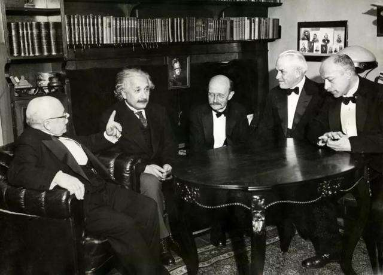
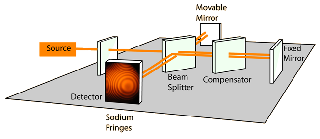

量子力学与统计物理{style=background:green;width:960px}
---------------
Quantum mechanics and statistical physics 


<br>

::: block

**<font color=#FFFF00 face="娃娃体-简" >李小飞</font>** @ 光电科学与工程学院
<br>
<br>
2020-03-01
{style=background:none;width:960px}

::: 


---


### 课程简介

- 课程目标
- 分数构成
- 教学效果
- 参考书目
- 三条军规

--

- 课程目标
    1. Learn the formal theory of Quantum Mechanics
    2. How physical systems are described in Quantum Mechanics.   
    3. How to solve problems in Quantum Mechanics  

--

- 分数构成
    1. Normal results： 20\%
    2. Midterm examination results： 20\%
    3. Final examination results ：60\%
  

--

- 教学效果
   
  

--

- 参考书目

    1. 《量子力学》卷I，II， 曾谨言， 科学出版社， 2008           
    2. Principles of quantum mechanics, shankar
    3. Modern quantum mechanics, shankar
    4. Lectures on quantum mechanics, weinberg
    5. Principles of quantum mechanics, Dirac {.fragment .highlight-green}

--

<!-- .slide:  data-auto-animate -->
### 三条军规


--

<!-- .slide:  data-auto-animate -->
### 三条军规
1. Objects are wave-particles and can be in states of superposition


--

<!-- .slide:  data-auto-animate -->
### 三条军规
1. Objects are wave-particles and can be in states of superposition
2. Rule 1 holds as long as you don't measure


--

<!-- .slide:  data-auto-animate -->
### 三条军规
1. Objects are wave-particles and can be in states of superposition
2. Rule 1 holds as long as you don't measure
3. Measurement gives random results


---

### 第一讲：普朗克能量子假说

- [ ] Great successes in Classical Physics
- [ ] Michelson-Morley experiment  
- [ ] Black body radiation
- [ ] Three formulas for radiation
- [ ] Planck's Energy Quantum Hypothesis

---

<!-- .slide:  data-auto-animate -->

### 经典物理学的伟大成就

>
 
 
 


--

<!-- .slide:  data-auto-animate -->

### 经典物理学的伟大成就

1. Newtonian mechanics  {.fragment .fade-up}
2. Maxwell's electromagnetism   {.fragment .fade-up}       
3. Thermodynamic laws  {.fragment .fade-up}
>
 
 
 


--

<!-- .slide:  data-auto-animate -->

```py
    "There is nothing new to be discovered in physics now. 
    All that remains is more and more precise measurements" 

                                 Lord Kelvin (1900)
```


--

<!-- .slide:  data-auto-animate -->

```py
    "There is nothing new to be discovered in physics now. 
    All that remains is more and more precise measurements" 

                                 Lord Kelvin (1900)
```


```py
    "But, the beauty and clearness ... is obscured by 
    two small puzzling clouds " 
                                 Lord Kelvin (1900.4)
```

--

<!-- .slide:  data-auto-animate -->

### Two small puzzling clouds


--

<!-- .slide:  data-auto-animate -->

### Two small puzzling clouds

- [ ] Michelson-Morley experiment


--


<!-- .slide:  data-auto-animate -->

### Two small puzzling clouds

- [ ] Michelson-Morley experiment

- [ ] Black body radiation experiment


--


<!-- .slide:  data-auto-animate -->

### Two small puzzling clouds

- [ ] Michelson-Morley experiment

- [ ] Black body radiation experiment



--

### 迈克尔逊-莫雷实验



There is no displacement of the interference bands, the Stationary Ether is thus shown to be incorrect {.fragment .fade-up}

--

### Relativity theory  

  

Greatly changed our view of time and space. {.fragment .fade-up}

Mainly useful in high-speed motion and strong gravitational field. {.fragment .fade-up}

--

### 黑体辐射实验

 

--

### Quantum mechanics 

 

It is a theory about matter.  {.fragment .fade-up}

--

### Foundation stones
 

---

###  黑体辐射实验

**<font color=#FFFF00 >定义：</font>**  Absorb all electromagnetic waves in any temperature

 

Interestingly, what is the mathematical function that describes all of these curves?  {.fragment .fade-up}

--

### Three formula for radiation

 

- [ ] Wien's formula
- [ ] Rayleigh-Jeans formula
- [x] Planck's formula 

--

#### Wien's formula  
$$
\rho(\nu) d \nu=c_{1} \nu^{3} e^{-c_{2} \nu / T} d \nu 
$$
- Derived from electromagnetism (1893),
- Described well only in high frequency region
- Nobel Prize in physics（1911)  {.fragment .highlight-green}

--

#### Rayleigh-Jeans formula
$$
\rho(\nu, T) d \nu=\frac{8 \pi}{c^{3}} \nu^{2} k T d \nu 
$$ 
- Derived from thermodynamics (1900), 
- Described well only in low frequency region
$$
\int_0 ^\infty \frac{8 \pi}{c^{3}} \nu^{2} k T d\nu \to \infty 
$$
- Nobel Prize in physics（1904）  {.fragment .highlight-green}

--

#### Planck's formula
$$
\rho(\nu, T) d \nu=\frac{8 \pi}{c^{3}} \frac{h \nu^{3} }{e^{h \nu / K T}-1} d \nu
$$

- Obtained from experimental data via interpolation technique (1900-4), 
- Described well in whole frequency region
- Nobel Prize in physics（1918）  {.fragment .highlight-green}

--

#### <font color=#FF000 >Problem: </font>

How to derive the Planck's formula from existing theory. {.fragment .fade-up} 

On **1900-12-14**, Planck gave out his solution based on his Energy Quantum Hypothesis!  {.fragment .fade-up}

---

<!-- .slide:  data-auto-animate -->
### Planck's energy quantum hypothesis

--

### Planck's energy quantum hypothesis

-  Black body consists of millions of oscillators {.fragment .fade-up} 
  
-  The oscillators can only radiate at a discrete amounts of energy
    $$    E=n\varepsilon $${.fragment .fade-up} 
- The unit of the energy (quanta) determined by the oscillator' frequency
    $$   \varepsilon=h\nu  $${.fragment .fade-up} 

--

Based on Boltzmann distribution law,
`
\[\frac{N_{i}}{N}=\frac{\exp \left(-\frac{E_{i}}{k T}\right)}{\sum_{i} \exp \left(\frac{-E_{i}}{k T}\right)}
\]
`{class="fragment"}

- If energy is continuous，the distribution between $E - E+dE$ : {.fragment .fade-up} 
  
`
\[
\omega=\frac{e^{-E / k T}}{\int\limits_{0}^{\infty} e^{-E / k T} d E}
\]
`{class="fragment"}

--

The average energy :  

`
\[\begin{aligned}
< E >  
& = \int\limits_{0}^{\infty} E \frac{e^{-E / k T}}{\int\limits_{0}^{\infty} e^{-E / k T} d E} d E  \\
\end{aligned} \]
` {class="fragment"}

`
\[\begin{aligned}
& = -kT (E e ^{-E / k T} \vert_{0}^{\infty}- \int\limits_{0}^{\infty} e^{-E / k T} d E)  \\
& = \color{red}{kT} 
\end{aligned} \]
` {class="fragment"}

--

- If energy is discrete，the distribution :
  
`
\[
  \frac{e^{-E / k T}}{\int\limits_{0}^{\infty} e^{-E / k T} d E} 
\]
` {class="fragment"} 

`
\[
  \to \frac{e^{-E / k T}}{\sum\limits_{0}^{\infty} e^{-E / k T}} 
\]
` {class="fragment"} 
 
`
\[
  \to \frac{e^{-nh\nu / k T}}{\sum\limits_{0}^{\infty} e^{-nhv / k T}} 
\]
` {class="fragment"}

--

The average energy is

`
\[\begin{aligned}
< E > 
& = \sum\limits_{0}^{\infty} nh\nu\frac{e^{-nh\nu / k T}}{\sum\limits_{0}^{\infty} e^{-nh\nu / k T}}  \\
\end{aligned} 
\]
` {class="fragment"} 
 
`
\[\begin{aligned}
& = -h\nu \frac{d}{dx} \frac{n e^{-nx}}{\sum\limits_{0}^{\infty} e^{-nx}}   \\
& = \color{red}{\frac{h\nu}{e^{h\nu/kT}-1}} 
\end{aligned} 
\]
`{class="fragment"} 


--

`
\[
\text{(Continuous)} \quad k T \rightarrow \frac{h \nu}{e^{ h \nu / k T}-1} \quad \text{(Discrete)}  
\]
`{class="fragment"} 

--

If energy is discrete, the item $kT$ in Rayleigh-Jeans 
\begin{equation*}
\rho(\nu, T) d \nu=\frac{8 \pi}{c^{3}} \nu^{2} k T d \nu 
\end{equation*} {.fragment .fade-up} 

should be replaced by $\dfrac{h \nu}{e^{ h \nu / k T}-1}$ {.fragment .fade-up} 

\begin{equation*}
\rho(\nu, T) d \nu=\frac{8 \pi}{c^{3}} \frac{h \nu^{3} }{e^{h \nu / K T}-1} d \nu
\end{equation*} {.fragment .fade-up} 

It is exactly the Planck's formula {.fragment .fade-up} 

---

### 讨论: 

#### 能量量子化只是一种数学处理技术？ {.fragment .highlight-green}

--

<!-- .slide:  data-auto-animate -->
### Signification of planck's energy quantum hypothesis


--

<!-- .slide:  data-auto-animate -->
### Signification of planck's energy quantum hypothesis

- Broke through the constraints of classical physics  {.fragment .fade-up} 
  
- Opened the door of quantum mechanics {.fragment .fade-up} 

--


### The End 

::: block
In 1927, **Dirac** got the Planck's formula from Quantum Mechanism.
:::

---


<!-- .slide: data-background="images/uestclogo.png" data-background-opacity="0.07"-->
### A & q


---


### 选择PPT转场方式

You can select from different transitions

[None](?transition=none#/transitions) - [Fade](?transition=fade#/transitions) - [Slide](?transition=slide#/transitions) - [Convex](?transition=convex#/transitions) - [Concave](?transition=concave#/transitions) - [Zoom](?transition=zoom#/transitions)

--

### 选择PPT主题 

You can select from different themes:

<a href="#" onclick="document.getElementById('theme').setAttribute('href','libs/reveal.js/4.1.3/theme/black.css'); return false;">Black (default)</a> -
<a href="#" onclick="document.getElementById('theme').setAttribute('href','libs/reveal.js/4.1.3/theme/white.css'); return false;">White</a> -
<a href="#" onclick="document.getElementById('theme').setAttribute('href','libs/reveal.js/4.1.3/theme/league.css'); return false;">League</a> -
<a href="#" onclick="document.getElementById('theme').setAttribute('href','libs/reveal.js/4.1.3/theme/sky.css'); return false;">Sky</a> -
<a href="#" onclick="document.getElementById('theme').setAttribute('href','libs/reveal.js/4.1.3/theme/beige.css'); return false;">Beige</a> -
<a href="#" onclick="document.getElementById('theme').setAttribute('href','libs/reveal.js/4.1.3/theme/simple.css'); return false;">Simple</a>-
<a href="#" onclick="document.getElementById('theme').setAttribute('href','libs/reveal.js/4.1.3/theme/serif.css'); return false;">Serif</a> -
<a href="#" onclick="document.getElementById('theme').setAttribute('href','libs/reveal.js/4.1.3/theme/blood.css'); return false;">Blood</a> -
<a href="#" onclick="document.getElementById('theme').setAttribute('href','libs/reveal.js/4.1.3/theme/night.css'); return false;">Night</a> -
<a href="#" onclick="document.getElementById('theme').setAttribute('href','libs/reveal.js/4.1.3/theme/moon.css'); return false;">Moon</a> -
<a href="#" onclick="document.getElementById('theme').setAttribute('href','libs/reveal.js/4.1.3/theme/solarized.css'); return false;">Solarized</a>

---
