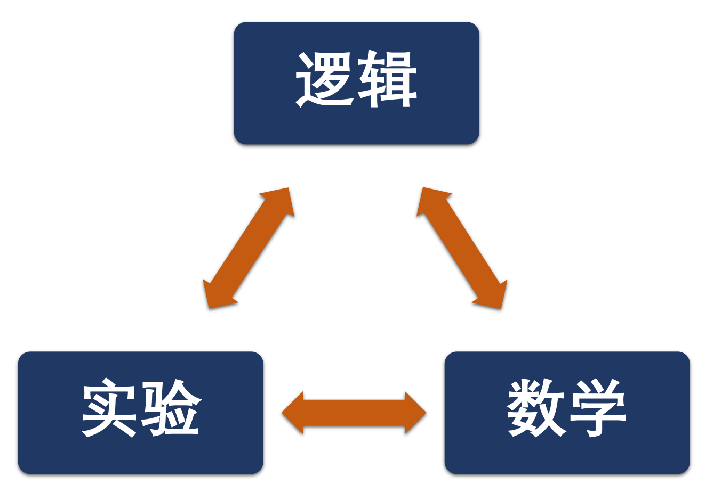

## **
  量子力学与统计物理  
**

  Quantum mechanics and statistical physics  

 
 

**
李小飞**  @ 光电科学与工程学院

 

 2023-03-01  

<!-- .slide: data-background="images/uestclogo-1.png" data-background-opacity="1.0"-->

---

### **前情回顾** 

 

- 波粒二象性
- 波函数假说
- 波函数的统计解释
- 态叠加原理
- 薛定谔方程

--

### **:fa-leaf: 量子力学基本原理**
 
- [x] 波函数公设：微观体系的状态由希尔伯特空间的一个波函数（态矢量）完全描述 

- [x] 演化公设：态矢量随时间的演化服从薛定谔方程

- [ ] 算符公设：微观体系的物理量由希尔伯特空间的厄密算符表示

- [ ] 对易公设：位置算符与正则动量算符之间存在对易关系

  $$ [X_i, P_j] = i \bar{h} \delta_{ij} $$

- [ ] 全同粒子公设： 全同粒子的态矢量具有交换对称性

---

# 第三章 量子力学中的力学量

--

### :fa-leaf: **学习方法的转变**

- 前面两章，我们回到了量子力学建立的时代，跟随的大家的脚步，针对大量经典**实验**，通过深入地**逻辑**分析，获得了量子力学的一些知识，并对前两个公设有了较为基本的认识。
 
- 从现在开始，我们将基于**数学**建立起严格的量子力学体系

---

###  1. 希尔伯特空间与第一公设 

--

#### :fa-paper-plane: 加法，数乘和内积  

`\begin{aligned}
 \text{1、定义加法} \quad  &\xi=\psi+\varphi\\
  &\psi+\varphi=\varphi+\psi \qquad (\text{交换律})\\
  &(\psi+\varphi)+\xi=\psi+(\varphi+\xi) \qquad (\text{合律})\\  &\psi+\text{O}= \psi \qquad (\text{零元})\\
  &\psi+\varphi= \text{O} \qquad (\text{逆元})
\end{aligned}`{class="fragment"}

--

`
\[
\begin{aligned}
\text{2、定义数乘} \quad &\varphi=\psi a\\
&\psi 1= \psi \qquad (\text{1元})\\
&(\psi a)b=\psi (ab) \qquad (\text{结合律})\\
&\psi(a+b)= \psi a+ \psi b \qquad (\text{第一分配律})\\
&(\psi+\varphi) a = \psi a +\varphi a \qquad (\text{第二律}) \\
\text{3、定义内积} \quad &(\psi, \varphi)=c \\
 &(\varphi,\psi)= c^*
\end{aligned}
\]
`{class="fragment"}

--

$\color{#FFA500}{\text{例-1：}}$  对于定义在3维矢量空间的两矢量，求它们的内积{class="fragment"}

$$\psi=x_1\vec{i}+y_1\vec{j}+z_1\vec{k}, \qquad \varphi=x_2\vec{i}+y_2\vec{j}+z_2\vec{k}$${class="fragment"}

$\color{#FFA500}{\text{解：}}$ 这是实空间 $$(\psi, \varphi) = \psi \cdot \varphi= x_1x_2+y_1y_2+z_1z_2=c $$ {class="fragment"}

$$(\varphi, \psi) = (\psi, \varphi)^* = c^* = c $$ {class="fragment"}

--

`$\color{#FFA500}{\text{例-2：}}$ 有定义在$C^3$空间的列矩阵，求内积
\[\psi=
        \begin{pmatrix}
                a_1\\
                a_2\\
                a_3
        \end{pmatrix}, \qquad 
        \varphi =\begin{pmatrix}
            b_1\\
            b_2\\
            b_3
    \end{pmatrix}
\]`{class="fragment"}

`$\color{#FFA500}{\text{解：}}$  
\[(\psi, \varphi) = \begin{pmatrix}
        a_1 ^* &
        a_2 ^* &
        a_3 ^*
    \end{pmatrix}
        \begin{pmatrix}
        b_1\\
        b_2\\
        b_3
    \end{pmatrix}
    =a_1 ^* b_1 +a_2 ^* b_2 +a_3 ^* b_3
    =c 
    \]`{class="fragment"}

`\[(\varphi,\psi) = \begin{pmatrix}
        b_1 ^* &
        b_2 ^* &
        b_3 ^*
    \end{pmatrix}
        \begin{pmatrix}
        a_1\\
        a_2\\
        a_3
    \end{pmatrix}
    =b_1 ^* a_1 +b_2 ^* a_2 +b_3 ^* a_3
    =c^* 
\]`{class="fragment"}

--

$\color{#FFA500}{\text{例-3：}}$  求定义在实空间的两函数的内积 {class="fragment"}

`\[\psi(x)=\sin nx, \varphi(x)=\sin mx\]`{class="fragment"}

`$\color{#FFA500}{\text{解：}}$
\[(\psi, \varphi)=\int_{-l} ^{l} \sin(nx) \sin(mx) dx=\begin{cases}
         0, \qquad n\neq m \\
        \dfrac{l}{2} , \qquad n=m
    \end{cases}
\]`{class="fragment"}

--

$\color{#FFA500}{\text{例-4：}}$ 求定义在复数空间的两函数的内积 {class="fragment"}

$\color{#FFA500}{\text{解：}}${class="fragment"}

`\[(\psi, \varphi)=\int_a ^b \psi^*(x)  \varphi(x) dx=c\]
\[(\varphi,\psi)=\int_a ^b \varphi^*(x)\psi(x) dx = (\int_a ^b \varphi(x)\psi^*(x) dx) ^* =c^*\]`{class="fragment"}

这正好是量子力学里的计算！{class="fragment"}

--

#### :fa-paper-plane: 内积的性质：{class="fragment"}

`\[(\psi, \varphi)= (\varphi,\psi)^* \]
    \[(\psi, \varphi+\xi)= (\psi, \varphi) + (\psi, \xi)\qquad (\text{分配律})\]
    \[(\psi, \varphi a)= (\psi, \varphi )a \]
    \[(\psi a, \varphi )= (\psi, \varphi )a^* \]    
    \[(\Psi,c_1\psi_1+c_2\psi_2)=(\Psi,c_1\psi_1)+(\Psi,c_2\psi_2)\]
\[(\psi,\psi)= c\ge 0\]`{class="fragment"}

--

#### :fa-paper-plane: 左矢与右矢： {class="fragment"}

考察内积：{class="fragment"}

$$(\psi,\psi) = \int \psi^* \psi d \tau $$ {class="fragment"}

同一波函数放在左边还是右边，意义不同{class="fragment"}

右边是线性的而左边是反线性的：  
$$(\psi, a \psi)= a (\psi,\psi)$$ 
$$(a\psi, \psi)= a^* (\psi, \psi)$${class="fragment"}

为了清楚地描述这种线性反线性特点，定义**左矢**和**右矢**
$$\langle \psi |, \qquad |\psi \rangle $$  {class="fragment"}

--

则内积可定成：
$$(\psi,\varphi)\equiv \langle \psi | \varphi \rangle $$ {class="fragment"}

线性与反线性:
$$\langle a\psi | = \langle \psi |a^* ,\qquad |a\psi \rangle = a|\psi \rangle$$ {class="fragment"}

这种记号，称为 Dirac (迪拉克) 记号 {class="fragment"}

--

#### :fa-paper-plane: 常见空间的定义 {class="fragment"}

- 矢量空间：满足加法和数乘两种运算的集合 {class="fragment"}

- 内积空间：满足加法、数乘和内积三种运算的集合 {class="fragment"}
  
- 希尔伯特空间:  完全的内积空间 {class="fragment"}
  

*完全性：对于给定的任意小实数$\varepsilon$，总有数N存在，当 m, n>N时，下式成立
$$ (\psi_m -\psi_n, \psi_m -\psi_n )< \varepsilon $${class="fragment"}

--

#### :fa-paper-plane: 理解第一公设 {class="fragment"}

- 查看我们以前学习到的波函数，它恰好是可进行加法、数乘和内积三种运算的。{class="fragment"}

- 因此，一个体系的所有状态的波函数的集合构成一个希尔伯特空间。{class="fragment"}
  
- 反过来说，正好是量子力学第一条公设：{class="fragment"}

 

$\color{#FFA500}{\text{微观体系的状态用希尔伯特空间的（波函数）态矢量描述：}}$  {class="fragment"}

---

###  2. 算符代数

--

#### :fa-paper-plane: 算符的定义  {class="fragment"}

描述希尔伯特空间矢量之间的映射关系有符号。{class="fragment"}

- 即：算符作用于一个态矢量，将映射到另一个态矢量。
    $$\hat{F} |\Psi \rangle = |\varphi \rangle $$ {class="fragment"}
 
- $\color{#FFA500}{\text{Tips:}}$ 在不引起不明意义的条件下，为简单见可略去算符上面的帽子 {class="fragment"}

--

#### :fa-paper-plane: 算符的运算 {class="fragment"}

**(1) 算符相等**  {class="fragment"}

对任意波函数，有
$$ A\Psi=B\Psi \to A=B $$ {class="fragment"}

**(2) 算符的和** {class="fragment"}

$$ (A+B)\Psi=A\Psi+B\Psi $$ {class="fragment"}

- 交换律 {class="fragment"}

$$A+B=B+A$$ {class="fragment"}

- 结合律 {class="fragment"}

$$ (A+B)+C=A+(B+C)$$ {class="fragment"}

--

**(3) 算符的积** {class="fragment"}

$$ (AB)\Psi=A(B\Psi) $$ {class="fragment"}

- 交换律不成立 {class="fragment"}

>即 $AB=BA$ 或 $AB\ne BA$ 都有可能 {class="fragment"}

- 对易子 {class="fragment"}

$$ [A,B]=AB-BA$$ {class="fragment"}

若$$[A,B]=0$$ {class="fragment"}

称两算符对易，否则不对易 {class="fragment"}

--

**(4) 逆算符** {class="fragment"}

$$ F|\Psi> = |\psi> $$
$$ F^{-1}|\psi> = |\Psi> $$ {class="fragment"}

**(5) 伴算符** {class="fragment"}
        
$$ F|\Psi> = |\psi> $$
$$ <\psi| = <\Psi| F^{\dagger} $$ {class="fragment"}
        
- 内积形式：{class="fragment"}

$$ (\varphi,F\Psi)=(\varphi,\psi)$$ 
$$ (F^\dagger \Psi,\varphi)=(\psi,\varphi)$$ {class="fragment"}

--

**(6) 自伴算符** {class="fragment"}
 
$$ F^{\dagger} = F $$ {class="fragment"}
        
- 性质：{class="fragment"}

$$ (\Psi, F \psi) = (F \Psi, \psi)$$  
$$<\Psi|F^{\dagger}|\psi> = (<\psi|F|\Psi>)^* $$ {class="fragment"}

自伴性也称厄密性，**自伴算符** = **厄密算符** {class="fragment"}

--

**(7) 幺正(酉)算符**  {class="fragment"}  

$$ F^{\dagger}F = FF^{\dagger}=I $${class="fragment"}

- 性质：{class="fragment"}

$$ F^{\dagger} = F^{-1} $$ {class="fragment"}
     
$\color{#FFA500}{\text{Tips:}}$  厄密算符: $ F=F^{\dagger}$ ， 幺正算符: $ F^{-1} = F^{\dagger}$ ，幺正厄密算符：$ F = F^{-1} = F^{\dagger}$ {class="fragment"}

 

 
**(8) 线性算符** {class="fragment"}

对任意函数，有{class="fragment"}
        
$$F(c_1\psi_1+c_2\psi_2 ) = c_1(F\psi_1)+c_2(F\psi_2 )$$ {class="fragment"}

--

**(8) 算符的本征方程** {.fragment .fade-up} 

$$ F |\psi> = f |\psi> $$ {.fragment .fade-up} 

称 $f$ 是算符$F$的本征值，$\psi$是属于本征值$f$的本征函数 {.fragment .fade-up} 

- 比如： 定态薛定谔方程就是哈密顿算符的本征方程 {.fragment .fade-up} 

$$ H |\psi> = E |\psi> $$ {.fragment .fade-up} 

- 解所有力学量算符的本征方程，就可以得到体系的所有物理量的可能值。{.fragment .fade-up}
  
因此，$\color{#FFA500}{\text{微观体系的物理量由希尔伯特空间的\`厄密\`算符表示}}$  {.fragment .fade-up}

---

### 3. 力学量算符的获得 

--

#### :fa-paper-plane: 位置与动量算符

$\color{#FFA500}{\text{例-5：}}$ 已知粒子的位置波函数$\psi(x,t)$，求位置和动量的平均值{class="fragment"}

$\color{#FFA500}{\text{解：}}$ 根据统计解释，位置的平均值为： {class="fragment"}

`\begin{aligned}
\overline{x} & = \int x | \psi(x, t) | ^{2} d x \\ 
 &= \int \psi^* (x, t) x \psi(x, t) d x
\end{aligned}`{class="fragment"}

若已知动量波函数 $c(p_x,t)$, 动量期望值为： {class="fragment"}

$$\overline{p}_x=\int c^*(p_x, t) p c(p_x, t) d p_x$$ {class="fragment"}

--

- 但现在动量波函数未知! 可考虑傅里叶变换 {class="fragment"}  

` 
\[\begin{equation*}
        \begin{split}
            \overline{p}&=\int c^{*}(p) p c(p) d p \\  
            &=\int (\frac{1}{\sqrt{2 \pi \hbar}} \int \psi^{*}(x) e^{\frac{i}{\hbar} p\cdot x} d x) p c\left(p\right) d p \\
            &=\frac{1}{\sqrt{2 \pi \hbar}} \int \int \psi^{*}(x) {\color{red}{(e^{\frac{i}{\hbar} p\cdot x}  p)}} c\left(p\right) d xd p \\
            &=\frac{1}{\sqrt{2 \pi \hbar}} \int \int \psi^{*}(x) {\color{red}{(-i\hbar\frac{d}{d x} e^{\frac{i}{\hbar} p\cdot x}})} c(p) d xd p \\
            &=\int \psi^{*}(x) (-i\hbar\frac{d}{d x}) [\frac{1}{\sqrt{2 \pi \hbar}} \int e^{\frac{i}{\hbar} p\cdot x} c(p) d p]  d x\\
         \end{split}
\end{equation*}\]  
` {class="fragment"}

--

- 傅里叶变换， 得
$$\overline{p} =\int \psi^{*}(x) (-i\hbar\frac{d}{d x}) \psi(x)  d x$$ {class="fragment"}

- 若定义计算符号   
$$ \hat{p}_x = -i \hbar \frac{d}{dx}, \qquad \to \qquad \hat{\vec{p}} = -i \hbar \nabla  $$  {class="fragment"}

- 上式可写成         
$$\overline{p}_x=\int \psi^{*}(x) \hat{p}_x \psi(x) d x $$ {class="fragment"}
  

--

- 称 $\hat{\vec{p}} = -i \hbar \nabla $ 是位置空间（表象）的动量算符 {class="fragment"}
  
- 对于任意力学量F，若存在算符$\hat{F}$， {class="fragment"}

则其期望值为：
  $$\overline{F}=\int \psi^{*}(x) \hat{F} \psi(x) d x $$ {class="fragment"}

- 很明显： $$ \hat{\vec{r}} = \vec{r}$$ {class="fragment"}

---

#### :fa-paper-plane: 任意算符的获得

$\color{red}{命题：}$ 如何获得任意力学量F的算符 $\hat F$ {class="fragment"}

$\color{red}{方案：}$
我们知道位置算符和动量算符：{class="fragment"}

`
\begin{cases}
\hat{\vec{r}} = \vec{r} \\
\hat{\vec{p}} =-i\hbar(\dfrac{d}{d x}\vec{i}+ \dfrac{d}{d y}\vec{j} + \dfrac{d}{d z}\vec{k})=-i\hbar \nabla
\end{cases} 
` {class="fragment"}

- 经典物理学具备的力学量, 一般是位置与动量的函数：$$F(\vec{r},\vec{p})$$，{class="fragment"}

则量子力学算符为-Bohm规则（1954)：$$ \hat{F}=F(\hat{\vec{r}},\hat{\vec{p}})$$ {class="fragment"}

--

例如：动能 $ T=\dfrac{p^2}{2\mu} \to \hat{T}= \dfrac{\hat{p}^2}{2\mu} $ {.fragment .fade-up} 

哈密顿量： $ H=T+U(\vec{r} )\to \hat{H}= \hat{T}+ U(\hat{\vec{r}})$ {.fragment .fade-up} 

角动量：$ \vec{L}=\vec{r}\times\vec{p} \to \hat{\vec{L}}=\hat{\vec{r}}\times \hat{\vec{p}}$ {.fragment .fade-up} 

--

$\color{red}{Tips:}$  若 $F(\vec{r},\vec{p})$ 含 $(\vec{r}^m \cdot \vec{p}^n)$ 项，则进行特殊处理 {.fragment .fade-up}   

对于连乘项 
`\[\vec{r}^m\cdot\vec{p}^n\]` {.fragment .fade-up}   

采用如下方式进行取代
`\[\frac{1}{2}(\hat{\vec{r}}^m\cdot\hat{\vec{p}}^n+\hat{\vec{p}}^n\cdot\hat{\vec{r}}^m)\]` {.fragment .fade-up}   

- 经典物理学不具备的的力学量，其算符将在量子力学中定义 {.fragment .fade-up} 
  
比如：自旋（S），宇称（P），$\dots$ {.fragment .fade-up} 

--

$\color{#FFA500}{\text{例-1：}}$ 求经典物理量$F=x^2p_x$的量子力学算符表示 
$\color{#FFA500}{\text{解：}}$  根据Bohm规则，有：
`\[\begin{aligned}
        \hat{F}=\frac{1}{2} (\hat{x}^2 \hat{p}_x + \hat{p}_x \hat{x}^2 ) 
\end{aligned}\]` 

---

### 4. 所有可观测力学量算符都是线性厄密算符

$\color{red}{命题1:}$ 所有可观测力学量算符都是线性算符 {.fragment .fade-up}  

$\color{red}{证明:}$ 设$\psi_1, \psi_2$ 是算符$\hat{F}$的属于本征值$f$的两个解 {.fragment .fade-up} 

$$\hat{F}\psi_1=f\psi_1, \to c_1\hat{F}\psi_1=c_1f\psi_1 $$
{.fragment .fade-up} 

$$\hat{F}\psi_2=f\psi_2, \to c_2\hat{F}\psi_2=c_2f\psi_2 $$
{.fragment .fade-up} 

$$f(c_1\psi_1+c_2\psi_2)=c_1\hat{F}\psi_1+c_2\hat{F}\psi_2$$
{.fragment .fade-up} 

$$\hat{F}(c_1\psi_1+c_2\psi_2)=c_1\hat{F}\psi_1+c_2\hat{F}\psi_2$$
{.fragment .fade-up} 

证毕！{.fragment .fade-up} 

--

$\color{red}{命题2:}$ 所有可观测力学量算符都是厄密算符   {.fragment .fade-up} 

$\color{red}{证明:}$ 对任意态$\Psi$, 可观测$\hat{F}$的平均值是实数， 有： 
$$(\Psi,\hat{F}\Psi)=(\hat{F} \Psi, \Psi) $$ {.fragment .fade-up} 

取 $\Psi= \psi_1+c\psi_2 $, 得：{.fragment .fade-up} 

`
\[ ([\psi_1+c\psi_2],\hat{F} [\psi_1+c\psi_2])=(\hat{F}[\psi_1+c\psi_2],[\psi_1+c\psi_2])
\] 
`{.fragment .fade-up} 

` 
\[\begin{equation*}
    \begin{split}
    &\left( \psi_{1}, \hat{F} \psi_{1} \right) + c^{*} \left( \psi_{2}, \hat{F} \psi_{1} \right)+ c \left( \psi_{1}, \hat{F} \psi_{2} \right)+ |c|^{2} \left( \psi_{2}, \hat{F} \psi_{2} \right)= \\
    & \left( \hat{F} \psi_{1}, \psi_{1} \right) +c^{*} \left( \hat{F} \psi_{2}, \psi_{1} \right)+ c \left( \hat{F} \psi_{1}, \psi_{2} \right) + |c|^{2} \left( \hat{F} \psi_{2}, \psi_{2} \right)
    \end{split}  
\end{equation*} \]
` {.fragment .fade-up} 

--

由于平均值都是实数，有 
$$(\psi_1,\hat{F}\psi_1)=(\hat{F} \psi_1, \psi_1), \quad (\psi_2,\hat{F}\psi_2)=(\hat{F} \psi_2, \psi_2) $$ {.fragment .fade-up} 

消去第一、四项，得：
$$ c^{\*} \left( \psi_{2}, \hat{F} \psi_{1}\right)+c\left(\psi_{1}, \hat{F} \psi_{2}\right) = c^{*} \left( \hat{F} \psi_{2}, \psi_{1} \right) + c \left( \hat{F} \psi_{1}, \psi_{2} \right)$$ {.fragment .fade-up} 

取$c=1$得：
$$  \left(\psi_{2}, \hat{F} \psi_{1}\right)+\left(\psi_{1}, \hat{F} \psi_{2}\right) = \left(\hat{F} \psi_{2}, \psi_{1}\right)+\left(\hat{F} \psi_{1}, \psi_{2}\right) , \cdots (1)$$ {.fragment .fade-up} 

--

取 $c=i$，得：
$$-i\left(\psi_{2}, \hat{F} \psi_{1}\right)+i\left(\psi_{1}, \hat{F} \psi_{2}\right) =-i\left(\hat{F} \psi_{2}, \psi_{1}\right)+i\left(\hat{F} \psi_{1}, \psi_{2}\right)$$ {.fragment .fade-up} 

乘以$i$，得：
$$\left(\psi_{2}, \hat{F} \psi_{1}\right)-\left(\psi_{1}, \hat{F} \psi_{2}\right) =\left(\hat{F} \psi_{2}, \psi_{1}\right)-\left(\hat{F} \psi_{1}, \psi_{2}\right), \cdots (2) $$ {.fragment .fade-up} 

(1)+(2)，并同除以2，得 
$$\left(\psi_{2}, \hat{F} \psi_{1}\right) =\left(\hat{F} \psi_{2}, \psi_{1}\right)$$ {.fragment .fade-up} 

证毕！ {.fragment .fade-up} 
   

--

#### 结论

- 微观体系的物理量由希尔伯特空间的厄密算符表示

--

<!-- .slide: data-background="images/uestclogo-8.png" data-background-opacity="1.0"-->

# 
  A & Q 

---

### :fa-leaf: 作 业

1. 你是如何理解“微观体系的物理量由希尔伯特空间的厄密算符表示”的？
   
2. 试指出下列哪些算符是线性算符，哪些是厄密算符？并说明理由

   $$ 4 x^2 \frac{d^2} {dx^2}, [~]^2, \sum_{k=1}^n,  \frac{d}{dx}, i\frac{d}{dx}, 4\frac{d^2}{d x^2}$$ 

3. 试证明处于定态的粒子的动量平均值不随时间变化
   
4. 设氢原子处于基态$\psi_{100}$,求径向位置r,动量和动能的平均值.

--

#### **前情回顾** 

 

### **:fa-leaf: 量子力学基本原理**
 
- [x] 波函数公设：微观体系的状态由希尔伯特空间的一个波函数（态矢量）完全描述 

- [x] 演化公设：态矢量随时间的演化服从薛定谔方程

- [x] 算符公设：微观体系的物理量由希尔伯特空间的**厄密算符**表示

- [ ] 对易公设：位置算符与正则动量算符之间存在对易关系  

  $$ [X_i, P_j] = i \bar{h} \delta_{ij} $$ 

- [ ] 全同粒子公设： 全同粒子的态矢量具有交换对称性

---

### 5、厄密算符的性质

---

#### :fa-paper-plane:   厄密算符的运算性质

- 两厄米算符之和仍为厄米算符
- 当且仅当两厄米算符对易时，它们之积才是厄米算符。
- 无论两厄米算符是否对易，算符$\dfrac{1}{2}(AB+BA)$ 及$\dfrac{1}{2i}(AB-BA) $  都是厄米算符。
- 任意算符总可以分解成$A=A_+ +iA_-$，且$A_+$和$A_-$，都是厄米算符

--

$\color{red}{命题:}$ 1. 试证明两厄米算符之和仍为厄米算符 

$\color{red}{证明:}$ 设A，B为厄米算符，对于任意态，有
$$(\psi, A\psi ) = (A\psi, \psi), \qquad (\psi, B\psi ) = (B\psi, \psi)$$

它们的和： 
`
\begin{equation*}
        \begin{split}
            (\psi, (A+B)\psi ) &= (\psi, A\psi ) + (\psi, B\psi ) \\  
            &=(A\psi, \psi ) + (B\psi, \psi ) \\
            &=((A+B)\psi, \psi ) 
         \end{split}
\end{equation*}
`  
证毕！
  

--

$\color{red}{命题:}$ 2、当且仅当两厄米算符对易时，它们之积才是厄米算符。

$\color{red}{证明:}$ 设A，B为厄米算符，对于任意态，有
`
\begin{equation*}
        \begin{split}
            (\psi, (AB)\psi ) &= (\psi, A(B\psi) ) \\  
            &=((A \psi), (B\psi) )  \\
            &=(B(A \psi), \psi )  \\
            &=( (BA) \psi, \psi )  \\
            &=( (AB) \psi, \psi )  \\
         \end{split}
\end{equation*} 
`
证毕！
   

--

$\color{red}{命题:}$ 3、无论两厄米算符A和B是否对易，算符$\dfrac{1}{2}(AB+BA)$ 及 $\dfrac{1}{2i}(AB-BA) $ 都是厄米算符

$\color{red}{证明:}$ 设A，B为厄米算符，对于任意态，有
`
\begin{equation*}
        \begin{split}
            (\psi, \dfrac{1}{2}(AB+BA)\psi ) &=\dfrac{1}{2}(\psi, AB\psi) + \dfrac{1}{2}(\psi, BA\psi)  \\
            &=\dfrac{1}{2}(A\psi, B\psi) + \dfrac{1}{2}(B\psi, A\psi)  \\
            &=\dfrac{1}{2}(BA\psi, \psi) + \dfrac{1}{2}(AB\psi, \psi)  \\
            &=\dfrac{1}{2}((BA+AB)\psi, \psi) \\
            &=(\dfrac{1}{2}(BA+AB)\psi, \psi) \\
            &=(\dfrac{1}{2}(AB+BA)\psi, \psi) 
         \end{split}
    \end{equation*} 
`

--

`
\begin{equation*}
        \begin{split}
            (\psi, \dfrac{1}{2i}(AB-BA)\psi ) &= (\psi, \dfrac{1}{2i}AB\psi) - (\psi, \dfrac{1}{2i}BA\psi)\\  
            &=\dfrac{1}{2i}(\psi, AB\psi) - \dfrac{1}{2i}(\psi, BA\psi)  \\
            &=\dfrac{1}{2i}(A\psi, B\psi) - \dfrac{1}{2i}(B\psi, A\psi)  \\
            &=\dfrac{1}{2i}(BA\psi, \psi) - \dfrac{1}{2i}(AB\psi, \psi)  \\
            &=-(\dfrac{1}{2i}BA\psi, \psi) +(\dfrac{1}{2i}AB\psi, \psi)  \\
            &=(\dfrac{1}{2i}(AB-BA)\psi, \psi) \\
         \end{split}
    \end{equation*} 
` 

证毕！
   

--

$\color{red}{命题:}$ 4、任意算符总可以分解成$A=A_+ +iA_-$，且$A_+$和$A_-$，都是厄米算符

$\color{red}{证明:}$ 令：
$$A_+=\dfrac{1}{2} (A+A^+), \qquad A_+=\dfrac{1}{2i} (A-A^+) $$

总有$A=A_+ +iA_-$, 

问题转化为求证$\dfrac{1}{2} (A+A^+), \dfrac{1}{2i} (A-A^+) $是厄米算符

--

`
\begin{equation*}
        \begin{split}
            (\psi, \dfrac{1}{2} (A+A^+)\psi ) &=\dfrac{1}{2}(\psi, (A)\psi) + \dfrac{1}{2}(\psi, (A^+)\psi) \\
            &= \dfrac{1}{2}((A^+)\psi, \psi) + \dfrac{1}{2}((A^+)^+\psi, \psi) \\
            &= \dfrac{1}{2}((A^+)\psi, \psi) + \dfrac{1}{2}(A\psi, \psi) \\
            &= \dfrac{1}{2}( (A^+ + A) \psi, \psi ) \\
            &=( \dfrac{1}{2}(A+A^+) \psi, \psi ) 
         \end{split}
\end{equation*}  
`

证毕！

---

#### :fa-paper-plane:   厄密算符的本征性质

- 厄米算符的本征值为实数
- 任意态下平均值为实数的算符必为厄米算符
- 厄米算符属于不同本征值的本征函数正交
- 简并的本征函数可通过重组变得正交
- 厄米算符的本征函数系具有完备性
- 厄米算符的本征函数系具有封闭性

  

--

$\color{red}{命题:}$ 1、试证明厄米算符的本征值为实数

$\color{red}{证明:}$ 设A为厄米算符，有如下本征方程
    $$A\psi=a\psi $$

$$\begin{equation*}
    (\psi, A\psi)=(\psi, a\psi)=a(\psi, \psi)
\end{equation*}$$  

由厄米性，有：
\begin{equation*}
    (\psi, A\psi)=(A\psi, \psi)=(a\psi, \psi)= a^* (\psi, \psi)
\end{equation*}

因此：
\begin{equation*}
    a(\psi, \psi)= a^* (\psi, \psi)
\end{equation*}

所以，本征值 a必为实数， 证毕！
  

--

$\color{red}{命题:}$ 2、任意态下平均值为实数的算符必为厄米算符

$\color{red}{证明:}$任意态$\Psi$下，F的平均值
$$(\Psi,F\Psi)=\bar{F}=\bar{F}^* = (\Psi,F\Psi)^* = (F\Psi,\Psi), \qquad (1) $$

令 $\Psi= \psi_1+c\psi_2 $, 代入上式，得：
$$([\psi_1+c\psi_2],F [\psi_1+c\psi_2])=$$
$$(F[\psi_1+c\psi_2],[\psi_1+c\psi_2]) $$

`
\begin{array}{r}
    \left(\psi_{1}, F \psi_{1}\right)+c^{*}\left(\psi_{2}, F \psi_{1}\right)+c\left(\psi_{1}, F \psi_{2}\right)+|c|^{2}\left(\psi_{2}, \hat{F} \psi_{2}\right) \\
    =\left(F \psi_{1}, \psi_{1}\right)+c^{*}\left(F \psi_{2}, \psi_{1}\right)+c\left(F \psi_{1}, \psi_{2}\right)+|c|^{2}\left(\hat{F} \psi_{2}, \psi_{2}\right)
\end{array}
`

--

由（1）式，有： 
$$(\psi_1,F\psi_1)=(F \psi_1, \psi_1), \quad (\psi_2,F\psi_2)=(F \psi_2, \psi_2) $$

可消去上式第一、四项：

`\begin{array}{r}
        c^{*}\left(\psi_{2}, F \psi_{1}\right)+c\left(\psi_{1}, F \psi_{2}\right) \\
        =c^{*}\left(F \psi_{2}, \psi_{1}\right)+c\left(F \psi_{1}, \psi_{2}\right)
\end{array}
`
取$c=1$，
$$  \left(\psi_{2}, F \psi_{1}\right)+\left(\psi_{1}, F \psi_{2}\right) = \left(\hat{F} \psi_{2}, \psi_{1}\right)+\left(\hat{F} \psi_{1}, \psi_{2}\right) , \cdots (2) $$

--

取$c=i$，
$$-i\left(\psi_{2}, F \psi_{1}\right)+i\left(\psi_{1}, F \psi_{2}\right) =-i\left(\hat{F} \psi_{2}, \psi_{1}\right)+i\left(F \psi_{1}, \psi_{2}\right)$$

上式乘以$i$,得：
$$\left(\psi_{2}, F \psi_{1}\right)-\left(\psi_{1}, F \psi_{2}\right) 
=\left(\hat{F} \psi_{2}, \psi_{1}\right)-\left(F \psi_{1}, \psi_{2}\right), \cdots (3)$$

(2)+(3),并两边同除以2，得
$$\left(\psi_{2}, F \psi_{1}\right) =\left(F \psi_{2}, \psi_{1}\right)$$

证毕！
  

--

$\color{red}{命题:}$ 3、试证厄米算符属于不同本征值的本征函数正交

$\color{red}{证明:}$ 设 $\psi_a , \psi_b $ 分别是属于本征值a、b的本征函数

`   
\begin{equation*}
(\psi_a, A\psi_b)=(\psi_a, b\psi_b)=b(\psi_a, \psi_b)
\end{equation*}
` 

由厄米性，有：
`
\begin{equation*}
(\psi_a, A\psi_b)=(A\psi_a, \psi_b)=a(\psi_a, \psi_b)
\end{equation*}
`

由于$a\neq b$,有
$$\begin{equation*}
(\psi_a, \psi_b)=0
\end{equation*}$$

证毕！
  

--

  
  设$\psi_n$、$\psi_m$都是厄米算符A的本征函数

1. 归一性：
    $$\begin{equation*}
        (\psi_n, \psi_m)=1, \qquad (n=m)
    \end{equation*} $$ 
2. 正交性：
    $$\begin{equation*}
        (\psi_n, \psi_m)=1, \qquad (n\neq m)
    \end{equation*}$$
若定义$\delta$函数:
`
\begin{equation*}
        \delta_{n m}= 
        \begin{cases}1, & n=m \\ 
            0, & n \neq m
        \end{cases}
        \end{equation*}
`

--

#### 厄密算符本征函数的正交归一性

$$\begin{equation*}
(\psi_n, \psi_m)=\delta_{nm}
\end{equation*}$$
  

--

  
$\color{red}{命题:}$ 4、简并的本征函数可通过重组变得正交

$\color{red}{证明:}$ 设厄米算符A属于本征值a的本征函数有f个

$$\begin{equation*}
        A\psi_{na}=a\psi_{na}, \quad (n=1,2,3,\cdots, f)
\end{equation*}$$

由这f函数构成线性叠加态
$$\begin{equation*}
\Psi_a=\sum_{n=1}^{f} c_n \psi_{na} \qquad (n=1,2,3,\cdots, f)
\end{equation*}$$

取f个这样的叠加态
$$\begin{equation*}
    \Psi_{\beta a}=\sum_{n=1}^{f} c_{\beta n} \psi_{na} \qquad (\beta=1,2,3,\cdots, f)
\end{equation*}$$

--

$$\begin{equation*}
        A\Psi_{\beta a}=\sum_{n=1}^{f} c_{\beta n} A\psi_{na} =a \Psi_{\beta a}
\end{equation*}$$

表明这些叠加态也是属于本征值a的本征函数。

选择系数$c_{\beta n}$，让这f个新的本征态正交归一
$$\begin{equation*}
(\Psi_{\beta a}, \Psi_{\beta' a})=\delta_{\beta\beta'}
\end{equation*}$$

正交式 $\dfrac{1}{2}f(f-1)$，归一式 $f$，系数$c_{\beta n}$：$f^2$

总有：$ f^2\le \dfrac{1}{2}f(f-1)+f$，即总可找到一组$c_{\beta n}$,满足正交归一化条件。
  

--

$\color{yellow}{例题:}$ 试采用Schmidt正交化方案使能量E的三个简并函数（$\Psi_1, \Psi_2, \Psi_3$）正交
    
$\color{yellow}{解:} $取$\psi_1=\dfrac{\Psi_1}{(\Psi_1, \Psi_1)}$

设 $\psi_2'=\Psi_2-(\psi_1, \Psi_2)\psi_1$

$$\begin{equation*}
    (\psi_1, \psi_2')=(\psi_1, \Psi_2)-(\psi_1, \Psi_2)(\psi_1, \psi_1)=0
\end{equation*}$$

取$\psi_2=\dfrac{\psi_2'}{(\psi_2', \psi_2')}$

设 $\psi_3'=\Psi_3-(\psi_1, \Psi_3)\psi_1-(\psi_2, \Psi_3)\psi_2$

--

$$\begin{equation*}
    (\psi_1, \psi_3')=(\psi_1, \Psi_3)-(\psi_1, \Psi_3)(\psi_1, \psi_1)-(\psi_2, \Psi_3)(\psi_1, \psi_2)=0
\end{equation*}$$

$$\begin{equation*}
        (\psi_2, \psi_3')=(\psi_2, \Psi_3)-(\psi_1, \Psi_3)(\psi_2, \psi_1)-(\psi_2, \Psi_3)(\psi_2, \psi_2)=0
\end{equation*}$$

取$\psi_3=\dfrac{\psi_3'}{(\psi_3', \psi_3')}$

则$\psi_1, \psi_2, \psi_3$构成正交归一化组。

--

现在求它们的本征值$\dots$

$$ H\psi_1= H \dfrac{\Psi_1}{(\Psi_1, \Psi_1)} =  \dfrac{E\Psi_1}{(\Psi_1, \Psi_1)} = E \psi_1$$

$$ H\psi_2= H \dfrac{\Psi_2-(\psi_1, \Psi_2)\psi_1}{(\psi_2', \psi_2')} =  \dfrac{H\Psi_2-(\psi_1, \Psi_2)H\psi_1}{(\psi_2', \psi_2')}=E\psi_2$$

同理，有$ H\psi_3=E\psi_3$
    
说明它们依然是简并的！
  

--

$\color{red}{命题:}$ 5、厄米算符的本征函数系具有完备性

$\color{red}{完备性定义:}$：设体系的厄米算符A具有本征方程
$$\begin{equation*}
    A\psi_{n}=a_n\psi_{n}, 
\end{equation*}$$ 
则这个体系的任意态函数都可以A的本征函数系上展开
$$\begin{equation*}
        \Psi=\sum_n c_n \psi_{n} \qquad (n=1,2,3,\cdots)
\end{equation*}$$
这种性质称为本征函数系的完备性。

完备性证明： 见文献《厄米算符本征函数完备性的一般证明》，大学物理，2012, 31(9): 16-19.

--

试证明展开系数就是态矢量在对应本征基矢上的投影

$\color{yellow}{证明:}$$c_n=\sum_m c_m\delta_{nm} $
$$= \sum_m c_m(\psi_n, \psi_m)$$
$$= (\psi_n, \sum_m c_m\psi_m) $$
$$=(\psi_n, \Psi)$$

--

试证明展开系数的模方$|c_n|^2$就是测得本征值$a_n$的概率

`
    \begin{equation*}
        \begin{split}
            \bar{A}&=(\Psi, A\Psi)=(\Psi, A\sum_n c_n \psi_{n})=(\Psi, \sum_n c_n A\psi_{n})\\
            &=(\sum_m c_m \psi_{m}, \sum_n c_n a_n \psi_{n})\\
            &=\sum_{m,n} c_m^* c_n a_n (\psi_m, \psi_n)\\
            &=\sum_{m,n} c_m^* c_n a_n \delta_{mn}\\
            &=\sum_{n} c_n^* c_n a_n =\sum_{n} |c_n|^2 a_n 
        \end{split}
    \end{equation*}
`
  

--

$\color{red}{命题:}$ 6、厄米算符的本征函数系具有封闭性

$\color{red}{证明:}$ 封闭性与完备性互为充要条件
`
\begin{equation*}
        \begin{split}
            \Psi(x)&=\sum_n c_n \psi_{n}(x) \\
            &=\sum_n (\psi_n(x'), \Psi(x')) \psi_{n}(x)\\
            &= (\sum_n\psi_{n} ^* (x)\psi_n(x'), \Psi(x')) \\
            \to &\sum_n\psi_{n} ^* (x)\psi_n(x')=\delta(x-x')\\
            \to &(\psi_{n}(x),\psi_n(x'))=\delta(x-x')
        \end{split} 
\end{equation*}
`  

--

#### :fa-paper-plane:   波函数与矩阵的关系

态的展开系数构成系数矩阵:
`
\begin{equation*}
    \begin{split}
            \vec{P}&=\sum_i{x_i\vec{e_i}}, \qquad i=1,2,3 \\
            \Psi&=\sum_n c_n \psi_n, \qquad n=1,2,\cdots 
    \end{split}  
\end{equation*}
`
数学上，基矢组{$\vec{e_i}$}张开的空间叫三维矢量空间, 有 $$\vec{P}\Leftrightarrow(x_1,x_2,x_3)$$
本征函数系{$\psi_n$}张开的空间叫Hilbert空间,有 $$\Psi\Leftrightarrow(c_1,c_2,\cdots)^T$$

--

#### 希尔伯特空间表述量子力学

- 希尔伯特空间的**态矢量**描述体系的状态
   
- 希尔伯特空间的**厄米算符**描述体系的力学量
   
- 算符的本征函数系构成希尔伯特空间的一个正交归一完全基
  

--

<!-- .slide: data-background="images/uestclogo-8.png" data-background-opacity="1.0"-->

# 
  A & Q 

---

#### :fa-paper-plane: 作 业  

1. 试指出下列波函数哪些相互正交，并说明理由
   `$$ |\psi_1> = \begin{bmatrix} 
       1 \\
       1 \\
       0 \\
       0 \\
   \end{bmatrix},   
    |\psi_2> = \begin{bmatrix} 
       0 \\
       0 \\
       0 \\
       1 \\
   \end{bmatrix},   
    |\psi_3> = \begin{bmatrix} 
       0 \\
       1 \\
       0 \\
       1 \\
   \end{bmatrix}  $$` 

2. 试证明如下两个态正交
   `\[ \rs{\psi_1}=\sin nx,\qquad \rs{\psi_2}=\sin mx,\qquad  \left|x\right|<l\]`

--

3. 已知某体系力学量$A$有两正交归一本征态$\psi_1$, $\psi_2$, 相应本征值为$a_1$, $a_2$. 力学量$B$两正交归一本征态$\varphi_1$, $\varphi_2$, 相应本征值为$b_1$, $b_2$. 若有如下关系：
   `$$ \psi_1 = \frac{1}{5}(3\varphi_1+4i\varphi_2), \psi_2 = \frac{1}{5}(4\varphi_1-3i\varphi_2)  $$`
现对某态$\Psi$测量A，得值$a_1$后再测量B，然后再测量A，试问第二次测得值为 $a_1$的概率是多少？

4. 试证当且仅当两厄密算符A,B对易时,它们的积才是厄密的.

5. P51 3.2, 3.5, 3.6, 3.8, 3.9, 3.12, 3.13 

---

 ### 6、常见力学量算符的本征方程

- 《量子化就是本征值问题》 $\hspace{2em}$ -- 薛定谔(1926)

--

---

 ### 7、对易不对易关系

--

---

 ### 8、不确定性原理

--

---

 ### 9、守恒定律

--