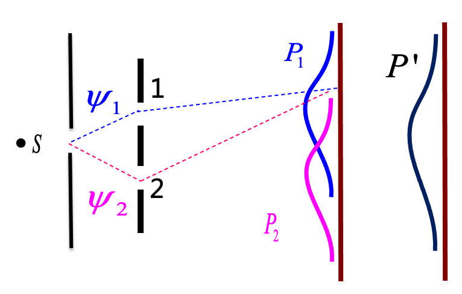
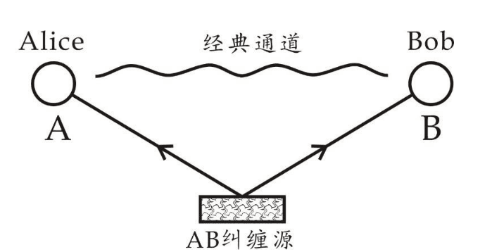
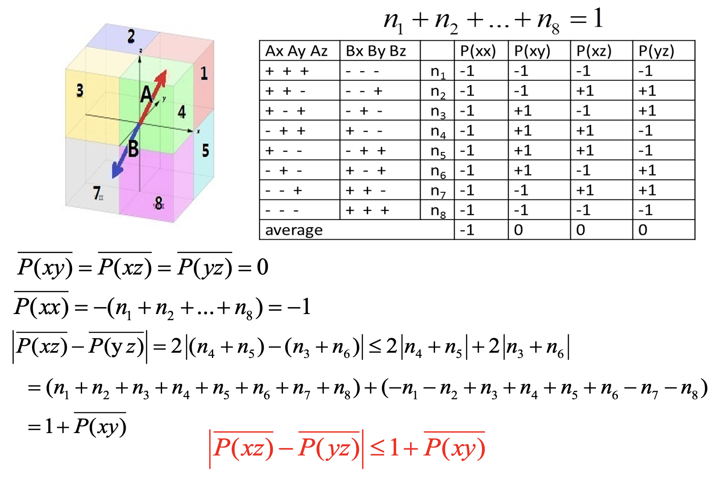
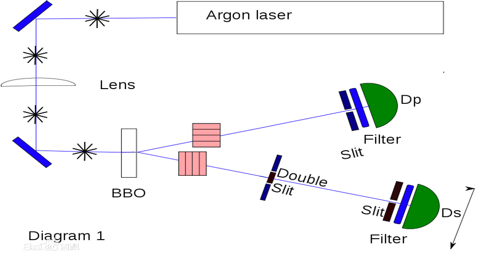
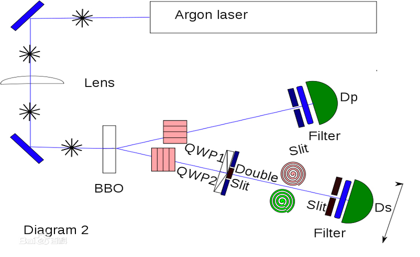

量子力学与统计物理{style=background:green;width:960px}
---------------
Quantum mechanics and statistical physics 

 

::: block

**李小飞** @ 光电科学与工程学院
 
 
2020-03-01
{style=background:none;width:960px}

::: 

---

<!-- .slide:  data-auto-animate -->

### **前情回顾** 

--

<!-- .slide:  data-auto-animate -->

### **前情回顾** 

- 波粒二象性

--

<!-- .slide:  data-auto-animate -->

### **前情回顾** 

- 波粒二象性
- 波函数

--

<!-- .slide:  data-auto-animate -->

### **前情回顾** 

- 波粒二象性
- 波函数
- 波函数的统计诠释

--

### 关键问题

概率论 or 决定论 ？ 

---

### 第四讲：态叠加原理

- 叠加态
  
- 态叠加原理

- Which Way ?
  

---

### 经典叠加

>

- 小球双缝实验，$P'=P_1+P_2 $， 是概率叠加。 {.fragment .fade-up} 

- 经典叠加是概率叠加！ {.fragment .fade-up} 

--

### 量子叠加

> 
- 电子双缝实验，很明显，$P\neq P_1+P_2 $ ****
- 量子体系不服从概率叠加！波恩认为服从状态叠加
$$ \psi =\psi_1+\psi_2$$ {.fragment .fade-up} 

--

  

\[\begin{equation*}
        \begin{split}
            \omega&=|\psi|^2 \\
            &=|\psi_1+\psi_2|^2 \\
            &=(\psi_1^*+\psi_2^*)(\psi_1+\psi_2) \\ 
            &=|\psi_1|^2+|\psi_2|^2 + \color{red}{（\psi_1^*\psi_2+\psi_2^*\psi_1）} 
        \end{split}  
\end{equation*}
\] 

- 计算表明，存在干涉项（后两项），产生干涉条纹 {.fragment .fade-up} 
- 电子如果只过一个缝，则$\psi_1$ 或$\psi_2$为零，干涉项为零，无干涉条纹！ {.fragment .fade-up} 
- 电子只有同时过两条缝才有干涉条纹，电子同时过两条缝的这种状态称为叠加状态。 {.fragment .fade-up} 
  

--

### 态叠加原理 (Born)

- 如果 $\psi_1$ 、 $\psi_2$、 $\cdots$、$\psi_n$ 是粒子可能的态，那么它们的线性叠加也是粒子可能的态（叠加态）
 $$ \Psi=c_1 \psi_1+ c_2\psi_2+\cdots+c_n\psi_n $$ {.fragment .fade-up} 

- 如果粒子处于叠加态 $\Psi$, 那么测得粒子处在第$i$态 （$\psi_i$) 的概率为 $$\|c_i\|^2, \qquad \text{且} \qquad \sum_{i=1}^{n} |c_i|^2 =1$$ {.fragment .fade-up} 

---

<!-- .slide: data-background-video="figs/Wave-particle-duality and-double-slit-experiment.mp4" .slide:data-background-color="#ffffff" -->

--

### 实验分析 

 {.fragment .fade-up} 

- 目标：想观测到电子同时过两条缝 {.fragment .fade-up} 
- 结果：只观测到电子过一条缝。探测器越灵敏，干涉条纹越模糊，探测器足够灵敏，干涉条纹消失 {.fragment .fade-up} 

--

  
### 思考

- 测量目的、设备和实验结果 
   1. 当我们“挖出”Ａ和Ｂ两条缝时，“设计”了一个想要观察**波动性**的设备，电子被我们预先设定为“波”，因此我们观测到**波动性**（干涉条纹）。 {.fragment .fade-up} 
   2. 当我们装上侦测器时，整个实验被我们“改成”观察电子的**粒子性**，因为想要知道电子到底是由Ａ还是Ｂ穿过时，就必须先具备确定的“位置”，因此我们观察到了**粒子性**（干涉条纹消失）。 {.fragment .fade-up} {.fragment .fade-up} 

--

- 测量导致状态发生改变
   1. 探测前，电子处于叠加态（$ \psi =\psi_1+\psi_2$）{.fragment .fade-up} 

   2. 探测时，电子状态改变，被迫从叠加态变为确定态 （$\psi_1$ or $\psi_2$），（波函数坍塌）{.fragment .fade-up} 

   3. 探测后，电子处于确定态。 {.fragment .fade-up} 

   4. 探测器不灵敏，有部分没有被探测到的电子依然处于叠加态， 干涉条纹模糊。{.fragment .fade-up} 
   5. 探测器灵敏，全部电子被探测，没有电子处于叠加态， 干涉条纹消失。{.fragment .fade-up} {.fragment .fade-up} 

--

- 测量结果互补（互补性原理）
   1. 波动性和粒子性是两种不同的属性，{.fragment .fade-up} 

   2. 不能因为测得粒子性就否定波动性，反之亦然。 {.fragment .fade-up} 
 
   3. 不同的测量结果就算相互矛盾，也要同时接受， {.fragment .fade-up} 

   4. 各种测量结果互补地揭示物体本质（波粒二象性） {.fragment .fade-up} {.fragment .fade-up} 

--

### 结论
   - 电子总是处于叠加态 {.fragment .fade-up} 

   - 没被测量时，保持在叠加态 {.fragment .fade-up} 

   - 测量导致确定的态，但结果是随机的 {.fragment .fade-up} 

   - 测得电子处于某个确定态，是测量导致的结果 {.fragment .fade-up} 

---

### 学术大讨论 - Which way ?

- The probabilistic interpretation and Superposition principle of states were controversial from the beginning of of quantum mechanics {.fragment .fade-up} 

  
  1. De Broglie Pilot waves {.fragment .fade-up} 

  2. Schr$\ddot{o}$dinger's cat {.fragment .fade-up} 

  3. EPR paradox {.fragment .fade-up} 

  4. Wheeler's delayed choice experiment {.fragment .fade-up} 

  5. Quantum eraser experiment {.fragment .fade-up} 

  6. $\cdots \cdots$ {.fragment .fade-up} 

--

### Schr$\ddot{o}$dinger's cat 

 

--

### Wheeler's delayed choice experiment

--

### EPR paradox

--

### The bell inequality

--

### Quantum eraser experiment

--

### Quantum eraser experiment
  

--

### Summary
::: block
- Objects are wave-particles and in the states of superposition
- Measurement changes the states and gives random results
- Measurement results are complementary
- Measurement leads to objective reality
{style=background:green;width:800px}
::: 

---

<!-- .slide: data-background="images/uestclogo.png" data-background-opacity="0.07"-->
### A & q

---

---

### 选择PPT转场方式

You can select from different transitions

[None](?transition=none#/transitions) - [Fade](?transition=fade#/transitions) - [Slide](?transition=slide#/transitions) - [Convex](?transition=convex#/transitions) - [Concave](?transition=concave#/transitions) - [Zoom](?transition=zoom#/transitions)

--

### 选择PPT主题 

You can select from different themes:

<a href="#" onclick="document.getElementById('theme').setAttribute('href','libs/reveal.js/4.1.3/theme/black.css'); return false;">Black (default)</a> -
<a href="#" onclick="document.getElementById('theme').setAttribute('href','libs/reveal.js/4.1.3/theme/white.css'); return false;">White</a> -
<a href="#" onclick="document.getElementById('theme').setAttribute('href','libs/reveal.js/4.1.3/theme/league.css'); return false;">League</a> -
<a href="#" onclick="document.getElementById('theme').setAttribute('href','libs/reveal.js/4.1.3/theme/sky.css'); return false;">Sky</a> -
<a href="#" onclick="document.getElementById('theme').setAttribute('href','libs/reveal.js/4.1.3/theme/beige.css'); return false;">Beige</a> -
<a href="#" onclick="document.getElementById('theme').setAttribute('href','libs/reveal.js/4.1.3/theme/simple.css'); return false;">Simple</a>-
<a href="#" onclick="document.getElementById('theme').setAttribute('href','libs/reveal.js/4.1.3/theme/serif.css'); return false;">Serif</a> -
<a href="#" onclick="document.getElementById('theme').setAttribute('href','libs/reveal.js/4.1.3/theme/blood.css'); return false;">Blood</a> -
<a href="#" onclick="document.getElementById('theme').setAttribute('href','libs/reveal.js/4.1.3/theme/night.css'); return false;">Night</a> -
<a href="#" onclick="document.getElementById('theme').setAttribute('href','libs/reveal.js/4.1.3/theme/moon.css'); return false;">Moon</a> -
<a href="#" onclick="document.getElementById('theme').setAttribute('href','libs/reveal.js/4.1.3/theme/solarized.css'); return false;">Solarized</a>

---

