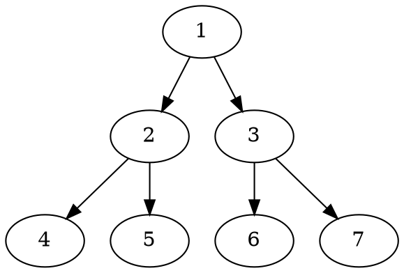

<!-- .slide: data-background="images/2021-12-03-05-23-33.png" -->

## 量子力学与统计物理 {style=background:green;width:960px}
#### Quantum mechanics and statistical physics

<br>

::: block
**李小飞** @ 光电科学与工程学院
{style=background:none;width:960px}
::: 

---


## 1、请选择PPT转场方式 {style=background:red;width:850px;height=150px}


You can select from different transitions
[None](?transition=none#/transitions) - [Fade](?transition=fade#/transitions) - [Slide](?transition=slide#/transitions) - [Convex](?transition=convex#/transitions) - [Concave](?transition=concave#/transitions) - [Zoom](?transition=zoom#/transitions)

---

## 2、请选择PPT主题 

reveal.js comes with a few themes built in:
<a href="#" onclick="document.getElementById('theme').setAttribute('href','libs/reveal.js/3.8.0/css/theme/black.css'); return false;">Black (default)</a> -
<a href="#" onclick="document.getElementById('theme').setAttribute('href','libs/reveal.js/3.8.0/css/theme/white.css'); return false;">White</a> -
<a href="#" onclick="document.getElementById('theme').setAttribute('href','libs/reveal.js/3.8.0/css/theme/league.css'); return false;">League</a> -
<a href="#" onclick="document.getElementById('theme').setAttribute('href','libs/reveal.js/3.8.0/css/theme/sky.css'); return false;">Sky</a> -
<a href="#" onclick="document.getElementById('theme').setAttribute('href','libs/reveal.js/3.8.0/css/theme/beige.css'); return false;">Beige</a> -
<a href="#" onclick="document.getElementById('theme').setAttribute('href','libs/reveal.js/3.8.0/css/theme/simple.css'); return false;">Simple</a> <br>
<a href="#" onclick="document.getElementById('theme').setAttribute('href','libs/reveal.js/3.8.0/css/theme/serif.css'); return false;">Serif</a> -
<a href="#" onclick="document.getElementById('theme').setAttribute('href','libs/reveal.js/3.8.0/css/theme/blood.css'); return false;">Blood</a> -
<a href="#" onclick="document.getElementById('theme').setAttribute('href','libs/reveal.js/3.8.0/css/theme/night.css'); return false;">Night</a> -
<a href="#" onclick="document.getElementById('theme').setAttribute('href','libs/reveal.js/3.8.0/css/theme/moon.css'); return false;">Moon</a> -
<a href="#" onclick="document.getElementById('theme').setAttribute('href','libs/reveal.js/3.8.0/css/theme/solarized.css'); return false;">Solarized</a>

---

## 3. 背影设置

<!-- .slide: data-background="#ff0000" -->
## 1-color Backgrounds

Set `data-background="#ffffff"` on a slide to change the background color. All CSS color formats are supported.

--

<!-- .slide: data-background="images/2021-12-03-05-23-33.png" -->

### 2-Image Backgrounds

--

<!-- .slide: data-background-video="https://s3.amazonaws.com/static.slid.es/site/homepage/v1/homepage-video-editor.mp4" data-background-color="#000000" -->

### 3-Video Backgrounds

--

<!-- .slide: data-background="http://i.giphy.com/90F8aUepslB84.gif" -->

### 4-GIF Backgrounds

--

<!-- .slide: data-transition="slide" data-background="#4d7e65" data-background-transition="zoom" -->

### 5-Background Transitions

Different background transitions are available via the backgroundTransition option. This one's called "zoom".

--

<!-- .slide: data-transition="slide" data-background="#b5533c" data-background-transition="zoom" -->

### 5-Background Transitions

You can override background transitions per-slide.

---

## 4、 reveal.js 对数学公式的支持

A thin wrapper for MathJax

---


`
$\begin{aligned}
\dot{x} & = \sigma(y-x) \\
\dot{y} & = \rho x - y - xz \\
\dot{z} & = -\beta z + xy
\end{aligned} $
` 

---

`
$$
\begin{aligned}
\dot{x} & = \sigma(y-x) \\
\dot{y} & = \rho x - y - xz \\
\dot{z} & = -\beta z + xy
\end{aligned} 
$$` 

---

`
$ \begin{aligned}
\dot{x} & = \sigma(y-x) \\
\dot{y} & = \rho x - y - xz \\
\dot{z} & = -\beta z + xy
\end{aligned}   
$
` 


---

## 5. 代码块 

```javascript {data-line-numbers}
function add(x, y) {
  return x + y
}
```

---


## 6、文内 ID 链接 

- [Markdown](#markdown)
- [Status bar](#statusbar)

--

## <a id="markdown"></a> Markdown

Since Reveal.js use marked to parse the markdown string you can use this in your document:

- GitHub flavored markdown.
- GFM tables

If you need a sample file you can get it here:
https://raw.githubusercontent.com/evilz/vscode-reveal/master/sample.md


--


## <a id="statusbar"></a> Status bar

As soon as your markdown document has at least two slides, slides counter will appear in the status bar on right.

**Now in version 2**, you can see a list of all your slides on the sidebar.

---

## 7、主题（Theme）

reveal.js comes with a few themes built in:
- Black (default)
- White
- League
- Sky
- Beige
- Simple
- Serif
- Blood
- Night
- Moon
- Solarized

--

You can set the theme of reveal.js 
- using `revealjs.theme` parameter in VSCode config  
- in the document itself using front matter.

--

## 8、自定义主题
If you want a custom theme 
- add custom style to a CSS file (my-theme.css) in the same folder that your markdown.

- add this in the front-matter header :

```
---
customTheme : "my-theme"
---
```

--


## 9、文件头 YAML Front Matter

You can change settings directly in your markdown file using front matter style. You can change all extention settings like this :

```
---
theme : "white"
transition: "zoom"
---
```

--


--

## 10、导出 （Print to PDF）

To export your presentation to pdf you can:
- click on PDF icon in the sidebar
- call the command `Revealjs: Export in PDF`


This will try to launch Chrome or your default browser and launch printing.

Be sure to set print setting correctly:
- No margin
- print background

--

## <a id="htmlexport"></a> Export static Website

To export your presentation to a static website you can:
- click on HTML icon in the sidebar
- call the command `Revealjs: Export in HTML`


This will try to launch Chrome in headless or your default browser it takes about 10sec and then open the export folder.


---

## 11、 数据作图 

### Bar chart with CSV data

<canvas class="stretch" data-chart="bar">
,January, February, March, April, May, June, July
My first dataset, 65, 59, 80, 81, 56, 55, 40
My second dataset, 28, 48, 40, 19, 86, 27, 90
</canvas>

--

### Line chart with CSV data and JSON configuration

<canvas class="stretch" data-chart="line">
My first dataset,  65, 59, 80, 81, 56, 55, 40
<!-- This is a comment -->
My second dataset, 28, 48, 40, 19, 86, 27, 90
<!-- 
{ 
"data" : {
	"labels" : ["Enero", "Febrero", "Marzo", "Avril", "Mayo", "Junio", "Julio"],
	"datasets" : [ { "borderColor": "#ff0", "borderDash": ["8","10"] }, { "borderColor": "#0ff" } ]
	}
}
-->
</canvas>

--

### Pie chart

<canvas class="stretch" data-chart="pie">
Black, Red, Green, Yellow
My first dataset, 40, 40, 20, 6
My second dataset, 45, 40, 25, 4
</canvas>


---


## 12、fragment 动画

使用实例-grow：{.fragment .grow}

使用实例-shrink：{.fragment .shrink}

使用实例-highlight-red：{.fragment .highlight-red}

使用实例-highlight-green：{.fragment .highlight-green}

使用实例-highlight-blue：{.fragment .highlight-blue}

使用实例-highlight-current-red：{.fragment .highlight-current-red}

使用实例-highlight-current-green：{.fragment .highlight-current-green}

使用实例-highlight-current-blue：{.fragment .highlight-current-blue}

使用实例-fade-in：{.fragment .fade-in}

使用实例-fade-out：{.fragment .fade-out}

--

### fragment 支持的动画 (2)


<span class="fragment highlight-red">
  <span class="fragment highlight-green">
    <span class="fragment fade-out">
      Turn red > Turn green > Fade out
    </span>
  </span>
</span>

使用实例-fade-right：{.fragment .fade-right}

使用实例-fade-up：{.fragment .fade-up}

使用实例-fade-down：{.fragment .fade-down}

使用实例-fade-left：{.fragment .fade-left}

使用实例-fade-in-then-out：{.fragment .fade-in-then-out}

使用实例-fade-in-then-semi-out：{.fragment .fade-in-then-semi-out}


--

### fragment 支持的动画 (3) 

<p class="fragment" data-fragment-index="3">Appears last</p>
<p class="fragment" data-fragment-index="1">Appears first </p> 
<p class="fragment" data-fragment-index="2">Appears second</p>

---

## 13、 Video 
<video data-autoplay src="http://clips.vorwaerts-gmbh.de/big_buck_bunny.mp4"></video>

---


## 14、使用说明

1. Zoom
   - Zoom anywhere on your presentation
   - `Alt + click`: Zoom in. Repeat to zoom back out.


2. Chalkboard
   - Just press 'b' or click on the pencil button to open and close your chalkboard.
   - Click the `left mouse button` to write on the chalkboard
   - Click the `right mouse button` to wipe the chalkboard
   - Click the `DEL` key to clear the chalkboard

---


<!-- .slide:  data-auto-animate -->

## 15、各种动画

---

<!-- .slide:  data-auto-animate -->

## 15、各种动画 {style="margin-top: 100px; color: red;}


---

<!-- .slide:  data-auto-animate -->

## 15、各种动画 {style="margin-top: 100px; color: red;}
# Animation

::: {data-id="box" style="height: 1px; background: salmon;"}
:::

---

<!-- .slide:  data-auto-animate -->

## 15、各种动画 {style="margin-top: 100px; color: green;}
# Animation

::: {data-id="box" style="height: 200px; background: blue;"}
:::


---

<!-- .slide:  data-auto-animate -->

# Group A

---

<!-- .slide:  data-auto-animate -->

# Group A {style="color: #3B82F6;"}

---

<!-- .slide:  data-auto-animate  data-auto-animate-id="two"-->

# Group B

---

<!-- .slide:  data-auto-animate  data-auto-animate-id="two"-->

# Group B {style="color: #10B981;"}

---

<!-- .slide:  data-auto-animate  data-auto-animate-id="two" data-auto-animate-restart-->

# Group C ❤️

---

<!-- .slide:  data-auto-animate  data-auto-animate-id="two"-->

# Group C ❤️ {style="color: #EC4899;"}

---

<!-- .slide:  data-auto-animate -->

<pre data-id="code-animation"><code data-trim data-line-numbers>
let planets = [
    { name: 'mars', diameter: 6779 },
]
</code></pre>

---

<!-- .slide:  data-auto-animate -->

<pre data-id="code-animation"><code data-trim data-line-numbers>
let planets = [
    { name: 'mars', diameter: 6779 },
    { name: 'earth', diameter: 12742 },
    { name: 'jupiter', diameter: 139820 }
]
</code></pre>

---

<!-- .slide:  data-auto-animate -->

::: {data-id="code-animation"}
```js {data-trim data-line-numbers}
let circumferenceReducer = ( c, planet ) => {
    return c + planet.diameter * Math.PI;
}

let planets = [
    { name: 'mars', diameter: 6779 },
    { name: 'earth', diameter: 12742 },
    { name: 'jupiter', diameter: 139820 }
]

let c = planets.reduce( circumferenceReducer, 0 )
```
:::


---

```js {data-line-numbers="1-2|3|4"}
let a = 1; 
let b = 2;
let c = x => 1 + 2 + x;
c(3);
```

---

## 16、不显示

---


<!-- .slide: data-visibility="hidden" -->
Hidden Slides
-------------

This slide is visible in the source, but hidden when the presentation is viewed. You can show all hidden slides by setting the \`showHiddenSlides\` config option to \`true\`.


---


## 16、自动调整字体大小 
Add the `r-fit-text` class to auto-size text
## FIT TEXT {class="r-fit-text"}


---


`
\[\small \begin{equation*}
    \begin{split}
    &\left( \psi_{1}, \hat{F} \psi_{1} \right) + c^{*} \left( \psi_{2}, \hat{F} \psi_{1} \right)+ c \left( \psi_{1}, \hat{F} \psi_{2} \right)+ |c|^{2} \left( \psi_{2}, \hat{F} \psi_{2} \right) \\
    &= \left( \hat{F} \psi_{1}, \psi_{1} \right) +c^{*} \left( \hat{F} \psi_{2}, \psi_{1} \right)+ c \left( \hat{F} \psi_{1}, \psi_{2} \right) + |c|^{2} \left( \hat{F} \psi_{2}, \psi_{2} \right)
    \end{split}  
\end{equation*}
\] 
` {class="r-fit-text"}

---

<font size=6> 
<span>
\[ ([\psi_1+c\psi_2],\hat{F} [\psi_1+c\psi_2])=(\hat{F}[\psi_1+c\psi_2],[\psi_1+c\psi_2])
\]
\[\begin{equation*}
    \begin{split}
    &\left( \psi_{1}, \hat{F} \psi_{1} \right) + c^{*} \left( \psi_{2}, \hat{F} \psi_{1} \right)+ c \left( \psi_{1}, \hat{F} \psi_{2} \right)+ |c|^{2} \left( \psi_{2}, \hat{F} \psi_{2} \right)= \\
    & \left( \hat{F} \psi_{1}, \psi_{1} \right) +c^{*} \left( \hat{F} \psi_{2}, \psi_{1} \right)+ c \left( \hat{F} \psi_{1}, \psi_{2} \right) + |c|^{2} \left( \hat{F} \psi_{2}, \psi_{2} \right)
    \end{split}  
\end{equation*}
\] 
</span>
</font>


---


## 17、碎片演示 （Fragments）

Hit the next arrow...{class="fragment"}

... to step through ...{class="fragment"}

... a fragmented slide.{class="fragment"}

This slide has fragments which are also stepped through in the notes window.

<aside class="notes">
    This slide has fragments which are also stepped through in the notes window.
</aside>

---

## 18、各种碎片演示风格（Styles）

There's different types of fragments, like:

grow {class="fragment grow"}

shrink {class="fragment shrink"}

fade-out {class="fragment fade-out"}

<span style="display: inline-block;" class="fragment fade-right">fade-right, </span>
<span style="display: inline-block;" class="fragment fade-up">up, </span>
<span style="display: inline-block;" class="fragment fade-down">down, </span>
<span style="display: inline-block;" class="fragment fade-left">left</span>

fade-in-then-out {class="fragment fade-in-then-out"}

fade-in-then-semi-out {class="fragment fade-in-then-semi-out"}

Highlight <span class="fragment highlight-red">red</span> <span class="fragment highlight-blue">blue</span> <span class="fragment highlight-green">green</span>

---


## 19、 字体大小与颜色

<font face="华文仿宋" >华文仿宋</font>
<font face="华文仿宋" >华文仿宋</font>
<font face="凌慧体-简" >凌慧体-简</font>
<font face="娃娃体-简" >娃娃体-简</font>

<font color=#FF000 >红色</font>
<font color=#008000 >绿色</font>
<font color=#FFFF00 >黄色</font>

<font size=1 color=red >红色</font>
<font size=5 color=blue >绿色</font>
<font size=7 color=green >green</font>


---

## 20、各种流程图

---


## Planuml

```plantuml
Bob -> Alice : hello
```

---

## dot



---

## ditaa

```ditaa {style=background-color:red}
    +--------+   +-------+    +-------+
    |        | --+ ditaa +--> |       |
    |  Text  |   +-------+    |diagram|
    |Document|   |!magic!|    |       |
    |     {d}|   |       |    |       |
    +---+----+   +-------+    +-------+
        :                         ^
        |       Lots of work      |
        +-------------------------+
```

---

# mermaid


---

## 21、各种分栏

---

::: .container

::: left
### Left 
*menu here*
- 
:::


::: right right
### Right
- with
- a
- list
:::

:::


---


::: .container

::: left
### Left 

:::

::: middle
### middle
 
:::


::: right
### Right
:::

:::


---


::: {.col style="height:100%; background:red; left:-8.33%;text-align: left; float: left; width:50%; z-index:-10;"}
Column 1 Content

Column 1 Content

Column 1 Content

Column 1 Content

:::
::: {.col style="background:blue;left:31.25%; top: 75px;  float: right;  text-align: right;  z-index:-10;  width:50%;"}
Column 2 Content

Column 2 Content

Column 2 Content

Column 2 Content
:::


---

## 21、备注

---


## You can add Speaker note using 


note: this text will be visible to speaker only

---

# Thank

note: Always thank audience !


---

## 22、使用HTML语法

<section>
   <h3>Title</h3>
   <p >Text</p>
   <p class="fragment">Fragment</p>
 </section>


---

## 23、 使用Markdown语法

<section data-markdown>
  $$ \frac{1}{\Bigl(\sqrt{\phi \sqrt{5}}-\phi\Bigr) e^{\frac25 \pi}} = 1+\frac{e^{-2\pi}} {1+\frac{e^{-4\pi}} {1+\frac{e^{-6\pi}} {1+\frac{e^{-8\pi}} {1+\ldots} } } } $$
</section> 


---


### The END


---
