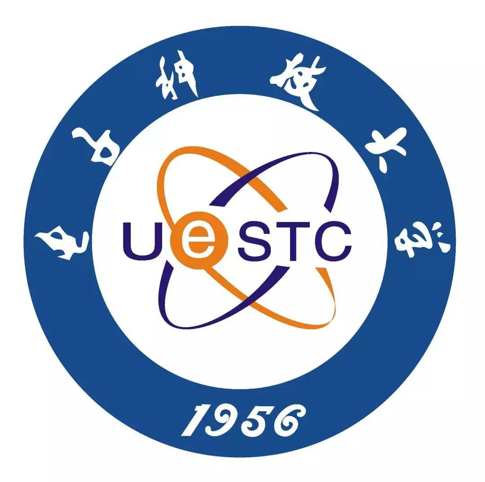

量子力学与统计物理{style=background:#003377; width:800px}
---------------
Quantum mechanics and statistical physics 

::: block

**李小飞** @ 光电科学与工程学院
 
 
2023-03-01
{style=background:none;width:960px}

::: 

---

#   第一章 绪论 
  

- [ ] 课程简介
- [ ] 普朗克能量子假说
- [ ] 波粒二象性与物质波

---

## 课程简介

- [ ] 课程目标
- [ ] 分数构成
- [ ] 教学效果
- [ ] 参考书目
- [ ] 三条军规

--

### 课程目标

