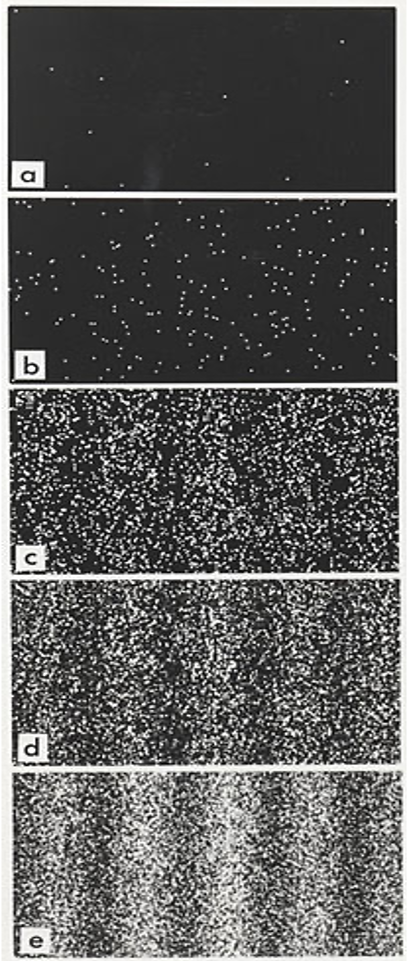

## **<center> <font color=#003399> 量子力学与统计物理 </font> </center>**

<center> <font color=#003399> Quantum mechanics and statistical physics </font> </center>

<br>
<br>

**<center><font color=#FFA500 face="娃娃体-简" >李小飞</font>** <font color=#003399> @ 光电科学与工程学院</font></center>

<br>

<center><font color=#003399> 2023-03-01 </font> </center>


<!-- .slide: data-background="QM-beamer/images/uestclogo-1.png" data-background-opacity="1.0"-->

---


### **前情回顾** 
- 大量实验表明：波粒二象性是物质的本质属性。 
$$\lambda=\frac{h}{p}, \qquad \nu =\frac{E}{h}$$ 
- 必须发展新的物理学{.fragment .fade-up}

---

# 第二章 波函数与薛定谔方程
note: # 章
note: ## 第X讲
note: ### N、主题  
note: ###  无次序主题
note: ####  分主题
note: #####    再分主题
note: ######   

---

## 第一讲：波函数

<br>

- 波函数
  
- 波函数的统计诠释

--

<!-- .slide:  data-auto-animate -->
###  双缝干涉实验分析

--

<!-- .slide:  data-auto-animate -->
###  双缝干涉实验分析  {style="color: #FF0000;"}


::: .container

::: left

- 多个波构成电子 {.fragment .fade-in}
- 多个电子构成波 {.fragment .fade-in}
- 单个电子既是粒子又是波 {.fragment .fade-in}
  - 电子与自己干涉 {.fragment .fade-up}
  - 电子至少同时有两条路径. {.fragment .fade-up}
  - 牛顿力学失效！ {.fragment .fade-up}
  - $\cdots$ {.fragment .fade-up}
:::

::: right
 
:::

:::

> 

波粒二象性导致的困境: 如何描述物体的运动状态？ {.fragment .fade-up}


---

<!-- .slide:  data-auto-animate -->
### 1. 波函数假设（Basic assumption 1/5）
::: {data-id="box" style="height: 1px; background: salmon;"}
:::  

--

<!-- .slide:  data-auto-animate -->
### 1. 波函数假设（Basic assumption 1/5）{style="color: #FF0000;"}

<br>

1924, De Broglie assumed that: {.fragment .fade-up} 

<br>

::: {data-id="box" style="height: 100px; background: green;"}
- The state of a system is described by a wavefunction {.fragment .fade-up} 
:::  

<br>

- 中文表述： 波函数完全描述物体的状态$\hspace{2em}$ {.fragment .fade-up} 

--


####  构造第一个波函数 

- For a classical plane wave 

`\begin{aligned}
 y(x,t)&=A e^{i(\dfrac{2\pi}{\lambda}x-\omega t)} \\
    & = A e^{i\dfrac{2\pi}{h}(\dfrac{h}{\lambda}x-h\nu t)}
\end{aligned}`{.fragment .fade-up}
    

--

- Putting the De Broglie relationship into the formula, one gets 
`$$\Psi_p(x,t)=A e^{\dfrac{i}{\hbar}(px-Et)}$$`{.fragment .fade-up}

- It is a quantum plane wavefunction described the state of a quantum free particle with constant energy and momentum {.fragment .fade-up} 

- $\color{red}{Tips:}$ Wavefunction is a complex function {.fragment .fade-up} 

--

- A general wavefunction is the wave-packet of quantum plane wavefunction.

`$$\begin{aligned}
\Psi(x,t) &= \sum c(p)\Psi_p(x,t) \\
&= \int c(p,t) e^{\frac{i}{\hbar}px}dp
\end{aligned}$$`{.fragment .fade-up}

-  The $c(p,t)$ is the wavefunction of the system using momentum as argument.  {.fragment .fade-up} 

- $\color{red}{Tips:}$ fourier transformation pair of $\Psi(x,t)$ and $c(p,t)$  {.fragment .fade-up} 

--

####  德布罗意的成就

- 物质波假说
- 电子的波动性
- 波函数假说
- 构造第一个波函数
- ...
  


  " 德布罗意已经揭开了面纱的一角 "   --爱因斯坦  {.fragment .fade-up} 

--

<!-- .slide:  data-auto-animate -->
###  Big problems


--

<!-- .slide:  data-auto-animate -->
###  Big problems {style="color: #FF0000;"}
::: block{style=background:red;width:800px;height:80px}

- 波函数的物理本质是什么 ？{.fragment .fade-up} 
  

::: 

--

<!-- .slide:  data-auto-animate -->
###  Big problems {style="color: #FF0000;"}
::: block

- 波函数的物理本质是什么 ？
  
- 如何获得物体的波函数 ？{.fragment .fade-up}
{style=background:red;width:800px;height:150px}
::: 

---

<!-- .slide:  data-auto-animate -->
### 2. 波函数的统计诠释

--

<!-- .slide:  data-auto-animate -->
### 2. 波函数的统计诠释 {style="color: #FF0000;"}

In 1926, Born proposed the statistical interpretation of wavefunction : 

  - The magnitude of wavefunction $\Psi(\vec{r},t)$ does not tell us how much of the particle is at position $\vec{r}$ at time t, {.fragment .fade-up} 
  - but rather the probability ($W$) that the particle is at or near the position at time t. 
$$ d W = |\Psi(\vec{r},t)|^2 d \tau $$ {.fragment .fade-up} 

 {style=background:green;width:850px}

Nobel Prize in physics（1954) {.fragment .fade-up} 

--

####  解释双缝干涉实验  

- 自由电子平面波，等概率出现在屏的任一位置 {.fragment .fade-up} 
- 电子通过双缝，发生衍射和干涉，导致在某些位置的振幅大，某些位置的振幅小 {.fragment .fade-up} 
- 振幅较大的位置电子出现概率大，形成明纹。振幅小的位置电子出现概率小，形成暗纹 {.fragment .fade-up} 
- 明暗干涉条纹不体现电子的波的形状，体现的是电子出现概率的分布。 {.fragment .fade-up} 


--

<!-- .slide:  data-auto-animate --> 
####  Do you believe it? 

#### 决定论 VS 概率论 {.fragment .fade-up}

--


<!-- .slide:  data-auto-animate -->
####  统计诠释的数学描述

- Magnitude of a wavefunction, $|\Psi|^2 =\Psi^* \Psi $ {.fragment .fade-up} 
- Probability density, $\omega = |\Psi|^2 $ {.fragment .fade-up} 
- Probability in $d \tau$,  $d W = |\Psi|^2 d \tau $ {.fragment .fade-up} 
- Normalization, $$ \int\limits_{\Omega} |\Psi|^2 d \tau =1 $$ {.fragment .fade-up} 

--

- Expectation value of any $f (x)$  $$ <f(x)>=\int_{0}^{\infty} f(x) |\Psi(x)|^2 dx $$ {.fragment .fade-up} 
- Expectation value of observable A  
   $$ < A>=\int_{0}^{\infty} \Psi^*(x) A \Psi(x) dx $$ {.fragment .fade-up} 

--

$ \color{red} {Tips：} $ 
  - $\Psi$ and $C\Psi$ describe the same state 
    $$\frac{C\Psi(x_1)}{C\Psi(x_2)} = \frac{\Psi(x_1)}{\Psi(x_2)}$$ {.fragment .fade-up} 
  
  - $\Psi$ and $e^{i\omega}\Psi$ describe the same state 
    $$ |e^{i\omega} \Psi|^2 = e^{-i\omega} e^{i\omega} |\Psi|^2 = |\Psi|^2 $$ {.fragment .fade-up} 

  - 两相同的波函数叠加, 在测量上并没有什么不同！这与经典波叠是完全不同的。  {.fragment .fade-up} 

--

- Requiring a wavefunction to be （标准化条件）
  1. 单值 {.fragment .fade-up} 
  2. 连续 {.fragment .fade-up} 
  3. 有限 {.fragment .fade-up} 
  4. 平方可积 {.fragment .fade-up} 

--

$\color{#FFA500}{\text{例-1：}}$   Normalizating the wavefunction $$\psi(x)=\sin(x), \qquad (0\le x \le \pi)$$

$\color{#FFA500}{\text{解：}}$  assuming the normalized wavefunction to be  $$\Psi=C\psi(x)=C\sin(x)$$ {.fragment .fade-up} 

--

`
\[\begin{equation*}
        \begin{split}
            \int_0 ^\pi |C\sin(x)|^2 dx &=1 \\
            C^2 \int_0 ^\pi \sin^2(x) dx &=1 \\
            C^2 \int_0 ^\pi \frac{1-\cos 2x }{2} dx &=1 \\ 
            C^2 [\frac{x}{2}-\frac{\sin 2x}{4}]_0 ^\pi &=1 \\ 
            C&=\sqrt{\dfrac{2}{\pi}}
        \end{split}  
\end{equation*}
\] 
`{.fragment .fade-up}

--

The normalizated wavefunction is
  $$ \Psi=C\sin(x)=\sqrt{\frac{2}{\pi}}\sin(x)$$ {.fragment .fade-up} 

--

$\color{#FFA500}{\text{例-2：}}$   Normalizating the plane wavefunction $$ \Psi_p (x,t)=e^{\frac{i}{\hbar}(px-Et)} $$ {.fragment .fade-up}

$\color{#FFA500}{\text{解：}}$ assuming the normalized wavefunction is  $$\Psi=C\Psi_p (x,t)$$ {.fragment .fade-up} 

--


`\[\begin{equation*} 
        \begin{split}
            \int_{-\infty} ^\infty |C\Psi_p (x,t)|^2 dx &=1  \\
            C^2 \int_0 ^\infty \Psi_p (x) \Psi_{p'} ^* (x) dx &=\delta (p-p')  \\
            C^2 \int_0 ^\infty e^{\frac{i}{\hbar}(p-p')x} dx &=\delta (p-p')\\
            C^2 2\pi \hbar \delta (p-p') &=\delta(p-p') \\
            C&= \frac{1}{\sqrt{2\pi \hbar}}
        \end{split} 
\end{equation*}
\]`{.fragment .fade-up}

--

with the defination of $\delta$ funcation,{.fragment .fade-up}

`\[ \delta(x)=\int_{-\infty}^{+\infty} \frac{1}{\sqrt{2 \pi}} e^{i k x}dk\]`{.fragment .fade-up} 

We get the normalized plane wavefunction
$$ \Psi(x,t)=\frac{1}{\sqrt{2\pi \hbar}} e^{\frac{i}{\hbar}px-Et} $$ {.fragment .fade-up} 

$$ \Psi(\vec r ,t)=\frac{1}{(2\pi \hbar)^{3/2}} e^{\frac{i}{\hbar}\vec p\cdot \vec r -Et} $$ {.fragment .fade-up} 

Momentum wavefunction $$ c(\vec{p},t)=\frac{1}{(2\pi\hbar)^{3/2}} \int_{0}^{\infty} \Psi(\vec{r},t) e^{-\frac{i}{\hbar} \vec{p}\cdot \vec{r} } d \tau $$  {.fragment .fade-up} 


--

#### 玻恩 (Max Born 1882～1970)
德国理论物理学家，量子力学奠基人之一,因对波函数的统计解释，获1954年诺贝尔物理学奖

<center></center>

1912年受聘哥廷根大学无薪讲师，1933年因犹太血统被剥夺教职和财产，流亡英国 {.fragment .fade-up} 

泡利、海森堡和黄昆都是他的学生 {.fragment .fade-up} 


--

###  Conclusion  

The state of matter is described by a wavefunction and the magnitude of the wavefunction $ \Psi(x,t)$ tells us the probability that the particle is at or near the position ($x$) at time $t$.}

--

### Is the world obeys the rule of probability ?


--


<!-- .slide: data-background="QM-beamer/images/uestclogo-8.png" data-background-opacity="1.0"-->

# <center> <font color ="FF0000"> A & Q </font></center>


---


###  作业 

1. 试述波函数的主要内容，并写出三维平面波函数
2. 写出波函数的标准化条件
3. 求归一化波函数 Aexp(-|x|/2)
4. 如何确定两波函数描述同一个态
5. 试述波函数统计诠释的内容，并解释单电子双缝干涉实验
6. 已知氢原子电子的波函数(t=0)为$\psi(r)=Ae^{-r/a_0} $,试求:
   1. 归一化系数A
   2. 电子在$r-r+dr$之间出现的概率
   3. 电子在哪里出现概率最大(r的值)

---

## 第二讲：态叠加原理

<br>

- 量子态与叠加态  
- 态叠加原理
- Which-Way 实验

---

<!-- .slide:  data-auto-animate --> 
### 1. 量子态与叠加态


--

<!-- .slide:  data-auto-animate --> 
###  经典态与量子态  {style="color: #FF0000;"}

- 经典态
: 粒子的位置，动量等各种物理量都有确定值的状态, 用如下函数描述 
$$f(\vec{q},\vec{p})$$ {.fragment .fade-up} 

- 量子态
: 粒子的位置，动量等各种物理量有多种可能值的状态, 用波函数描述
$$ \Psi(\vec{r}), \Psi(\vec{p}),\cdots $$
当不考虑具体自变量时, 记作$\Psi$，称为态矢量 {.fragment .fade-up} 

--

####  经典叠加

<center></center>

>

- 子弹双缝实验，$P'=P_1+P_2 $， 是概率叠加 {.fragment .fade-up} 

- 经典叠加不是描述状态的函数的叠加而是**概率**的叠加 {.fragment .fade-up} 

--

<center></center>

> 
- 很明显，在单电子双缝实验中，有$P\neq P_1+P_2 $ {.fragment .fade-up} 
- 处于量子态的体系服从的不是概率叠加！那是什么？{.fragment .fade-up}  


--


#### 量子叠加 

- 波恩认为服从的是状态函数的叠加，也即态（矢量的）叠加，称为**态叠加**。

$$ \psi =\psi_1+\psi_2$$ {.fragment .fade-up} 

---

###  2. 态叠加原理


--


####  考虑单电子双缝干涉实验

Using wavefunction $\psi_1$ to describe the state of the electron running across slit-1 and $\psi_2$ for slit-2.{.fragment .fade-up} 

when the both slits opened, one can assume that the electron locates at the superposition state 
$$\Psi=c_1 \psi_1+ c_2\psi_2$${.fragment .fade-up} 

based on statistical interpretation, the possiblity density of electron reaches certain point of screen should be
`$$\begin{aligned}
             \omega &=|\Psi|^2 \\
             &= (c_1 \psi_1+ c_2\psi_2)^* (c_1 \psi_1+ c_2\psi_2) \\
             &=(\psi_1^*+\psi_2^*)(\psi_1+\psi_2) \\ 
             & = |c_1|^2 |\psi_1|^2 + |c_2|^2 |\psi_2|^2  
             + \color{red}{[c_1 c_2 ^* \psi_1 \psi_2 ^* + c_1 ^* c_2 \psi_1 ^* \psi_2]}
\end{aligned}$$`  
{.fragment .fade-up}


--


干涉条纹源于后两项（干涉项） {.fragment .fade-up} 

- 如果电子只过一个缝，则有$\psi_1$ 或$\psi_2$为零，干涉项为零，无干涉条纹！ {.fragment .fade-up} 
  
- 干涉条纹正是源于电子同时过两个缝的状态, 即叠加态。 {.fragment .fade-up} 

- 基于此，波恩提出了态叠加原理 {.fragment .fade-up}
  

--

<!-- .slide:  data-auto-animate --> 
###  态叠加原理表述 (Born)


--

<!-- .slide:  data-auto-animate --> 
###  态叠加原理表述 (Born) {style="color: #FF0000;"}

--

- 如果 $\psi_1$ 、 $\psi_2$、 $\cdots$、$\psi_n$ 是粒子可能的状态，那么它们的线性叠加也是粒子可能的状态（叠加态）
 $$ \Psi=c_1 \psi_1+ c_2\psi_2+\cdots+c_n\psi_n $$ {.fragment .fade-up} 
 - 如果粒子处于叠加态 $\Psi$, 那么测得粒子处在第$i$态 （$\psi_i$) 的概率为 $$\|c_i\|^2, \qquad \text{且} \qquad \sum_{i=1}^{n} |c_i|^2 =1$$ {.fragment .fade-up}
{style=background:green;width:850px} 

注意： 经典的波叠后并不部分地处于原来各波的状态，测量时也得到原来各波的值! {.fragment .fade-up}

---

### 3. 实验升级 Which way ?


--


<!-- .slide: data-background-video="QM-beamer/figs/Wave-particle-duality and-double-slit-experiment.mp4" .slide:data-background-color="#ffffff" -->


--


####  实验分析 

 {.fragment .fade-up} 


- 目标：想观测到电子同时过两条缝 {.fragment .fade-up} 
- 结果：只观测到电子过一条缝。{.fragment .fade-up}
- 探测器越灵敏，干涉条纹越模糊，{.fragment .fade-up}
- 探测器足够灵敏，干涉条纹消失，如图(b)所示 {.fragment .fade-up} 


--

  
#### 深入思考

- 实验目标与实验结果的一致性 
   1. 当我们“挖出”Ａ和Ｂ两条缝时，“设计”了一个想要观察**波动性**的设备，电子被我们预先设定为“波”，因此我们观测到**波动性**（干涉条纹）。 {.fragment .fade-up} 
   
   2. 当我们装上侦测器时，整个实验被我们“改成”观察电子的**粒子性**，因为想要知道电子到底是由Ａ还是Ｂ穿过时，就必须先具备确定的“位置”，因此我们观察到了**粒子性**（干涉条纹消失）。 {.fragment .fade-up} {.fragment .fade-up} 

--

- 测量导致状态改变
   1. 探测前，电子处于叠加态（$ \psi =\psi_1+\psi_2$）{.fragment .fade-up} 

   2. 探测时，电子状态改变，被迫从叠加态变为确定态 （$\psi_1$ or $\psi_2$），（波函数坍塌）{.fragment .fade-up} 

   3. 探测后，电子处于确定态。 {.fragment .fade-up} 

   4. 探测器不灵敏，有部分没有被探测到的电子依然处于叠加态， 干涉条纹模糊。{.fragment .fade-up} 
   5. 探测器灵敏，全部电子被探测，没有电子处于叠加态， 干涉条纹消失。{.fragment .fade-up} {.fragment .fade-up} 


--


- 测量结果的互补性（互补性原理）
   1. 波动性和粒子性是两种不同的属性，一般不能用同一设备进行测量{.fragment .fade-up} 

   2. 不能因为测得粒子性就否定波动性，反之亦然。 {.fragment .fade-up} 
 
   3. 不同的测量结果就算相互矛盾，也要同时接受。 {.fragment .fade-up} 

   4. 各种测量结果互补地揭示物体本质（波粒二象性） {.fragment .fade-up} {.fragment .fade-up} 


--

####  结论

   - 电子具有波粒二象性，总是处于叠加态 {.fragment .fade-up} 

   - 不被测量，保持在叠加态 {.fragment .fade-up} 

   - 测量导致确定的态，但结果是随机的 {.fragment .fade-up} 

   - 测得电子过某条缝，不能说明电子原本就要过这条缝，这只是测量导致的结果 {.fragment .fade-up} 


---

### 4. 学术大讨论 

- 统计诠释和叠加态自量子力学开始建立时始就引起了人们的广泛争论  {.fragment .fade-up} 

  1. De Broglie Pilot waves {.fragment .fade-up} 
  2. Schr$\ddot{o}$dinger's cat {.fragment .fade-up} 
  3. EPR paradox {.fragment .fade-up} 
  4. Wheeler's delayed choice experiment {.fragment .fade-up} 
  5. Quantum eraser experiment {.fragment .fade-up} 
  6. $\cdots \cdots$ {.fragment .fade-up} 

--


####  薛定谔的猫 

 

--

####  惠勒延迟选择实验


--

####  EPR佯谬


--

####  贝尔不等式


--


####  量子擦除实验


 


--

###   Summary

::: block
- Objects are wave-particles and in the state of superposition
- Measurement changes the states and gives random results
- Measurement results are random and complementary
- Measurement leads to objective reality
{style=background:green;width:800px}
::: 

--

- The world is not a real world?

- What is the measurement?

- If not performing measurement, what it should be?

--


<!-- .slide: data-background="QM-beamer/images/uestclogo-8.png" data-background-opacity="1.0"-->

# <center> <font color ="FF0000"> A & Q </font></center>


---


###  作业 

1. 试述态叠加原理， 并从这个角度解释单电子双缝干涉实验
2. 你认为物体总是处于叠加态吗，为什么 ？
3. 已知粒子的波函数(t=0)如下,
   `\[\psi(x) = \begin{cases}
     \sqrt{A}\sin \frac{\pi x}{a}, \quad 0\leq x\leq a\\
     0, \qquad  x<0, x>a
   \end{cases}\]`
   1. 试求归一化系数A
   2. 试求位置的概率密度
   3. 试求动量的概率密度 
  

---


## 第三讲：薛定谔方程

<br>

- 薛定谔方程
  
- 定态薛定谔方程

- 守恒定律 

--

  
### 重要结论
<br>

- 物体总是处于叠加态 
- 世界是普遍联系的 {.fragment .fade-up}
- 测量导致确定的态 {.fragment .fade-up}
- 世界是可知的 {.fragment .fade-up}
  

--


###  量子力学发展的两条分支

```mermaid 
    graph LR %% comments
    %% Entity[Text]
    ID-1(Wavefunction)
    ID-2[Matrix Mechanics]
    ID-3[Wave Mechanics]
    ID-4(Path Integrals)
    ID-1--Schrodinger---ID-3
    ID-1--Born,Heisenberg---ID-2
    ID-2--Schrodinger---ID-3
    ID-2--Dirac---ID-4
    ID-3--Dirac---ID-4
```


--


<!-- .slide:  data-auto-animate -->
### 波动方程


"你们总在说波函数，那总得有个波动方程吧!"    
$\hspace{10em}$--德拜(1925) {.fragment .fade-up}


--

<!-- .slide:  data-auto-animate -->
### 波动方程


"你们总在说波函数，那总得有个波动方程吧!"   
$\hspace{10em}$--德拜(1925)

<br>

> 
- [x] 波函数的本质是什么 ？
- [ ] 如果获得波函数 ？ 


--

### Dear Debye, I find one! -- 薛定谔 


---

### 1. 薛定谔方程


--

###  可能来源 

- 最小作用量原理 $\int\limits_{t_1}^{t_2} \delta L d t =0 $  {.fragment .fade-up} 
- 波动性和粒子性的结合 {.fragment .fade-up} 
- 基本假设，不能从其他原理推导  {.fragment .fade-up} 
 


--

### 是粒子还是波？是妻子还是情人？


<br>

 
### “这是个难题！” 
$\hspace{10em}$ --《薛定谔的女友》(2001) {.fragment .fade-up} 

- 这部话剧讲述了薛定谔方程建立的神秘过程：在1925年圣诞节前，薛定谔像往年一样，来到阿尔卑斯山度假。这次陪伴他的不是妻子安妮，而是维也纳的一位神秘女郎。就是这位比薛定谔的猫还神秘的女郎激发了薛定谔的灵感. 他一年内连发6篇`SCI`论文，建立波动量子力学  {.fragment .fade-up} 

--

<!-- .slide:  data-auto-animate -->
###  可能思路 

平面波函数必是方程的解 $$\psi(x,t)=\Psi_p(x,t)=e^{\frac{i}{\hbar}(p\cdot x-Et)}$$ {.fragment .fade-up} 
 
`对它求关于位置的导数
\begin{aligned}
-i\hbar \nabla \psi(x,t) &=p\psi(x,t) \\
 \hbar^2 \nabla^2 \psi(x,t) &=p^2\psi(x,t) \\
 \frac{\hbar^2}{2\mu} \nabla^2 \psi(x,t) &=\frac{p^2}{2\mu} \psi(x,t) , \quad \cdots (1)
\end{aligned}`{.fragment .fade-up} 

--

再求关于位置的导数  
$$\begin{equation*}
       i\hbar \frac{\partial }{\partial t} \psi(x,t) =E\psi(x,t)  , \qquad \cdots (2)
  \end{equation*}$$ {.fragment .fade-up} 

(2)式-(1)式,并注意到$~E-\dfrac{p^2}{2\mu}=0$ {.fragment .fade-up}  
 
$$\begin{equation*}
    (i\hbar \frac{\partial }{\partial t} - \frac{\hbar^2}{2\mu} \nabla^2 )\psi(x,t) =(E-\frac{p^2}{2\mu})\psi(x,t)=0  
    \end{equation*}$$ {.fragment .fade-up} 

$$\begin{equation*}
    i\hbar \frac{\partial }{\partial t} \psi(x,t) = \frac{\hbar^2}{2\mu} \nabla^2 \psi(x,t)
    \end{equation*}$$ 
{.fragment .fade-up} 


--


一般的波函数可表示成平面波的线性叠加 {.fragment .fade-up}   

`\begin{aligned} 
\Psi(x,t) & 
= \int c(p,t) e^{\frac{i}{\hbar}px} dp \\
(i\hbar \frac{\partial }{\partial t} - \frac{\hbar^2}{2\mu} \nabla ^2 ) \Psi(x,t) 
    & = \int c(p,t) (E-\frac{p^2}{2\mu}) e^{\frac{i}{\hbar} px } dp  \\ 
    & =0  
\end{aligned}`{.fragment .fade-up}  

$$ i\hbar \frac{\partial }{\partial t} \Psi(x,t) = \frac{\hbar^2}{2\mu} \nabla^2 \Psi(x,t) $$ {.fragment .fade-up}  

--

   
非自由粒子具有势能 $U(x)$ {.fragment .fade-up} 

`\begin{aligned} 
(i\hbar \frac{\partial }{\partial t} - \frac{\hbar^2}{2\mu} \nabla ^2 ) \Psi(x,t) 
    & = \int c(p,t) (E-\frac{p^2}{2\mu}) e^{\frac{i}{\hbar} px } dp  \\ 
    & = \int c(p,t) U(x) e^{\frac{i}{\hbar} px } dp  \\
    & = U(x) \int c(p,t)  e^{\frac{i}{\hbar} px } dp  \\ 
    & = U(x)\Psi(x,t) \\
\end{aligned}`{.fragment .fade-up}

$$\hspace{4em}i\hbar \frac{\partial }{\partial t} \Psi(x,t) = (\frac{\hbar^2}{2\mu} \nabla^2 +U(x)) \Psi(x,t)$$ {.fragment .fade-up} 

这正是单粒子体系的薛定谔方程 {.fragment .fade-up} 

--


对于多粒子体系 {.fragment .fade-up}
  
$${\small \begin{equation*}
        i\hbar \frac{\partial }{\partial t} \Psi(X,t) = \left[\sum_{i=1} ^{N} \frac{\hbar ^2}{2\mu_i} \nabla^2 +U(X)\right] \Psi(X,t)
    \end{equation*}}$$ {.fragment .fade-up} 

where, $X=x_1, x_2, \cdots, x_N $ {.fragment .fade-up} 


--

###  检验正确性

- 自由粒子的解 （作业）{.fragment .fade-up} 
  
- 氢原子光谱 （工程数学）{.fragment .fade-up} 
  
- $\cdots\cdots$ {.fragment .fade-up} 


发表论文：《Quantisierung als Eigenwert problem》(量子化是本征值问题)，整整140页！ {.fragment .fade-up} 

--

###  评 价

- 我一阅读完毕整篇论文，就像被一个迷语困惑多时渴慕知道答案的孩童，现在终于听到了解答！ 
$\hspace{14em}$ --普朗克 {.fragment .fade-up} 

- 这著作的灵感如同泉水般源自一位真正的天才！
$\hspace{14em}$ --爱因斯坦 {.fragment .fade-up} 
 
- 波动方程把量子理论推进了关键性的一步 
$\hspace{14em}$ --玻尔 {.fragment .fade-up} 

--

  
### 薛定谔

奥地利维也纳人, 量子力学的奠基人。 薛天才, 通灵的人, 1926年提出薛定谔方程; 1935年提出“薛定谔的猫”，至今还是“养猫人”的猫王；1943年写的《生命是什么》一书，被誉为“唤起生物革命的小册子”。
   
<center></center> 

薛定谔：他玉树临风，英俊潇洒，风流倜傥，人见人爱，花见花开，情人无数，江湖人称 “段正淳“  {.fragment .fade-up} 


--

<!-- .slide:  data-auto-animate -->
### 状态演化假设 （Basic assumption 2/5）

--

<!-- .slide:  data-auto-animate -->
### 状态演化假设 （Basic assumption 2/5）

The evolution of wavefunction obeys Schr$\ddot{o}$dinger equation
\begin{equation*}
    i\hbar \frac{\partial }{\partial t} \Psi (\overrightarrow{r},t ) =\left [ -\frac{\hbar^2}{2\mu }\nabla ^2 + U(\overrightarrow{r},t ) \right ]\Psi (\overrightarrow{r}, t ) 
\end{equation*} {.fragment .fade-up} 

>

- 中文表述：波函数随时间的演化服从薛定谔方程 {.fragment .fade-up} 


---

<!-- .slide:  data-auto-animate -->
### 2. 守恒定律 

--

<!-- .slide:  data-auto-animate -->
### 2. 守恒定律 

守恒律是物理量随时间的变化率问题，量子力学最重要的是概率，
$$\omega (\vec{r}, t)=|\Psi(\vec{r}, t)|^{2} =\Psi^{*} (\vec{r}, t) \Psi(\vec{r}, t)$$ {.fragment .fade-up} 


--

<!-- .slide:  data-auto-animate -->
### 2. 守恒定律 

守恒律研究物理量随时间的变化率，量子力学最重要的概念是概率
$$\omega (\vec{r}, t) d \tau=|\Psi(\vec{r}, t)|^{2} d \tau =\Psi^{*} (\vec{r}, t) \Psi(\vec{r}, t)d \tau $$ 

考虑概率密度随时间的的变化率， 
$$  \frac{\partial \omega}{\partial t} = \frac{\partial}{\partial t}\left[\Psi^{*} (\vec{r}, t) \Psi(\vec{r}, t)\right] $$ {.fragment .fade-up} 

守恒律要求这个变化率为零。$\hspace{3em}$ {.fragment .fade-up} 


--

具体计算过程：$\hspace{7em}$
`\begin{aligned} 
        \frac{\partial \omega}{\partial t} &= \frac{\partial}{\partial t}\left[\Psi^{*} (\vec{r}, t) \Psi(\vec{r}, t)\right]\\
        &=\Psi^{*} \frac{\partial \Psi}{\partial t}+\frac{\partial \Psi^{*}}{\partial t} \Psi, \cdots (1) 
\end{aligned}`{.fragment .fade-up}  

`\begin{aligned}\frac{\partial \Psi}{\partial t}  = \frac{i \hbar}{2 \mu} \nabla^{2} \Psi+\frac{1}{i \hbar} U \Psi, \cdots (2)
\end{aligned}` {.fragment .fade-up} 
 
`\begin{aligned} 
\frac{\partial \Psi^*}{\partial t}  = -\frac{i \hbar}{2 \mu} \nabla^{2} \Psi^*-\frac{1}{i \hbar} U \Psi^*, \cdots (3)
\end{aligned}` {.fragment .fade-up}  


--


把(2),（3）代回（1）, 得：$\hspace{7em}$ 
 
<span>
\[\begin{aligned}
        \frac{\partial \omega}{\partial t}& =\frac{i \hbar}{2 \mu}\left(\Psi^{*} \nabla^{2} \Psi-\Psi \nabla^{2} \Psi^{*}\right) \\
        &=\frac{i \hbar}{2 \mu} \nabla \cdot\left(\Psi^{*} \nabla \Psi-\Psi \nabla \Psi^{*}\right)\\
\end{aligned}\]
</span>  

<span>
\[\begin{aligned}
        \frac{\partial \omega}{\partial t}&=-\nabla \cdot \frac{i \hbar}{2 \mu} \left(\Psi \nabla \Psi^{*}-\Psi^{*} \nabla \Psi\right) \\ 
        &=-\nabla \cdot \vec{J}
\end{aligned}\]
</span>  

上式，定义了矢量 $ \vec{J} \hspace{7em}$   {.fragment .fade-up} 

--


平移，得连续性方程 
$$
\frac{\partial \omega}{\partial t}+ \nabla \cdot \vec{J}=0, \cdots (4)
$$ {.fragment .fade-up} 

说明矢量 $ \vec{J}$ 决定着概率密度的变化率：
$$ \vec J =\frac{i \hbar}{2 \mu} ( \Psi \nabla  
\Psi ^* - \Psi ^* \nabla \Psi ) $$  {.fragment .fade-up} 

--

在任意封闭空间区域 V， 对（4）式求积分： 
`\begin{aligned}
   \oint_{V} \frac{\partial \omega}{\partial t} d \tau &= \oint_{V} (-\nabla \cdot \vec{J})  d \tau \\
    \frac{d}{d t} \oint_{V} \omega d \tau &=-\oint_{S} \vec{J} \cdot d \vec{S}, \cdots (5)
\end{aligned}` {.fragment .fade-up} 

- 单位时间内体系V内增加的概率，应等于穿过V的边界面S进入V内的概率，所以矢量$\vec{J}$正是**概率流密度** {.fragment .fade-up} 

- 因此，(4) 、(5)式分别是**概率守恒定律**的微分、积分形式。 {.fragment .fade-up} 

--


对全空间积分：$\hspace{9em}$

`\begin{aligned}
        \frac{d}{d t} \oint\limits_{V} \omega d \tau &= \frac{d}{d t} \oint\limits_{V} |\Psi(\vec{r}, t)|^{2} \tau , \cdots （V \to \infty）  \\
        &=\frac{d}{d t} 1\\ 
        &=0
\end{aligned}`

- 总概率不随时间发生变化，概率守恒就是**粒子数守恒** {.fragment .fade-up} 

- 由于粒子既未产生也未湮灭， 薛定谔方程只满足狭义相对论的要求{.fragment .fade-up} 
  

--


- 对（4）式，左右同乘粒子质量$\mu$,   
\begin{equation*}
    \frac{\partial (\mu\omega)}{\partial t}+ \nabla \cdot (\mu\vec{J})=0
\end{equation*}  
得**质量守恒定律**: 

$$
\frac{\partial \omega_\mu}{\partial t}+ \nabla \cdot \vec{J_\mu}=0, \cdots (6)
$$ {.fragment .fade-up} 

--

对（4）式，左右同乘以粒子电荷$e$, 
\begin{equation*}
    \frac{\partial (e\omega)}{\partial t} + \nabla \cdot (e\vec{J})=0
\end{equation*}  
得**电荷守恒定律**:

$$ \frac{\partial \omega _e }{ \partial t} + \nabla \cdot \vec {J} _e = 0, \cdots (7)  $$ {.fragment .fade-up} 

--

#### 结 论：  

- 薛定谔方程描述的是满足狭义相对论条件的粒子的演化规律
  
- 包含 粒子数守恒，概率守恒，质量守恒，电荷守恒 等基本定律
  
- 如果知道粒子的哈密顿量，则可通过求解薛定谔方程得粒子的波函数

--


###  定态的概率流 $\hspace{9em}$

$\color{#FFA500}{\text{例-1：}}$  试证明定态的概率密度不随时间变化 

$\color{#FFA500}{\text{解：}}$ 基于概率密度的定义， 有： 
<span>
\[\begin{aligned}
            \omega (\vec{r}, t)&=\Psi^{*}(\vec{r}, t) \Psi(\vec{r}, t) \\
            &=\Psi_{E_n} (\vec{r} ) e^{-iE_n t/\hbar} \Psi_{E_n} ^* (\vec{r} ) e^{iE_n t/\hbar} \\
            &=\Psi_{E_n} (\vec{r} )\Psi_{E_n} ^* (\vec{r} ) \\
            &=|\Psi_{E_n} (\vec{r} )|^2 \\
            &=\omega (\vec{r})
\end{aligned}\]
</span>  


---


### 3. 定态薛定谔方程


--


  
####  定态薛定谔方程的导出  

$\color{#FFA500}{\text{例-1：}}$   若势函数$U(\vec{r},t ) $不显含时间 t，试分离变量 

$ \displaystyle i \hbar \frac{\partial }{\partial t} \Psi (\vec{r},t ) =\left [- \frac{\hbar^2}{2\mu }\nabla ^2 + V(\vec{r}) \right ]\Psi (\vec{r},t ) $  

$\color{#FFA500}{\text{解：}}$  设  $\Psi (\vec{r},t )  = \Psi (\vec{r} ) f(t) $ , 代回原方程，有： 
$$ \displaystyle i\hbar \Psi (\vec{r})  \frac{\partial }{\partial t} f(t)=f(t) \left [ -\frac{\hbar^2}{2\mu }\nabla ^2 + U(\vec{r}) \right ]\Psi (\vec{r}) $$ {.fragment .fade-up} 


--


`\begin{aligned}
i\hbar \frac{1}{f(t)}  \frac{\partial }{\partial t} f(t) &= \frac{1}{\Psi (\vec{r}) } \left [ -\frac{\hbar^2}{2\mu }\nabla ^2 + U(\vec{r}) \right ]\Psi (\vec{r}) \\
& =E 
\end{aligned}`
{.fragment .fade-up} 

得两个微分方程: $\hspace{9em}$ {.fragment .fade-up} 
: 1. 随时间的演化方程  
$$  i\hbar \frac{1}{f(t)}  \frac{\partial }{\partial t} f(t)=E \cdots (1)$$ {.fragment .fade-up} 

解得：$\displaystyle  f(t) =e^{-iEt/\hbar}$  {.fragment .fade-up} 

--

1. 固有值方程 $$  \left [ -\frac{\hbar^2}{2\mu }\nabla ^2 + U(\vec{r}) \right ]\Psi (\vec{r}) =E \Psi (\vec{r}) \cdots (2) $$  {.fragment .fade-up} 

- 哈密顿量形式为 
$$ \hat{H} \Psi (\vec{r}) =E \Psi (\vec{r})  $$    {.fragment .fade-up} 

- 这是哈密顿算符 $\hat{H}$ 的本征方程。结合定解条件，可得能量本征值谱 { $E_n$ } 及本征函数系 {$\Psi_{E_n} (\vec{r} )$} 。 {.fragment .fade-up} 

--

- 方程（1）和（2）的解函数结合在一起，得解：
$$  \Psi (\vec{r} ) f(t) = \Psi_E (\vec{r} ) e^{-iEt/\hbar} $$  {.fragment .fade-up} 

- 叠加解： 
$$ \Psi (\vec{r},t ) =\sum\limits_n \Psi_{E_n} (\vec{r} ) e^{-iE_n t/\hbar} $$  {.fragment .fade-up} 

结束！{.fragment .fade-up} 

--

###  定态,  定态波函数, 定态薛定谔方程

- $\Psi_E (\vec{r} ) e^{-iEt/\hbar}$ 描述的是能量有确定值的态, 称为定态，{.fragment .fade-up}

- 描述定态的波函数$\Psi_E (\vec{r} ) e^{-iEt/\hbar}$， 称为定态波函数 {.fragment .fade-up} 

- 因此，方程（2）称为定态薛定谔方程：
$$  \left [ -\frac{\hbar^2}{2\mu }\nabla ^2 + U(\vec{r}) \right ]\Psi (\vec{r}) =E \Psi (\vec{r}) $$ {.fragment .fade-up}


--


<!-- .slide: data-background="QM-beamer/images/uestclogo-8.png" data-background-opacity="1.0"-->

# <center> <font color ="FF0000"> A & Q </font></center>


---


### 作 业 

1. 试证明对于薛定谔方程的两个解,它们的线性叠加也是薛定谔方程的解
2. 试通过解薛定谔方程，求自由粒子的波函数
3. 试证明定态的概率流密度不随时间变化


-- 

