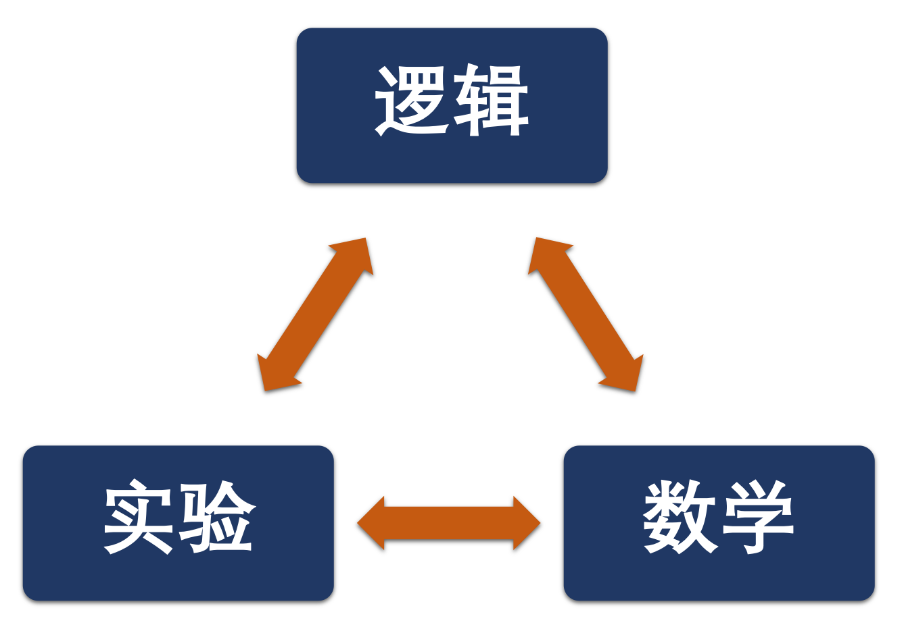
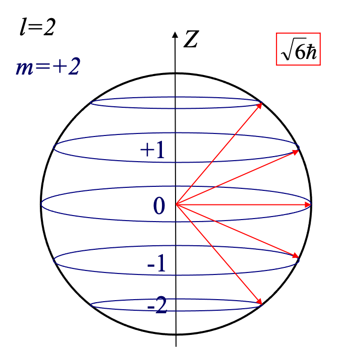
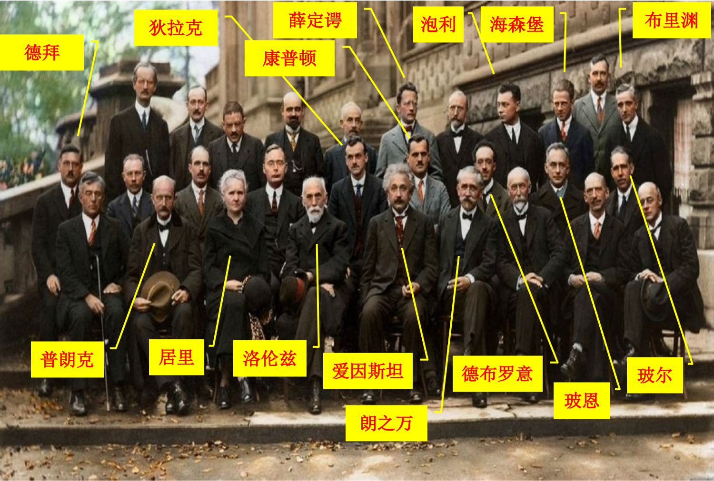

## **
  量子力学与统计物理  
**

  Quantum mechanics and statistical physics  

 
 

**
李小飞**  @ 光电科学与工程学院

 

 2023-03-01  

<!-- .slide: data-background="QM-beamer/images/uestclogo-1.png" data-background-opacity="1.0"-->

---

### **前情回顾** 

 

- 波粒二象性
- 波函数假说
- 波函数的统计解释
- 态叠加原理
- 薛定谔方程

--

###  量子力学基本原理**
 
- [x] 波函数公设：微观体系的状态由希尔伯特空间的一个波函数（态矢量）完全描述 

- [x] 演化公设：态矢量随时间的演化服从薛定谔方程

- [ ] 算符公设：微观体系的物理量由希尔伯特空间的厄密算符表示

- [ ] 对易公设：位置算符与正则动量算符之间存在对易关系

    $$ [X_\alpha, P_\beta] = i \bar{h} \delta_{\alpha \beta} $$

- [ ] 全同粒子公设： 全同粒子体系的状态具有交换不变性

---

# 第三章 量子力学中的力学量

--

###  学习方法的转变

- 前面两章，我们回到了量子力学建立的时代，跟随大家的脚步，直面大量**实验**，进行深入分析和**逻辑**思辨，获得了量子力学的一些知识，并对前两大公设有了较为基本的认识。
 
- 从现在开始，我们将基于**数学**建立起严格的量子力学体系

---

## 第一讲 力学量表示

--

###   1. 希尔伯特空间与第一公设

--

 
#### 加法，数乘和内积  

`\begin{aligned}
 \text{1、定义加法} \quad  &\xi=\psi+\varphi\\
  &\psi+\varphi=\varphi+\psi \qquad (\text{交换律})\\
  &(\psi+\varphi)+\xi=\psi+(\varphi+\xi) \qquad (\text{合律})\\  &\psi+\text{O}= \psi \qquad (\text{零元})\\
  &\psi+\varphi= \text{O} \qquad (\text{逆元})
\end{aligned}`{class="fragment"}

--

`
\[
\begin{aligned}
\text{2、定义数乘} \quad &\varphi=\psi a\\
&\psi 1= \psi \qquad (\text{1元})\\
&(\psi a)b=\psi (ab) \qquad (\text{结合律})\\
&\psi(a+b)= \psi a+ \psi b \qquad (\text{第一分配律})\\
&(\psi+\varphi) a = \psi a +\varphi a \qquad (\text{第二律}) \\
\text{3、定义内积} \quad &(\psi, \varphi)=c \\
 &(\varphi,\psi)= c^*
\end{aligned}
\]
`{class="fragment"}

--

$\color{#FFA500}{\text{例-1：}}$  对于定义在3维矢量空间的两矢量，求它们的内积{class="fragment"}

$$\psi=x_1\vec{i}+y_1\vec{j}+z_1\vec{k}, \qquad \varphi=x_2\vec{i}+y_2\vec{j}+z_2\vec{k}$${class="fragment"}

$\color{#FFA500}{\text{解：}}$ 这是实空间 $$(\psi, \varphi) = \psi \cdot \varphi= x_1x_2+y_1y_2+z_1z_2=c $$ {class="fragment"}

$$(\varphi, \psi) = (\psi, \varphi)^* = c^* = c $$ {class="fragment"}

--

`$\color{#FFA500}{\text{例-2：}}$ 有定义在$C^3$空间的列矩阵，求内积
\[\psi=
        \begin{pmatrix}
                a_1\\
                a_2\\
                a_3
        \end{pmatrix}, \qquad 
        \varphi =\begin{pmatrix}
            b_1\\
            b_2\\
            b_3
    \end{pmatrix}
\]`{class="fragment"}

`$\color{#FFA500}{\text{解：}}$  
\[(\psi, \varphi) = \begin{pmatrix}
        a_1 ^* &
        a_2 ^* &
        a_3 ^*
    \end{pmatrix}
        \begin{pmatrix}
        b_1\\
        b_2\\
        b_3
    \end{pmatrix}
    =a_1 ^* b_1 +a_2 ^* b_2 +a_3 ^* b_3
    =c 
    \]`{class="fragment"}

`\[(\varphi,\psi) = \begin{pmatrix}
        b_1 ^* &
        b_2 ^* &
        b_3 ^*
    \end{pmatrix}
        \begin{pmatrix}
        a_1\\
        a_2\\
        a_3
    \end{pmatrix}
    =b_1 ^* a_1 +b_2 ^* a_2 +b_3 ^* a_3
    =c^* 
\]`{class="fragment"}

--

$\color{#FFA500}{\text{例-3：}}$  求定义在实空间的两函数的内积 {class="fragment"}

`\[\psi(x)=\sin nx, \varphi(x)=\sin mx\]`{class="fragment"}

`$\color{#FFA500}{\text{解：}}$
\[(\psi, \varphi)=\int_{-l} ^{l} \sin(nx) \sin(mx) dx=\begin{cases}
         0, \qquad n\neq m \\
        \dfrac{l}{2} , \qquad n=m
    \end{cases}
\]`{class="fragment"}

--

$\color{#FFA500}{\text{例-4：}}$ 求定义在复数空间的两函数的内积 {class="fragment"}

$\color{#FFA500}{\text{解：}}${class="fragment"}

`\[(\psi, \varphi)=\int_a ^b \psi^*(x)  \varphi(x) dx=c\]
\[(\varphi,\psi)=\int_a ^b \varphi^*(x)\psi(x) dx = (\int_a ^b \varphi(x)\psi^*(x) dx) ^* =c^*\]`{class="fragment"}

这正好是量子力学里的计算！{class="fragment"}

--

####  内积的性质：{class="fragment"}

`\[(\psi, \varphi)= (\varphi,\psi)^* \]
    \[(\psi, \varphi+\xi)= (\psi, \varphi) + (\psi, \xi)\qquad (\text{分配律})\]
    \[(\psi, \varphi a)= (\psi, \varphi )a \]
    \[(\psi a, \varphi )= (\psi, \varphi )a^* \]    
    \[(\Psi,c_1\psi_1+c_2\psi_2)=(\Psi,c_1\psi_1)+(\Psi,c_2\psi_2)\]
\[(\psi,\psi)= c\ge 0\]`{class="fragment"}

--

####  左矢与右矢： {class="fragment"}

考察内积：{class="fragment"}

$$(\psi,\psi) = \int \psi^* \psi d \tau $$ {class="fragment"}

同一波函数放在左边还是右边，意义不同{class="fragment"}

右边是线性的而左边是反线性的：  
$$(\psi, a \psi)= a (\psi,\psi)$$ 
$$(a\psi, \psi)= a^* (\psi, \psi)$${class="fragment"}

为了清楚地描述这种线性反线性特点，定义**左矢**和**右矢**
$$\langle \psi |, \qquad |\psi \rangle $$  {class="fragment"}

--

则内积可写成：
$$(\psi,\varphi)\equiv \langle \psi | \varphi \rangle $$ {class="fragment"}

线性与反线性:
$$\langle a\psi | = \langle \psi |a^* ,\qquad |a\psi \rangle = a|\psi \rangle$$ {class="fragment"}

这种记号，称为 Dirac (迪拉克) 记号 {class="fragment"}

--

#### 常见空间的定义 {class="fragment"}

- 矢量空间：满足加法和数乘两种运算的集合 {class="fragment"}

- 内积空间：满足加法、数乘和内积三种运算的集合 {class="fragment"}
  
- 希尔伯特空间:  完全的内积空间 {class="fragment"}
  

*完全性：对于给定的任意小实数$\varepsilon$，总有数N存在，当 $ m, n>N $ 时，下式成立
$$ (\psi_m -\psi_n, \psi_m -\psi_n )< \varepsilon $${class="fragment"}

--

####  理解第一公设 {class="fragment"}

- 查看我们以前学习的波函数，它恰好可进行加法、数乘和内积三种运算。{class="fragment"}

- 因此，所有状态的波函数构成的集合是一个希尔伯特空间。{class="fragment"}
  
- 这正是量子力学第一公设：{class="fragment"}

 

$\color{#FFA500}{\text{微观体系的状态用希尔伯特空间的（波函数）态矢量描述：}}$  {class="fragment"}

---

###  2. 算符代数

--

#### 算符的定义  {class="fragment"}

描述希尔伯特空间矢量之间的映射关系的记号。{class="fragment"}

- 算符作用于一个态矢量，将映射到另一个态矢量。
    $$\hat{F} |\Psi \rangle = |\varphi \rangle $$ {class="fragment"}
 
$\color{#FFA500}{\text{Tips:}}$ 不引起不明意义时，可略上面的帽子 {class="fragment"}

--

####  算符的运算 {class="fragment"}

**(1) 算符相等**  {class="fragment"}

对任意波函数$\Psi$ ，有
$$ A\Psi=B\Psi \implies A=B $$ {class="fragment"}

**(2) 算符的和** {class="fragment"}

$$ (A+B)\Psi=A\Psi+B\Psi $$ {class="fragment"}

- 交换律 {class="fragment"}

$$A+B=B+A$$ {class="fragment"}

- 结合律 {class="fragment"}

$$ (A+B)+C=A+(B+C)$$ {class="fragment"}

--

**(3) 算符的积** {class="fragment"}

$$ (AB)\Psi=A(B\Psi) $$ {class="fragment"}

- 交换律不成立 {class="fragment"}

>即 $AB=BA$ 或 $AB\ne BA$ 都可能 {class="fragment"}

- 对易子 {class="fragment"}

$$ [A,B]\equiv AB-BA$$ {class="fragment"}

若$[A,B]=0$ {class="fragment"}

称两算符对易，否则不对易 {class="fragment"}

--

**(4) 逆算符** {class="fragment"}

$$ F|\Psi> = |\psi> $$
$$ F^{-1}|\psi> = |\Psi> $$ {class="fragment"}

**(5) 伴算符** {class="fragment"}
        
$$ F|\Psi> = |\psi> $$
$$ <\psi| = <\Psi| F^{\dagger} $$ {class="fragment"}
        
- 伴算符的内积形式：{class="fragment"}

$$ (\varphi,F\Psi)=(\varphi,\psi)$$ 
$$ (F^\dagger \Psi,\varphi)=(\psi,\varphi)$$ {class="fragment"}

--

**(6) 自伴算符** {class="fragment"}
 
$$ F^{\dagger} = F $$ {class="fragment"}
        
- 性质：{class="fragment"}

$$ (\Psi, F \psi) = (F \Psi, \psi)$$  
$$<\Psi|F^{\dagger}|\psi> = (<\psi|F|\Psi>)^* $$ {class="fragment"}

自伴性也称厄密性，**自伴算符** = **厄密算符** {class="fragment"}

--

**(7) 幺正(酉)算符**  {class="fragment"}  

$$ F^{\dagger}F = FF^{\dagger}=I $${class="fragment"}

- 性质：{class="fragment"}

$$ F^{\dagger} = F^{-1} $$ {class="fragment"}
     
$\color{#FFA500}{\text{Tips:}}$  厄密算符: $ F=F^{\dagger}$ ， 幺正算符: $ F^{-1} = F^{\dagger}$ ，幺正厄密算符：$ F = F^{-1} = F^{\dagger}$ {class="fragment"}

 

 
**(8) 线性算符** {class="fragment"}

对任意两函数，有{class="fragment"}
        
$$F(c_1\psi_1+c_2\psi_2 ) = c_1(F\psi_1)+c_2(F\psi_2 )$$ {class="fragment"}

--

**(8) 算符的本征方程** {.fragment .fade-up} 

$$ F |\psi> = f |\psi> $$ {.fragment .fade-up} 

称 $f$ 是算符$F$的本征值，$\psi$是算符$F$属于本征值$f$的本征函数 {.fragment .fade-up} 

- 比如： 定态薛定谔方程就是哈密顿算符的本征方程 {.fragment .fade-up} 

$$ H |\psi> = E |\psi> $$ {.fragment .fade-up} 

- 解所有力学量算符的本征方程，就可以得到体系的所有物理量的可能值。{.fragment .fade-up}
  
因此，$\color{#FFA500}{\text{微观体系的物理量由希尔伯特空间的\`厄密\`算符表示}}$  {.fragment .fade-up}

---

###  3. 力学量算符的获得 

--

####  位置与动量算符

$\color{#FFA500}{\text{例-5：}}$ 已知粒子的位置波函数$\psi(x,t)$，求位置和动量的平均值{class="fragment"}

$\color{#FFA500}{\text{解：}}$ 根据统计解释，位置的平均值为： {class="fragment"}

`\begin{aligned}
\overline{x} & = \int x | \psi(x, t) | ^{2} d x \\ 
 &= \int \psi^* (x, t) x \psi(x, t) d x
\end{aligned}`{class="fragment"}

若已知动量波函数 $c(p_x,t)$, 动量期望值为： {class="fragment"}

$$\overline{p}_x=\int c^*(p_x, t) p c(p_x, t) d p_x$$ {class="fragment"}

--

- 但现在动量波函数未知! 可考虑傅里叶变换 {class="fragment"}  

` 
\[\begin{equation*}
        \begin{split}
            \overline{p}&=\int c^{*}(p) p c(p) d p \\  
            &=\int (\frac{1}{\sqrt{2 \pi \hbar}} \int \psi^{*}(x) e^{\frac{i}{\hbar} p\cdot x} d x) p c\left(p\right) d p \\
            &=\frac{1}{\sqrt{2 \pi \hbar}} \int \int \psi^{*}(x) {\color{red}{(e^{\frac{i}{\hbar} p\cdot x}  p)}} c\left(p\right) d xd p \\
            &=\frac{1}{\sqrt{2 \pi \hbar}} \int \int \psi^{*}(x) {\color{red}{(-i\hbar\frac{d}{d x} e^{\frac{i}{\hbar} p\cdot x}})} c(p) d xd p \\
            &=\int \psi^{*}(x) (-i\hbar\frac{d}{d x}) [\frac{1}{\sqrt{2 \pi \hbar}} \int e^{\frac{i}{\hbar} p\cdot x} c(p) d p]  d x\\
         \end{split}
\end{equation*}\]  
` {class="fragment"}

--

- 再变换回来， 得
$$\overline{p} =\int \psi^{*}(x) (-i\hbar\frac{d}{d x}) \psi(x)  d x$$ {class="fragment"}

- 现定义计算符号   
$$ \hat{p}_x = -i \hbar \frac{d}{dx}, \qquad \to \qquad \hat{\vec{p}} = -i \hbar \nabla  $$  {class="fragment"}

- 原式可写成         
$$\overline{p}_x=\int \psi^{*}(x) \hat{p}_x \psi(x) d x $$ {class="fragment"}
  

--

- 称 $\hat{\vec{p}} = -i \hbar \nabla $ 是位置空间（表象）中的动量算符 {class="fragment"}
  
- 对于任意力学量F，若存在算符$\hat{F}$， {class="fragment"}

则其期望值为：
  $$\overline{F}=\int \psi^{*}(x) \hat{F} \psi(x) d x $$ {class="fragment"}

- 很明显： $$ \hat{\vec{r}} = \vec{r}$$ {class="fragment"}

- 这样，我们得到了位置和动量的算符表示

---

####  任意算符的获得

$\color{red}{命题：}$ 如何获得任意力学量F的算符 $\hat F$ {class="fragment"}

$\color{red}{方案：}$
我们已知位置算符和动量算符：{class="fragment"}

`
\begin{cases}
\hat{\vec{r}} = \vec{r} \\
\hat{\vec{p}} =-i\hbar(\dfrac{d}{d x}\vec{i}+ \dfrac{d}{d y}\vec{j} + \dfrac{d}{d z}\vec{k})=-i\hbar \nabla
\end{cases} 
` {class="fragment"}

我们也知道经典物理学力学量, 可表示成位置和动量的函数：$$F(\vec{r},\vec{p})$$，{class="fragment"}

- Bohm规则（1954)：$$ \hat{F}=F(\hat{\vec{r}},\hat{\vec{p}})$$ {class="fragment"}

--

例如：动能 $ T=\dfrac{p^2}{2\mu} \implies   \hat{T}= \dfrac{\hat{p}^2}{2\mu} $ {.fragment .fade-up} 

哈密顿量： $ H=T+U(\vec{r} )\implies \hat{H}= \hat{T}+ U(\hat{\vec{r}})$ {.fragment .fade-up} 

角动量：$ \vec{L}=\vec{r}\times\vec{p} \implies \hat{\vec{L}}=\hat{\vec{r}}\times \hat{\vec{p}}$ {.fragment .fade-up} 

--

$\color{red}{Tips:}$  若 $F(\vec{r},\vec{p})$ 含 $(\vec{r}^m \cdot \vec{p}^n)$ 项，则进行特殊处理 {.fragment .fade-up}   

对于连乘项 
`\[\vec{r}^m\cdot\vec{p}^n\]` {.fragment .fade-up}   

采用如下方式进行取代
`\[\frac{1}{2}(\hat{\vec{r}}^m\cdot\hat{\vec{p}}^n+\hat{\vec{p}}^n\cdot\hat{\vec{r}}^m)\]` {.fragment .fade-up}   

- 经典物理学不具备的力学量，算符在量子力学中自行定义 {.fragment .fade-up} 
  
比如：自旋（S），宇称（P），$\dots$ {.fragment .fade-up} 

--

$\color{#FFA500}{\text{例：}}$ 求经典物理量$F=x^2p_x$的量子力学算符表示
 
$\color{#FFA500}{\text{解：}}$  根据Bohm规则，有：
`\[\begin{aligned}
        \hat{F}=\frac{1}{2} (\hat{x}^2 \hat{p}_x + \hat{p}_x \hat{x}^2 ) 
\end{aligned}\]` {.fragment .fade-up} 

--

<!-- .slide: data-background="QM-beamer/images/uestclogo-8.png" data-background-opacity="1.0"-->

# 
  A & Q 

---

###  作 业
   
1. 试指出下列哪些算符是线性算符，哪些是厄密算符？并说明理由

   $$ 4 x^2 \frac{d^2} {dx^2}, [~]^2, \sum_{k=1}^n,  \frac{d}{dx}, i\frac{d}{dx}, 4\frac{d^2}{d x^2}$$ 

2. 试证明处于定态的粒子的动量平均值不随时间变化
   
3. 设氢原子处于基态$\psi_{100}$,求径向位置r,动量和动能的平均值.

---

## 第二、三讲 力学量算符的特点

--

###   1. 所有可观测力学量算符是线性厄密算符

--

$\color{#FFA500}{命题-1:}$ 所有可观测力学量算符都是线性算符 {.fragment .fade-up}  

$\color{#FFA500}{证明:}$ 设$\psi_1, \psi_2$ 是算符$\hat{F}$的属于本征值$f$的两个本征函数 {.fragment .fade-up} 

$$\hat{F}\psi_1=f\psi_1, \to c_1\hat{F}\psi_1=c_1f\psi_1 $$
{.fragment .fade-up} 

$$\hat{F}\psi_2=f\psi_2, \to c_2\hat{F}\psi_2=c_2f\psi_2 $$
{.fragment .fade-up} 

$$f(c_1\psi_1+c_2\psi_2)=c_1\hat{F}\psi_1+c_2\hat{F}\psi_2$$
{.fragment .fade-up} 

$$\hat{F}(c_1\psi_1+c_2\psi_2)=c_1\hat{F}\psi_1+c_2\hat{F}\psi_2$$
{.fragment .fade-up} 

证毕！{.fragment .fade-up} 

--

$\color{#FFA500}{命题-2:}$ 所有可观测力学量算符都是厄密算符   {.fragment .fade-up} 

$\color{#FFA500}{证明:}$ 对任意态$\Psi$, 可观测$\hat{F}$的平均值是实数， 有： 
$$(\Psi,\hat{F}\Psi)=(\hat{F} \Psi, \Psi) $$ {.fragment .fade-up} 

取 $\Psi= \psi_1+c\psi_2 $, 得：{.fragment .fade-up} 

`
\[ ([\psi_1+c\psi_2],\hat{F} [\psi_1+c\psi_2])=(\hat{F}[\psi_1+c\psi_2],[\psi_1+c\psi_2])
\] 
`{.fragment .fade-up} 

` 
\[\begin{equation*}
    \begin{split}
    &\left( \psi_{1}, \hat{F} \psi_{1} \right) + c^{*} \left( \psi_{2}, \hat{F} \psi_{1} \right)+ c \left( \psi_{1}, \hat{F} \psi_{2} \right)+ |c|^{2} \left( \psi_{2}, \hat{F} \psi_{2} \right)= \\
    & \left( \hat{F} \psi_{1}, \psi_{1} \right) +c^{*} \left( \hat{F} \psi_{2}, \psi_{1} \right)+ c \left( \hat{F} \psi_{1}, \psi_{2} \right) + |c|^{2} \left( \hat{F} \psi_{2}, \psi_{2} \right)
    \end{split}  
\end{equation*} \]
` {.fragment .fade-up} 

--

由于平均值都是实数，有 
$$(\psi_1,\hat{F}\psi_1)=(\hat{F} \psi_1, \psi_1), \quad (\psi_2,\hat{F}\psi_2)=(\hat{F} \psi_2, \psi_2) $$ {.fragment .fade-up} 

消去第一、四项，得：
$$ c^{\*} \left( \psi_{2}, \hat{F} \psi_{1}\right)+c\left(\psi_{1}, \hat{F} \psi_{2}\right) = c^{*} \left( \hat{F} \psi_{2}, \psi_{1} \right) + c \left( \hat{F} \psi_{1}, \psi_{2} \right)$$ {.fragment .fade-up} 

取$c=1$得：
$$  \left(\psi_{2}, \hat{F} \psi_{1}\right)+\left(\psi_{1}, \hat{F} \psi_{2}\right) = \left(\hat{F} \psi_{2}, \psi_{1}\right)+\left(\hat{F} \psi_{1}, \psi_{2}\right) , \cdots (1)$$ {.fragment .fade-up} 

--

取 $c=i$，得：
$$-i\left(\psi_{2}, \hat{F} \psi_{1}\right)+i\left(\psi_{1}, \hat{F} \psi_{2}\right) =-i\left(\hat{F} \psi_{2}, \psi_{1}\right)+i\left(\hat{F} \psi_{1}, \psi_{2}\right)$$ {.fragment .fade-up} 

乘以$i$，得：
$$\left(\psi_{2}, \hat{F} \psi_{1}\right)-\left(\psi_{1}, \hat{F} \psi_{2}\right) =\left(\hat{F} \psi_{2}, \psi_{1}\right)-\left(\hat{F} \psi_{1}, \psi_{2}\right), \cdots (2) $$ {.fragment .fade-up} 

(1)+(2)，并同除以2，得 
$$\left(\psi_{2}, \hat{F} \psi_{1}\right) =\left(\hat{F} \psi_{2}, \psi_{1}\right)$$ {.fragment .fade-up} 

证毕！ {.fragment .fade-up} 
   

--

###  量子力学基本原理
 
- [x] 波函数公设：微观体系的状态由希尔伯特空间的一个波函数（态矢量）完全描述 

- [x] 演化公设：态矢量随时间的演化服从薛定谔方程

- [x] 算符公设：微观体系的物理量由希尔伯特空间的**厄密算符**表示

- [ ] 对易公设：位置算符与正则动量算符之间存在对易关系  

  $$ [X_i, P_j] = i \bar{h} \delta_{ij} $$ 

- [ ] 全同粒子公设： 全同粒子体系的状态具有交换不变性

---

###  2、厄密算符的性质

---

####   厄密算符的运算性质

- 两厄米算符之和仍为厄米算符
- 当且仅当两厄米算符对易时，它们之积才是厄米算符。
- 无论两厄米算符是否对易，算符$\dfrac{1}{2}(AB+BA)$ 及$\dfrac{1}{2i}(AB-BA) $  都是厄米算符。
- 任意算符总可以分解成$A=A_+ + iA_-$，且$A_+$和$A_-$都是厄米算符

--

$\color{#FFA500}{命题:}$ 1. 试证明两厄米算符之和仍为厄米算符 

$\color{#FFA500}{证明:}$ 设A，B为厄米算符，对于任意态，有
$$(\psi, A\psi ) = (A\psi, \psi), \qquad (\psi, B\psi ) = (B\psi, \psi)$$

它们的和： 
`
\begin{equation*}
        \begin{split}
            (\psi, (A+B)\psi ) &= (\psi, A\psi ) + (\psi, B\psi ) \\  
            &=(A\psi, \psi ) + (B\psi, \psi ) \\
            &=((A+B)\psi, \psi ) 
         \end{split}
\end{equation*}
`  
证毕！
  

--

$\color{#FFA500}{命题:}$ 2、当且仅当两厄米算符对易时，它们之积才是厄米算符。

$\color{#FFA500}{证明:}$ 设A，B为厄米算符，对于任意态，有
`
\begin{equation*}
        \begin{split}
            (\psi, (AB)\psi ) &= (\psi, A(B\psi) ) \\  
            &=((A \psi), (B\psi) )  \\
            &=(B(A \psi), \psi )  \\
            &=( (BA) \psi, \psi )  \\
            &=( (AB) \psi, \psi )  \\
         \end{split}
\end{equation*} 
`
证毕！
   

--

$\color{#FFA500}{命题:}$ 3、无论两厄米算符A和B是否对易，算符$\dfrac{1}{2}(AB+BA)$ 及 $\dfrac{1}{2i}(AB-BA) $ 都是厄米算符

$\color{#FFA500}{证明:}$ 设A，B为厄米算符，对于任意态，有
`
\begin{equation*}
        \begin{split}
            (\psi, \dfrac{1}{2}(AB+BA)\psi ) &=\dfrac{1}{2}(\psi, AB\psi) + \dfrac{1}{2}(\psi, BA\psi)  \\
            &=\dfrac{1}{2}(A\psi, B\psi) + \dfrac{1}{2}(B\psi, A\psi)  \\
            &=\dfrac{1}{2}(BA\psi, \psi) + \dfrac{1}{2}(AB\psi, \psi)  \\
            &=\dfrac{1}{2}((BA+AB)\psi, \psi) \\
            &=(\dfrac{1}{2}(BA+AB)\psi, \psi) \\
            &=(\dfrac{1}{2}(AB+BA)\psi, \psi) 
         \end{split}
    \end{equation*} 
`

--

`
\begin{equation*}
        \begin{split}
            (\psi, \dfrac{1}{2i}(AB-BA)\psi ) &= (\psi, \dfrac{1}{2i}AB\psi) - (\psi, \dfrac{1}{2i}BA\psi)\\  
            &=\dfrac{1}{2i}(\psi, AB\psi) - \dfrac{1}{2i}(\psi, BA\psi)  \\
            &=\dfrac{1}{2i}(A\psi, B\psi) - \dfrac{1}{2i}(B\psi, A\psi)  \\
            &=\dfrac{1}{2i}(BA\psi, \psi) - \dfrac{1}{2i}(AB\psi, \psi)  \\
            &=-(\dfrac{1}{2i}BA\psi, \psi) +(\dfrac{1}{2i}AB\psi, \psi)  \\
            &=(\dfrac{1}{2i}(AB-BA)\psi, \psi) \\
         \end{split}
    \end{equation*} 
` 

证毕！
   

--

$\color{#FFA500}{命题:}$ 4、任意算符总可以分解成$A=A_+ +iA_-$，且$A_+$和$A_-$，都是厄米算符

$\color{#FFA500}{证明:}$ 令：
$$A_+=\dfrac{1}{2} (A+A^+), \qquad A_+=\dfrac{1}{2i} (A-A^+) $$

总有$A=A_+ +iA_-$, 

问题转化为求证$\dfrac{1}{2} (A+A^+), \dfrac{1}{2i} (A-A^+) $是厄米算符

--

`
\begin{equation*}
        \begin{split}
            (\psi, \dfrac{1}{2} (A+A^+)\psi ) &=\dfrac{1}{2}(\psi, (A)\psi) + \dfrac{1}{2}(\psi, (A^+)\psi) \\
            &= \dfrac{1}{2}((A^+)\psi, \psi) + \dfrac{1}{2}((A^+)^+\psi, \psi) \\
            &= \dfrac{1}{2}((A^+)\psi, \psi) + \dfrac{1}{2}(A\psi, \psi) \\
            &= \dfrac{1}{2}( (A^+ + A) \psi, \psi ) \\
            &=( \dfrac{1}{2}(A+A^+) \psi, \psi ) 
         \end{split}
\end{equation*}  
`

证毕！

---

#### 厄密算符的本征性质

- 厄米算符的本征值为实数
- 任意态下平均值为实数的算符必为厄米算符
- 厄米算符属于不同本征值的本征函数正交
- 简并的本征函数可通过重组变得正交
- 厄米算符的本征函数系具有完备性
- 厄米算符的本征函数系具有封闭性

  

--

$\color{#FFA500}{命题:}$ 1、试证明厄米算符的本征值为实数

$\color{#FFA500}{证明:}$ 设A为厄米算符，有如下本征方程
    $$A\psi=a\psi $$

$$\begin{equation*}
    (\psi, A\psi)=(\psi, a\psi)=a(\psi, \psi)
\end{equation*}$$  

由厄米性，有：
\begin{equation*}
    (\psi, A\psi)=(A\psi, \psi)=(a\psi, \psi)= a^* (\psi, \psi)
\end{equation*}

因此：
\begin{equation*}
    a(\psi, \psi)= a^* (\psi, \psi)
\end{equation*}

所以，本征值 a必为实数， 证毕！
  

--

$\color{#FFA500}{命题:}$ 2、任意态下平均值为实数的算符必为厄米算符

$\color{#FFA500}{证明:}$任意态$\Psi$下，F的平均值
$$(\Psi,F\Psi)=\bar{F}=\bar{F}^* = (\Psi,F\Psi)^* = (F\Psi,\Psi), \qquad (1) $$

令 $\Psi= \psi_1+c\psi_2 $, 代入上式，得：
$$([\psi_1+c\psi_2],F [\psi_1+c\psi_2])=$$
$$(F[\psi_1+c\psi_2],[\psi_1+c\psi_2]) $$

`
\begin{array}{r}
    \left(\psi_{1}, F \psi_{1}\right)+c^{*}\left(\psi_{2}, F \psi_{1}\right)+c\left(\psi_{1}, F \psi_{2}\right)+|c|^{2}\left(\psi_{2}, \hat{F} \psi_{2}\right) \\
    =\left(F \psi_{1}, \psi_{1}\right)+c^{*}\left(F \psi_{2}, \psi_{1}\right)+c\left(F \psi_{1}, \psi_{2}\right)+|c|^{2}\left(\hat{F} \psi_{2}, \psi_{2}\right)
\end{array}
`

--

由（1）式，有： 
$$(\psi_1,F\psi_1)=(F \psi_1, \psi_1), \quad (\psi_2,F\psi_2)=(F \psi_2, \psi_2) $$

可消去上式第一、四项：

`\begin{array}{r}
        c^{*}\left(\psi_{2}, F \psi_{1}\right)+c\left(\psi_{1}, F \psi_{2}\right) \\
        =c^{*}\left(F \psi_{2}, \psi_{1}\right)+c\left(F \psi_{1}, \psi_{2}\right)
\end{array}
`
取$c=1$，
$$  \left(\psi_{2}, F \psi_{1}\right)+\left(\psi_{1}, F \psi_{2}\right) = \left(\hat{F} \psi_{2}, \psi_{1}\right)+\left(\hat{F} \psi_{1}, \psi_{2}\right) , \cdots (2) $$

--

取$c=i$，
$$-i\left(\psi_{2}, F \psi_{1}\right)+i\left(\psi_{1}, F \psi_{2}\right) =-i\left(\hat{F} \psi_{2}, \psi_{1}\right)+i\left(F \psi_{1}, \psi_{2}\right)$$

上式乘以$i$,得：
$$\left(\psi_{2}, F \psi_{1}\right)-\left(\psi_{1}, F \psi_{2}\right) 
=\left(\hat{F} \psi_{2}, \psi_{1}\right)-\left(F \psi_{1}, \psi_{2}\right), \cdots (3)$$

(2)+(3),并两边同除以2，得
$$\left(\psi_{2}, F \psi_{1}\right) =\left(F \psi_{2}, \psi_{1}\right)$$

证毕！
  

--

$\color{#FFA500}{命题:}$ 3、试证厄米算符属于不同本征值的本征函数正交

$\color{#FFA500}{证明:}$ 设 $\psi_a , \psi_b $ 分别是属于本征值a、b的本征函数

`   
\begin{equation*}
(\psi_a, A\psi_b)=(\psi_a, b\psi_b)=b(\psi_a, \psi_b)
\end{equation*}
` 

由厄米性，有：
`
\begin{equation*}
(\psi_a, A\psi_b)=(A\psi_a, \psi_b)=a(\psi_a, \psi_b)
\end{equation*}
`

由于$a\neq b$,有
$$\begin{equation*}
(\psi_a, \psi_b)=0
\end{equation*}$$

证毕！
  

--

  
  设$\psi_n$、$\psi_m$都是厄米算符A的本征函数

1. 归一性：
    $$\begin{equation*}
        (\psi_n, \psi_m)=1, \qquad (n=m)
    \end{equation*} $$ 
2. 正交性：
    $$\begin{equation*}
        (\psi_n, \psi_m)=1, \qquad (n\neq m)
    \end{equation*}$$
若定义$\delta$函数:
`
\begin{equation*}
        \delta_{n m}= 
        \begin{cases}1, & n=m \\ 
            0, & n \neq m
        \end{cases}
        \end{equation*}
`

--

#### 厄密算符本征函数的正交归一性

$$\begin{equation*}
(\psi_n, \psi_m)=\delta_{nm}
\end{equation*}$$
  

--

  
$\color{#FFA500}{命题:}$ 4、简并的本征函数可通过重组变得正交

$\color{#FFA500}{证明:}$ 设厄米算符A属于本征值a的本征函数有f个

$$\begin{equation*}
        A\psi_{na}=a\psi_{na}, \quad (n=1,2,3,\cdots, f)
\end{equation*}$$

由这f个函数构成线性叠加态
$$\begin{equation*}
\Psi_a=\sum_{n=1}^{f} c_n \psi_{na} \qquad (n=1,2,3,\cdots, f)
\end{equation*}$$

取f个这样的叠加态
$$\begin{equation*}
    \Psi_{\beta a}=\sum_{n=1}^{f} c_{\beta n} \psi_{na} \qquad (\beta=1,2,3,\cdots, f)
\end{equation*}$$

--

$$\begin{equation*}
        A\Psi_{\beta a}=\sum_{n=1}^{f} c_{\beta n} A\psi_{na} =a \Psi_{\beta a}
\end{equation*}$$

表明这些叠加态也是属于本征值a的本征函数。

选择系数$c_{\beta n}$，让这f个新的本征态正交归一
$$\begin{equation*}
(\Psi_{\beta a}, \Psi_{\beta' a})=\delta_{\beta\beta'}
\end{equation*}$$

正交式 $\dfrac{1}{2}f(f-1)$，归一式 $f$，系数$c_{\beta n}$：$f^2$

总有：$ f^2\le \dfrac{1}{2}f(f-1)+f$，即总可找到一组$c_{\beta n}$,满足正交归一化条件。
  

--

$\color{#FFA500}{例:}$ 试采用Schmidt正交化方案使能量E的三个简并函数（$\Psi_1, \Psi_2, \Psi_3$）正交
    
$\color{#FFA500}{解:} $取$\psi_1=\dfrac{\Psi_1}{(\Psi_1, \Psi_1)}$

设 $\psi_2'=\Psi_2-(\psi_1, \Psi_2)\psi_1$

$$\begin{equation*}
    (\psi_1, \psi_2')=(\psi_1, \Psi_2)-(\psi_1, \Psi_2)(\psi_1, \psi_1)=0
\end{equation*}$$

取$\psi_2=\dfrac{\psi_2'}{(\psi_2', \psi_2')}$

设 $\psi_3'=\Psi_3-(\psi_1, \Psi_3)\psi_1-(\psi_2, \Psi_3)\psi_2$

--

$$\begin{equation*}
    (\psi_1, \psi_3')=(\psi_1, \Psi_3)-(\psi_1, \Psi_3)(\psi_1, \psi_1)-(\psi_2, \Psi_3)(\psi_1, \psi_2)=0
\end{equation*}$$

$$\begin{equation*}
        (\psi_2, \psi_3')=(\psi_2, \Psi_3)-(\psi_1, \Psi_3)(\psi_2, \psi_1)-(\psi_2, \Psi_3)(\psi_2, \psi_2)=0
\end{equation*}$$

取$\psi_3=\dfrac{\psi_3'}{(\psi_3', \psi_3')}$

则$\psi_1, \psi_2, \psi_3$构成正交归一化组。

--

现在求它们的本征值$\dots$

$$ H\psi_1= H \dfrac{\Psi_1}{(\Psi_1, \Psi_1)} =  \dfrac{E\Psi_1}{(\Psi_1, \Psi_1)} = E \psi_1$$

$$ H\psi_2= H \dfrac{\Psi_2-(\psi_1, \Psi_2)\psi_1}{(\psi_2', \psi_2')} =  \dfrac{H\Psi_2-(\psi_1, \Psi_2)H\psi_1}{(\psi_2', \psi_2')}=E\psi_2$$

同理，有$ H\psi_3=E\psi_3$
    
说明它们依然是简并的！
  

--

$\color{#FFA500}{命题:}$ 5、厄米算符的本征函数系具有完备性

$\color{#FFA500}{完备性定义:}$：设体系的厄米算符A具有本征方程
$$\begin{equation*}
    A\psi_{n}=a_n\psi_{n}, 
\end{equation*}$$ 
则这个体系的任意态函数都可以A的本征函数系上展开
$$\begin{equation*}
        \Psi=\sum_n c_n \psi_{n} \qquad (n=1,2,3,\cdots)
\end{equation*}$$
这种性质称为本征函数系的完备性。

完备性证明： 见文献《厄米算符本征函数完备性的一般证明》，大学物理，2012, 31(9): 16-19.

--

$\color{#FFA500}{命题:}$试证明展开系数就是态矢量在对应本征基矢上的投影

$\color{#FFA500}{证明:}$$c_n=\sum_m c_m\delta_{nm} $
$$= \sum_m c_m(\psi_n, \psi_m)$$
$$= (\psi_n, \sum_m c_m\psi_m) $$
$$=(\psi_n, \Psi)$$

--

$\color{#FFA500}{命题:}$试证明展开系数的模方$|c_n|^2$就是测得本征值$a_n$的概率

$\color{#FFA500}{证明:}

`
    \begin{equation*}
        \begin{split}
            \bar{A}&=(\Psi, A\Psi)=(\Psi, A\sum_n c_n \psi_{n})=(\Psi, \sum_n c_n A\psi_{n})\\
            &=(\sum_m c_m \psi_{m}, \sum_n c_n a_n \psi_{n})\\
            &=\sum_{m,n} c_m^* c_n a_n (\psi_m, \psi_n)\\
            &=\sum_{m,n} c_m^* c_n a_n \delta_{mn}\\
            &=\sum_{n} c_n^* c_n a_n =\sum_{n} |c_n|^2 a_n 
        \end{split}
    \end{equation*}
`
  

--

$\color{#FFA500}{命题:}$ 6、厄米算符的本征函数系具有封闭性

$\color{#FFA500}{证明:}$ 封闭性与完备性互为充要条件
`
\begin{equation*}
        \begin{split}
            \Psi(x)&=\sum_n c_n \psi_{n}(x) \\
            &=\sum_n (\psi_n(x'), \Psi(x')) \psi_{n}(x)\\
            &= (\sum_n\psi_{n} ^* (x)\psi_n(x'), \Psi(x')) \\
            \to &\sum_n\psi_{n} ^* (x)\psi_n(x')=\delta(x-x')\\
            \to &(\psi_{n}(x),\psi_n(x'))=\delta(x-x')
        \end{split} 
\end{equation*}
`  

--

####  波函数与矩阵的关系

- 态的展开系数构成系数矩阵:
`
\begin{equation*}
    \begin{split}
            \vec{P}&=\sum_i{x_i\vec{e_i}}, \qquad i=1,2,3 \\
            \Psi&=\sum_n c_n \psi_n, \qquad n=1,2,\cdots 
    \end{split}  
\end{equation*}
`
数学上，基矢组{$\vec{e_i}$}张开的空间叫三维矢量空间, 有 $$\vec{P}\Leftrightarrow(x_1,x_2,x_3)$$
本征函数系{$\psi_n$}张开的空间叫Hilbert空间,有 $$\Psi\Leftrightarrow(c_1,c_2,\cdots)^T$$

--

#### 希尔伯特空间表述量子力学

- 希尔伯特空间的**态矢量**描述体系的状态
   
- 希尔伯特空间的**厄米算符**描述体系的力学量
   
- 算符的本征函数系构成希尔伯特空间的正交归一完全基
  

--

<!-- .slide: data-background="QM-beamer/images/uestclogo-8.png" data-background-opacity="1.0"-->

# 
  A & Q 

---

####  作 业  

1. 试指出下列波函数哪些相互正交，并说明理由
   `$$ |\psi_1> = \begin{bmatrix} 
       1 \\
       1 \\
       0 \\
       0 \\
   \end{bmatrix},   
    |\psi_2> = \begin{bmatrix} 
       0 \\
       0 \\
       0 \\
       1 \\
   \end{bmatrix},   
    |\psi_3> = \begin{bmatrix} 
       0 \\
       1 \\
       0 \\
       1 \\
   \end{bmatrix}  $$` 

2. 试证明如下两个态正交
   `\[ \rs{\psi_1}=\sin nx,\qquad \rs{\psi_2}=\sin mx,\qquad  \left|x\right| \le l\]`

--

3. 已知某体系力学量$A$有两正交归一本征态$\psi_1, \psi_2$, 相应本征值为$a_1, a_2$. 力学量$B$两正交归一本征态$\varphi_1, \varphi_2$, 相应本征值为$b_1, b_2$. 有如下关系成立：
   `$$ \psi_1 = \frac{1}{5}(3\varphi_1+4i\varphi_2), \psi_2 = \frac{1}{5}(4\varphi_1-3i\varphi_2)  $$`
现对某态$\Psi$测量A，得值$a_1$后再测量B，然后再测量A，试问第二次测得值为$a_1$的概率是多少？

4. 试证当且仅当两厄密算符A,B对易时,它们的积才是厄密的.

5. P51: 3.2, 3.5, 3.6, 3.8, 3.9, 3.12, 3.13 

---

## 第四讲 常见算符的本征方程

--

####  前情回顾

- 希尔伯特空间的态矢量描述体系的状态
- 希尔伯特空间的厄米算符描述体系的物理- 物理量可取的值是相应算符的本征值
- 取某本征值的概率是态矢量按算符本征函数系展开时的对应本征矢前展开系数的模方
 
> 量子化就是本征值问题
 -- 薛定谔(1926)

---

###  1. 动量算符

$\color{#FFA500}{\text{例-1：}}$ 求解动量算符本征方程
`\[\hat{\vec p}\psi_{\vec p}=\vec p \psi_{\vec p}\]`   
$\color{#FFA500}{\text{解：}}$ 先求$x$分量  
`\begin{equation*}
        \begin{split}
            \hat{p}_x\psi_{p_x}&=p_x \psi_{p_x} \\
            -i\hbar\frac{\partial}{\partial x} \psi_{\vec p} &= p_x \psi_{p_x}\\
            \frac{1}{\psi_{p_{x}}} \frac{\partial}{\partial x} \psi_{p_{x}}&=\frac{i p_{x}}{\hbar}\\
            \psi_{p_{x}}&=Ae^{\frac{i}{\hbar}p_x x} \\
            \psi_{p_{x}}&=\frac{1}{\sqrt{2\pi\hbar}}e^{\frac{i}{\hbar}p_x x}
        \end{split} 
    \end{equation*}`{.fragment .fade-up } 

--

本征函数:
`$$ \psi_{\vec{p}}(\vec{r})=\frac{1}{(2\pi\hbar)^{3/2}}e^{\frac{i}{\hbar}\vec{p}\cdot \vec{x}}$$`

本征值谱: 连续
    `$$ p \in (-\infty, +\infty) $$`
正交归一性：
    `$$ (\psi_{\vec{p}'}, \psi_{\vec{p}}) =\delta(\vec{p}'-\vec{p})$$`
完备性：
    `$$ \Psi(\vec{r},t)=\iiint\limits_{-\infty}^{+\infty}c(\vec{p},t) \psi_{\vec{p}}(\vec{r}) dp_xdp_ydp_z $$`
封闭性：
`$$ (\psi_{\vec{p}}(\vec{r}''), \psi_{\vec{p}}(\vec{r}')) =\delta(\vec{r}''-\vec{r}')$$`

---

###  2. 位置算符

$\color{#FFA500}{\text{例-2：}}$  求解位置算符本征方程
    `\[\hat{\vec r}\psi_{\vec \lambda}=\vec \lambda \psi_{\vec \lambda}\]`  
 $\color{#FFA500}{\text{解：}}$  
`\begin{equation*}
        \begin{split}
            \hat{\vec r}\psi_{\vec \lambda}&=\vec \lambda \psi_{\vec \lambda} \\
            \vec{r}\psi_{\vec \lambda}&=\vec \lambda \psi_{\vec \lambda} 
        \end{split} 
    \end{equation*}`

分析: $\vec \lambda$是本征值（常数），所以除 $\vec r =\vec \lambda $这一点外，$\psi_{\vec \lambda}$在其他位置处处为零! 这是$\delta$函数

--

本征函数:
`$$ \psi_{\vec \lambda}(\vec{r})= A \delta(\vec{r}-\vec{\lambda})= \delta(\vec{r}-\vec{\lambda})$$`
本征值谱: 连续
    `$$ \lambda \in (-\infty, +\infty) $$`
正交归一性：
    `$$ (\psi_{\vec{\lambda}'}, \psi_{\vec{\lambda}}) =\delta(\vec{\lambda}'-\vec{\lambda})$$`
完备性：
    `$$ \Psi(\vec{r},t)=\iiint\limits_{-\infty}^{+\infty}c_(\vec{\lambda}(\vec{r},t) \psi_{\vec{\lambda}}(\vec{r}') dx'dy'dz' $$`
封闭性：
`$$ (\psi_{\vec{\lambda}}(\vec{r}''), \psi_{\vec{\lambda}}(\vec{r}')) =\delta(\vec{r}''-\vec{r}')$$`

--

$\color{#FFA500}{\text{课堂作业:}}$  已知某算符为  $\hat{F}=-ie^{ix}\frac{d}{dx}$，求本征函数 

--

$\color{#FFA500}{\text{解：}}$ 设本征方程为
$$ \hat{F}\psi_f(x)=f\psi_f(x)$$

代入算符的具体形式：
`\begin{equation*}
        \begin{split}
            -ie^{ix}\frac{d}{dx}\psi_f(x)&=f\psi_f(x) \\
            \frac{d\psi_f(x)}{\psi_f(x)}&=ife^{-ix} dx \\
            \frac{d\psi_f(x)}{\psi_f(x)}&=d(-fe^{-ix}) \\
           \ln{\psi_f(x)}&=-fe^{-ix}+\ln c \\
           \psi_f(x)&=c e^{-fe^{-ix}}
        \end{split} 
    \end{equation*}`

---

###  角动量算符

$\color{#FFA500}{\text{例-3：}}$ 已知角动量的经典定义如下，求它的算符形式，并求解本征方程
$$\vec{L}=\vec{r}\times\vec{p}$$} 

$\color{#FFA500}{\text{解：}}$  根据$Bohm$原则，有：
$$\hat{\vec{L}}=\hat{\vec{r}}\times\hat{\vec{p}}= -i\hbar \vec{r}\times\nabla$$

--

(I)直角坐标系, 角动量各分量 
`$$
    \left \{
    \begin{array}{l} 
        \hat{L}_x=y\hat{p}_z-z\hat{p}_y  \\ 
        \hat{L}_y=z\hat{p}_x-x\hat{p}_z  \\ 
        \hat{L}_z=x\hat{p}_y-y\hat{p}_x 
    \end{array}
    \right.$$`

角动量方
$$ \hat{L}^2= \hat{L}_x ^2+ \hat{L}_y ^2 +\hat{L}_z ^2  $$

--

(II)球坐标系，角动量各分量
` $$
\left\{\begin{array}{l}
        \hat{L}_{x}=i \hbar\left[\sin \varphi \frac{\partial}{\partial \theta}+\cot \theta \cos \varphi \frac{\partial}{\partial \varphi}\right] \\
        \hat{L}_{y}=-i \hbar\left[\cos \varphi \frac{\partial}{\partial \theta}+\cot \theta \sin \varphi \frac{\partial}{\partial \varphi}\right] \\
        \hat{L}_{z}=-i \hbar \frac{\partial}{\partial \varphi}
        \end{array}\right.
$$ `
角动量方
` $$ \hat{L}^{2}=-\hbar^{2}\left[\frac{1}{\sin \theta} \frac{\partial}{\partial \theta}\left(\sin \theta \frac{\partial}{\partial \theta}\right)+\frac{1}{\sin ^{2} \theta} \frac{\partial^{2}}{\partial \varphi^{2}}\right] $$ `
后者容易变量分离

--

$\color{#FFA500}{\text{解-1：}}$$\hat{L}_z$ 的本征方程为:
$$\hat{L}_z\Phi(\varphi)=l_z\Phi(\varphi)$$

代入算符具体形式：
`\begin{equation*}
        \begin{split}
            -i \hbar \frac{\partial}{\partial \varphi}\Phi(\varphi)&=l_z\Phi(\varphi) \\
            \frac{1}{\Phi(\varphi)}\frac{\partial}{\partial \varphi}\Phi(\varphi)&=\frac{i}{\hbar}l_z \\
            \Phi(\varphi)&=A e ^{\frac{i}{\hbar}l_z\varphi}
        \end{split} 
\end{equation*}`
根据周期性边界条件：$\Phi(\varphi)=\Phi(2\pi+\varphi)$
`\begin{equation*}
        \frac{A e ^{\frac{i}{\hbar}l_z(2\pi+\varphi)}}{A e ^{\frac{i}{\hbar}l_z\varphi}}=1
\end{equation*} `

--

得
`\begin{equation*}
        e ^{\frac{i}{\hbar}l_z2\pi}=1
\end{equation*}`
化成三角式 
`$$
    \cos \left(2 \pi l_{z} / \hbar\right)+i \sin \left(2 \pi l_{z} / \hbar\right)=1
$$`
`$$ 2 \pi l_{z} / \hbar=2\pi m, \qquad (m=0,\pm 1,  \pm 2, \cdots) $$`
`$$\implies l_z=m\hbar$$`
`$$\implies \Phi_m(\varphi)=Ae^{im\varphi}$$`

--

归一化:
`\begin{equation*}
        \begin{split}
            \int_0 ^{2\pi} |\Phi|^2 d \varphi &= \int_0 ^{2\pi} \Phi^*\Phi  d \varphi \\
            &= A^2 \int_0 ^{2\pi} e^{im\varphi-im\varphi} d \varphi \\
            &= A^2 2\pi \\
            &= 1
        \end{split}   
\end{equation*}`
`$$ \implies A= \frac{1}{\sqrt{2\pi}} $$`
`$$ \Phi_m(\varphi)=\frac{1}{\sqrt{2\pi}}e^{im\varphi}$$`
 

--

算符：  $$\hat{L}_{z}=-i \hbar \frac{\partial}{\partial \varphi}$$ 
本征方程： 
`$$\hat{L}_z\Phi_m(\varphi)=m\hbar \Phi_m (\varphi)$$`
本征函数: 
`$$ \Phi_m(\varphi)=\frac{1}{\sqrt{2\pi}}e^{im\varphi}$$`

--

本征值谱:  分立
`$$ l_z=m\hbar, \qquad (m=0,\pm 1,  \pm 2, \cdots) $$`
正交归一性：
`$$ (\Phi_{m'}(\varphi), \Phi_m(\varphi)) =\delta_{m'm}$$`
完备性与封闭性：
`$$ (\Phi_m(\varphi''), \Phi_m(\varphi')) =\delta(\varphi''-\varphi')$$`

--

 
$\color{#FFA500}{\text{解-2：}}$  $\hat{L}^2$ 的本征方程

$$\hat{L}^2 Y(\theta,\varphi)=L^2 Y(\theta,\varphi)$$

代入算符的具体形式, 并令本征值为$\lambda\hbar^2$,有：

`\begin{equation*}
    \left[\frac{1}{\sin \theta} \frac{\partial}{\partial \theta}\left(\sin \theta \frac{\partial}{\partial \theta}\right)+\frac{1}{\sin ^{2} \theta} \frac{\partial^{2}}{\partial \varphi^{2}}\right] Y(\theta,\varphi) = -\lambda Y(\theta,\varphi)
\end{equation*}`

这是球谐方程!

--

分离变量, 令 
`\[ Y(\theta,\varphi)= Y(\theta)\Phi_m(\varphi)\]`

得有关$\theta$的方程

`\begin{equation}
        -\frac{\hbar^{2}}{\sin ^{2} \theta}\left[\sin \theta \frac{\partial}{\partial \theta} \left(\sin \theta \frac{\partial}{\partial \theta}\right)-m^{2}\right] Y(\theta)=\lambda Y(\theta)
\end{equation}`

幂级数法, 得 $$\lambda=l(l+1), \qquad (l= 0,1,2,\cdots)$$ 

--

$得\hat{L}^2$的本征值：

$$L^2 =\lambda\hbar^2 = l(l+1)\hbar^2 $$

幂级数法, 得函数：$$Y(\theta)=P_{l} ^m(\cos \theta)$$

式中$P_{l}$是勒上德多项式, 是勒上德方程的解

`\begin{equation}
        \frac{d}{d x}\left[\left(1-x^{2}\right) \frac{d P_{l}}{d x}\right]+l(l+1) P_{l}(x)=0 
\end{equation}`

--

得 $\hat{L}^2$的本征函数(已归一化)：
`$$
    \mathrm{Y}_{l m}(\theta, \varphi)=(-1)^{m} \sqrt{\frac{(2 l+1)(l-m) !}{4 \pi(l+m) !}} \mathrm{P}_{l}^{m}(\cos \theta) \Phi_{m}(\varphi)
$$` 
式中：
` $$ m=0,\pm 1,  \pm 2, \cdots, \pm l  $$ `

` $\mathrm{P}_{l}^{m} $ 是连带勒上德多项式 `

`$$
    P_{l}^{m}(\cos \theta)=(-1)^{l+m} \frac{1}{2^{l} l !} \sqrt{\frac{(2 l+1)}{4 \pi} \frac{(l+m) !}{(l-m) !} } \frac{1}{\sin ^{m} \theta}\left(\frac{d}{d \cos \theta}\right)^{l-m} \sin ^{2 l} \theta
$$`

--

小结$\to$算符：  
`$$ \hat{L}^{2}=-\hbar^{2}\left[\frac{1}{\sin \theta} \frac{\partial}{\partial \theta}\left(\sin \theta \frac{\partial}{\partial \theta}\right)+\frac{1}{\sin ^{2} \theta} \frac{\partial^{2}}{\partial \varphi^{2}}\right] $$`
本征方程： 
`$$\hat{L}^2Y(\theta,\varphi)=l(l+1)\hbar^2 Y(\theta,\varphi)$$`

本征函数:     
`$$
    \mathrm{Y}_{l m}(\theta, \varphi)=(-1)^{m} \sqrt{\frac{(2 l+1)(l-m) !}{4 \pi(l+m) !}} \mathrm{P}_{l}^{m}(\cos \theta) \Phi_{m}(\varphi)
$$` 

--

本征值谱:  分立
`$$l(l+1)\hbar^2, \qquad (l= 0,1,2,\cdots, n) $$`
简并度: $2l+1$, $\because (m= 0,\pm 1,\pm 2,\cdots, \pm l)$

正交归一性：
`$$
    \int_{0}^{\pi} \int_{0}^{2 \pi} Y_{l m}(\theta, \varphi) Y_{l^{\prime} m^{\prime}}^{*}(\theta, \varphi) \sin \theta \mathrm{d} \theta \mathrm{d} \varphi=\delta_{l l^{\prime}} \delta_{m m^{\prime}}
$$`
完备性与封闭性：
`$$\psi(\theta, \varphi)=\sum_{l=0}^{n} \sum_{m=-l}^{l} C_{l m} \mathrm{Y}_{l m}(\theta, \varphi)$$`

--

<!-- .slide: data-background-color="#FFFFFF" -->
######  角动量量子化图像：
- 大小量子化：
`$\sqrt{l(l+1)}\hbar, \quad (l=1,2,\cdots, n-1)$ `

- 方向量子化:
`$l_z=m\hbar, \quad (m=0,\pm 1,\pm 2, \cdots, \pm l)$ `

--

###  4. 能量算符

$\color{#FFA500}{\text{例-4：}}$  求质量为$\mu$的一维自由粒子的能量本征值和本征态  
    
$\color{#FFA500}{\text{解：}}$ 能量算子即哈密顿算子：
`$$ \hat{H}=\hat{T}+\hat{V}=\frac{\hat{p}_x ^2 }{2\mu} = -\frac{\hbar^2}{2\mu}\frac{d^2}{dx^2} $$`
建立能量本征方程：
`$$ \hat{H} \psi =E \psi $$`
`$$ -\frac{\hbar^2}{2\mu}\frac{d^2}{dx^2} \psi =E \psi $$`

--

写成数理方程标准形：
    ` $$  \psi'' + k^2 \psi =0 $$ `
固有解（本征解）： $\psi \sim e^{\pm ikx}$ 

固有值（本征值）：$ E= \dfrac{\hbar^2 k^2 }{2\mu} $

--

$\color{#FFA500}{\text{例-5:}}$ 求转动惯量为$I$的平面转子的能量本征值和本征态

$\color{#FFA500}{\text{解：}}$ 哈密顿算子：
`$$ \hat{H}=\hat{T}+\hat{V}=\frac{\hat{l}_z ^2 }{2I} = -\frac{\hbar^2}{2I}\frac{\partial^2}{\partial\varphi^2} $$`
本征方程：
`$$ \hat{H} \psi =E \psi $$`
`$$ -\frac{\hbar^2}{2I}\frac{\partial^2}{\partial\varphi^2} \psi =E \psi $$`

--

本征函数： `$$\psi_m(\varphi)=\frac{1}{\sqrt{2\pi}}e^{im\varphi}, \qquad (m=0,\pm 1, \pm 2, \cdots)$$`

本征值： 
$$ E_m=\frac{m^2 \hbar^2}{2I} $$     

--

<!-- .slide: data-background="QM-beamer/images/uestclogo-8.png" data-background-opacity="1.0"-->

# 
  A & Q 

---

####  作 业：
1. 处于一维无限深势阱(宽度为a)粒子的状态波函数
`\[ \psi(x)=\frac{4}{\sqrt{a}}\sin \frac{\pi x}{a} \cos ^2 \frac{\pi x}{a}  \]`
 试写出能量的可能值及概率, 并计算能量平均值
2. 对于处于一维无限深势阱(宽度为a)粒子,试求算符$\hat{F}=\hat{p}_x + \hat{x}$ 的本征方程
3. 设氢原子处于$\psi=0.5Y_{11}+0.4Y_{20}$态时 ,试求:
   (1)能量的可能值
   (2) $L_z$,$L^2$的可能值,概率及平均值 

---

## 第五讲、对易关系

--

###  量子力学基本原理**
 
- [x] 波函数公设：微观体系的状态由希尔伯特空间的一个波函数（态矢量）完全描述 

- [x] 演化公设：态矢量随时间的演化服从薛定谔方程

- [x] 算符公设：微观体系的物理量由希尔伯特空间的厄密算符表示

- [ ] 对易公设：位置算符与正则动量算符之间存在对易关系

  $$ [X_\alpha, P_\beta] = i \bar{h} \delta_{\alpha \beta} $$

- [ ] 全同粒子公设： 全同粒子体系的状态具有交换不变性

--

###  1. 对易子运算法则

--

####  对易子定义：
$$ [F,G]\equiv FG-GF $$ 

- 若$[F,G]=0$,则对易 
  
- 若$[F,G]\neq0$,则不对易  

--

####  对易子运算法则

1. $[A,B]=-[B,A]$
1. $[A,A]=0$
1. $[A,c]=0$
1. $[A,B+C]=[A,B]+[A,C]$
1. $[A,BC]=B[A,C]+[A,B]C$
1. $[AB,C]=A[B,C]+[A,C]B$
1. $[A,[B,C]] + [B,[C,A]] + [C,[A,B]] =0$

--

$\color{#FFA500}{\text{例-1：}}$ 试证明法则（5） 
`\begin{equation*}
    \begin{split} 
    \text{左}&=[AB,C]\\ 
            &=ABC-CAB \\
    \text{右}&=A[B,C]+[A,C]B \\ 
            &=A(BC-CB)+(AC-CA)B\\
            &=ABC-ACB+ACB-CAB\\
            &=ABC-CAB
    \end{split}  
\end{equation*}`  

证毕！{.fragment .fade-up } 

--

####  推论：
如果A与B、C分别对易

- 则A与$B+C$对易
- 则A与$B^n + C^m$对易
- 则A与$BC$对易
- 则A与$B^n C^m$对易
- 则A与$B^n C^m  +B^{n'} C^{m'}$对易

--

$\color{#FFA500}{\text{证明：}}$  
`\begin{equation*}
            \begin{split} 
             [A,B^{n}]&=[A,BB^{n-1}] \\
             &=B[A,B^{n-1}]+[A,B]B^{n-1}\\
             &=B[A,B^{n-1}] \\
             &=B^2[A,B^{n-2}]\\
             &=\cdots\\
             &=B^{n-1}[A,B]\\
             &= 0\\
            \end{split}  
\end{equation*}`

同理：$[A,C^{m}]=0$

--

`\begin{equation*}
    \begin{split} 
    [A,B^{n}+C^{m}] &= [A,B^{n}]+[A,C^{m}]\\
    &=0 \\
    [A,B^{n}C^{m}] &= B^{n}[A,C^{m}] + [A,B^{n}] C^{m}\\
    &=0 \\
\end{split}  
\end{equation*}`

同理：$[A,B^{n'} C^{m'}]=0$

`\begin{equation*}
    \begin{split} 
    [A,B^{n}C^{m}+B^{n'}C^{m'}] &= [A,B^{n}C^{m}]+[A,B^{n'}C^{m'}]\\
    &=0\\
\end{split}  
\end{equation*}`
 
证毕！

---

###  2. 基本对易关系

--

$\color{#FFA500}{\text{例-1：}}$ 求位置-动量有如下对易关系式  
$$[x_\alpha,p_\beta] = i\hbar \delta_{\alpha \beta} $$

$\color{#FFA500}{\text{证明：}}$ 对任意波函数$\psi$，有
`\begin{equation*}
        \begin{split}
        xp_x\psi&= x(-i\hbar \frac{\partial}{\partial x})\psi \\
        &=-i\hbar x \frac{\partial}{\partial x}\psi\\
        p_x x \psi&= -i\hbar \frac{\partial}{\partial x} (x\psi) \\
        &=-i\hbar\psi - i\hbar x \frac{\partial}{\partial x}\psi \\
        \end{split}  
\end{equation*}`
 

--

两式相减,得： $$(xp_x-p_x x)\psi= i\hbar\psi$$
 $xp_x-p_x x= i\hbar$ 
即： $$\boxed{[x,p_x]= i\hbar}$$

同理，有：

`$\begin{cases}
    [x,p_x]= i\hbar  \\ 
    [y,p_y]= i\hbar  \\ 
    [z,p_z]= i\hbar  
\end{cases}$`
`$\begin{cases}
    [x,p_y]= 0  \\ 
    [y,p_z]= 0  \\ 
    [z,p_x]= 0  
\end{cases}$`
`$\begin{cases}
    [p_x,p_y]= 0  \\ 
    [p_y,p_z]= 0  \\ 
    [p_z,p_x]= 0  
\end{cases}$`
`$\begin{cases}
    [x,y]= 0  \\ 
    [y,z]= 0  \\ 
    [z,x]= 0  
\end{cases}$ `
 

--

####  量子力学基本对易关系式

` $$\boxed{\begin{cases}
    [x_\alpha,x_\beta]= 0  \\ 
    [p_\alpha,p_\beta]= 0  \\ 
    [x_\alpha,p_\beta]= i\hbar \delta_{\alpha\beta}  \\ 
\end{cases}} $$ `

- 其他力学量算符都是位置与动量算符的函数
  
- 基于算符代数（运算法则）和 量子力学基本对易关系式，可得任意两算符之间的对易关系！

---

###  3. 常见对易关系

$\color{#FFA500}{\text{例-2：}}$ 试证明角动量-位置对易关系 
$$[L_x, y] = i\hbar z, \quad [L_x,x] = 0 $$
$\color{#FFA500}{\text{证明：}}$  
`\begin{equation*}
    \begin{split}
    [L_x,y]&= [yp_z-zp_y,y]\\
    &=-[y,yp_z-zp_y]\\
    &= -[y,yp_z] + [y,zp_y]\\
    &=-y[y,p_z] -[y,y]p_z + z[y,p_y] + [y,z]p_y\\
    &=-0 -0 + z i\hbar + 0\\
    &=i\hbar z \\
    \end{split}  
\end{equation*}`

--

同理，有：

`$\begin{cases}
    [L_x,y]= i\hbar z  \\ 
    [L_x,x]= 0  \\ 
    [L_x,z]= -i\hbar y 
\end{cases}$`
`$\begin{cases}
    [L_y,z]= i\hbar x  \\ 
    [L_y,y]= 0  \\ 
    [L_y,x]= -i\hbar z 
\end{cases}$`
`$\begin{cases}
    [L_z,x]= i\hbar y  \\ 
    [L_z,z]= 0  \\ 
    [L_z,y]= -i\hbar x 
\end{cases}$`

 
 
 
- 角动量-位置对易关系:
  
`$$ \boxed{[L_\alpha,x_\beta]= \varepsilon_{\alpha\beta\gamma} i\hbar x_\gamma}  $$` 

--

$\color{#FFA500}{\text{例-3：}}$ 试证明角动量-动量有如下对易关系式
$$[L_x,p_y]=i\hbar p_z,  [L_x,p_x]=0$$
$\color{#FFA500}{\text{证明：}}$   
`\begin{equation*}
    \begin{split}
    [L_x,p_y]&= [yp_z-zp_y,p_y]\\
    &=-[p_y,yp_z-zp_y]\\
    &=-[p_y,yp_z] + [p_y,zp_y]\\
    &=-y[p_y,p_z] -[p_y,y]p_z + z[p_y,p_y] + [p_y,z]p_y\\
    &=-y[p_y,p_z] +[y,p_y]p_z + z[p_y,p_y] + [p_y,z]p_y\\
    &=-0 + i\hbar p_z + 0+0\\
    &=i\hbar p_z \\
    \end{split}  
\end{equation*}`

--

同理：

`$\begin{cases}
    [L_x,p_y]= i\hbar p_z  \\ 
    [L_x,p_x]= 0  \\ 
    [L_x,p_z]= -i\hbar p_y 
\end{cases}$`

`$\begin{cases}
    [L_y,p_z]= i\hbar p_x  \\ 
    [L_y,p_y]= 0  \\ 
    [L_y,p_x]= -i\hbar p_z 
\end{cases}$`

`$\begin{cases}
    [L_z,p_x]= i\hbar p_y  \\ 
    [L_z,p_z]= 0  \\ 
    [L_z,p_y]= -i\hbar p_x 
\end{cases}$`

--

角动量-动量对易关系

`$$ \boxed{[L_\alpha,p_\beta]= \varepsilon_{\alpha\beta\gamma} i\hbar p_\gamma}  $$`

---

$\color{#FFA500}{\text{例-4：}}$ 试证明角动量对易关系 
$$[L_x,L_y]=i\hbar L_z,  [L_z, L^2]= 0$$

$\color{#FFA500}{\text{证明-1：}}$ 基于运算法则 

`\begin{equation*}
    \begin{split}
    [L_x,L_y]= &[yp_z-zp_y,zp_x-xp_z]\\
    =&[yp_z,zp_x-xp_z] - [zp_y,zp_x-xp_z]\\
    =&y[p_z,zp_x-xp_z]+[y,zp_x-xp_z]p_z- z[p_y,zp_x-xp_z]-[z,zp_x-xp_zp_y\\
    =&y[p_z,zp_x]-y[p_z,xp_z]+[y,zp_x]p_z-[y,xp_z]p_z \\ &-z[p_y,zp_x]+z[p_y,xp_z]- [z,zp_x]p_y+[z,xp_z]p_y\\    
\end{split}  
\end{equation*}`

--

`\begin{equation*}
    \begin{split}
    [L_x,L_y]=&yz[p_z,p_x]+y[p_z,z]p_x-yx[p_z,p_z]-y[p_z,x]p_z \\ & +[y,p_x]p_z+[y,z]p_xp_z-x[y,p_z]p_z -[y,x]p_zp_z \\ & -zz[p_y,p_x] -[p_y,z]p_x +zx[p_y,p_z] +z[p_y,x]p_z \\ & -z[z,p_x]p_y -[z,z]p_xp_+x[z,p_z]p_y +[z,x]p_zp_y\\  
    =&0-yi\hbar p_x-0-0+0+0-0 -0-0 -0 +0 +0-0 -0+xi\hbar p_y +0\\
    =&i\hbar xp_y-i\hbar y p_x\\
    =&i\hbar (xp_y-y p_x)\\
    =&i\hbar L_z\\    
\end{split}  
\end{equation*}`
 

--

$\color{#FFA500}{\text{证明-2：}}$ 基于推论 
`\begin{equation*}
    \begin{split}
    [L_x,L_y]= &[yp_z-zp_y,zp_x-xp_z]\\
    =&[yp_z,zp_x-xp_z] - [zp_y,zp_x-xp_z]\\
    =&y[p_z,zp_x-xp_z]+[y,zp_x-xp_z]p_z- z[p_y,zp_x-xp_z]-[z,zp_x-xp_zp_y\\
    =&y[p_z,zp_x]+0- 0-[z,-xp_z]p_y\\
    =&yz[p_z,p_x]+y[p_z,z]p_x+x[z,p_z]p_y+[z,x]p_zp_y\\
    =&0-yi\hbar p_x+x i\hbar p_y+0\\
    =&i\hbar L_z\\
\end{split}  
\end{equation*}`

$\color{#FFA500}{\text{结束！}}$  

--

 
同理：

`$\begin{cases}
    [L_x,L_y]= i\hbar L_z  \\ 
    [L_x,L_x]= 0  \\ 
    [L_x,L_z]= -i\hbar L_y 
\end{cases}$`

`$\begin{cases}
    [L_y,L_z]= i\hbar L_x  \\ 
    [L_y,L_y]= 0  \\ 
    [L_y,L_x]= -i\hbar L_z 
\end{cases}$`

`$\begin{cases}
    [L_z,L_x]= i\hbar L_y  \\ 
    [L_z,L_z]= 0  \\ 
    [L_z,L_y]= -i\hbar L_x 
\end{cases}$`

--

角动量对易关系-1:

$$ \boxed{[L_\alpha,L_\beta]= \varepsilon_{\alpha\beta\gamma} i\hbarL_\gamma}  $$ 

---

继续证明...

`\begin{equation*}
    \begin{split}
    [L_z,L^2]&= [L_z,L_x ^2+L_y ^2+L_z ^2]\\
    &=[L_z,L_x ^2]+[L_z,L_y ^2]+[L_z,L_z ^2]\\
    &=[L_z,L_x ^2]+[L_z,L_y ^2]\\
    &=L_x[L_z,L_x] +[L_z,L_x]L_x +L_y[L_z,L_y] +[L_z,L_y]L_y\\
    &=i\hbar L_x L_y +i\hbar L_yL_x -i\hbar L_yL_x- i\hbar L_xL_y \\
    &=0 \\
    \end{split}  
\end{equation*} `

--

同理:

`$$\begin{cases}
    [L_x,L^2]= 0  \\ 
    [L_y,L^2]= 0  \\ 
    [L_z,L^2]= 0 
\end{cases}$$`

 
 
 
角动量对易关系-2:
    $$ \boxed{[L_\alpha,L^2]= 0}  $$ 

--
     
$\color{#FFA500}{\text{课堂作业：}}$  现定义角动量升降算符：
$$L_\pm \equiv L_x \pm i L_y$$ 
试证明对易关系角动量对易关系-3:  
$$[L_\pm,L^2]=0, \quad [L_z, L_\pm]= \pm \hbar L_\pm $$

--

小结$\to$常见对易关系

`$$\begin{cases}
[x_\alpha,x_\beta]= 0  \\ 
[p_\alpha,p_\beta]= 0  \\ 
[x_\alpha,p_\beta]= i\hbar \delta_{\alpha\beta}  \\ 
\end{cases}$$`

`$$ [L_\alpha,x_\beta]= \varepsilon_{\alpha\beta\gamma} i\hbar x_\gamma $$`
  
`$$ [L_\alpha,p_\beta]= \varepsilon_{\alpha\beta\gamma} i\hbar p_\gamma $$`
`$$ [L_\alpha,L_\beta]= \varepsilon_{\alpha\beta\gamma} i\hbar L_\gamma $$`
`$$ [L_\alpha,L^2]= 0 $$`

--

<!-- .slide: data-background="QM-beamer/images/uestclogo-8.png" data-background-opacity="1.0"-->

# 
  A & Q 

---

$\color{#FFA500}{\text{作 业：}}$  
1. 设体系处于$L^2$和$L_z$的共同本征态$Y_{lm}$,试证明:

    (1)$\overline{L}_x=\overline{L}_y=0$ 

    (2)$\overline{L_x^2 }=\overline{L_y^2 }=\dfrac{1}{2}[l(l+1)\hbar^2 - m^2 \hbar ^2]$ 

---

## 第六讲 对易关系的物理含义

---

###  量子力学基本原理**
 
- [x] 波函数公设：微观体系的状态由希尔伯特空间的一个波函数（态矢量）完全描述 

- [x] 演化公设：态矢量随时间的演化服从薛定谔方程

- [x] 算符公设：微观体系的物理量由希尔伯特空间的厄密算符表示

- [x] 对易公设：位置算符与正则动量算符之间存在对易关系

  $$ [X_\alpha, P_\beta] = i \bar{h} \delta_{\alpha \beta} $$

- [ ] 全同粒子公设： 全同粒子体系的状态具有交换不变性

---

###   1. 对易的物理含义

- 相互对易的两力学量算符，具有共同本征函数系
  
- 当体系处于共同的本征态时，它们同时具有确定值
  
- 构成最小完全集的一组力学量算符的数目等于体系的自由度。
 

--

$\color{#FFA500}{\text{例-1：}}$  试证明如果两算符具有共同的本征函数系，则它们对易

$\color{#FFA500}{\text{证明：}}$ 设它们的共同本征函数系为{$\varphi_n$}, 有：
`\begin{equation*}
    \begin{split} 
    A\varphi_n&=a_n \varphi_n \\
    B\varphi_n&=b_n \varphi_n \\
    \end{split}  
\end{equation*} ` 
对任意波函数
`\begin{equation*}
    \begin{split} 
    [A,B]\Psi &= [A,B]\sum_n c_n \varphi_n \\
    &= \sum_n c_n [A,B]\varphi_n 
    \end{split}  
\end{equation*} ` 

--

`\begin{equation*}
    \begin{split} 
    [A,B]\Psi &= \sum_n c_n (AB-BA)\varphi_n\\
    &= \sum_n c_n AB\varphi_n- \sum_n c_n BA\varphi_n\\
    &= \sum_n c_n a_nb_n\varphi_n- \sum_n c_n a_nb_n\varphi_n\\
    &= 0\Psi
    \end{split}  
\end{equation*} ` 

 $$ \therefore  [A,B]=0$$

$\color{#FFA500}{\text{结束！}}$  

---

$\color{#FFA500}{\text{例-2：}}$ 试证明如果两算符对易，则它们具有共同的本征函数系

$\color{#FFA500}{\text{证明：}}$  设A有本征函数系{$\varphi_n$}, 有：
`\begin{equation*}
    \begin{split} 
    A(B\varphi_n)&= AB\varphi_n\\
    &=BA\varphi_n \\
    &=Ba_n\varphi_n \\
    &=a_n(B\varphi_n) 
    \end{split}  
\end{equation*}`

这说明$B\varphi_n$ 和 $\varphi_n$ 都是A的属于本征值$a_n$的本征态！

--

- 当$a_n$非简并时， 由于 $B\varphi_n$ 和 $\varphi_n$ 描述同一个本征态，两者最多只差一个常数因子，记为 $b_n$, 有：
$$ B\varphi_n=b_n \varphi_n$$
即： $\varphi_n$也是B的本征态。

$\color{#FFA500}{\text{结束！}}$  

---

####  推论1：

一组力学量算符具有共同本征函数完备系的充要条件是这些算符彼此两两对易

--

$\color{#FFA500}{\text{例子-1：}}$  动量本征函数系

由于 $[p_\alpha,p_\beta]=0$,动量算符（$p_x, p_y, p_z$）具有共同本征函数系, 即平面波
$$ \Psi_{\vec p}= \frac{1}{(2\pi\hbar)^{3/2}} e^{\frac{i}{\hbar}\vec{p}\cdot\vec{r}}$$ 

--

$\color{#FFA500}{\text{例子-2：}}$  角动量本征函数系 

由于 $[L_z,L^2]=0$,它们具有共同的本征函数系 {$Y_{lm}$},

当体系处于共同本征态$Y_{lm}$时 ，它们同时有确定值
$$L_z= m\hbar, \qquad L^2=l(l+1)\hbar ^2 $$
    
当体系处于非共同本征态，比如 $$\frac{1}{\sqrt{2}}Y_{lm} + \frac{1}{\sqrt{2}}Y_{lm'}$$
此时，$L^2$有确定值
    $$L^2=l(l+1)\hbar ^2 $$

--

而$L_z$具有两个可能值（非确定）
$$L_z= m\hbar\quad \text{or} \quad m'\hbar$$
也就是说$\frac{1}{\sqrt{2}}Y_{lm} + \frac{1}{\sqrt{2}}Y_{lm'}$是$L^2$的本征态，却不是$L_z$的本征态。

---

####  推论2：
        
一组力学量同时有确定值的条件：

- 算符彼此两两对易
  
- 体系处于它们的共同本征态

--

####  推论3：
        
完全确定体系的一个量子态所需要的彼此对易的一组力学量算符集称为力学量完全集，最小力学量完全集所含力学量的数目等于体系的自由度。

--

$\color{#FFA500}{\text{例子-1：}}$ 几何空间的自由度为3 

完全确定几何空间一个矢量（一个点）的位置，至少需要三个彼此对易的一组力学量构成的集，比如: $$(i,j,k) \qquad or \qquad (r,\theta,\varphi) $$
    
当然，你可以用多于三个力学量构成的集来完全描述，但不是最小完全集！

--

$\color{#FFA500}{\text{例子-2：}}$ 经典物理学

经典物理学用$\vec{r}, \vec{p}$来完全描述质点的运动状态，即用了六个力学量:
$$(x,y,z, p_x, p_y, p_z)$$

量子力学发现六个力学量不是彼此对易的
    `$$\begin{cases}
        [x_\alpha,x_\beta]= 0  \\ 
        [p_\alpha,p_\beta]= 0  \\ 
        [x_\alpha,p_\beta]= i\hbar \delta_{\alpha\beta}  \\ 
    \end{cases}$$`

它们不是一个完全集！

---
###   2. 不对易的物理含义

--

####  不确定性原理:

若两力学量的算符不对易, 则它们一般不同时具有确定值 {style=background:red;width:850px;height:120px} 

--

--

####  不确定度

- 偏差: 测量值与平均值之差
$$ \Delta F=F-\bar{F} $$
- 不确定度: 偏差的绝对值
$$ \left | \Delta F  \right | $$
- 均方差: 偏差平方的平均值 （量子涨落）
$$ \overline{(\Delta F)^2} $$

--

$\color{#FFA500}{\text{例-1：}}$ 试证明 $ \overline{(\Delta F)^2} = \overline{F^2} - \overline{F}^2  $

$\color{#FFA500}{\text{证明：}}$ 由偏差的定义，有:

`\begin{equation*}
    \begin{split} 
    \overline{(\Delta F)^2}&= \overline{(F-\bar{F})^2}\\
    &=\overline{F^2-2F\bar{F}+\bar{F}^2 }\\
    &=\overline{F^2} -2\overline{F\bar{F}} +\overline{\bar{F}^2 }\\
    &=\overline{F^2} -2\overline{F}^2 +\overline{F}^2\\
    &= \overline{F^2} - \overline{F}^2
    \end{split}  
\end{equation*}` 

$\color{#FFA500}{\text{结束！}}$  

--

$\color{#FFA500}{\text{例-2：}}$ 试证明不确定度有如下对易关系 
   $$[\Delta F, \Delta G]= [F, G]$$
$\color{#FFA500}{\text{证明：}}$  
`$\small{\begin{equation*}
    \begin{split} 
    [\Delta F, \Delta G]&= \Delta F \Delta G - \Delta G \Delta F \\
    &=(F-\bar{F}) (G-\bar{G})- (G-\bar{G}) (F-\bar{F}) \\
    &=FG -F\bar{G}-\bar{F}G + \bar{F} \bar{G} -GF + G \bar{F} + \bar{G}F -\bar{G} \bar{F}   \\
    &=FG-GF \\
    &=[F, G]
    \end{split}  
\end{equation*}}$` 

--

####  不确定性原理的严格证明

$\color{#FFA500}{\text{证明：}}$ 令 $$[\hat{F}, \hat{G}]= i\hat{k}$$
对任意波函数$\psi$，计算含实参$\xi$的积分：

`$\small{\begin{aligned}
I(\xi)= &\int|(\xi\Delta \hat{F}-i \Delta \hat{G}) \psi|^{2} d \tau\quad (\geq 0) \\
=&\int[\xi \Delta \hat{F} \psi-i \Delta \hat{G} \psi][\xi \Delta \hat{F} \psi-i \Delta \hat{G} \psi]^{*} d \tau \\
=&\int[\xi \Delta \hat{F} \psi-i \Delta \hat{G} \psi] [\xi(\Delta \hat{F} \psi)^{*}+i(\Delta \hat{G} \psi)^{*}] d \tau \\
\end{aligned}}$`

--

`$\small{\begin{aligned}
I(\xi)=&\int[\xi \Delta \hat{F} \psi-i \Delta \hat{G} \psi]\left[\xi(\Delta\hat{F} \psi)^{*}+i(\Delta \hat{G} \psi)^{*}\right] d \tau \\
=& \xi^{2} \int(\Delta \hat{F} \psi)(\Delta \hat{F} \psi)^* d \tau-i\xi \int(\Delta \hat{G} \psi)(\Delta \hat{F} \psi)^* d \tau \\
    &+i \xi \int(\Delta \hat{F} \psi)(\Delta \hat{G} \psi)^* d \tau + \int(\Delta \hat{G} \psi)(\Delta \hat{G} \psi)^* d \tau \\
=& \xi^{2} \int \psi^{*}(\Delta \hat{F})^{2} \psi d \tau-i \xi \int\psi^{*}(\Delta \hat{F} \Delta \hat{G}) \psi d \tau \\
&+i \xi \int \psi^{*}(\Delta \hat{G} \Delta \hat{F}) \psi d \tau+\int\psi^{*}(\Delta \hat{G})^{2} \psi d \tau \\
\end{aligned}}$`

--

  
`$$
\begin{aligned}
=& \xi^{2} \int \psi^{*}(\Delta \hat{F})^{2} \psi d \tau-i \xi \int\psi^{*}(\Delta \hat{F} \Delta \hat{G}-\Delta \hat{G} \Delta \hat{F})\psi d \tau+\int \psi^{*}(\Delta \hat{G})^{2} \psi d \tau \\
=& \xi^{2} \overline{(\Delta F)^{2}}-i \xi \overline{[\Delta F, \Delta G]}+\overline{(\Delta G)^{2}}\\
=&\xi^{2} \overline{(\Delta F)^{2}}+\xi \overline{[F, G]}+\overline{(\Delta G)^{2}} \\
=&\xi^{2} \overline{(\Delta F)^{2}}+\xi \bar{\hat{k}}+\overline{(\Delta G)^{2}} \\
\geq & 0\\
\end{aligned}
$$`

--

`\[\xi^{2} \overline{(\Delta F)^{2}}+\xi \bar{\hat{k}}+\overline{(\Delta G)^{2}} \geq  0\] ` 

把上式与如下不等式对比：
`$$a \xi^{2}+b \xi+c \geq 0$$ `
$$
b^{2}-4 a c \leq 0 \Rightarrow a c \geq \frac{b^{2}}{4}
$$
可知： 
$$
\overline{(\Delta \hat{F})^{2}} \cdot \overline{(\Delta \hat{G})^{2}}\geq \frac{(\bar{\hat{k}})^{2}}{4}
$$

--

得： 
$$
\boxed{\overline{(\Delta \hat{F})^{2}} \cdot \overline{(\Delta \hat{G})^{2}} \geq \frac{1}{4}|\overline{[\hat{F}, \hat{G}]}|^{2}}
$$
证毕！

---

### 3. 海森堡不确定性关系
取位置与动量不对易关系式，
$$ [x,p_x]=i\hbar $$
代入不确定原理公式，得
`$$
\overline{(\Delta \hat{x})^{2}} \cdot \overline{(\Delta \hat{p_x})^{2}} 
\geq \frac{1}{4}|\overline{[\hat{x}, \hat{p_x}]}|^{2}=\frac{\hbar^2}{4}
$$ `
$$
\sqrt{\overline{(\Delta x)^{2}} \cdot \overline{(\Delta p_x)^{2}}} 
\geq \frac{\hbar}{2}
$$

--

得海森堡不确定性关系：
$$  
\boxed{\Delta x \cdot \Delta p_x 
\geq \frac{\hbar}{2}}
$$ 

$\color{#FFA500}{\text{结束！}}$  

--

#### 能量-时间不确定性关系

`\[\Delta x \Delta p = \Delta (vt)  \Delta p = \Delta t  \Delta (vp)=\Delta t  \Delta E \]`

`\[\implies \boxed{\Delta E \Delta t \geq \frac{\hbar}{2}}   \]`

- 激发态没有明确的能量，其能量不确定度$\Delta E$称为能级宽度$\Gamma$

- 能量的$\Gamma$越大（扩展态），粒子的寿命越短；$\Gamma$越小（局域态），粒子处于这个态的寿命越长。

-- 

###   海森堡

 
维尔纳·海森堡（Heisenberg，1901/12/5－1976/2/1），德国物理学家，1932年诺贝尔物理学奖。主要贡献：（1） 创立矩阵量子力学；（2）提出“测不准原理”；（3）散射（S）矩阵。 (学术伦理)

--

--

不确定性关系式表明：

- 若两力学量算符不对易（对易子不等于零），对易子平均值的平方一般会大于零，则它们的不确定度的积必大于零，说明它们一般不能同时具有确定值
  
- 若两个力学量算符对易，则总可以找出这样的态（比如共同的本征态），使它们同时有确定值。 

--

TIPS：下列说法，正确的有：

1. 两力学量算符对易，则同时有确定值
2. 两力学量算符不对易,则不可能同时有确定值 
3. 若两力学量算符有共同的本征态，则彼此对易
4. 若两力学量算符不对易，则没有共同本征态
5. 若两力学量算符A,B对易，则A的本征函数必是B的本征函数.
6. 若[A,B]=常数，则A和B能有共同本征态

--

<!-- .slide: data-background="QM-beamer/images/uestclogo-8.png" data-background-opacity="1.0"-->

# 
  A & Q 

--

$\color{#FFA500}{\text{作 业：}}$  
1. 试计算体系处于$L_z$的基态 $Y_{00}$时，$L_x, L_y$的不确定度,并验证不确定性原理.
2. 试用不确定性原理,估算氢原子基态能量和一维谐振子的最小能量
3. 设有波函数`$ \psi(x,0)= A\left(a^2-x^2\right); \quad -a<x<a $`（其他地方为零），试求：
   （1） 归一化系数 $A$， 
   （2） $x, x^2, p_x, p_x ^2 的平均值,并验证不确定性原理

---

## 第七讲 对称与守恒

--

### 1. 算符运动方程与守恒条件

1918年 德国数学家 A. E. Noether : 从自然界的每一对称性可
得到一守恒律；反之，每一个守恒律均揭示蕴含其中的一种对称性。

--

####  守恒量定义

$\color{#FFA500}{\text{经典守恒量：}}$  力学量的值不随时间变化

   - 机械能空间平移不变→动量守恒
   - 机械能空间转动不变→角动量守恒
   - 机械能时间平移不变→能量守恒

$\color{#FFA500}{\text{经典守恒量：}}$ 任意态下力学量的平均值不随时间变化
    $$ \bar{F}(t)=(\Psi(t), F\Psi(t)) =c.  $$

--

`$$\begin{aligned}
\overline{F}(t)&=(\Psi(t), F(t)\Psi(t)) \\
            \frac{d\bar{F}}{dt}&=(\frac{\partial\Psi }{\partial t}, F\Psi) +(\Psi, \frac{\partial F }{\partial t}\Psi) +(\Psi, F\frac{\partial\Psi }{\partial t}) \\
            &= - \frac{1}{i\hbar} (H\Psi, F\Psi)+(\Psi, \frac{\partial F }{\partial t}\Psi) + \frac{1}{i\hbar} (\Psi, FH\Psi) \\
            &= - \frac{1}{i\hbar} (\Psi, HF\Psi)+(\Psi, \frac{\partial F }{\partial t}\Psi) + \frac{1}{i\hbar} (\Psi, FH\Psi) \\
            &= (\Psi, \frac{\partial F }{\partial t}\Psi)  +\frac{1}{i\hbar} (\Psi, [F,H]\Psi) \\
            &=\overline{(\frac{\partial F }{\partial t})}  +\frac{1}{i\hbar} \overline{[F,H]} \\
\end{aligned}$$`

--

####  算符运动方程  

`$$\boxed{\frac{d\bar{F}}{dt} = \overline{(\frac{\partial F }{\partial t})}  +\frac{1}{i\hbar} \overline{[F,H]}}$$`

--

####  守恒条件 
由守恒量定义：   
    $$ \bar{F}(t)=(\Psi(t), F\Psi(t)) =c.  $$
    $$\frac{d\bar{F}}{dt}=\overline{(\frac{\partial F }{\partial t})}  +\frac{1}{i\hbar} \overline{[F,H]}=0$$

得守恒量条件：
`$$\left\{\begin{aligned}
            &\frac{\partial F }{\partial t}=0\\
            &[F,H]=0 \\
    \end{aligned} \right. $$`

--

####  守恒量性质

$\color{#FFA500}{\text{性质-1：}}$  守恒量测量值的概率分布不随时间改变
    
$\color{#FFA500}{\text{证明：}}$  $F$是守恒量，则 $[F,H]=0$, 设$F,H$的共同本征函数系$\{\varphi_n\}$, 

任意态$\Psi(t)$在$\{\varphi_n\}$展开时，系数为：
$$C_n(t)=(\varphi_n, \Psi(t))$$

展开系数的模方即为测量值为本征值$f_n$的概率，因此要证明：
    $$\frac{d}{dt} |C_n(t)|^2=0$$

--

`$$\begin{aligned}
      \frac{d}{dt} |C_n(t)|^2 &= \frac{d}{dt} C_n^* C_n \\
      &=C_n \frac{d}{dt} C_n^*  +  C_n^*\frac{d}{dt}C_n \\
      &=[C_n^*[\frac{d}{dt} C_n]^*  +  [C_n^* \frac{d}{dt}C_n] \\
    \end{aligned}$$`
两项互为共厄项，只要求一项

--

`$$\begin{aligned}
      C_n^*\frac{d}{dt}C_n&= (\varphi_n, \Psi)^* \frac{d}{dt}(\varphi_n, \Psi) \\
      &= (\varphi_n, \Psi)^* (\varphi_n, \frac{d}{dt}\Psi) \\
      &= \frac{1}{i\hbar}(\varphi_n, \Psi)^* (\varphi_n, H\Psi) \\
      &= \frac{1}{i\hbar}(\varphi_n, \Psi)^* (H\varphi_n, \Psi) \\
      &= \frac{E_n}{i\hbar}C_n ^* C_n 
    \end{aligned}$$`

--

`$$\begin{aligned}
        \frac{d}{dt} |C_n(t)|^2 &= [C_n^*[\frac{d}{dt} C_n]^*  +  [C_n^* \frac{d}{dt}C_n] \\
        &= [\frac{E_n}{i\hbar}C_n ^* C_n ]^* + \frac{E_n}{i\hbar}C_n ^* C_n \\
        &= -\frac{E_n}{i\hbar}C_n ^* C_n ] + \frac{E_n}{i\hbar}C_n ^* C_n \\
        &=0
    \end{aligned}$$`

$\color{#FFA500}{\text{结束！}}$ 

$\color{#FFA500}{\text{Tips:}}$ 无论体系处于本征态还是叠加态（任意态），守恒量的平均值及各测量值的概率分布都不随时间变化。  

--

$\color{#FFA500}{\text{性质2：}}$  若体系有两个不对易守恒量，则一般存在简并能级

$\color{#FFA500}{\text{证明：}}$ 设$F$、$G$都是守恒量，则有 $$[F, H]=0, \quad [G, H]=0$$ 

设$F,H$的共同本征函数系为{$\varphi_n$}, 则有：
` $$F\varphi_n =f_n \varphi_n, \qquad H\varphi_n =E_n \varphi_n $$ `
` $$H(G\varphi_n) =HG\varphi_n=GH\varphi_n= E_n (G\varphi_n)$$ `

说明 $G\varphi_n$ 和 $\varphi_n$ 都是H的属于$E_n$的本征态。

--

假设能级非简并，则$G\varphi_n$ 和 $\varphi_n$描述同一个态，两者最多只差一个常数因子，设为 $g_n$，有：
    $$G\varphi_n=g_n \varphi_n$$
即$\varphi_n$也是G的本征态。

那么$F$和$G$有相同的本征函数系，即它们对易，与题设相矛盾。

$\color{#FFA500}{\text{结束！}}$  

--

$\color{#FFA500}{\text{推论：}}$

- 若体系有两个不对易守恒量，则一般存在简并能级， 非简并能级都是守恒量的本征态，简并能级中存在守恒量的一个本征态。
  
- 根据能级简并，可找出体系的守恒量；根据能级不简并，可找到守恒量的本征态。

---

###   2. 常见守恒定律

--

$\color{#FFA500}{\text{例-1：}}$  试证明自由粒子的动量是守恒量  

$\color{#FFA500}{\text{证明：}}$ 
- 自由粒子动量算符为：
    $$ \hat{\vec{p}} = -i\hbar\nabla  $$

    不显含时间，有 $$\frac{d}{dt}\hat{\vec{p}}=0$$ 

--

- 自由粒子哈密顿算符为： 
`$$\begin{aligned}
    \hat{H} &= \frac{1}{2\mu} \hat{\vec{p}}^2 \\
    [\hat{\vec{p}},\hat{H}]&= \frac{1}{2\mu}[\hat{\vec{p}}, \hat{\vec{p}}^2 ] =0 \\
    \end{aligned}$$`

$\color{#FFA500}{\text{结束！}}$  

--

####  动量守恒定律:

具有空间平移不变性的体系，其动量守恒 

$\color{#FFA500}{\text{证明：}}$ 设体系沿x轴方向无穷小平移a：
    $$ T(a)\psi(x)=\psi(x-a) $$
    
等式右边做Taylor展开，
`\[\begin{aligned}
        \psi(x-a)=&\psi(x) -a \frac{d}{d x} \psi(x)+\frac{a^{2}}{2 !} \frac{d^{2}}{d x^{2}} \psi(x)-\ldots \\
        &=e^{-a \frac{d}{d x}} \psi(x) \\
    T(a)=&e^{-a \frac{d}{d x}}= e^{-\frac{i}{\hbar}a \hat{p}_x}\\
        &=1-\frac{i}{\hbar}a \hat{p}_x 
    \end{aligned}\]` 

--

取无穷小量  
$$T(\delta x)= e^{-\frac{i}{\hbar}\delta x p_x } $$ 
    
推广到三维：
` $$ T(\delta \hat{\vec{r}})= e^{-\frac{i}{\hbar}\delta \hat{\vec{r}}\cdot \hat{\vec{p}} }  $$ `

对于无穷小平移，取一级近似
    $$T=1-\frac{i}{\hbar}\delta x p_x$$
平移算符不显含时间，算符$p_x$满足条件（1）

--

若具空间平移不变性，则
`$$\begin{aligned}
        \left[T, H\right] &= 0 \\
        [1-\frac{i}{\hbar}\delta x p_x, H] &=0 \\
        [1, H]-[\frac{i}{\hbar}\delta x p_x, H]&=0 \\
        [\frac{i}{\hbar}\delta x p_x, H]&=0 \\
        [p_x, H] &=0 \\
    \end{aligned}$$`
满足条件（2）

$\color{#FFA500}{\text{结束！}}$  

---

$\color{#FFA500}{\text{例-2：}}$  
试证明在中心力场中运动粒子的角动量是守恒量                                
$\color{#FFA500}{\text{证明：}}$ 中心力场中的角动量
`$$
    \left\{\begin{array}{l}
        \hat{L}_{x}=i \hbar\left[\sin \varphi \frac{\partial}{\partial \theta}+\cot \theta \cos \varphi \frac{\partial}{\partial \varphi}\right] \\
        \hat{L}_{y}=-i \hbar\left[\cos \varphi \frac{\partial}{\partial \theta}+\cot \theta \sin \varphi \frac{\partial}{\partial \varphi}\right] \\
        \hat{L}_{z}=-i \hbar \frac{\partial}{\partial \varphi}
        \end{array}\right.
    $$`

`$$ \hat{L}^{2}=-\hbar^{2}\left[\frac{1}{\sin \theta} \frac{\partial}{\partial \theta}\left(\sin \theta \frac{\partial}{\partial \theta}\right)+\frac{1}{\sin ^{2} \theta} \frac{\partial^{2}}{\partial \varphi^{2}}\right] $$`
    
不显含时间，满足条件（1）

--

中心力场哈密顿算符： 

`$\begin{aligned}
\hat{H} &= -\frac{\hbar^{2}}{2 \mu r^{2}}\left[\frac{\partial}{\partial r}\left(r^{2} \frac{\partial}{\partial r}\right)+\frac{1}{\sin \theta} \frac{\partial}{\partial \theta}\left(\sin \theta \frac{\partial}{\partial \theta}\right)+\frac{1}{\sin ^{2} \theta} \frac{\partial^{2}}{\partial \varphi^{2}}\right]+ V(r) \\
& = -\frac{\hbar^{2}}{2 \mu r^{2}} \frac{\partial}{\partial r}\left(r^{2} \frac{\partial}{\partial r}\right)+\frac{\hat{L}^{2}}{2 \mu r^{2}}+V(r)
\end{aligned}$`{class="r-fit-text"} 

- 角动量都是$\theta, \varphi$ 的函数，与$r$无关，与哈密顿算符只有含$r$的第一项、第三项都对易。
- 角动量都与$L^2$对易。

所以上述哈密顿算符与角动量各分量算符及角动量方均对易， 满足条件（2） 

$\color{#FFA500}{\text{结束！}}$

--

####  角动量守恒定律：

具有空间旋转不变性的体系角动量守恒                               

$\color{#FFA500}{\text{证明：}}$ 对于无穷小平移，有：
$$T=1-\frac{i}{\hbar}\delta x p_x$$

同理, 对于无穷小旋转,有:
`$$R(\delta \vec{\theta}) \psi(\vec{r})=e^{-\frac{i}{\hbar} \delta \vec{\theta} \cdot \widehat{\vec{L}}} \psi(\vec{r})
$$`

$\cdots$ 作业

--

$\color{#FFA500}{\text{例-3：}}$  哈密顿算符不显含时间的体系能量守恒                            
$\color{#FFA500}{\text{证明：}}$ (1)密顿算符不显含时间, 有: 
$$\frac{d}{dt}\hat{H}=0$$ 

(2) 密顿算符与自己对易： 
    $$ [\hat{H},\hat{H}]=0 $$

$\color{#FFA500}{\text{结束！}}$  

--

####  能量守恒定律：
具有时间平移对称性的体系能量守恒                               

--

####  宇称守恒定律 
哈密顿算符具有空间反射不变性的体系，则宇称守恒                             

--

(1) 定义宇称算符

- 空间反射：$$\vec{r} \to -\vec{r} $$
    $$\Psi(\vec{r}) \to \Psi(-\vec{r}) $$

- 宇称算符： $$ \hat{P}\Psi(\vec{r},t) = \Psi(-\vec{r},t) $$

--

  
(2) 解宇称算符本征方程： 
    
设宇称的本征函数为 $\psi_p (\vec{r})$, 有：
    
`$$\begin{aligned}
        \hat{P}\psi_p (\vec{r}) &= p\psi_p (\vec{r}) \\
        \hat{P}^2\psi_p (\vec{r}) &= \hat{P}(\hat{P}\psi_p (\vec{r}))\\
        &=\hat{P} p\psi_p (\vec{r}) \\
        &= p^2\psi_p (\vec{r})\\
    \end{aligned}$$ `

--

基于定义，有：
`$$\begin{aligned}
        \hat{P}^2\psi_p (\vec{r}) &= \hat{P} [\hat{P} \psi_p (\vec{r})]\\
        &= \hat{P} \psi_p (-\vec{r})\\
        &= \psi_p (\vec{r})\\
    \end{aligned}$$`

两式比较，得 
$$p^2=1$$
$$p=\pm 1$$
宇称的本征值为1时，称为偶宇称，为-1时称为奇宇称。

--

(3) 证明宇称守恒 
    
- 显然，宇称算符不显含时间t, 满足条件（1）

- 哈密顿算符具有空间反射不变性, 即：
    $$ H(\vec{r},t)= H(-\vec{r},t)$$

对任意态$\Psi (\vec{r},t))$，有：
`$$\begin{aligned}
        \hat{P} (\hat{H}(\vec{r},t) \Psi (\vec{r},t)) &= \hat{H}(-\vec{r},t) \Psi (-\vec{r},t)\\
        &= \hat{H}(\vec{r},t) \Psi (-\vec{r},t)\\
        &= \hat{H}(\vec{r},t) \hat{P} \Psi (\vec{r},t)\\
    \end{aligned}$$`

--

得： $$ \hat{P} \hat{H} = \hat{H} \hat{P} $$
即：$$[\hat{P}, \hat{H}]=0$$
满足条件（2）

$\color{#FFA500}{\text{结束！}}$  

--

####  弱相互作用体系宇称不守恒

--

$\color{#FFA500}{\text{作 业：}}$  
1. 试证明具有空间旋转不变性的体系角动量守恒  
2. 试证明球谐函数$Y_{lm}$的宇称由量子数$l$决定  
3. 对于一维自由粒子,试证明 \\
   (1)动量,宇称都是守恒量 \\
   (2)动量算子与宇称算子不对易,因此存在能级简并