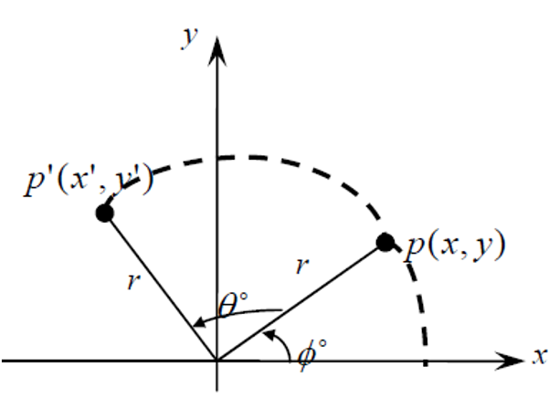

## **
  量子力学与统计物理  
**

  Quantum mechanics and statistical physics  

 
 

**
李小飞**  @ 光电科学与工程学院

 

 2023-03-01  

<!-- .slide: data-background="QM-beamer/images/uestclogo-1.png" data-background-opacity="1.0"-->

---

#   第四章 态和力学量的表象

note: # 章
note: ## 第X讲
note: ### N、主题  
note: ###  无次序主题
note: ####  分主题
note: #####  再分主题
note: ######  

--

## 第一讲 矩阵表示

--

###   前情回顾
- 波函数 : $$ \Psi(\vec{r},t)$$
- 薛定谔方程 :     
`\begin{equation*}
            i\hbar \frac{\partial }{\partial t} \Psi(\vec{r},t) = (\frac{\hbar^2}{2\mu} \nabla^2 +U(\vec{r})) \Psi(\vec{r},t)
        \end{equation*}`
- 力学量算符 :
` $$\left\{ \begin{aligned}
            &\hat{\vec{r}} =\vec{r}  \\
            &\hat{\vec{p}} =-i\hbar(\dfrac{d}{d x}+ \dfrac{d}{d y} + \dfrac{d}{d z}) \\
            &\hat{F}=F(\hat{\vec{r}},\hat{\vec{p}}) \\
        \end{aligned} \right.$$ ` 
默认以位置为自变量，称为位置表象

--

###  表象理论
$\color{#FFA500}{\text{表象：}}$  
波函数和力学量的具体表示形式，选择一个力学量本征函数系做为基就是选取一种表象

$\color{#FFA500}{\text{表象理论：}}$ 研究量子力学具体表示形式以及它们之间的相互变换的理论。
 

---

### 1. 波函数矩阵表示

$\color{#FFA500}{\text{命题-1：}}$ 试证明波函数可用其在任意基上的展开系数构成的矩阵表示
`$$ \Psi(\vec{r},t)=\sum_n a_n(t) \psi_n(\vec{r})$$ 
        $$ \Psi\Leftrightarrow(a_1,a_2,\cdots,a_n)^T $$`   

$\color{#FFA500}{\text{证明：}}$ 对于任意表象$Q$

- 本征谱分立: {$u_n(\vec{r})$}
`\begin{equation*}
            a_n(t)=(u_n(\vec{r}), \Psi(\vec{r},t)) 
        \end{equation*}` 

- 本征连续谱: {$u_q(\vec{r})$}
`\begin{equation*}
            a(q,t)=(u_q(\vec{r}), \Psi(\vec{r},t)) 
        \end{equation*}`  

--

`\begin{equation*}
            \begin{split} 
                \Psi(\vec{r},t)&=\sum_n a_n(t) u_n(\vec{r}) \\
                &=a_1(t) u_1+ a_2(t) u_2+\cdots+ a_n(t) u_n \\
                &=(u_1,u_2,\cdots,u_n) 
               \begin{pmatrix}
                    a_1(t)\\
                    a_2(t)\\
                    \cdots\\
                    a_n(t)
                \end{pmatrix} \\
                &= (u_1,u_2,\cdots,u_n) (a_1(t),a_2(t),\cdots, a_n(t))^T
            \end{split}  
        \end{equation*}`  
有： $$   \Psi \Leftrightarrow (a_1(t),a_2(t),\cdots, a_n(t))^T \Leftrightarrow {\color{red}  \pmb {\Psi} } $$
称为波函数的矩阵表示

--

`$$\begin{matrix}
      ~~  & \text{矢量空间} & \text{希尔伯特空间}\\ 
      \text{基}  & \{\vec{e}_1,\vec{e}_2,\vec{e}_3\}  & \{ u_1,u_2,\cdots,u_n \}\\ 
      \text{正交归一}  & \vec{e}_i \cdot \vec{e}_j=\delta_{ij} & ( u_m, u_n)= \delta_{mn}\\ 
      \text{完备性}  & \vec{P}=\sum\limits_{i=1}^{3} x_i \vec{e}_i &  \Psi=\sum_n a_n(t) u_n \\  
      \text{投影}  & x_i= \vec{e}_i \cdot \vec{P}  & a_n(t)=( u_m, \Psi) \\ 
      \text{矩阵}  & (x_1, x_2, x_3)^T & (a_1(t), a_2(t), \cdots, a_n(t))^T
      \end{matrix}
      $$`

---

$\color{#FFA500}{\text{例-2：}}$  已知动量在位置表象的本征态是平面波，求其动量表象中的具体形式

$\color{#FFA500}{\text{解：}}$ 动量的本征谱连续
    $$a(q,t)=(u_q(\vec{r}), \Psi(\vec{r},t)) $$

动量的基 {$u_q(\vec{r})$}
$$u_q(\vec{r})=\psi_{\vec{p}}(\vec{r})=\frac{1}{(2\pi\hbar)^{3/2}} e^{\frac{i}{\hbar}\vec{p}\cdot \vec{r}}$$
被投影的波函数
$$\Psi(\vec{r},t)=\frac{1}{(2\pi \hbar)^{3/2}} e^{\frac{i}{\hbar}(\vec p\cdot \vec r -Et)} = \psi_{\vec{p}}(\vec{r}) e^{-\frac{i}{\hbar}Et}  $$

--

代回公式
`$$\begin{aligned}
a(q,t)&=(u_q(\vec{r}), \Psi(\vec{r},t)) \\
&= (\psi_{\vec{p}}(\vec{r}), \psi_{\vec{p}'}(\vec{r})e^{-\frac{i}{\hbar}Et})\\
&= e^{-\frac{i}{\hbar}Et}(\psi_{\vec{p}}(\vec{r}), \psi_{\vec{p}'}(\vec{r}))\\
&= e^{-\frac{i}{\hbar}Et}\delta(\vec{p}-\vec{p}')
\end{aligned} $$`

$\color{#FFA500}{\text{Tips:}}$  本征态在自身表象中的矩阵表示为$\delta$函数。
$$ a(q) = \delta(\vec{p}-\vec{p}') $$ 
 

---

$\color{#FFA500}{\text{例-3：}}$  已知如下波函数是某体系的能量本征态，求其基态$(n=1)$分别在动量和能量表象中的表示
        $$ \psi_n(x)=\sqrt{\frac{2}{a}} \sin \frac{n\pi}{a}x, \qquad 0<x<a $$

$\color{#FFA500}{\text{解-1：}}$ 动量的本征谱连续, 采用公式
 $$
 a(q,t)=(u_q(\vec{r}), \Psi(\vec{r},t)) 
 $$ 
 代入
`\begin{equation*}
        \begin{split}
            a(p)&= (\psi_{p}(x), \psi_1(x))\\
            &= (\frac{1}{\sqrt{2\pi\hbar}}e^{\frac{i}{\hbar}px}, \sqrt{\frac{2}{a}} \sin \frac{\pi}{a}x)
        \end{split} 
    \end{equation*}`

--

`\begin{equation*}
        \begin{split}
          a(p) &= \frac{1}{\sqrt{2\pi\hbar}}\sqrt{\frac{2}{a}} (e^{\frac{i}{\hbar}px},  \sin \frac{\pi}{a}x)\\
            &= \frac{1}{\sqrt{2\pi\hbar}}\sqrt{\frac{2}{a}} \int_{-a} ^a e^{-\frac{i}{\hbar}px}\sin \frac{\pi}{a}x dx\\
            &=\sqrt{\frac{a\pi}{\hbar}} \frac{1+e^{\frac{i}{\hbar}pa}}{\pi^2-p^2a^2/\hbar^2}
        \end{split} 
    \end{equation*}`

--

$\color{#FFA500}{\text{解-2：}}$能量本征谱分立
`\begin{equation*}
        \begin{split}
            a_n(E,t)&=(u_n(\vec{r}), \Psi(\vec{r},t)) \\
            a_n(E)&=(\psi_n(x), \psi_1(x)) \\
            &= \int_{-a} ^a \sqrt{\frac{2}{a}} \sin \frac{n\pi}{a}x \sqrt{\frac{2}{a}} \sin \frac{\pi}{a}x dx \\
            &= \frac{2}{a} \int_{-a} ^a \sin \frac{n\pi}{a}x \sin \frac{\pi}{a}x dx \\
            &=\delta(E_1-E_n) \\
            &=\delta_{1n} 
        \end{split} 
    \end{equation*}`  

---

###   2. 算符的矩阵表示
 
$\color{#FFA500}{\text{例-4：}}$ 算符$F$在位置表象中存在如下定义式，求其在Q表象的矩阵形式
` \begin{equation*}
        \varphi(\vec{r})=F\Psi(\vec{r}) 
    \end{equation*} ` 

$\color{#FFA500}{\text{解：}}$ 设Q表象的基为{$u_n(\vec{r})$}

把两波函数在表象Q展开：
`\begin{equation*}
        \begin{split} 
         \sum_m b_m(t)u_m(\vec{r})&= F\sum_m a_m(t)u_m(\vec{r}) \\
         \sum_m b_m(t)u_m(\vec{r})&= \sum_m Fu_m(\vec{r})a_m(t) \\
         \sum_m b_m(t)u_n ^*(\vec{r}) u_m(\vec{r})&= \sum_m u_n ^*(\vec{r}) Fu_m(\vec{r})a_m(t) 
        \end{split}  
    \end{equation*}` 

--

`\begin{equation*}
        \begin{split} 
        \sum_m b_m(t)\left(u_n (\vec{r}), u_m(\vec{r})\right)&= \sum_m \left(u_n (\vec{r}), Fu_m(\vec{r})\right)a_m(t) \\
         \sum_m b_m(t)\delta_{nm}&= \sum_m \left(u_n (\vec{r}), Fu_m(\vec{r})\right)a_m(t) \\
         b_n(t)&= \sum_m \left(u_n (\vec{r}), Fu_m(\vec{r})\right)a_m(t) \\
         b_n(t)&= \sum_m F_{nm} a_m(t) 
        \end{split}  
    \end{equation*}` 

取遍$n, m$, 得定义式的矩阵形式
`$$\begin{pmatrix}
        b_1(t)\\
        b_2(t)\\
        \cdots \\
        b_n(t)
    \end{pmatrix}
    =
    \begin{pmatrix}
       F_{11} & F_{12} & \cdots & F_{1n} \\
       F_{21} & F_{22} & \cdots & F_{2n} \\
       \cdots & \cdots &  \cdots& \cdots\\
        F_{n1} & F_{n2} & \cdots & F_{nn} \\
    \end{pmatrix}
    \begin{pmatrix}
        a_1(t)\\
        a_2(t)\\
        \cdots \\
        a_n(t)
    \end{pmatrix}
    $$`
$\color{#FFA500}{\text{结束！}}$  

--

- 算符矩阵元公式 
  $$ \boxed{F_{nm}=(u_n (\vec{r}), Fu_m(\vec{r})) = \int u_n^* (\vec{r}) F u_m(\vec{r}) dx}  $$

--

####  算符矩阵性质 

- 力学量算符的矩阵是厄密矩阵 
- 力学量算符的矩阵，对角元都是实数
- 力学量算符在自身表象是对角矩阵，对角元素就是算符的本征值

--

厄密矩阵的定义:

- 矩阵F的共轭矩阵: 
  $$F^{\dagger} = (F_{nm} ^*) ^T $$

例如：
`$$
F=\begin{pmatrix} 1 & 2+2i & 3 \\ 4 & 5 & 6 \\ 7 & 8 & 9 
\end{pmatrix}  
F^{\dagger} = \begin{pmatrix} 1 & 4 & 7 \\ 2-2i & 5 & 8 \\ 3 & 6 & 9 
\end{pmatrix}
$$` 

--

- 如果有 $F= F^{\dagger}$， 则称F为厄密矩阵

例如：
`$$
F=\begin{pmatrix} 1 & 0 & -1 \\ 0 & 5 & 0 \\ -1 & 0 & 9 
\end{pmatrix} = 
F^{\dagger} 
$$` 

厄密矩阵元的特点 $$  F_{nm}^* = F_{mn}  $$

--

$\color{#FFA500}{\text{例-5：}}$ 指出下列矩阵，哪些是厄密矩阵
`$$\begin{matrix}
        \begin{pmatrix}
            a & 0 & 0 & 0 \\
            0 & b & 0 & 0 \\
            0 & 0 & c & 0\\
            0 & 0 & 0 & 0 \\
         \end{pmatrix} 
         &  
         \begin{pmatrix}
            a & 1 & 0 & 0 \\
            2 & b & 0 & 0 \\
            0 & 0 & c & 0\\
            0 & 0 & 0 & 0 \\
         \end{pmatrix} 
         & 
         \begin{pmatrix}
            a & 1 & 0 & 0 \\
            1 & b & 0 & 0 \\
            0 & 0 & c & 0 \\
            0 & 0 & 0 & 0 \\
         \end{pmatrix} 
         \\ 
         \begin{pmatrix}
            a & 1 & 0 & 0 \\
            -1 & b & 0 & 0 \\
            0 & 0 & c & 0 \\
            0 & 0 & 0 & 0 \\
         \end{pmatrix} 
         &     
        \begin{pmatrix}
            a & i & 0 & 0 \\
            i & b & 0 & 0 \\
            0 & 0 & c & 0 \\
            0 & 0 & 0 & 0 \\
        \end{pmatrix} 
         &   
         \begin{pmatrix}
            a & -i & 0 & 0 \\
            i & b & 0 & 0 \\
            0 & 0 & c & 0 \\
            0 & 0 & 0 & 0 \\
         \end{pmatrix} 
    \end{matrix}
$$`

---

$\color{#FFA500}{\text{性质-1:}}$ 力学量算符的矩阵表示都是厄密矩阵

$\color{#FFA500}{\text{证明：}}$  
`\begin{equation*}
        \begin{split}
            F_{nm}&=(u_n (\vec{r}), Fu_m(\vec{r}))\\
            &=(Fu_n (\vec{r}), u_m(\vec{r}))\\
            &=(u_m(\vec{r}), Fu_n (\vec{r}))^*\\
            &=F_{mn}^*\\
        \end{split} 
    \end{equation*}`
$\color{#FFA500}{\text{结束！}}$  

---

$\color{#FFA500}{\text{性质-2}}$ 力学量算符的矩阵表示，对角元都是实数

$\color{#FFA500}{\text{证明：}}$ 
`\begin{equation*}
        \begin{split}
            F_{nm}&=F_{mn}^*\\
            F_{nn}&=F_{nn}^*\\
        \end{split} 
    \end{equation*}`

    即：对角元都是实数。 

$\color{#FFA500}{\text{结束！}}$  

--

$\color{#FFA500}{\text{性质-3}}$ 力学量算符的矩阵表示，在自身表象中是对角矩阵, 且对角元就是本征值。

$\color{#FFA500}{\text{证明：}}$ 
`\begin{equation*}
        \begin{split}
            F_{nm}&=(u_n (\vec{r}), Fu_m(\vec{r}))\\
            &=(u_n (\vec{r}), f_nu_m(\vec{r}))\\
            &=f_n(u_n (\vec{r}), u_m(\vec{r}))\\
            &=f_n\delta_{mn}\\
        \end{split} 
    \end{equation*}`

即：（1）非对角元都是0，是对角阵。（2）对角元就是本征值\\

$\color{#FFA500}{\text{结束！}}$  

---

####  对角化的物理意义

- 力学量算符的表示一般不是对角阵（不在自身表象）
- 在数学上做矩阵对角化，使其成为对角阵 （在自身表象）
- 对角化完成从任意表象回到自身表象的过程
- 对角元就是本征值（求本征值）

---

###  学术讨论

已知波函数取如下形式：$$\psi(x)=\dfrac{1}{\sqrt{2}}u_1(x)+\dfrac{1}{2}u_2(x)+\dfrac{1}{2}u_3(x)$$

其系数矩阵为
$$\begin{pmatrix}
            \dfrac{1}{\sqrt{2}}\\
            \dfrac{1}{2}\\
            \dfrac{1}{2}
            \end{pmatrix}^T $$
试问：
1. 各函数都取$x$自变量，所以此矩阵是波函数在位置表象的矩阵表示！
1. 如果此矩阵是波函数在能量表象的矩阵表示，你可以获得哪些信息？  

---

$\color{#FFA500}{\text{作 业：}}$  
1. 求动量表象中的位置算符和动量算符的具体形式
2. 求动量表象中位置算符的本征值和本征函数

---

##   第二讲 公式的矩阵表示

--

###  前情回顾

- 波函数矩阵表示 ：
  
$$ a_n(t)=(u_n(\vec{r}), \Psi(\vec{r},t)) $$ 
  
- 力学量算符矩阵表示 ：
   
$$ F_{nm} = (u_n (\vec{r}), Fu_m(\vec{r})) $$  
   
- 公式的矩阵表示：$\cdots$

--

###   量子力学常用公式

- 平均值公式
- 归一化公式
- 本征方程
- 薛定谔方程
- 运动方程

--

###  1. 平均值公式

$\color{#FFA500}{\text{例-1：}}$ 求平均值公式在Q表象中的具体形式（矩阵表示）
`$$ \overline{F}=\int \Psi^* (\vec{r},t) F \Psi(\vec{r},t) d\tau = (\Psi^* (\vec{r},t), F \Psi(\vec{r},t)) $$`

$\color{#FFA500}{\text{解：}}$ 把波函数在表象Q展开  
`\begin{equation*}
        \begin{split}
            \overline{F}&=(\Psi(\vec{r},t), F\Psi(\vec{r},t)) \\
            &= \left(\sum_n a_n(t) u_n(\vec{r}), \sum_m a_m(t) F u_m(\vec{r})\right)\\
            &= \sum_{n,m} a_n ^*(t) (u_n(\vec{r}), F u_m(\vec{r})) a_m(t)\\
            &= \sum_{n,m} a_n ^*(t) F_{nm} a_m(t)\\
        \end{split} 
    \end{equation*}`

--

取遍$n, m$, 得到如下矩阵形式

`$$\overline{F} =(a_1 ^* (t), a_2 ^* (t),\cdots,a_n^* (t) )\begin{pmatrix}
       F_{11} & F_{12} & \cdots & F_{1n} \\
       F_{21} & F_{22} & \cdots & F_{2n} \\
       \cdots & \cdots &  \cdots& \cdots\\
        F_{n1} & F_{n2} & \cdots & F_{nn} \\
    \end{pmatrix}
    \begin{pmatrix}
        a_1(t)\\
        a_2(t)\\
        \cdots \\
        a_n(t)
    \end{pmatrix}$$`

平均值公式的矩阵形式：
$$ \boxed{\large \overline{F} = \pmb {\Psi} ^{\dagger } \pmb {F} \pmb {\Psi}}  $$

$\color{#FFA500}{\text{结束！}}$  

---

考虑自身表象，有：
`$$\overline{F} =(a_1 ^*(t), a_2 ^*(t),\cdots,a_n^*(t) )
    \begin{pmatrix}
       f_1 & 0 & \cdots & 0 \\
       0& f_2 & \cdots & 0 \\
       \cdots & \cdots &  \cdots& \cdots\\
        0 & 0 & \cdots & f_n \\
    \end{pmatrix}
    \begin{pmatrix}
        a_1(t)\\
        a_2(t)\\
        \cdots \\
        a_n(t)
    \end{pmatrix}
    $$`

正是平均值公式的第二种形式
$$ \large \overline{F} = \sum_n a_n^* (t) a_n(t) f_n= \sum_n |a_n(t)|^2 f_n $$

---

###  2. 归一化公式

$\color{#FFA500}{\text{例-2：}}$ 求归一化公式在Q表象中的具体形式
$$ \int \Psi^* (\vec{r},t) \Psi(\vec{r},t) d\tau = \left(\Psi(\vec{r},t), \Psi(\vec{r},t)\right) = 1 $$
    
$\color{#FFA500}{\text{解：}}$ 把波函数在表象Q展开
`\begin{equation*}
        \begin{split}
            1 &=\left(\Psi(\vec{r},t), \Psi(\vec{r},t)\right) \\
            &= \left(\sum_n a_n(t) u_n(\vec{r}), \sum_m a_m(t) u_m(\vec{r})\right)\\
            &= \sum_{n,m} a_n ^* (t) \left(u_n(\vec{r}), u_m(\vec{r})\right) a_m(t)\\
            &= \sum_{n,m} a_n ^* (t) \delta_{nm} a_m(t)\\
        \end{split} 
    \end{equation*}`

--

去$\delta_{nm}$函数，得
` $$  \sum_{n} a_n ^* (t) a_n(t) =1 $$ `

取遍$n$, 得到矩阵形式
` $$ (a_1 ^*(t), a_2 ^*(t),\cdots,a_n^*(t) )
    \begin{pmatrix}
        a_1(t)\\
        a_2(t)\\
        \cdots \\
        a_n(t)
    \end{pmatrix}
    =1 $$  `

改写成：
$$ \large \pmb {\Psi} ^{\dagger } \pmb {\Psi} =1 $$

--

###   3. 本征方程

$\color{#FFA500}{\text{例-3：}}$  求本征方程在Q表象中的具体形式
    $$ F\psi_n (\vec{r}) =f \psi_n (\vec{r})$$

$\color{#FFA500}{\text{解：}}$  
`\begin{equation*}
        \begin{split}
            F\psi_m (\vec{r}) &=f \psi_m \\
            \psi_n ^*  F\psi_m &=\psi_n ^* f \psi_m\\
            (\psi_n, F\psi_m )&=(\psi_n, f \psi_m)\\
            (\psi_n, F\psi_m )&=f(\psi_n, \psi_m)\\
            F_{nm} &=f \delta_{nm} \\
            (F_{nm} - f \delta_{nm})a_n &= 0\\
        \end{split} 
    \end{equation*}`

--

取遍$n,m$, 得矩阵形式
`$$
\begin{pmatrix}
    F_{11}-f & F_{12} & \cdots & F_{1n} \\
    F_{21} & F_{22}-f & \cdots & F_{2n} \\
    \vdots & \vdots & \ddots & \vdots \\
    F_{n1} & F_{n2} & \cdots & F_{nn}-f
\end{pmatrix} \begin{pmatrix} a_1 \\ a_2 \\ \vdots \\ a_n  \end{pmatrix} =0  \quad \quad (1)
$$ `

--

有解条件, 系数行列式为零, 得久期方程：
`$$\begin{vmatrix}
        F_{11}-f & F_{12} & \cdots & F_{1n} \\
        F_{21} & F_{22}-f & \cdots & F_{2n} \\
        \vdots & \vdots & \ddots & \vdots \\
         F_{n1} & F_{n2} & \cdots & F_{nn}-f \\
     \end{vmatrix} 
     =0 $$`

- 解久期方程， 得本征谱 {$f_1,f_2,\cdots, f_n $}
     
- 依次把$f_i$ 代回方程（1），解得第i个本征函数。本征方程得解

$\color{#FFA500}{\text{Tips:}}$  Tips: 矩阵化使本征方程从微分方程变为代数方程！

--

--

#### 求解实例
$\color{#FFA500}{\text{例-4：}}$  已知算符在Q表象中的矩阵形式如下, 求本征值和归一化本征函数，并将矩阵对角化。
`$$ L_x= \frac{\hbar}{\sqrt{2}}
        \begin{pmatrix}
            0 & 1 & 0  \\
            1 & 0 & 1  \\
            0 & 1 & 0 \\
         \end{pmatrix} $$`
        
可选方案:

- 解久期方程，得本征值，然后代入方程（1），得本征函数 ，再直接写出对角阵 
- 直接从数学上对角化，对角元就是本征值，然后代入方程（1），得本征函数。

--

$\color{#FFA500}{\text{解：}}$  第一步： 解久期方程求本征值
`$$\frac{\hbar}{\sqrt{2}}
    \begin{vmatrix}
       0-f & 1 & 0  \\
       1 & 0-f & 1  \\
       0 & 1 & 0-f \\
    \end{vmatrix} 
    =0 $$`

$$ -f^3+2f=0 $$

$$ f_1=\sqrt{2}, f_2=0, f_3=-\sqrt{2} $$

$L_x$的本征值为 $\lambda_i=\dfrac{\hbar}{\sqrt{2}} f_i$，即: 
$$ \hbar, 0, -\hbar$$

--

第二步：把$f_i$ 依次代回方程求本征函数
`$$\begin{pmatrix}
        0-f_i & 1 & 0  \\
        1 & 0-f_i & 1  \\
        0 & 1 & 0-f_i \\
     \end{pmatrix} 
     \begin{pmatrix}
         a_1\\
         a_2\\
         a_3
     \end{pmatrix}
     =0 $$`

得三个本征函数（具有不确定参数）
`$$\small \begin{matrix}
       f_1=\sqrt{2} & f_2=0  &  f_3=-\sqrt{2}\\
    \begin{pmatrix}
        1/\sqrt{2}a_2\\
        a_2\\
        1/\sqrt{2}a_2
    \end{pmatrix}  
    = 1/\sqrt{2}a_2 \begin{pmatrix}
        1\\
        \sqrt{2}\\
        1
        \end{pmatrix} 
    & 
    \begin{pmatrix}
        a_1\\
        0\\
        a_1
    \end{pmatrix}  
    =  a_1 \begin{pmatrix}
        1\\
        0\\
        1
    \end{pmatrix}
    &
    \begin{pmatrix}
        -1/\sqrt{2}a_2\\
        a_2\\
        -1/\sqrt{2}a_2
    \end{pmatrix} 
    = 1/\sqrt{2}a_2 \begin{pmatrix}
        -1\\
        \sqrt{2}\\
        -1
    \end{pmatrix} 
    \end{matrix}$$`           

--

依次代入归一化公式， $$ \pmb {\Psi} ^{\dagger } \pmb {\Psi} =1 $$

确定参数，得归一化本征函数
`$$\begin{matrix}
    f_1=\sqrt{2} & f_2=0  &  f_3=-\sqrt{2}\\
    \dfrac{1}{2} a_2 ^2 (1, \sqrt{2}, 1)
    \begin{pmatrix}
    1\\
    {\sqrt{2}}\\
    1
    \end{pmatrix} 
    =1 
    & 
    a_1 ^2 (1, 0, 1)
    \begin{pmatrix}
     1\\
     0\\
     1
    \end{pmatrix} 
    =1 
     &
     \dfrac{1}{2} a_2 ^2 (-1, \sqrt{2}, -1)
    \begin{pmatrix}
     -1\\
     {\sqrt{2}}\\
     -1
    \end{pmatrix} 
    =1 \\
    a_2= \dfrac{1}{\sqrt{2}} &  a_1= \dfrac{1}{\sqrt{2}} &   a_2=\dfrac{1}{\sqrt{2}} 
    \\
    \psi_1=\dfrac{1}{2}
    \begin{pmatrix}
    1\\
    \sqrt{2}\\
    1
    \end{pmatrix}  
    & 
    \psi_2=\dfrac{1}{\sqrt{2}}
    \begin{pmatrix}
    1\\
    0\\
    1
    \end{pmatrix}  
    &
    \psi_3=\dfrac{1}{2}
    \begin{pmatrix}
    -1\\
    \sqrt{2}\\
    -1
    \end{pmatrix}  
    \end{matrix}$$`   

--

第三步：写出对角阵：
`$$ L_x= \frac{\hbar}{\sqrt{2}}
        \begin{pmatrix}
            0 & 1 & 0  \\
            1 & 0 & 1  \\
            0 & 1 & 0 \\
         \end{pmatrix} 
    = 
    \begin{pmatrix}
        \hbar & 0 & 0  \\
        0 & 0 &   0\\
        0 & 0 & -\hbar \\
     \end{pmatrix} 
    $$`

$\color{#FFA500}{\text{结束！}}$ 

---

###  4. 薛定谔方程

$\color{#FFA500}{\text{例-5：}}$  薛定谔方程在Q表象中的矩阵表示
    $$ i\hbar \frac{\partial}{\partial t }\psi (\vec{r},t) =H\psi (\vec{r},t)$$

$\color{#FFA500}{\text{解：}}$ 波函数在Q表象展开
`\begin{equation*}
        \begin{split}
            i\hbar \frac{\partial}{\partial t }\sum_n a_n(t) u_n(\vec{r})  &=H\sum_n a_n(t) u_n(\vec{r}) \\
            u_m ^* (\vec{r}) i\hbar \frac{\partial}{\partial t }\sum_n a_n(t) u_n(\vec{r})  &=u_m ^* (\vec{r})H\sum_n a_n(t) u_n(\vec{r}) \\
            i\hbar \frac{\partial}{\partial t }u_m ^* (\vec{r}) \sum_n a_n(t) u_n(\vec{r})  &=u_m ^* (\vec{r})\sum_n a_n(t) Hu_n(\vec{r}) \\      
        \end{split} 
    \end{equation*}`

--

`\begin{equation*}
        \begin{split}
            i\hbar \frac{\partial}{\partial t } \left(u_m (\vec{r}), \sum_n a_n(t) u_n(\vec{r}) \right) &=\left(u_m (\vec{r}), \sum_n a_n(t) Hu_n(\vec{r})\right) \\
            i\hbar \frac{\partial}{\partial t }\sum_n a_n(t)\left(u_m (\vec{r}),  u_n(\vec{r}) \right) &=\sum_n \left(u_m (\vec{r}),  Hu_n(\vec{r})  \right)a_n(t) \\
            i\hbar \frac{\partial}{\partial t }\sum_n a_n(t)\delta_{mn} &=\sum_n  H_{mn} a_n(t) \\
            i\hbar \frac{\partial}{\partial t } a_n(t) &=\sum_n H_{mn} a_n(t)  \\
        \end{split} 
    \end{equation*}`

--

取遍$n,m$, 得矩阵形式\\ 
`$$i\hbar \frac{\partial}{\partial t }  
    \begin{pmatrix}
        a_1(t)\\
        a_2(t)\\
        \cdots \\
        a_n(t)
    \end{pmatrix}
    =         
    \begin{pmatrix}
        H_{11} & H_{12} & \cdots & H_{1n} \\
        H_{21} & H_{22} & \cdots & H_{2n} \\
        \vdots & \vdots & \ddots & \vdots\\
        H_{n1} & F_{n2} & \cdots & H_{nn} \\
     \end{pmatrix}
     \begin{pmatrix}
         a_1(t)\\
         a_2(t)\\
         \vdots \\
         a_n(t)
     \end{pmatrix}$$`

写成这样：
$$ \boxed{i\hbar \frac{\partial}{\partial t }  \pmb \Psi = \pmb H  \pmb \Psi }  $$

---

###   5. 算符运动方程

$\color{#FFA500}{\text{例-6：}}$  求运动方程在Q表象中的矩阵表示
    $$ \frac{d\overline{F}}{dt}=\overline{\frac{\partial F }{\partial t}}  +\frac{1}{i\hbar} \overline{[F,H]}$$

$\color{#FFA500}{\text{解：}}$ 波函数在Q表象展开
`\begin{equation*}
        \begin{split}
            \frac{d(\psi,F \psi )}{dt} &=(\psi,\frac{\partial F }{\partial t} \psi)  +\frac{1}{i\hbar}  ( \psi,[F,H]\psi) \\
            \frac{d(\sum_m a_m u_m,F \sum_n a_n u_n )}{dt} &=(\sum_m a_m u_m,\frac{\partial F }{\partial t} \sum_n a_n u_n) \\  
            &+\frac{1}{i\hbar}  (\sum_m a_m u_m,[F,H]\sum_n a_n u_n)  \\    
        \end{split} 
    \end{equation*}`

--

`\begin{equation*}
        \begin{split}
            \frac{d\sum_{mn}a_m ^* (u_m,Fu_n )a_n}{dt} &=\sum_{mn} a_m ^*  (u_m,\frac{\partial F }{\partial t} u_n)a_n \\  
            &+\frac{1}{i\hbar} \sum_{mn} a_m ^*  ( u_m,[F,H] u_n)a_n  \\  
            \frac{d\sum_{mn}a_m ^* F_{mn}a_n}{dt} &=\sum_{mn} a_m ^*  \frac{\partial F_{mn} }{\partial t}a_n \\  
            &+\frac{1}{i\hbar} \sum_{mn} a_m ^* [F_{mn},H_{mn}]a_n  \\       
        \end{split} 
    \end{equation*}`

--

取遍$n,m$, 得矩阵形式
`\begin{equation*}
        \begin{split} 
            \frac{d \pmb \Psi^{\dagger } \pmb F \pmb \Psi}{dt} &=\pmb \Psi^{\dagger } \frac{\partial \pmb F }{\partial t} \pmb \Psi +\frac{1}{i\hbar} \pmb \Psi^{\dagger } [\pmb F, \pmb H] \pmb \Psi \\       
        \end{split} 
    \end{equation*}`

写成这样：
` $$\boxed{\frac{d \overline{\pmb F}}{d t} = \overline{\frac{\partial \pmb F }{\partial t}} +\frac{1}{i\hbar} \overline{ [\pmb F,\pmb H]} } $$ ` 

---

$\color{#FFA500}{\text{作 业：}}$  

1. 取Q表象为动量表象，试求平均值公式和薛定谔方程的具体形式。
2. 在$L_z$表象中,$L_x$ 和 $L_y$的矩阵表示如下,求它们的本征值和归一化本征矢
`\[L_x= \frac{\hbar}{\sqrt{2}}\begin{bmatrix}
            0 & 1 & 0 \\
            1 & 0 & 1 \\
            0 & 1 & 0
        \end{bmatrix}, \quad L_y= \frac{\hbar}{\sqrt{2}}\begin{bmatrix}
            0 & -i & 0 \\
            i & 0 & -i \\
            0 & i & 0
        \end{bmatrix} \]`

---

##  第二讲 幺正变换

--

###  前情回顾

- 波函数矩阵表示，
- 力学量算符矩阵表示
- 公式的矩阵表示 
- 表象变换 {.fragment .fade-in-then-semi-out } 

---

###  1. 幺正变换的定义

--

####  幺正矩阵

- F的逆矩阵 $F^{-1} F=FF^{-1} =I$, 
  $$F\Psi=\psi, \qquad F^{-1}\psi=\Psi$$  
- F的共轭矩阵 $F^{\dagger} =(F_{nm} ^* )^T $, 
  $$ (\psi, F\Psi), \qquad (F^{\dagger}\psi, \Psi)$$ 
- 如果 $F^{\dagger } =F$，称F为 厄密矩阵，           
$$F_{mn}=F_{nm} ^*$$ 
- 如果 $ F^{\dagger }=F^{-1}$，称F为幺正矩阵 
$$F^{\dagger} F= FF^{\dagger}=I$$

--

####  幺正变换

通过幺正矩阵联系起来的两矩阵之间的变换，称为幺正变换。

--

$\color{#FFA500}{\text{例-1：}}$  试证明二维平面矢量绕原点的旋转变换是幺正变换

$\color{#FFA500}{\text{证明：}}$ 

`$\left\{\begin{matrix}
        x'=x\cos\theta -y\sin\theta\\
        y'=x\sin\theta+y\cos\theta
    \end{matrix}\right. \implies 
    \begin{bmatrix}
        x' \\
        y'
    \end{bmatrix}
    =
    \begin{bmatrix}
        \cos\theta & -\sin\theta\\
        \sin\theta & \cos\theta
    \end{bmatrix}
    \begin{bmatrix}
        x \\
        y
    \end{bmatrix}$`

`$$ R_\theta=
    \begin{bmatrix}
        \cos\theta &-\sin\theta\\
        \sin\theta &\cos\theta
    \end{bmatrix}, \quad 
    R_\theta ^{\dagger}=
    \begin{bmatrix}
        \cos\theta &\sin\theta\\
        -\sin\theta &\cos\theta
    \end{bmatrix} $$
    $$ R_\theta  R_\theta ^{\dagger} = R_\theta ^{\dagger} R_\theta=  
    \begin{bmatrix}
        \cos\theta &-\sin\theta\\
        \sin\theta &\cos\theta
    \end{bmatrix}
    \begin{bmatrix}
        \cos\theta &\sin\theta\\
        -\sin\theta &\cos\theta
    \end{bmatrix}
    =I
    $$`

--

###   量子力学中幺正变换

--

####  基矢变换
$\color{#FFA500}{\text{例-1：}}$  量子力学不同表象基组之间的变换是幺正变换  

$\color{#FFA500}{\text{证明：}}$  设A的基组为{$\psi_\alpha$}, B的基组为 {$\varphi_n$}, 

把$A$的正交归一化公式按$B$展开: 
`\begin{equation*}
        \begin{split}
            \delta_{\alpha\beta} &= (\psi_\alpha, \psi_\beta) \\
            &= (\sum_n S_{n\alpha} \varphi_n, \sum_m S_{m\beta} \varphi_m)\\
            &= \sum_{nm} S_{n\alpha} ^* S_{m\beta}(\varphi_n, \varphi_m)\\
            &= \sum_{nm} S_{n\alpha} ^* S_{m\beta}\delta_{nm}\\
            &= \sum_{n} S_{n\alpha} ^* S_{n\beta} \\
            &= \sum_{n} S^{\dagger } _{\alpha n} S_{n\beta}
        \end{split} 
    \end{equation*}`

--

 
把B的正交归一化公式按A展开: 
` \begin{equation*}
        \begin{split}
            \sum_{\alpha} S_{n\alpha}  S^{\dagger } _{\alpha m}&=\sum_{\alpha} S_{n\alpha}  S_{m \alpha} ^* \\
            &=\sum_{\alpha} (\varphi_n, \psi_\alpha) (\varphi_m, \psi_\alpha)^* \\
            &=\sum_{\alpha} (\psi_\alpha,\varphi_n)^* (\psi_\alpha,\varphi_m) \\
            &=\sum_{\alpha\beta} (\psi_\alpha,\varphi_n)^* (\psi_\beta,\varphi_m) \delta_{\alpha\beta} \\
            &=\sum_{\alpha\beta} S_{\alpha n}^*  S_{\beta m} (\psi_\alpha,\psi_\beta)\\
            &= (\sum_{\alpha} S_{\alpha n}\psi_\alpha,\sum_{\beta} S_{\beta m}\psi_\beta)\\
            &= (\varphi_n,\varphi_m) =\delta_{nm} 
        \end{split} 
    \end{equation*} `

--

两式结合：
`\begin{equation*}
        \begin{split}
            \sum_{\alpha} S_{n\alpha}   S^{\dagger } _{\alpha m} &=\delta_{nm} \\
            \sum_{n} S^{\dagger } _{\alpha n} S_{n\beta}&=\delta_{\alpha\beta}
        \end{split} 
    \end{equation*}`
    
即：$$ S^{\dagger }S=SS^{\dagger } =I$$ 
   
$\color{#FFA500}{\text{结束！}}$ 

--

注意： $$ S_{n\alpha} = (e_n, e_\alpha)= (e_{(B)}, e_{(A)})$$ 

基组变换公式： $$ \boxed{\large u_{(B)}= S^{\dagger} u_ {(A)}} $$

---

####  波函数变换
$\color{#FFA500}{\text{例-3：}}$ 同一波函数在两表象中的矩阵之间的变换是幺正变换

$\color{#FFA500}{\text{证明：}}$  设A的基组为{$\psi_\alpha$}, B的基组为 {$\varphi_n$}

波函数$\Psi$分别在A表象和B表象中展开：
`\begin{equation*}
        \begin{split}
             \sum_\alpha a_\alpha \psi_\alpha  &= \sum_n b_n \varphi_n =\Psi\\
            \sum_\alpha a_\alpha \psi_\beta ^* \psi_\alpha &= \sum_n b_n \psi_\beta ^* \varphi_n \\
            \sum_\alpha a_\alpha (\psi_\beta, \psi_\alpha) &= \sum_n b_n (\psi_\beta, \varphi_n) \\
            \sum_\alpha a_\alpha \delta_{\alpha\beta} &= \sum_n b_n (\psi_\beta, \varphi_n) \\
            a_\alpha &= \sum_n S_{\alpha n} b_n\\
        \end{split} 
    \end{equation*}`

--

$$ a_\alpha = \sum_n S_{\alpha n} b_n$$

对上式取遍$\alpha,n$, 得矩阵形式
$$ a =S b$$

改写成：

$$ b = S^{\dagger} a$$

$\color{#FFA500}{\text{结束！}}$ 

--

####  算符变换

$\color{#FFA500}{\text{例-4：}}$ 一力学量算符在两表象中的矩阵之间的变换是幺正变换 

$\color{#FFA500}{\text{证明：}}$  设A的基组为{$\psi_\alpha$}, B的基组为 {$\varphi_n$}

算符F在A表象的矩阵元为$F_{\alpha\beta}$, 在B表象中的矩阵元为$F'_{nm}$

`\begin{equation*}
        \begin{split}
            F'_{nm} &= \left(\varphi_n, F\varphi_m\right) \\
            &= \left(\sum_{\alpha} S_{\alpha n}\psi_\alpha, F \sum_{\beta} S_{\beta m}\psi_\beta\right)\\
            &= \sum_{\alpha\beta} S_{\alpha n} ^* \left(\psi_\alpha, F \psi_\beta\right) S_{\beta m}\\
            &= \sum_{\alpha\beta} S_{\alpha n} ^* F_{\alpha\beta} S_{\beta m}
        \end{split} 
    \end{equation*}`

--

`\begin{equation*}
    \begin{split}
        F'_{nm} &= \sum_{\alpha\beta} S_{n\alpha } ^{\dagger} F_{\alpha\beta} S_{\beta m} \\
        &= (S^{\dagger} F S)_{nm}
    \end{split} 
    \end{equation*}` 

 

 
$$ \implies F'= S^{\dagger} F S $$

---

###  3. 幺正变换的性质

--

$\color{#FFA500}{\text{性质-1:}}$  幺正变换不改变算符的本征值

$\color{#FFA500}{\text{证明：}}$  算符F在A表象的矩阵为F，本征矢为a, 在B表象中的矩阵为F' 本征矢为b。 A的本征方程为：
$$Fa=fa \qquad (1) $$ 
B的本征方程：
` \begin{equation*}
        \begin{split}
            F'b&=f'b\\
            S^{\dagger} F S S^{\dagger}a &=f'S^{\dagger}a\\
            S^{\dagger} F a &=f'S^{\dagger}a\\
            SS^{\dagger} F a &=f'SS^{\dagger}a\\
            F a &=f'a \qquad (2)\\
        \end{split} 
    \end{equation*} ` 
    比较（1）、（2），有$f=f'$
　$\color{#FFA500}{\text{结束！}}$  

--

$\color{#FFA500}{\text{性质-2:}}$ 幺正变换不改变矩阵的迹

说明：矩阵对角元素之和称为矩阵A的迹，用$SP(A)$或$tr(A)$表示，
有性质：$tr(AB)=tr(BA) $, 先证明之:
` \begin{equation*}
        \begin{split}
            tr(AB) &=\sum_i (AB)_{ii}\\
            &=\sum_{i} \sum_{j} (A_{ij} B_{ji}) \\
            &=\sum_{i} \sum_{j} (B_{ji} A_{ij}) \\
            &=\sum_{j} (BA)_{jj} \\
            &=tr(BA)
        \end{split} 
    \end{equation*}`

--

$\color{#FFA500}{\text{证明：}}$  
`\begin{equation*}
        \begin{split}
            F'&= S^{\dagger} F S \\
            tr(F')&=tr(S^{\dagger} F S)\\
            &=tr(SS^{\dagger}  F)\\
            &=tr(F)\\
        \end{split} 
    \end{equation*} `

$\color{#FFA500}{\text{结束！}}$     

--

$\color{#FFA500}{\text{性质-3:}}$ 幺正变换不改变物理规律

现已知在位置表象中的基本对易关系$xp_x-p_x x =i\hbar$，试求它在动量（$p_x$）表象中的形式，然后证明这种对易关系不随表象发生变化

$\color{#FFA500}{\text{证明-1：}}$ 在$p_x$表象, 有：

$$ \hat{x}=i\hbar\dfrac{\partial}{\partial p_x}, \qquad \hat{p}_x=p_x $$

对任意$p_x$表象的波函数 $\Psi(p_x)$
`\begin{equation*}
        \begin{split}
            \hat{x}\hat{p}_x\Psi &= i\hbar\dfrac{\partial}{\partial p_x} (p_x \Psi )\\
            &= i\hbar\Psi + p_xi\hbar\dfrac{\partial}{\partial p_x}\Psi \qquad (a)\\
        \end{split} 
    \end{equation*}` 

--

$$\hat{p}_x\hat{x}\Psi = p_x(i\hbar\dfrac{\partial}{\partial p_x}\Psi) \qquad (b)$$

(a)-(b)
$$\hat{x}\hat{p}_x\Psi-\hat{p}_x\hat{x}\Psi=i\hbar\Psi$$
$$\implies \hat{x}\hat{p}_x-\hat{p}_x\hat{x}=i\hbar$$

形式没有改变！

--

$\color{#FFA500}{\text{证明-2：}}$ 对于任意表象$Q$，

$$ x'= S^\dagger x S, \qquad p'_x= S^\dagger p_x S $$

两式左右乘再作差：
`\begin{equation*}
        \begin{split}
        x'p'_x-p'_x x' &= S^\dagger x S S^\dagger p_x S - S^\dagger p_x S S^\dagger x S \\
        &= S^\dagger x p_x S - S^\dagger p_x x S \\
        &= S^\dagger (x p_x -  p_x x) S \\
        &= i\hbar S^\dagger S \\
        &= i\hbar \\
        \end{split} 
    \end{equation*}` 

$\color{#FFA500}{\text{结束！}}$  

--

####  推论：

- 量子体系进行任一幺正变换不改变它的全部物理内容

- 两个量子体系，如果能用幺正变换联系起来，则它们在物理上是等价的

---

###   构造S矩阵

由前可知，幺正矩阵在表象变换过程中，起关键作用，下面组出构造S矩阵的具体方法

$\color{#FFA500}{\text{例：}}$  已知算符A在B表象中的矩阵如下，求A表象和B表象之间的幺正矩阵S
`$$ A=\begin{bmatrix}
            2\varepsilon  & 0 & \varepsilon\\
            0 & 2\varepsilon & 0 \\
            \varepsilon & 0 & 2\varepsilon\\
        \end{bmatrix} $$`

$\color{#FFA500}{\text{思考：}}$  若已知A表象的基为 $\{\psi_\alpha \}$, B表象的基为 $ \{\varphi_n \}$， 则可直接计算内积得S：
$$ S_{n\alpha} =(\varphi_n, \psi_\alpha) $$

--

现在只知道一个非对角矩阵A，可以通过解久期方程得到本征值和本征函数，可使其对角化为A'，则A‘在自身表象, 称之为回到自身表象。也就是说这完成一个从B表象到A表象的幺正变换,关系式为：

$$ A'=S^\dagger A S$$

上式中，$A$、 $A'$ 已知， 则 $S$、$S^\dagger$ 可求！

如何求？！

--

$\color{#FFA500}{\text{例：}}$ 试证明A（矩阵）在B表象的本征函数系构成这个S矩阵
    
$\color{#FFA500}{\text{证明：}}$  注意到$A'$的对角元是本征值$a$
`\begin{equation*}
    \begin{split}
    A' &=S^\dagger A S \\
    A'_{mn} &=(S^\dagger A S)_{mn}  \\
    a_m \delta_{mn} & =  \sum_{\alpha \beta} S^{\dagger} _{m \alpha} A_{\alpha \beta} S_{\beta n} \\
    a_m \sum_m S_{\alpha m}\delta_{mn}&= \sum_{\alpha \beta} \left(\sum_m S_{\alpha m} S^\dagger_{m \alpha}\right) A_{\alpha \beta} S_{\beta n}\\
    a_n S_{\alpha n}&= \sum_{\beta} A_{\alpha \beta} S_{\beta n} \\
    \end{split} 
    \end{equation*}` 

表明：S矩阵的第n列正好是a的第n个本征态，即依次排列本征函数则构成S阵！

---

$\color{#FFA500}{\text{作 业：}}$  
1. 算符F在A表象的矩阵如下(其中$\theta$为实常数) 
`\[ F= \begin{pmatrix}
          0 & e^{\theta} \\
          e^{-\theta} & 0 \\
        \end{pmatrix} \]`
    (1)求F的本征值和正交归一本征矢在A表象的具体表示\\
    (2)求使F对角化的幺正变换矩阵S
2. 已知两可观测力学量算符A,B. 满足 $A^2=B^2=I, \quad AB+BA=0$,求 \\ 
    (1) 算符A,B的本征值 \\ 
    (2) 在A表象中A,B及它们的本征矢的具体表示 \\ 
    (3) 在B表象中A,B及它们的本征矢的具体表示 \\ 
    (4) 从A到B的幺正变换矩阵S

---

## 第三讲 狄拉克(Dirac)符号

---

###  1. 左矢与右矢

量子力学用希尔伯特空间描述，希尔伯特空间是内积空间, 定义了
- 加法：$\psi + \varphi$
- 数乘：$c\psi$
- 内积：$(\psi,\psi)$

$\bullet$考察内积： $(\psi,\psi)=\int\psi^*\psi d\tau$ 

同一波函数放在左边还是右边，意义有所不同： 
  - 右边是线性矢量：  $(\psi,a\psi)=a (\psi,\psi)$ 
  - 左边是反线性矢量：   $(a\psi,\psi)=a^* (\psi,\psi)$   

--

为了清楚地描述这种线性反线性特点，特定义左矢和右矢:

$$\langle \psi |, \qquad |\psi \rangle $$ 

内积：`\[(\psi,\psi)\equiv \langle \psi | \psi \rangle\]`

  线性右矢: $\langle a\psi | = \langle \psi |a^* $

  反线性左矢: $ |a\psi \rangle = a|\psi \rangle$ 

--

$\bullet$ 考察加法和数乘：发现其中的矢量是线性的，用右矢。
`$$\small \begin{aligned}
    &\text{内积：}   & (\psi,\Psi)  & \quad\Leftrightarrow \quad & | \Psi \rangle =\langle \psi | \Psi \rangle \\
    &\text{平均值：}   & \bar{F}=(\Psi,F\Psi)  & \quad\Leftrightarrow \quad & \bar{F} =\langle \Psi|F | \Psi \rangle \\
    &\text{态叠态：}   & \Psi=a_1 \psi_1+ a_2 \psi_2  & \quad\Leftrightarrow \quad &| \Psi \rangle =a_1 |1 \rangle+ a_2 |2 \rangle\\
    &\text{展开式1：}     & \Psi=\sum\limits_{i=1} ^n a_i \psi_i & \quad \Leftrightarrow \quad &| \Psi \rangle =\sum\limits_{i=1} ^n a_i |i \rangle\\
    &\text{展开式2：}     & \Psi=\sum\limits_{i=1} ^n (\psi_i ,\Psi) \psi_i & \quad \Leftrightarrow \quad &| \Psi \rangle =\sum\limits_{i=1} ^n \langle i | \Psi \rangle |i\rangle\\
    \end{aligned}$$`

 

--

###  2. 外积

$\bullet$ 考察展开式：

`$$\begin{aligned}
    \Psi \rangle &= \sum\limits_{i=1} ^n \langle i | \Psi \rangle |i\rangle\\
                 &= \sum\limits_{i=1} ^n |i\rangle\langle i | \Psi \rangle \\
    \end{aligned}$$`

发现存在 $|i\rangle\langle i$项，称为本征函数的外积，有:
` \[\sum\limits_{i=1} ^n |i\rangle\langle i |=1\] `
称为本征函数系的完全性(封闭性)。 

--

对于一般态：$ \Psi =\sum a_n \varphi_n $, 也可定义外积：
$$\hat{p} = |\Psi\rangle\langle \Psi |$$

右矢的矩阵形式：
`$$|\Psi\rangle = \begin{pmatrix}
        a_1\\
        a_2\\
        \vdots\\
        a_n
    \end{pmatrix}$$` 
左矢的矩阵形式：
    `$$ \langle\Psi| = (a_1 ^*, a_2 ^*, \cdots, a_n ^*) $$`

--

内积矩阵形式：
`$$\langle\Psi|\Psi\rangle = (a_1 ^*, a_2 ^*, \cdots, a_n ^*) \begin{pmatrix}
        a_1\\
        a_2\\
        \cdots\\
        a_n\
    \end{pmatrix} = c $$`

外积的矩阵形式：
`$$|\Psi\rangle\langle\Psi|= \begin{pmatrix}
        a_1\\
        a_2\\\
        \cdots\\
        a_n\
    \end{pmatrix} (a_1 ^*, a_2 ^*, \cdots, a_n ^*) = \pmb M $$`

--

###  3. 密度算符

定义算符： 
$$ \hat{p}_i = |i\rangle\langle i | \qquad $$ 

则有: 
`$$ \hat{p}_i\Psi= |i\rangle\langle i | \Psi \rangle = \langle i | \Psi \rangle |i\rangle=a_i |i\rangle $$`

` $$\Psi= \sum\limits_i ^n a_i |i\rangle = \sum\limits_i ^n \hat{p}_i\Psi$$ `

可知： $ \hat{p}_i\Psi $ 是矢量$\Psi$ 在第$i$ 个本征矢上的投影， 因此称$\hat{p}_i$为投影算符}

--

考察一般态的投影算符$\hat{p}$在$i$态的平均值：

`$$ \begin{aligned}
    \overline{\hat{p}} &=\langle i |\hat{p} | i \rangle \\
               &=\langle i |\Psi\rangle\langle \Psi | i \rangle \\
               &=(\langle i |\Psi\rangle) (\langle \Psi | i \rangle) \\
               &=a_i ^* a_i =\omega_i \\
    \end{aligned} $$`
这是概率密度，因此称 $\hat{p} = |\Psi\rangle\langle \Psi |$ 为密度算符。

---

###  4. 密度矩阵
    
考察平均值公式：
`$$ \begin{aligned}
    \overline{\hat{F}} &=\sum\limits_i |a_i|^2 f_i \\
            &=\sum\limits_i \omega_i \langle i |\hat{F}|i \rangle  \\
            &=\sum\limits_{ij} \omega_i \langle i |\hat{F} |j\rangle \langle j| i\rangle  \\
            &=\sum\limits_{ij} \langle j| i\rangle  \omega_i \langle i |\hat{F} |j\rangle  \\
            &=\sum\limits_{j} \langle j | \left(\sum\limits_{i}| i \rangle  \omega_i \langle i |\right) \hat{F} |j\rangle  \\
    \end{aligned} $$`

--

定义密度矩阵：$$ \hat{\rho} = \sum\limits_{i}| i \rangle  \omega_i \langle i | $$

得平均值公式-3：

`$$ \begin{aligned}
            \bar{\hat{F}}&=\sum\limits_{j} \langle j | \hat{\rho} \hat{F} |j\rangle \\
                &=tr (\hat{\rho} \hat{F} )
        \end{aligned} $$`   

---

$\color{#FFA500}{\text{例：}}$  求算符$\hat{F}$在 $|\Psi\rangle =\sum\limits_n a_n |n\rangle $上的平均值

$\color{#FFA500}{\text{解：}}$ 求算符的矩阵：
    $$ F_{nm} = \langle n | F |m \rangle  $$
求密度矩阵：
    $$ \hat{\rho} = \sum\limits_{n}| n \rangle  a_n ^* a_n \langle n | $$
对两矩阵的积求迹得平均值
    $$\bar{\hat{F}}=tr (\hat{\rho} \hat{F} )$$

思路是不是更清楚！

--

###  5. 狄拉克符号描述的量子力学

  
- 量子态(无表象)： $\hspace{1em}|\Psi \rangle$ 
  - 位置表象：$\hspace{2em} \langle x |\Psi \rangle$
  - 动量表象：$\hspace{2em} \langle p_x |\Psi \rangle$ 
  
- 算符(无表象)： $\hspace{1.5em} F$ 
  - 位置表象：$\hspace{2em} F(x, -i\hbar \frac{\partial }{\partial x}) $ 
  - 动量表象：$\hspace{2em} F(i\hbar \frac{\partial }{\partial p_x}, p_x) $ 
  
- 展开式： $\hspace{1em}|\Psi \rangle =\sum\limits_{n=1} ^n a_n |n \rangle$ 
  
- 内积：   ` $\hspace{2em}\langle \varphi | \Psi \rangle = (\varphi, \Psi)= \int \varphi^*\Psi d\tau $ `

--

-  归一化： $\hspace{1em}\langle \Psi | \Psi \rangle = (\Psi, \Psi)= \int \Psi^*\Psi d\tau = 1 $ 
  
- 正交归一： $\langle n | m \rangle = \delta_{nm}, \hspace{2em} \langle \lambda | \lambda' \rangle = \delta(\lambda-\lambda') $
  
- 展开系数： $ a_n= \langle n | \Psi \rangle, \hspace{2em}a_n ^*= \langle \Psi | n \rangle$ 
 
- 平均值：  $\hspace{1em}\overline{F} = \langle \Psi |F | \Psi \rangle = \sum_i |a_i|^2 f_i = tr (\hat{\rho} \hat{F} )$ 
  
- 矩阵元：  $\hspace{1em}F_{nm} = \langle n |F | m \rangle$ 
    
- 幺正矩阵（变换）：$S_{m\alpha} =\langle m| \alpha \rangle $ 
  
- 投影算符：$p_i = |i\rangle\langle i |, \qquad \text{封闭性:} \sum_i |i\rangle\langle i |=1 $ 

- 密度矩阵： $\hat{\rho} = \sum\limits_{i}| i \rangle  \omega_i \langle i |, \quad \hat{\rho} = \sum\limits_{i}| \Psi_i \rangle  P_i \langle \Psi_i | $ 
 

--

- 本征方程：$F|n\rangle =f_n |n\rangle$ 

- 薛定谔方程：$$ i\hbar \frac{\partial }{\partial t} |\Psi(t)\rangle = H|\Psi(t)\rangle $$ 

- 算符运动方程：$$ \frac{d\overline{A}(t)}{dt}=\overline{\frac{\partial A(t) }{\partial t}}  +\frac{1}{i\hbar} \overline{[A(t),H(t)]}$$
 

---

--

####  应用实例 

1、求波函数的矩阵表示：  
    $$|\Psi \rangle =\sum\limits_{n=1} ^n a_n |n \rangle$$
    $$ a_n= \langle n | \Psi \rangle$$

展开系数构成矩阵表示：  
    $$\begin{pmatrix}
    a_1\\
    a_2\\\
    \cdots\\
    a_n\
    \end{pmatrix} $$

--

2、求算符的矩阵表示：  
    $$|\varphi \rangle = F |\Psi \rangle$$
    $$|\varphi \rangle = \sum_n F |n\rangle\langle n |\Psi \rangle$$
    $$\langle m |\varphi \rangle = \sum_n  \langle m| F |n\rangle\langle n |\Psi \rangle$$
    $$ b_m = \sum_n  F_{mn} a_n$$

--

3、求薛定谔方程的矩阵表示： 
`$$ \begin{aligned}
    i \hbar \frac{\partial}{\partial t} |\Psi \rangle &= H |\Psi \rangle  \\
    i \hbar \frac{\partial}{\partial t} \langle m |\Psi \rangle &= \langle m |H |\Psi \rangle \\ 
     &= \sum_n \langle m |H |n\rangle\langle n |\Psi \rangle  \\
     i \hbar \frac{\partial}{\partial t} a_m  &= \sum_n H_{mn} a_n 
    \end{aligned}
    $$`
 

--

4、求薛定谔方程在各表象中的形式： 
`$$ \begin{aligned}
    i \hbar \frac{\partial}{\partial t} |\Psi(t) \rangle &= H |\Psi(t) \rangle  , \quad \text{无表象}\\
    i \hbar \frac{\partial}{\partial t} \langle x|\Psi(t) \rangle &= H (x, \hat{p}_x) \langle x|\Psi(t) \rangle  , \quad \text{位置表象}\\
    i \hbar \frac{\partial}{\partial t} \langle x|\Psi(t) \rangle &= [- \frac{\hbar^2}{2\mu} \frac{\partial ^2 }{\partial x^2} + U(x)] \langle x|\Psi(t) \rangle  , \quad \text{位置表象}\\
    i \hbar \frac{\partial}{\partial t} \langle p_x|\Psi(t) \rangle &= H (\hat{x}, p_x) \langle p_x|\Psi(t) \rangle  , \quad \text{动量表象}\\
    i \hbar \frac{\partial}{\partial t} \langle p_x|\Psi(t) \rangle &=  [ \frac{p^2 _x}{2\mu} + U(i \hbar \frac{\partial }{\partial p_x}) ] \langle p_x|\Psi(t) \rangle  , \quad \text{动量表象}\\
    i \hbar \frac{\partial}{\partial t} \langle n|\Psi(t) \rangle &=  \langle n|H|m \rangle \langle n |\Psi(t) \rangle  , \quad \text{Q表象}\\
    \end{aligned}
    $$`

--

5、求平均值公式的矩阵表示： 
`$$ \begin{aligned}
    \bar{F} &= \langle \Psi |F |\Psi \rangle  \\
    &= \langle \Psi |1 \cdot F \cdot 1 |\Psi \rangle  \\
    &= \sum_{mn} \langle \Psi |m\rangle\langle m |F| n\rangle\langle n |\Psi \rangle  \\
    &= \sum_{mn} a_m ^* F_{mn} a_n 
    \end{aligned}
    $$`

--

 
6、求两算符积的平均值公式的矩阵表示： 
`$$ \begin{aligned}
    \overline{GF} &= \langle \Psi |GF |\Psi \rangle  \\
    &= \langle \Psi |1 \cdot G \cdot 1 \cdot F \cdot 1 |\Psi \rangle  \\
    &= \sum_{mln} \langle \Psi |m\rangle\langle m |G |l\rangle\langle l| F| n\rangle\langle n |\Psi \rangle  \\
    &= \sum_{mln} a_m ^* G_{ml} F_{ln} a_n 
    \end{aligned}
    $$`

---

$\color{#FFA500}{\text{作 业：}}$  
1. 设体系处于叠加态 
   $$ \left\vert \psi \right\rangle = a \left\vert 0 \right\rangle + b\left\vert 1 \right\rangle $$
   现定义如下算符
   $$
   F= \left\vert 1 \right\rangle \left\langle 0 \right\vert + \left\vert 0 \right\rangle \left\langle 1 \right\vert
   $$ 
   求 $ F \left\vert \psi \right\rangle = ?$  

--

1. 试证明在幺正变换下两个态的内积保持不变.
2. 试证明在幺正变换下算符的本征值保持不变.
3. 试写出定态薛定谔方程和平均值公式在动量表象和Q表象中的具体形式 

--

###   5 .量子力学绘景(Pictures)

--

####  量子力学的两个基本方程：  

  - 薛定谔方程（态的演化）：$$ i\hbar \frac{\partial }{\partial t} |\Psi(t)\rangle = H|\Psi(t)\rangle $$
  - 算符运动方程（算符的演化）：$$ \frac{d\overline{A}(t)}{dt}=\overline{(\frac{\partial A(t) }{\partial t})}  +\frac{1}{i\hbar} \overline{[A(t),H(t)]}$$

这个世界到底什么在变？

- 状态在变 
- 物理态在变

--

####  量子力学的三种绘景：

- 薛定谔绘景：只有波函数（态）在变，服从薛定谔方程
- 海森堡绘景：只有算符（力学量）在变，服从算符运动方程（海森堡方程）
- 狄拉克绘景：波函数和算符都在变，一切都只是幺正变换。

--

 
定义时间演化算符：

    $$ U(t,t_0) |\Psi(t_0)\rangle = |\Psi(t)\rangle  $$

$\color{#FFA500}{\text{分析:}}$  

(1) 因为 $ U(t_0,t_0) |\Psi(t_0)\rangle = |\Psi(t_0)\rangle  $ \\
有：$$ U(t_0,t_0)=I $$
    
(2)：求 $ U(t,t_0)$
`$$ \begin{aligned}
        i\hbar \frac{\partial }{\partial t} |\Psi(t)\rangle &= H|\Psi(t)\rangle  \\
        i\hbar \frac{\partial }{\partial t}  U(t,t_0) |\Psi(t)\rangle &= H U(t,t_0) |\Psi(t)\rangle  \\
        i\hbar \frac{\partial }{\partial t}  U(t,t_0)  &= H U(t,t_0)  \\
        U(t,t_0)  &= e^{-\frac{i}{\hbar} H(t-t_0)}  \\
    \end{aligned} $$`

--

(3)：$ U(t,t_0)$是幺正算符
    
`$$ \begin{aligned}
        U(t,t_0)  &= e^{-\frac{i}{\hbar} H(t-t_0)}  \\
        U^\dagger (t,t_0)  &= e^{\frac{i}{\hbar} H(t-t_0)}  \\
        U^\dagger (t,t_0)U(t,t_0) &= U^\dagger (t,t_0)U(t,t_0) \\
         &=e^{\frac{i}{\hbar} H(t-t_0)-\frac{i}{\hbar} H(t-t_0)} \\
         &=e^0=I
    \end{aligned} $$`
    
因此，有：
    $$ |\Psi(t)\rangle = U(t,t_0) |\Psi(t_0)\rangle   $$
对比： 
    $$ |\psi_{(B)}\rangle = S^\dagger |\psi_{(A)}\rangle $$

--

（4）分析平均值：
    
`$$ \begin{aligned}
        \bar{F} &= \langle \Psi(t) |F(t_0) | \Psi \rangle(t)  \\
        &= \langle \Psi(t_0) |U^\dagger (t,t_0) |F(t_0) | U(t,t_0) |\Psi(t_0)\rangle   \\
        &= \langle \Psi(t_0) |U^\dagger (t,t_0) F(t_0) U(t,t_0) |\Psi(t_0)\rangle   \\
        &= \langle \Psi(t_0) F(t,t_0) |\Psi(t_0)\rangle   \\
    \end{aligned} $$`
式中，令： $$ F(t,t_0) =U^\dagger (t,t_0) F(t_0) U(t,t_0)$$
对比：
     $$F'=S^\dagger F S $$

--

####  世界的变化

</center
            
"必须把科学当艺术,然后才能从中得到完整的知识" -- 歌德

